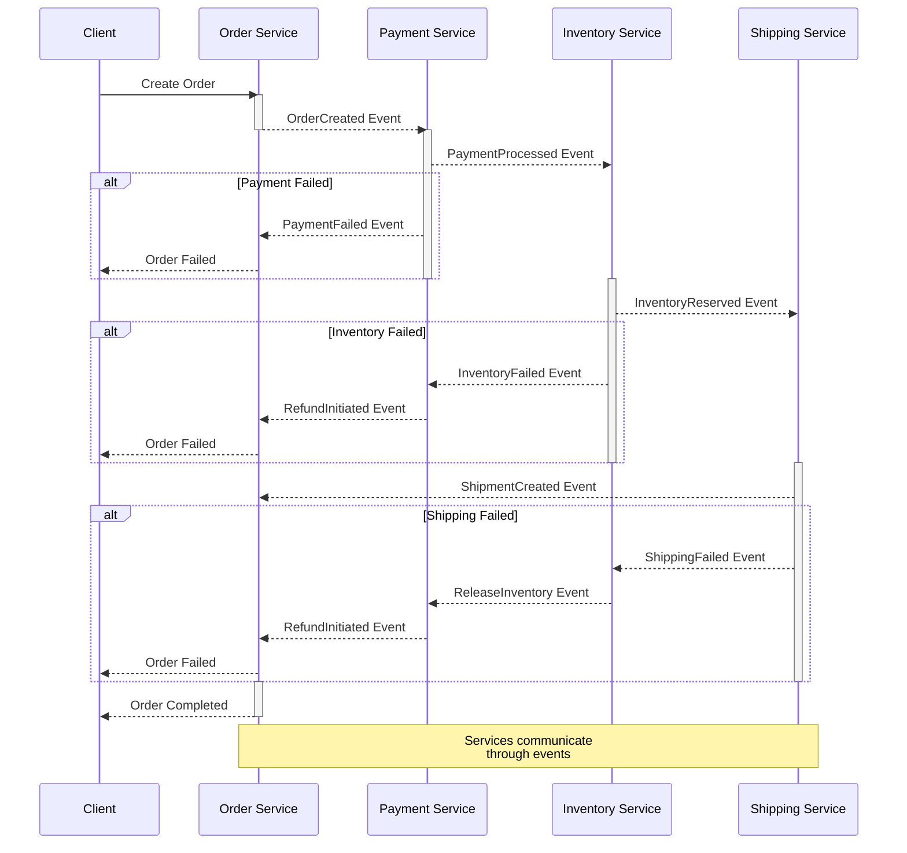
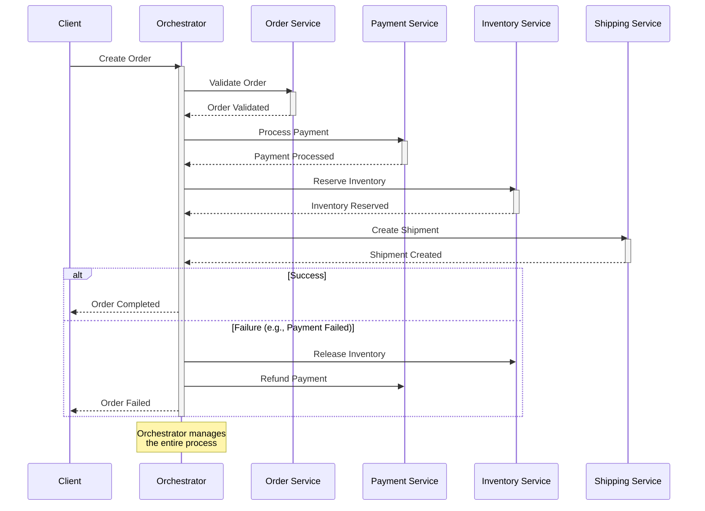

## Що таке SAGA патерн?

SAGA - це патерн проектування, який допомагає управляти розподіленими транзакціями в мікросервісній архітектурі. Замість використання класичних ACID транзакцій, які можуть блокувати ресурси на тривалий час, SAGA розбиває велику транзакцію на послідовність локальних транзакцій, де кожна локальна транзакція оновлює дані в межах одного сервісу.

Основні принципи патерну:

* **S**emantic - кожна транзакція має чітке семантичне значення в контексті бізнес-процесу.
* **A**synchronous - операції виконуються асинхронно, без блокування ресурсів.
* **G**radual - процес розбивається на послідовність менших кроків.
* **A**ctions - кожен крок являє собою атомарну дію з можливістю відкату.

Термін "SAGA" вперше був представлений у 1987 році Гектором Гарсія-Моліною та Кеннетом Салемом у їхній статті "Sagas". Спочатку він був розроблений для управління довготривалими транзакціями в традиційних базах даних, але з появою мікросервісної архітектури отримав нове життя як патерн для управління розподіленими транзакціями.

## Які проблеми вирішує?

---

SAGA патерн вирішує кілька важливих проблем у розподілених системах та мікросервісній архітектурі.

Найголовніша проблема, яку вирішує SAGA - це забезпечення узгодженості ([eventual consistency](https://en.wikipedia.org/wiki/Eventual_consistency){:target="_blank"}) даних між різними сервісами без використання розподілених ACID транзакцій.
У великих системах, де дані розподілені між різними сервісами, класичні транзакції стають неефективними через довгі блокування та проблеми з масштабуванням. SAGA дозволяє підтримувати консистентність даних через послідовність локальних транзакцій.

Друга важлива проблема - це управління довготривалими бізнес-процесами. У реальних системах бізнес-операції можуть тривати години або навіть дні, включаючи взаємодію з зовнішніми системами та очікування відповіді від користувачів. SAGA надає механізм для координації таких тривалих процесів, зберігаючи їх стан та забезпечуючи можливість відновлення після збоїв.

SAGA також вирішує проблему відмовостійкості у розподілених системах. Коли щось йде не так під час виконання розподіленої операції, SAGA забезпечує механізм компенсаційних транзакцій, які можуть відкотити зміни у правильному порядку. Це особливо важливо в мікросервісній архітектурі, де відмова одного сервісу не повинна призводити до неузгодженості даних у всій системі.

Ще одна проблема, яку вирішує SAGA - це масштабованість системи. Завдяки асинхронній природі та відсутності глобальних блокувань, система може ефективно масштабуватися горизонтально. Кожен сервіс може обробляти свою частину транзакції незалежно, що дозволяє розподіляти навантаження між різними вузлами.

SAGA також допомагає з моніторингом та відлагодженням складних бізнес-процесів. Оскільки кожен крок процесу чітко визначений та має свій стан, стає простіше відстежувати прогрес виконання операцій та знаходити причини помилок. Це особливо цінно в складних системах з багатьма взаємопов'язаними сервісами.

І нарешті, SAGA вирішує проблему гнучкості та модифікації бізнес-процесів. Завдяки чіткому розділенню на кроки та можливості додавання нових кроків, стає простіше модифікувати існуючі процеси або додавати нові варіанти обробки без необхідності переписувати всю логіку транзакцій.

---

## Підходи до реалізації Saga

### Хореографія (Choreography)

Хореографія в SAGA патерні представляє собою децентралізований підхід до управління розподіленими транзакціями, де кожен сервіс самостійно приймає рішення про свої дії на основі подій від інших сервісів.

У цьому підході відсутній центральний координатор, а сервіси взаємодіють безпосередньо один з одним через події. Кожен сервіс публікує події про свої зміни стану, а інші сервіси підписуються на ці події та реагують відповідно до своєї бізнес-логіки.

Наприклад, коли сервіс замовлень створює нове замовлення, він публікує подію `OrderCreated`. Платіжний сервіс, підписаний на цю подію, отримує її та ініціює процес оплати. Після успішної оплати він публікує подію `PaymentProcessed`, яку отримує сервіс інвентаризації для резервування товарів.

У разі виникнення помилки, сервіс публікує подію про невдачу, а інші сервіси, які вже виконали свої операції, запускають компенсаційні дії на основі цієї події. Наприклад, якщо резервування товару неможливе, сервіс інвентаризації публікує подію `InventoryReservationFailed`, а платіжний сервіс, отримавши цю подію, ініціює повернення коштів.

Хореографія особливо ефективна в системах з простими потоками даних та невеликою кількістю взаємодіючих сервісів. Вона забезпечує високу автономність сервісів та природну масштабованість, оскільки кожен сервіс може незалежно обробляти свою частину бізнес-процесу.

Проте зі збільшенням кількості сервісів та ускладненням бізнес-процесів, хореографія може стати складною для розуміння та відлагодження, оскільки логіка процесу розподілена між усіма учасниками. У таких випадках може бути доцільнішим використання підходу оркестрації.

Діаграма реалізації хореографії:



Приклад реалізації хореографії:

```cs
// Події
public record OrderCreated(
    string OrderId,
    string CustomerId,
    decimal TotalAmount,
    List<OrderItem> Items
);

public record PaymentProcessed(
    string OrderId,
    string TransactionId,
    decimal Amount,
    DateTime ProcessedAt
);

public record PaymentFailed(
    string OrderId,
    string Reason,
    DateTime FailedAt
);

public record InventoryReserved(
    string OrderId,
    string ReservationId,
    List<OrderItem> Items,
    DateTime ReservedAt
);

public record OrderCompleted(
    string OrderId,
    string TransactionId,
    string ReservationId,
    DateTime CompletedAt
);

// Сервіс замовлень
public class OrderService
{
    private readonly IEventBus _eventBus;
    private readonly IOrderRepository _orderRepo;
    private readonly ILogger<OrderService> _logger;

    public async Task CreateOrder(CreateOrderRequest request)
    {
        try
        {
            // Створення замовлення
            var order = new Order
            {
                Id = Guid.NewGuid().ToString(),
                CustomerId = request.CustomerId,
                Items = request.Items,
                TotalAmount = request.Items.Sum(i => i.Price * i.Quantity),
                Status = OrderStatus.Created,
                CreatedAt = DateTime.UtcNow
            };

            await _orderRepo.SaveOrder(order);

            // Публікація події
            await _eventBus.Publish(new OrderCreated(
                order.Id,
                order.CustomerId,
                order.TotalAmount,
                order.Items
            ));

            _logger.LogInformation(
                "Order {OrderId} created and published for customer {CustomerId}", 
                order.Id, 
                order.CustomerId
            );
        }
        catch (Exception ex)
        {
            _logger.LogError(ex, "Failed to create order for customer {CustomerId}", 
                request.CustomerId);
            throw;
        }
    }

    // Обробник події успішної оплати
    public async Task HandlePaymentProcessed(PaymentProcessed @event)
    {
        var order = await _orderRepo.GetOrder(@event.OrderId);
        if (order == null)
        {
            _logger.LogWarning("Order {@OrderId} not found for payment processing", 
                @event.OrderId);
            return;
        }

        order.Status = OrderStatus.PaymentCompleted;
        order.PaymentTransactionId = @event.TransactionId;
        order.UpdatedAt = DateTime.UtcNow;

        await _orderRepo.UpdateOrder(order);
        _logger.LogInformation(
            "Order {OrderId} payment processed with transaction {TransactionId}", 
            order.Id, 
            @event.TransactionId
        );
    }

    // Обробник події невдалої оплати
    public async Task HandlePaymentFailed(PaymentFailed @event)
    {
        var order = await _orderRepo.GetOrder(@event.OrderId);
        if (order == null) return;

        order.Status = OrderStatus.PaymentFailed;
        order.FailureReason = @event.Reason;
        order.UpdatedAt = DateTime.UtcNow;

        await _orderRepo.UpdateOrder(order);
        _logger.LogWarning(
            "Order {OrderId} payment failed: {Reason}", 
            order.Id, 
            @event.Reason
        );
    }
}

// Платіжний сервіс
public class PaymentService
{
    private readonly IEventBus _eventBus;
    private readonly IPaymentProcessor _paymentProcessor;
    private readonly IPaymentRepository _paymentRepo;
    private readonly ILogger<PaymentService> _logger;

    public async Task HandleOrderCreated(OrderCreated @event)
    {
        try
        {
            // Перевірка на дублювання платежу
            var existingPayment = await _paymentRepo.GetByOrderId(@event.OrderId);
            if (existingPayment != null)
            {
                _logger.LogWarning(
                    "Duplicate payment attempt for order {OrderId}", 
                    @event.OrderId
                );
                return;
            }

            // Створення запису про платіж
            var payment = new Payment
            {
                OrderId = @event.OrderId,
                Amount = @event.TotalAmount,
                Status = PaymentStatus.Processing,
                CreatedAt = DateTime.UtcNow
            };

            await _paymentRepo.SavePayment(payment);

            // Обробка платежу
            var result = await _paymentProcessor.ProcessPayment(new ProcessPaymentRequest
            {
                OrderId = @event.OrderId,
                CustomerId = @event.CustomerId,
                Amount = @event.TotalAmount
            });

            if (result.Success)
            {
                payment.Status = PaymentStatus.Completed;
                payment.TransactionId = result.TransactionId;
                await _paymentRepo.UpdatePayment(payment);

                await _eventBus.Publish(new PaymentProcessed(
                    @event.OrderId,
                    result.TransactionId,
                    @event.TotalAmount,
                    DateTime.UtcNow
                ));

                _logger.LogInformation(
                    "Payment processed for order {OrderId} with transaction {TransactionId}", 
                    @event.OrderId, 
                    result.TransactionId
                );
            }
            else
            {
                payment.Status = PaymentStatus.Failed;
                payment.FailureReason = result.ErrorMessage;
                await _paymentRepo.UpdatePayment(payment);

                await _eventBus.Publish(new PaymentFailed(
                    @event.OrderId,
                    result.ErrorMessage,
                    DateTime.UtcNow
                ));

                _logger.LogWarning(
                    "Payment failed for order {OrderId}: {Reason}", 
                    @event.OrderId, 
                    result.ErrorMessage
                );
            }
        }
        catch (Exception ex)
        {
            _logger.LogError(ex, "Error processing payment for order {OrderId}", 
                @event.OrderId);

            await _eventBus.Publish(new PaymentFailed(
                @event.OrderId,
                "Internal payment processing error",
                DateTime.UtcNow
            ));
        }
    }
}

// Сервіс інвентаризації
public class InventoryService
{
    private readonly IEventBus _eventBus;
    private readonly IInventoryRepository _inventoryRepo;
    private readonly ILogger<InventoryService> _logger;

    public async Task HandlePaymentProcessed(PaymentProcessed @event)
    {
        try
        {
            // Перевірка наявності товарів
            var order = await _orderRepo.GetOrder(@event.OrderId);
            foreach (var item in order.Items)
            {
                var inventory = await _inventoryRepo.GetInventory(item.ProductId);
                if (inventory.AvailableQuantity < item.Quantity)
                {
                    throw new InsufficientInventoryException(item.ProductId);
                }
            }

            // Резервування товарів
            var reservationId = Guid.NewGuid().ToString();
            foreach (var item in order.Items)
            {
                await _inventoryRepo.UpdateInventory(
                    item.ProductId,
                    -item.Quantity,
                    reservationId
                );
            }

            // Публікація події про успішне резервування
            await _eventBus.Publish(new InventoryReserved(
                @event.OrderId,
                reservationId,
                order.Items,
                DateTime.UtcNow
            ));

            _logger.LogInformation(
                "Inventory reserved for order {OrderId} with reservation {ReservationId}", 
                @event.OrderId, 
                reservationId
            );
        }
        catch (InsufficientInventoryException ex)
        {
            _logger.LogWarning(
                "Insufficient inventory for product {ProductId} in order {OrderId}", 
                ex.ProductId, 
                @event.OrderId
            );

            // Ініціювання компенсаційної транзакції
            await _eventBus.Publish(new InventoryReservationFailed(
                @event.OrderId,
                $"Insufficient inventory for product {ex.ProductId}",
                DateTime.UtcNow
            ));
        }
        catch (Exception ex)
        {
            _logger.LogError(ex, "Error reserving inventory for order {OrderId}", 
                @event.OrderId);

            // Ініціювання компенсаційної транзакції
            await _eventBus.Publish(new InventoryReservationFailed(
                @event.OrderId,
                "Internal inventory processing error",
                DateTime.UtcNow
            ));
        }
    }

    // Обробник компенсаційної транзакції
    public async Task HandleInventoryReservationFailed(InventoryReservationFailed @event)
    {
        try
        {
            var reservations = await _inventoryRepo
                .GetReservationsByOrderId(@event.OrderId);

            foreach (var reservation in reservations)
            {
                await _inventoryRepo.ReleaseReservation(reservation.Id);
            }

            _logger.LogInformation(
                "Released inventory reservations for failed order {OrderId}", 
                @event.OrderId
            );
        }
        catch (Exception ex)
        {
            _logger.LogError(ex, 
                "Error releasing inventory reservations for order {OrderId}", 
                @event.OrderId
            );
        }
    }
}
```

### Оркестрація (Orchestration)

В оркестрації SAGA використовується центральний координатор (оркестратор), який керує всім процесом виконання розподіленої транзакції та знає про всі кроки, які потрібно виконати.

Оркестратор відповідає за виклик потрібних сервісів у правильному порядку, відстеження їхнього стану та обробку помилок. Він зберігає всю логіку процесу та послідовність виконання кроків, що робить процес більш прозорим та легшим для розуміння.

При виникненні помилки на будь-якому етапі, оркестратор бере на себе відповідальність за виконання компенсаційних дій у правильному порядку. Він знає, які кроки вже були виконані та які компенсаційні дії потрібно викликати для кожного з них.

Такий підхід особливо корисний у складних бізнес-процесах, де є багато учасників та складна логіка виконання.

Оркестрація спрощує моніторинг та відлагодження, оскільки вся інформація про стан процесу зосереджена в одному місці.

Діаграма реалізації оркестрації:



Приклад реалізації оркестрації:

```cs
// Команди для сервісів
public record ValidateOrderCommand(
    string OrderId,
    string CustomerId,
    decimal TotalAmount,
    List<OrderItem> Items
);

public record ProcessPaymentCommand(
    string OrderId,
    string CustomerId,
    decimal Amount
);

public record ReserveInventoryCommand(
    string OrderId,
    List<OrderItem> Items
);

public record ShipOrderCommand(
    string OrderId,
    string ShippingAddress,
    List<OrderItem> Items
);

// Відповіді від сервісів
public record ValidationResponse(
    bool IsValid,
    List<string> Errors
);

public record PaymentResponse(
    bool Success,
    string TransactionId,
    string ErrorMessage
);

public record InventoryResponse(
    bool Success,
    string ReservationId,
    string ErrorMessage
);

public record ShippingResponse(
    bool Success,
    string TrackingNumber,
    string ErrorMessage
);

// Стан SAGA
public class OrderSagaState
{
    public string OrderId { get; set; }
    public string CustomerId { get; set; }
    public decimal TotalAmount { get; set; }
    public List<OrderItem> Items { get; set; }
    public string CurrentStep { get; set; }
    public Dictionary<string, bool> CompletedSteps { get; set; } = new();
    
    // Дані про виконані кроки
    public string PaymentTransactionId { get; set; }
    public string InventoryReservationId { get; set; }
    public string ShippingTrackingNumber { get; set; }
    
    // Дані для компенсації
    public List<string> CompensatingActions { get; set; } = new();
    
    // Метадані
    public DateTime StartedAt { get; set; }
    public DateTime? CompletedAt { get; set; }
    public int RetryCount { get; set; }
    public string ErrorMessage { get; set; }
}

// Оркестратор SAGA
public class OrderSagaOrchestrator
{
    private readonly IOrderService _orderService;
    private readonly IPaymentService _paymentService;
    private readonly IInventoryService _inventoryService;
    private readonly IShippingService _shippingService;
    private readonly ISagaStateRepository _stateRepo;
    private readonly ILogger<OrderSagaOrchestrator> _logger;

    public async Task<Result> StartOrderSaga(CreateOrderRequest request)
    {
        var sagaState = new OrderSagaState
        {
            OrderId = Guid.NewGuid().ToString(),
            CustomerId = request.CustomerId,
            TotalAmount = request.TotalAmount,
            Items = request.Items,
            StartedAt = DateTime.UtcNow,
            CurrentStep = "Started"
        };

        await _stateRepo.SaveState(sagaState);

        try
        {
            // Крок 1: Валідація замовлення
            var validationResult = await ValidateOrder(sagaState);
            if (!validationResult.IsValid)
            {
                await FailSaga(sagaState, 
                    $"Order validation failed: {string.Join(", ", validationResult.Errors)}");
                return Result.Failure(sagaState.ErrorMessage);
            }

            // Крок 2: Обробка оплати
            var paymentResult = await ProcessPayment(sagaState);
            if (!paymentResult.Success)
            {
                await FailSaga(sagaState, 
                    $"Payment failed: {paymentResult.ErrorMessage}");
                return Result.Failure(sagaState.ErrorMessage);
            }

            // Крок 3: Резервування товарів
            var inventoryResult = await ReserveInventory(sagaState);
            if (!inventoryResult.Success)
            {
                await FailSaga(sagaState, 
                    $"Inventory reservation failed: {inventoryResult.ErrorMessage}");
                return Result.Failure(sagaState.ErrorMessage);
            }

            // Крок 4: Оформлення доставки
            var shippingResult = await ArrangeShipping(sagaState);
            if (!shippingResult.Success)
            {
                await FailSaga(sagaState, 
                    $"Shipping arrangement failed: {shippingResult.ErrorMessage}");
                return Result.Failure(sagaState.ErrorMessage);
            }

            // Завершення SAGA
            await CompleteSaga(sagaState);
            return Result.Success();
        }
        catch (Exception ex)
        {
            _logger.LogError(ex, "Unexpected error in saga for order {OrderId}", 
                sagaState.OrderId);
            await FailSaga(sagaState, "Unexpected error occurred");
            return Result.Failure(sagaState.ErrorMessage);
        }
    }

    private async Task<ValidationResponse> ValidateOrder(OrderSagaState state)
    {
        try
        {
            state.CurrentStep = "Validating";
            await _stateRepo.UpdateState(state);

            var result = await _orderService.ValidateOrder(new ValidateOrderCommand(
                state.OrderId,
                state.CustomerId,
                state.TotalAmount,
                state.Items
            ));

            if (result.IsValid)
            {
                state.CompletedSteps["Validation"] = true;
                await _stateRepo.UpdateState(state);
            }

            return result;
        }
        catch (Exception ex)
        {
            _logger.LogError(ex, "Error validating order {OrderId}", state.OrderId);
            throw;
        }
    }

    private async Task<PaymentResponse> ProcessPayment(OrderSagaState state)
    {
        try
        {
            state.CurrentStep = "ProcessingPayment";
            await _stateRepo.UpdateState(state);

            var result = await _paymentService.ProcessPayment(new ProcessPaymentCommand(
                state.OrderId,
                state.CustomerId,
                state.TotalAmount
            ));

            if (result.Success)
            {
                state.PaymentTransactionId = result.TransactionId;
                state.CompletedSteps["Payment"] = true;
                state.CompensatingActions.Add("RefundPayment");
                await _stateRepo.UpdateState(state);
            }

            return result;
        }
        catch (Exception ex)
        {
            _logger.LogError(ex, "Error processing payment for order {OrderId}", 
                state.OrderId);
            throw;
        }
    }

    private async Task<InventoryResponse> ReserveInventory(OrderSagaState state)
    {
        try
        {
            state.CurrentStep = "ReservingInventory";
            await _stateRepo.UpdateState(state);

            var result = await _inventoryService.ReserveInventory(
                new ReserveInventoryCommand(
                    state.OrderId,
                    state.Items
                ));

            if (result.Success)
            {
                state.InventoryReservationId = result.ReservationId;
                state.CompletedSteps["Inventory"] = true;
                state.CompensatingActions.Add("ReleaseInventory");
                await _stateRepo.UpdateState(state);
            }

            return result;
        }
        catch (Exception ex)
        {
            _logger.LogError(ex, "Error reserving inventory for order {OrderId}", 
                state.OrderId);
            throw;
        }
    }

    private async Task FailSaga(OrderSagaState state, string reason)
    {
        state.ErrorMessage = reason;
        state.CurrentStep = "Failed";

        // Виконання компенсаційних дій у зворотному порядку
        foreach (var action in state.CompensatingActions.AsEnumerable().Reverse())
        {
            try
            {
                await ExecuteCompensatingAction(state, action);
            }
            catch (Exception ex)
            {
                _logger.LogError(ex, 
                    "Error executing compensating action {Action} for order {OrderId}", 
                    action, 
                    state.OrderId);
            }
        }

        await _stateRepo.UpdateState(state);
    }

    private async Task ExecuteCompensatingAction(OrderSagaState state, string action)
    {
        switch (action)
        {
            case "RefundPayment":
                if (!string.IsNullOrEmpty(state.PaymentTransactionId))
                {
                    await _paymentService.RefundPayment(state.PaymentTransactionId);
                    _logger.LogInformation(
                        "Refunded payment for order {OrderId}, transaction {TransactionId}", 
                        state.OrderId, 
                        state.PaymentTransactionId);
                }
                break;

            case "ReleaseInventory":
                if (!string.IsNullOrEmpty(state.InventoryReservationId))
                {
                    await _inventoryService.ReleaseReservation(
                        state.InventoryReservationId);
                    _logger.LogInformation(
                        "Released inventory for order {OrderId}, reservation {ReservationId}", 
                        state.OrderId, 
                        state.InventoryReservationId);
                }
                break;
        }
    }

    private async Task CompleteSaga(OrderSagaState state)
    {
        state.CurrentStep = "Completed";
        state.CompletedAt = DateTime.UtcNow;
        await _stateRepo.UpdateState(state);

        _logger.LogInformation(
            "Successfully completed saga for order {OrderId}, duration: {Duration}ms", 
            state.OrderId, 
            (state.CompletedAt - state.StartedAt)?.TotalMilliseconds);
    }
}
```

API для взаємодії з процесом:

```cs
public static class OrderEndpoints
{
    public static void MapOrderEndpoints(this IEndpointRouteBuilder app)
    {
        var group = app.MapGroup("/api/orders")
            .WithTags("Orders")
            .WithOpenApi();

        group.MapPost("/", async (
            CreateOrderRequest request,
            OrderSagaOrchestrator sagaOrchestrator) =>
        {
            var result = await sagaOrchestrator.StartOrderSaga(request);

            return result.Success
                ? Results.Ok(new { Message = "Order processing started" })
                : Results.BadRequest(new { Error = result.ErrorMessage });
        })
        .WithName("CreateOrder")
        .WithDescription("Initiates a new order process")
        .Produces<object>(StatusCodes.Status200OK)
        .Produces<object>(StatusCodes.Status400BadRequest);

        group.MapGet("/{orderId}/status", async (
            string orderId,
            OrderSagaOrchestrator sagaOrchestrator) =>
        {
            var state = await sagaOrchestrator.GetSagaState(orderId);

            return state is null
                ? Results.NotFound()
                : Results.Ok(new
                {
                    state.OrderId,
                    state.CurrentStep,
                    state.CompletedSteps,
                    state.StartedAt,
                    state.CompletedAt,
                    state.ErrorMessage
                });
        })
        .WithName("GetOrderStatus")
        .WithDescription("Gets the current status of an order")
        .Produces<object>(StatusCodes.Status200OK)
        .Produces(StatusCodes.Status404NotFound);
    }
}
```

Цей приклад демонструє наступне:

* Централізоване управління процесом через оркестратор
* Чітке визначення кроків та їх послідовності
* Збереження стану процесу
* Обробку помилок та компенсаційні дії
* Моніторинг та логування
* API для взаємодії з процесом

## Порівняння підходів

### Хореографія

Переваги:

* Слабка зв'язність між сервісами
* Висока автономність сервісів
* Простіша реалізація для невеликих систем
* Природня масштабованість

Недоліки:

* Складно відстежувати процес цілком
* Потенційні циклічні залежності
* Складне відлагодження
* Розподілена бізнес-логіка

### Оркестрація

Переваги:

* Централізоване управління процесом
* Простіше відстеження та моніторинг
* Ізольована бізнес-логіка
* Простіше відлагодження

Недоліки:

* Вища зв'язність між сервісами
* Оркестратор може стати вузьким місцем
* Складніша реалізація
* Менша автономність сервісів

## Як користуватися SAGA патерном?

Щоб почати використовувати SAGA патерн, спершу необхідно провести детальний аналіз бізнес-процесу, визначивши всі кроки, учасників та можливі сценарії виконання та помилок. Під час цього аналізу важливо визначити порядок виконання операцій та спланувати компенсаційні дії для кожного кроку.

Після аналізу потрібно обрати підхід до реалізації - хореографію чи оркестрацію, базуючись на складності процесу та кількості учасників. Для простих процесів з невеликою кількістю учасників підійде хореографія, тоді як для складних процесів краще використовувати оркестрацію.

На етапі проектування важливо чітко визначити формат повідомлень між сервісами, спроектувати структуру зберігання стану SAGA та продумати механізми обробки помилок. Також необхідно визначити таймаути для кожного кроку та загальний таймаут для всього процесу.

При реалізації слід створити базову інфраструктуру для обміну повідомленнями, реалізувати всі необхідні кроки SAGA та їх компенсаційні дії. Особливу увагу варто приділити забезпеченню ідемпотентності операцій та обробці конкурентних запитів.
Важливою частиною впровадження SAGA є налаштування моніторингу та логування для відстеження стану процесів.
Необхідно реалізувати збір метрик, налаштувати сповіщення про помилки та створити панелі моніторингу для операційної підтримки.

Тестування SAGA повинно охоплювати всі можливі сценарії, включаючи успішне виконання, різні варіанти помилок та компенсаційні дії.
Особливу увагу слід приділити тестуванню відновлення після збоїв та перевірці консистентності даних.

Для ефективної роботи з SAGA важливо забезпечити належну документацію процесів, включаючи опис кроків, форматів повідомлень, компенсаційних дій та можливих станів. Це допоможе в подальшій підтримці та розвитку системи.

## Найкращі практики

При реалізації SAGA патерну ключовою практикою є забезпечення ідемпотентності всіх операцій, що дозволяє безпечно повторювати їх у разі збоїв.
Кожна операція повинна перевіряти свій попередній стан та уникати повторного виконання вже завершених дій.

Важливо ретельно управляти станом SAGA, зберігаючи всю необхідну інформацію про поточний крок, виконані операції та дані для компенсаційних дій. Стан має зберігатися в надійному сховищі з підтримкою транзакційності.

Обробка помилок та відновлення мають бути реалізовані з урахуванням усіх можливих сценаріїв збоїв.

Система повинна коректно обробляти тимчасові проблеми з мережею, недоступність сервісів та часткові збої.

Моніторинг та логування є критично важливими для роботи SAGA. Кожен крок процесу має бути належним чином залогований, а система моніторингу повинна відстежувати тривалість операцій, помилки та загальний стан процесів.

У .NET екосистемі існує декілька популярних бібліотек для реалізації SAGA:

`MassTransit` є однією з найпопулярніших бібліотек, яка надає готову інфраструктуру для реалізації SAGA.

Вона пропонує:

* Вбудовану підтримку різних транспортів (RabbitMQ, Azure Service Bus, та інших)
* Зручний API для визначення стейт-машин
* Автоматичне управління станом
* Вбудовану обробку помилок та повторні спроби

### Приклад простої SAGA з використанням MassTransit

```cs
public class OrderSaga : MassTransitStateMachine<OrderState>
{
    public OrderSaga()
    {
        Event(() => OrderSubmitted, x => x.CorrelateById(m => m.Message.OrderId));
        Event(() => PaymentProcessed, x => x.CorrelateById(m => m.Message.OrderId));

        Initially(
            When(OrderSubmitted)
                .Then(context => 
                {
                    context.Instance.OrderId = context.Data.OrderId;
                    context.Instance.Amount = context.Data.Amount;
                })
                .TransitionTo(AwaitingPayment)
                .PublishAsync(context => context.Init<ProcessPayment>(new 
                {
                    OrderId = context.Instance.OrderId,
                    Amount = context.Instance.Amount
                }))
        );

        During(AwaitingPayment,
            When(PaymentProcessed)
                .TransitionTo(Completed)
                .Then(context => context.Instance.PaymentId = context.Data.PaymentId)
        );

        SetCompensation(AwaitingPayment, 
            x => x.PublishAsync(context => context.Init<RefundPayment>(new 
            {
                PaymentId = context.Instance.PaymentId
            })));
    }
}

// Azure Service Bus конфігурація
services.AddMassTransit(x =>
{
    x.UsingAzureServiceBus((context, cfg) =>
    {
        cfg.Host("connection-string");
        cfg.ConfigureEndpoints(context);
    });
});

// Amazon SQS конфігурація
services.AddMassTransit(x =>
{
    x.UsingAmazonSqs((context, cfg) =>
    {
        cfg.Host("us-east-1", h =>
        {
            h.AccessKey("access-key");
            h.SecretKey("secret-key");
        });
        cfg.ConfigureEndpoints(context);
    });
});
```

Важливо також приділяти увагу безпеці, особливо при роботі з фінансовими операціями.

Кожен крок SAGA повинен виконуватися з належною авторизацією та аутентифікацією.

Тестування SAGA має бути комплексним, включаючи модульні тести для окремих компонентів та інтеграційні тести для перевірки взаємодії між сервісами. Особливу увагу слід приділяти тестуванню компенсаційних механізмів.

Документація процесів SAGA повинна бути детальною та актуальною, включаючи діаграми послідовності, опис подій та команд, специфікації форматів повідомлень та інструкції з розгортання та підтримки.

## Висновок

SAGA патерн є потужним інструментом для управління розподіленими транзакціями в сучасних додатках.

При правильній реалізації з урахуванням усіх найкращих практик, він забезпечує:

* Надійне управління довгими транзакціями
* Ефективну обробку помилок та відновлення
* Масштабованість та гнучкість системи
* Прозорість та можливість моніторингу
* Підтримку складних бізнес-процесів

> Важливо пам'ятати
{: .prompt-info }

Успішна реалізація SAGA вимагає ретельного планування, врахування всіх можливих сценаріїв та належного тестування.
Використання наведених практик та прикладів коду допоможе створити надійну та ефективну систему управління розподіленими транзакціями.
