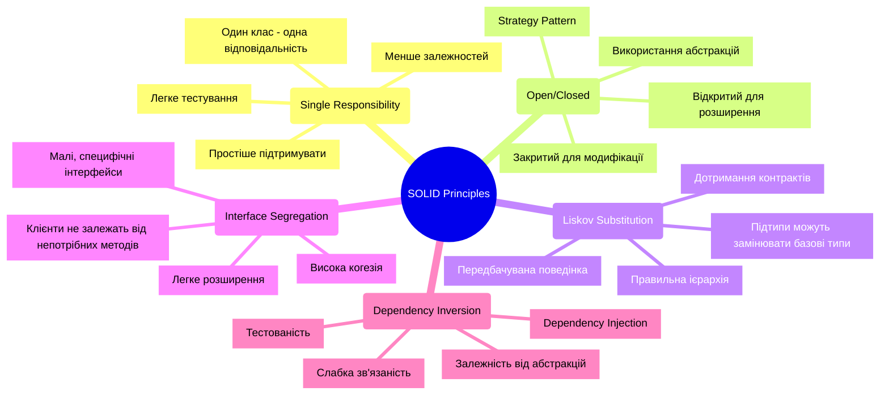

SOLID - це акронім п'яти фундаментальних принципів об'єктно-орієнтованого програмування та проєктування, представлених Робертом Мартіном.
Ці принципи допомагають створювати програмні системи, які є:

- Зрозумілими - код легко читати та розуміти
- Гнучкими - легко адаптуються до змін вимог
- Підтримуваними - просто вносити зміни та виправляти помилки
- Масштабованими - легко розширюються новою функціональністю
- Тестованими - добре покриваються автоматизованими тестами



Адаптивність коду є ключовою характеристикою сучасного програмного забезпечення.
Розглянемо основні аспекти адаптивного коду.

- Перш за все, адаптивний код легко змінюється.
Це означає, що внесення змін має мінімальний вплив на існуючий функціонал завдяки чіткому розділенню відповідальності та низькій зв'язаності між компонентами.

- Друга важлива характеристика - це простота розширення.
Нова функціональність може бути додана без модифікації існуючого коду через використання абстракцій та інтерфейсів, що забезпечує можливість гнучкої підміни реалізацій.

- Ефективне масштабування є третьою ключовою особливістю.
Адаптивний код підтримує як горизонтальне масштабування компонентів, так і вертикальне нарощування функціональності завдяки модульній архітектурі.

- Четверта характеристика - це хороша тестованість коду.
Вона досягається через можливість написання модульних тестів, легку підміну залежностей та ізольованість компонентів.

Говорячи про важливість принципів SOLID у сучасній розробці, варто відзначити кілька ключових аспектів.

- Перший з них - це управління складністю, яке досягається через розбиття складних систем на прості компоненти, створення чіткої структури та організації коду, а також забезпечення зрозумілих взаємозв'язків між частинами системи.

- Підготовка до змін є другим важливим аспектом SOLID. Гнучка архітектура забезпечує можливість швидкого реагування на нові вимоги та мінімізує технічний борг.

- Третій аспект - це покращення якості програмного забезпечення. Застосування принципів SOLID призводить до зменшення кількості помилок, підвищення надійності та кращої продуктивності розробки.

Нарешті, принципи SOLID значно покращують командну роботу.
Вони полегшують введення нових розробників у проект, спрощують процес code review та забезпечують ефективнішу комунікацію через код.

---

## Single Responsibility Principle (SRP)

Принцип єдиної відповідальності стверджує, що кожен клас повинен мати лише одну причину для змін.
Іншими словами, клас повинен виконувати лише одну чітко визначену функцію або відповідати за один аспект функціональності системи.

- Перший важливий аспект - це відповідальність компонентів системи. У добре спроектованій системі кожен клас має чітко визначену роль та призначення.
Методи класу працюють з єдиним, чітко окресленим набором даних, що забезпечує логічну цілісність. Особливо важливо, що зміни в одній частині такої системи не створюють несподіваних побічних ефектів в інших її частинах.

- Другим ключовим аспектом є згуртованість коду. У правильно спроектованому класі всі методи логічно пов'язані між собою та працюють для досягнення спільної мети.
Функціональність такого класу настільки цілісна та сфокусована, що його призначення можна легко та чітко описати одним реченням. Це значно полегшує розуміння коду та його подальшу підтримку.

- Третім фундаментальним аспектом виступає інкапсуляція. Цей принцип забезпечує приховування внутрішніх деталей реалізації класу від зовнішнього світу.
Натомість клас надає чіткий та зрозумілий публічний інтерфейс для взаємодії. Завдяки правильній інкапсуляції досягається мінімальна залежність між різними частинами системи, що робить код більш гнучким та стійким до змін.

### ❌ Приклад порушення принципу

```cs
public class UserManager
{
    private readonly string _connectionString;
    private readonly ILogger _logger;
    private readonly IEmailService _emailService;

    public UserManager(string connectionString, ILogger logger, IEmailService emailService)
    {
        _connectionString = connectionString;
        _logger = logger;
        _emailService = emailService;
    }

    public async Task RegisterUser(UserRegistrationDto dto)
    {
        // Валідація даних
        if (string.IsNullOrEmpty(dto.Email))
            throw new ValidationException("Email is required");
        if (string.IsNullOrEmpty(dto.Password))
            throw new ValidationException("Password is required");
        if (dto.Password.Length < 8)
            throw new ValidationException("Password must be at least 8 characters");

        // Хешування пароля
        var salt = GenerateSalt();
        var passwordHash = HashPassword(dto.Password, salt);

        // Збереження в базу даних
        using (var connection = new SqlConnection(_connectionString))
        {
            await connection.OpenAsync();
            using (var command = connection.CreateCommand())
            {
                command.CommandText = "INSERT INTO Users (Email, PasswordHash, Salt) VALUES (@Email, @PasswordHash, @Salt)";
                command.Parameters.AddWithValue("@Email", dto.Email);
                command.Parameters.AddWithValue("@PasswordHash", passwordHash);
                command.Parameters.AddWithValue("@Salt", salt);
                await command.ExecuteNonQueryAsync();
            }
        }

        // Відправка вітального email
        var emailMessage = new EmailMessage
        {
            To = dto.Email,
            Subject = "Welcome to our platform!",
            Body = "Thank you for registering..."
        };
        await _emailService.SendAsync(emailMessage);

        // Логування
        _logger.LogInformation($"User {dto.Email} registered successfully at {DateTime.UtcNow}");
    }

    private string GenerateSalt()
    {
        // Генерація солі
        byte[] salt = new byte[16];
        using (var rng = new RNGCryptoServiceProvider())
        {
            rng.GetBytes(salt);
        }
        return Convert.ToBase64String(salt);
    }

    private string HashPassword(string password, string salt)
    {
        // Хешування пароля
        using (var sha256 = SHA256.Create())
        {
            var passwordBytes = Encoding.UTF8.GetBytes(password + salt);
            var hashBytes = sha256.ComputeHash(passwordBytes);
            return Convert.ToBase64String(hashBytes);
        }
    }
}
```

### ✅ Правильна реалізація

```cs
// Модель даних
public class UserRegistrationDto
{
    public string Email { get; set; }
    public string Password { get; set; }
}

// Валідація
public class UserRegistrationValidator : IValidator<UserRegistrationDto>
{
    public ValidationResult Validate(UserRegistrationDto dto)
    {
        var result = new ValidationResult();

        if (string.IsNullOrEmpty(dto.Email))
            result.AddError("Email is required");

        if (string.IsNullOrEmpty(dto.Password))
            result.AddError("Password is required");
        else if (dto.Password.Length < 8)
            result.AddError("Password must be at least 8 characters");

        return result;
    }
}

// Сервіс для роботи з паролями
public interface IPasswordService
{
    string GenerateSalt();
    string HashPassword(string password, string salt);
}

public class PasswordService : IPasswordService
{
    public string GenerateSalt()
    {
        byte[] salt = new byte[16];
        using (var rng = new RNGCryptoServiceProvider())
        {
            rng.GetBytes(salt);
        }
        return Convert.ToBase64String(salt);
    }

    public string HashPassword(string password, string salt)
    {
        using (var sha256 = SHA256.Create())
        {
            var passwordBytes = Encoding.UTF8.GetBytes(password + salt);
            var hashBytes = sha256.ComputeHash(passwordBytes);
            return Convert.ToBase64String(hashBytes);
        }
    }
}

// Репозиторій для роботи з базою даних
public interface IUserRepository
{
    Task CreateAsync(User user);
    Task<User> GetByEmailAsync(string email);
}

public class UserRepository : IUserRepository
{
    private readonly string _connectionString;

    public UserRepository(string connectionString)
    {
        _connectionString = connectionString;
    }

    public async Task CreateAsync(User user)
    {
        using (var connection = new SqlConnection(_connectionString))
        {
            await connection.OpenAsync();
            using (var command = connection.CreateCommand())
            {
                command.CommandText = "INSERT INTO Users (Email, PasswordHash, Salt) VALUES (@Email, @PasswordHash, @Salt)";
                command.Parameters.AddWithValue("@Email", user.Email);
                command.Parameters.AddWithValue("@PasswordHash", user.PasswordHash);
                command.Parameters.AddWithValue("@Salt", user.Salt);
                await command.ExecuteNonQueryAsync();
            }
        }
    }

    public async Task<User> GetByEmailAsync(string email)
    {
        // Реалізація отримання користувача
    }
}

// Сервіс відправки email
public interface IEmailService
{
    Task SendWelcomeEmailAsync(string email);
}

public class EmailService : IEmailService
{
    private readonly IEmailClient _emailClient;
    private readonly IEmailTemplateService _templateService;

    public EmailService(IEmailClient emailClient, IEmailTemplateService templateService)
    {
        _emailClient = emailClient;
        _templateService = templateService;
    }

    public async Task SendWelcomeEmailAsync(string email)
    {
        var template = await _templateService.GetTemplateAsync("WelcomeEmail");
        var message = new EmailMessage
        {
            To = email,
            Subject = "Welcome to our platform!",
            Body = template
        };
        await _emailClient.SendAsync(message);
    }
}

// Основний сервіс реєстрації
public class UserRegistrationService
{
    private readonly IValidator<UserRegistrationDto> _validator;
    private readonly IPasswordService _passwordService;
    private readonly IUserRepository _userRepository;
    private readonly IEmailService _emailService;
    private readonly ILogger<UserRegistrationService> _logger;

    public UserRegistrationService(
        IValidator<UserRegistrationDto> validator,
        IPasswordService passwordService,
        IUserRepository userRepository,
        IEmailService emailService,
        ILogger<UserRegistrationService> logger)
    {
        _validator = validator;
        _passwordService = passwordService;
        _userRepository = userRepository;
        _emailService = emailService;
        _logger = logger;
    }

    public async Task RegisterUserAsync(UserRegistrationDto dto)
    {
        // Валідація
        var validationResult = _validator.Validate(dto);
        if (!validationResult.IsValid)
            throw new ValidationException(validationResult.Errors);

        // Створення користувача
        var salt = _passwordService.GenerateSalt();
        var passwordHash = _passwordService.HashPassword(dto.Password, salt);

        var user = new User
        {
            Email = dto.Email,
            PasswordHash = passwordHash,
            Salt = salt
        };

        // Збереження
        await _userRepository.CreateAsync(user);

        // Відправка email
        await _emailService.SendWelcomeEmailAsync(dto.Email);

        // Логування
        _logger.LogInformation($"User {dto.Email} registered successfully");
    }
}
```

### Переваги

- Першою ключовою перевагою є краща організація коду. Коли кожен клас має чітко визначене призначення, розробникам значно легше орієнтуватися в кодовій базі та знаходити потрібні компоненти. Така організація робить систему більш зрозумілою та прозорою для всіх учасників розробки.

- Друга суттєва перевага полягає у спрощенні процесу тестування. Оскільки кожен компонент відповідає лише за одну функціональність, його можна тестувати ізольовано від інших частин системи. Це зменшує потребу у створенні складних моків та стабів, що в результаті призводить до кращого покриття коду тестами.

- Третьою важливою перевагою є суттєве спрощення процесу внесення змін у код. При дотриманні SRP зміни зазвичай локалізовані в межах одного компонента, що мінімізує ризик виникнення небажаних побічних ефектів в інших частинах системи. Така структура робить процес модифікації коду більш безпечним та передбачуваним.

Загалом, принцип єдиної відповідальності є потужним інструментом для створення якісного, підтримуваного та надійного програмного забезпечення.

## Open/Closed Principle (OCP)

Принцип відкритості/закритості стверджує, що програмні сутності (класи, модулі, функції тощо) повинні бути:

- Відкриті для розширення: нову функціональність можна додати
- Закриті для модифікації: існуючий код не потрібно змінювати

Ключові аспекти принципу відкритості/закритості:

- Перший фундаментальний аспект - це використання абстракції та поліморфізму.
Цей підхід реалізується через активне застосування інтерфейсів та абстрактних класів, які формують стабільний фундамент системи.
Визначення правильних абстракцій дозволяє створювати гнучкі рішення, де поліморфна поведінка досягається через механізми успадкування.

- Другим важливим аспектом є забезпечення розширюваності системи.
Правильна архітектура дозволяє додавати нову функціональність без необхідності модифікації існуючого коду.
Це досягається через використання відповідних патернів проєктування та створення конфігурованої поведінки, яка може легко адаптуватися до нових вимог.

- Третій ключовий аспект - це інкапсуляція змін.
Цей підхід передбачає ізоляцію тих частин системи, які найбільш ймовірно будуть змінюватися з часом.
Завдяки такій ізоляції мінімізується вплив змін на інші компоненти системи, а стабільні публічні інтерфейси забезпечують надійний спосіб взаємодії між різними частинами програми.

### ❌ Приклад порушення принципу

```cs
public class OrderProcessor
{
    public decimal CalculateDiscount(Order order)
    {
        // Проблема: при додаванні нового типу знижки 
        // потрібно модифікувати існуючий код
        switch (order.DiscountType)
        {
            case DiscountType.None:
                return 0;
            case DiscountType.Fixed:
                return order.Amount > 100 ? 20 : 0;
            case DiscountType.Percentage:
                return order.Amount * 0.1m;
            case DiscountType.Seasonal:
                return DateTime.Now.Month == 12 ? order.Amount * 0.2m : 0;
            default:
                throw new ArgumentException("Unknown discount type");
        }
    }
}

// При додаванні нового типу знижки:
public enum DiscountType
{
    None,
    Fixed,
    Percentage,
    Seasonal,
    // Потрібно додати новий тип тут
    SpecialOffer // Новий тип
}
```

### ✅ Правильна реалізація

```cs
// 1. Визначаємо абстракцію для стратегії знижки
public interface IDiscountStrategy
{
    decimal CalculateDiscount(Order order);
}

// 2. Реалізуємо конкретні стратегії
public class NoDiscount : IDiscountStrategy
{
    public decimal CalculateDiscount(Order order) => 0;
}

public class FixedDiscount : IDiscountStrategy
{
    private readonly decimal _threshold;
    private readonly decimal _discountAmount;

    public FixedDiscount(decimal threshold, decimal discountAmount)
    {
        _threshold = threshold;
        _discountAmount = discountAmount;
    }

    public decimal CalculateDiscount(Order order)
    {
        return order.Amount > _threshold ? _discountAmount : 0;
    }
}

public class PercentageDiscount : IDiscountStrategy
{
    private readonly decimal _percentage;

    public PercentageDiscount(decimal percentage)
    {
        _percentage = percentage;
    }

    public decimal CalculateDiscount(Order order)
    {
        return order.Amount * (_percentage / 100);
    }
}

public class SeasonalDiscount : IDiscountStrategy
{
    private readonly int _month;
    private readonly decimal _percentage;

    public SeasonalDiscount(int month, decimal percentage)
    {
        _month = month;
        _percentage = percentage;
    }

    public decimal CalculateDiscount(Order order)
    {
        return DateTime.Now.Month == _month ? 
            order.Amount * (_percentage / 100) : 0;
    }
}

// 3. Фабрика для створення стратегій
public interface IDiscountStrategyFactory
{
    IDiscountStrategy CreateStrategy(DiscountType type);
}

public class DiscountStrategyFactory : IDiscountStrategyFactory
{
    public IDiscountStrategy CreateStrategy(DiscountType type)
    {
        return type switch
        {
            DiscountType.None => new NoDiscount(),
            DiscountType.Fixed => new FixedDiscount(100, 20),
            DiscountType.Percentage => new PercentageDiscount(10),
            DiscountType.Seasonal => new SeasonalDiscount(12, 20),
            _ => throw new ArgumentException("Unknown discount type")
        };
    }
}

// 4. Процесор замовлень, який використовує стратегії
public class OrderProcessor
{
    private readonly IDiscountStrategyFactory _strategyFactory;

    public OrderProcessor(IDiscountStrategyFactory strategyFactory)
    {
        _strategyFactory = strategyFactory;
    }

    public decimal CalculateDiscount(Order order)
    {
        var strategy = _strategyFactory.CreateStrategy(order.DiscountType);
        return strategy.CalculateDiscount(order);
    }
}

// 5. Додавання нової стратегії знижки без зміни існуючого коду
public class LoyaltyDiscount : IDiscountStrategy
{
    private readonly decimal _pointsPercentage;

    public LoyaltyDiscount(decimal pointsPercentage)
    {
        _pointsPercentage = pointsPercentage;
    }

    public decimal CalculateDiscount(Order order)
    {
        if (order.Customer?.LoyaltyPoints == null)
            return 0;

        return order.Amount * (order.Customer.LoyaltyPoints * _pointsPercentage / 100);
    }
}
```

### Переваги

- Перша ключова перевага - це гнучкість системи.
Завдяки правильній архітектурі стає легко додавати нову функціональність при мінімальному ризику регресії, що також спрощує масштабування системи в цілому.

- Друга важлива перевага - покращена підтримка коду.
При внесенні змін виникає менше помилок, проблеми легше локалізувати та виправляти, а процес рефакторингу стає значно простішим.

- Третьою перевагою є краща тестованість коду.
Існуючі модульні тести не потребують модифікації при додаванні нової функціональності, написання нових тестів стає простішим, що призводить до кращого покриття коду тестами.

- Четверта перевага полягає у зменшенні зв'язаності між компонентами.
Компоненти стають більш незалежними, мають чіткі межі відповідальності, що спрощує їх повторне використання.

> Важливо правильно визначати точки розширення системи
{: .prompt-info }
Це включає ретельний аналіз вимог та можливих змін, виділення стабільних абстракцій та проєктування гнучких інтерфейсів.
Важливо правильно використовувати успадкування, надаючи перевагу композиції та уникаючи глибокої ієрархії класів.
Управління конфігурацією також відіграє важливу роль.
Рекомендується використовувати DI контейнери, конфігураційні файли, а також factory та builder для створення об'єктів.
> Типові помилки
{: .prompt-info }
Надмірна абстракція може призвести до створення непотрібних інтерфейсів та занадто складних ієрархій.
Неправильний вибір точок розширення, включаючи передчасну або недостатню абстракцію, може ускладнити подальший розвиток системи.
Важливо також не порушувати інші принципи SOLID при впровадженні OCP.

Підсумовуючи, можна сказати, що принцип відкритості/закритості є фундаментальним для об'єктно-орієнтованого програмування.
Його правильне застосування значно зменшує ризики при внесенні змін, покращує якість коду, спрощує розширення системи, полегшує тестування та покращує можливості повторного використання коду.

## Liskov Substitution Principle (LSP)

Принцип підстановки Лісков стверджує, що об'єкти базового класу можуть бути замінені об'єктами його похідних класів без зміни правильності програми.
Іншими словами, якщо **A** є підтипом **B**, тоді об'єкти типу **B** можуть бути замінені об'єктами типу **A** без зміни бажаних властивостей програми.

Основні правила принципу Liskov Substitution, які забезпечують правильне використання успадкування в об'єктно-орієнтованому програмуванні.

- Перша група правил стосується контрактної відповідності між базовим класом та його нащадками.
При розробці важливо дотримуватися принципу, що передумови методів не можуть бути посилені в підкласі - це означає, що метод підкласу не може вимагати більш жорстких умов для свого виконання, ніж метод базового класу.
Також постумови не можуть бути послаблені в підкласі - результат виконання методу підкласу повинен відповідати всім гарантіям, які дає базовий клас.
Крім того, всі інваріанти базового класу повинні залишатися правильними для підкласу протягом всього життєвого циклу об'єкта.

- Друга група правил визначає поведінкові аспекти успадкування.
Методи підкласу повинні вміти працювати з усіма параметрами, які приймає відповідний метод базового класу, забезпечуючи повну сумісність при використанні.
При цьому підклас може повертати більш специфічний тип (підтип) того, що повертає базовий клас, що дозволяє уточнювати результати без порушення контракту.
Важливо також, щоб підклас не генерував винятки, які не очікуються від базового класу, оскільки це може порушити очікувану поведінку програми.

Дотримання цих правил забезпечує можливість безпечної заміни об'єктів базового класу об'єктами підкласів без порушення коректності роботи програми.

### ❌ Приклад порушення принципу

```cs
// Класичний приклад порушення LSP
public class Rectangle
{
    public virtual int Width { get; set; }
    public virtual int Height { get; set; }

    public virtual int CalculateArea()
    {
        return Width * Height;
    }
}

public class Square : Rectangle
{
    private int _size;

    public override int Width
    {
        get => _size;
        set
        {
            _size = value;
            Height = value; // Порушення LSP
        }
    }

    public override int Height
    {
        get => _size;
        set
        {
            _size = value;
            Width = value; // Порушення LSP
        }
    }
}

// Код, який порушує очікувану поведінку
public class GeometryCalculator
{
    public void ProcessRectangle(Rectangle rectangle)
    {
        rectangle.Width = 4;
        rectangle.Height = 5;
        
        // Очікуємо, що площа буде 20
        // Але для Square отримаємо 25!
        var area = rectangle.CalculateArea();
    }
}
```

### ✅ Правильна реалізація

```cs
// 1. Визначаємо абстракцію для фігур
public interface IShape
{
    double CalculateArea();
    double CalculatePerimeter();
}

// 2. Окремі реалізації для різних фігур
public class Rectangle : IShape
{
    public double Width { get; }
    public double Height { get; }

    public Rectangle(double width, double height)
    {
        if (width <= 0) throw new ArgumentException("Width must be positive", nameof(width));
        if (height <= 0) throw new ArgumentException("Height must be positive", nameof(height));
        
        Width = width;
        Height = height;
    }

    public double CalculateArea() => Width * Height;
    public double CalculatePerimeter() => 2 * (Width + Height);
}

public class Square : IShape
{
    public double Side { get; }

    public Square(double side)
    {
        if (side <= 0) throw new ArgumentException("Side must be positive", nameof(side));
        Side = side;
    }

    public double CalculateArea() => Side * Side;
    public double CalculatePerimeter() => 4 * Side;
}

// 3. Приклад використання
public class AreaCalculator
{
    public double CalculateTotalArea(IEnumerable<IShape> shapes)
    {
        return shapes.Sum(shape => shape.CalculateArea());
    }
}
```

### Переваги

- Перша перевага - це покращена модульність системи.
Компоненти стають більш незалежними, систему легше розширювати, а код простіше повторно використовувати.

- Друга перевага полягає у підвищенні надійності коду.
Поведінка системи стає більш передбачуваною, зменшується кількість помилок, а процес відлагодження спрощується.

- Третя перевага - краща тестованість коду.
Можливість повторного використання тестів для різних реалізацій зменшує кількість необхідного тестового коду та забезпечує краще покриття.

- Четверта перевага - це підвищена гнучкість системи.
Стає легше додавати нові типи, простіше підтримувати існуючий код та покращується масштабованість системи в цілому.

> Рекомендації
{: .prompt-info }

Почнемо з ключових рекомендацій щодо впровадження LSP.

- Першою важливою рекомендацією є проєктування за контрактом.
Це означає необхідність чіткого визначення передумов та постумов методів, документування очікуваної поведінки та використання інваріантів для забезпечення цілісності системи.

- Друга рекомендація стосується правильного використання абстракцій.
Варто надавати перевагу інтерфейсам перед конкретними реалізаціями, визначати чіткі контракти взаємодії та уникати тісної зв'язаності між компонентами.

- Третя рекомендація фокусується на тестуванні підстановки.
Важливо писати тести для базових класів, які потім можна використовувати для перевірки всіх похідних класів.
Використання параметризованих тестів допомагає забезпечити однакову поведінку для всіх реалізацій.

- Четверта рекомендація підкреслює важливість дотримання основних принципів об'єктно-орієнтованого програмування.

Принцип підстановки Лісков є фундаментальним для створення надійних об'єктно-орієнтованих систем.
Його правильне застосування забезпечує коректну ієрархію типів, гарантує передбачувану поведінку, покращує якість коду, спрощує розширення системи та полегшує процеси тестування й підтримки.
В результаті система стає більш надійною, гнучкою та простою в обслуговуванні.

## Interface Segregation Principle (ISP)

Принцип розділення інтерфейсів стверджує, що клієнти не повинні залежати від методів, які вони не використовують.
Великі інтерфейси потрібно розділяти на менші та більш специфічні.

- Першим важливим аспектом є гранулярність інтерфейсів.
Цей аспект передбачає, що кожен інтерфейс повинен мати чітко визначене та конкретне призначення в системі.
Досвід показує, що менші, добре сфокусовані інтерфейси працюють краще, ніж великі та універсальні.
Особливо важливо, щоб клієнтський код бачив лише ті методи, які йому дійсно потрібні для роботи, уникаючи залежності від непотрібної функціональності.

- Другим ключовим аспектом є когезія або зв'язність інтерфейсів.
Усі методи в межах одного інтерфейсу повинні бути логічно пов'язані між собою та працювати на досягнення спільної мети.
Кожен інтерфейс має представляти єдину, чітко визначену концепцію в системі.
Висока зв'язність між методами інтерфейсу забезпечує його цілісність та полегшує розуміння його призначення розробниками.

Правильне врахування цих аспектів при проєктуванні системи допомагає створювати більш гнучкі та підтримувані рішення, де кожен компонент має чітку відповідальність та мінімальну залежність від інших частин системи.

### ❌ Приклад порушення принципу

```cs
// Занадто великий інтерфейс з різноманітною функціональністю
public interface IEmployee
{
    // Особисті дані
    string GetName();
    string GetAddress();
    DateTime GetBirthDate();
    
    // Зарплата та фінанси
    decimal CalculateSalary();
    void ProcessPayroll();
    decimal CalculateBonus();
    
    // Управління задачами
    void AssignTask(Task task);
    Task[] GetTasks();
    void CompleteTask(Task task);
    
    // Відпустки
    void RequestVacation(DateTime start, DateTime end);
    int GetRemainingVacationDays();
    
    // Звітність
    void GeneratePerformanceReport();
    void SubmitTimesheet();
}

// Проблемна реалізація
public class PartTimeEmployee : IEmployee
{
    public string GetName() => "John Doe";
    public string GetAddress() => "123 Street";
    public DateTime GetBirthDate() => new DateTime(1990, 1, 1);
    
    public decimal CalculateSalary() => 1000m;
    public void ProcessPayroll() { /* ... */ }
    public decimal CalculateBonus() => 0; // Не отримує бонуси
    
    public void AssignTask(Task task) { /* ... */ }
    public Task[] GetTasks() => Array.Empty<Task>();
    public void CompleteTask(Task task) { /* ... */ }
    
    // Методи, які не мають сенсу для часткової зайнятості
    public void RequestVacation(DateTime start, DateTime end) 
        => throw new NotSupportedException();
    public int GetRemainingVacationDays() 
        => throw new NotSupportedException();
    
    public void GeneratePerformanceReport() 
        => throw new NotSupportedException();
    public void SubmitTimesheet() { /* ... */ }
}
```

### ✅ Правильна реалізація

```cs
// 1. Розділені інтерфейси за функціональністю
public interface IPersonalInfo
{
    string GetName();
    string GetAddress();
    DateTime GetBirthDate();
}

public interface IPayable
{
    decimal CalculateSalary();
    void ProcessPayroll();
}

public interface IBonusEligible
{
    decimal CalculateBonus();
}

public interface ITaskManageable
{
    void AssignTask(Task task);
    Task[] GetTasks();
    void CompleteTask(Task task);
}

public interface IVacationManageable
{
    void RequestVacation(DateTime start, DateTime end);
    int GetRemainingVacationDays();
}

public interface IReportable
{
    void GeneratePerformanceReport();
}

public interface ITimesheetSubmittable
{
    void SubmitTimesheet();
}

// 2. Реалізації для різних типів працівників
public class FullTimeEmployee : 
    IPersonalInfo, 
    IPayable, 
    IBonusEligible, 
    ITaskManageable, 
    IVacationManageable, 
    IReportable,
    ITimesheetSubmittable
{
    // Реалізація всіх необхідних методів
}

public class PartTimeEmployee : 
    IPersonalInfo, 
    IPayable, 
    ITaskManageable,
    ITimesheetSubmittable
{
    // Реалізація тільки потрібних методів
}

public class Contractor : 
    IPersonalInfo, 
    IPayable, 
    ITaskManageable,
    ITimesheetSubmittable
{
    // Реалізація тільки потрібних методів
}
```

### Переваги

- Перша ключова перевага - це підвищена гнучкість та розширюваність системи.
Коли інтерфейси правильно розділені, стає значно легше додавати нові можливості до системи. Розробники можуть просто комбінувати різні інтерфейси для створення потрібної функціональності, при цьому кількість залежностей між компонентами залишається мінімальною.

- Друга важлива перевага полягає у кращій підтримувані коду.
Малі, добре сфокусовані інтерфейси роблять код більш зрозумілим. Внесення змін стає простішим, оскільки модифікації зазвичай обмежені конкретним інтерфейсом і рідше викликають небажані побічні ефекти в інших частинах системи.

- Третьою перевагою є покращена тестованість коду.
Маленькі інтерфейси простіше імітувати (мокати) в тестах, сценарії тестування стають більш чіткими та зрозумілими, а загальне покриття коду тестами покращується.

- Четверта перевага - це зменшення зв'язаності між компонентами системи.
Компоненти стають більш незалежними один від одного, працюють через чітко визначені контракти, що робить процес рефакторингу значно простішим.

Підсумовуючи, можна сказати, що принцип розділення інтерфейсів є фундаментальним для створення гнучких та підтримуваних систем.
Його правильне застосування суттєво покращує модульність коду, спрощує процес тестування, полегшує розширення функціональності, зменшує зв'язаність компонентів та робить код більш адаптивним до змін.
При проєктуванні інтерфейсів критично важливо знаходити оптимальний баланс між їх розміром та функціональністю, завжди враховуючи потреби клієнтського коду, який буде їх використовувати.

## Dependency Inversion Principle (DIP)

Принцип інверсії залежностей складається з двох ключових правил:

- Модулі високого рівня не повинні залежати від модулів низького рівня. Обидва повинні залежати від абстракцій.
- Абстракції не повинні залежати від деталей. Деталі повинні залежати від абстракцій.

Ключові концепції принципу інверсії залежностей та пов'язані з ним патерни.

- Першою фундаментальною концепцією є використання абстракцій.
Цей підхід базується на активному застосуванні інтерфейсів та абстрактних класів, які формують стабільні контракти між компонентами системи.
Такі абстракції забезпечують незалежність високорівневих модулів від конкретних реалізацій низькорівневих компонентів, що робить систему більш гнучкою та стійкою до змін.

- Друга важлива концепція - це інверсія контролю (IoC).
Цей патерн передбачає передачу контролю над створенням та управлінням об'єктами від програми до спеціалізованого фреймворку.
IoC контейнер бере на себе відповідальність за конфігурацію залежностей та управління життєвим циклом об'єктів, що значно спрощує архітектуру системи та покращує її тестованість.

- Третя ключова концепція - це впровадження залежностей (Dependency Injection), яка пропонує різні механізми передачі залежностей об'єктам.
Constructor Injection передбачає передачу всіх необхідних залежностей через конструктор, що забезпечує явну декларацію вимог об'єкта.
Property Injection дозволяє встановлювати залежності через властивості об'єкта, що може бути корисним для опціональних залежностей.
Method Injection використовується коли залежності потрібні тільки для певних операцій і передаються безпосередньо в методи.

Ці концепції разом формують потужний інструментарій для створення слабко зв'язаних, легко тестованих та гнучких систем.

### ❌ Приклад порушення принципу

```cs
// Тісно зв'язаний код з прямими залежностями
public class CustomerService
{
    private readonly SqlConnection _connection;
    private readonly EmailClient _emailClient;
    private readonly FileLogger _logger;

    public CustomerService()
    {
        _connection = new SqlConnection("connection_string");
        _emailClient = new EmailClient("smtp.server.com");
        _logger = new FileLogger("app.log");
    }

    public void RegisterCustomer(CustomerDto dto)
    {
        try
        {
            // Пряма робота з SQL
            using (var command = _connection.CreateCommand())
            {
                command.CommandText = "INSERT INTO Customers...";
                // ...
            }

            // Пряма email
            _emailClient.Send(new EmailMessage
            {
                To = dto.Email,
                Subject = "Welcome!",
                Body = "Thank you for registering..."
            });

            // Пряме логування
            _logger.Log($"Customer {dto.Email} registered successfully");
        }
        catch (Exception ex)
        {
            _logger.Log($"Error registering customer: {ex.Message}");
            throw;
        }
    }
}
```

### ✅ Правильна реалізація

```cs
// 1. Визначення абстракцій
public interface ICustomerRepository
{
    Task<Customer> GetByIdAsync(int id);
    Task<Customer> GetByEmailAsync(string email);
    Task CreateAsync(Customer customer);
    Task UpdateAsync(Customer customer);
}

public interface IEmailService
{
    Task SendWelcomeEmailAsync(string email, string name);
    Task SendPasswordResetEmailAsync(string email, string resetToken);
}

public interface ILogger
{
    Task LogInfoAsync(string message);
    Task LogErrorAsync(string message, Exception exception = null);
}

// 2. Реалізації
public class SqlCustomerRepository : ICustomerRepository
{
    private readonly string _connectionString;
    private readonly ILogger _logger;

    public SqlCustomerRepository(string connectionString, ILogger logger)
    {
        _connectionString = connectionString;
        _logger = logger;
    }

    public async Task<Customer> GetByIdAsync(int id)
    {
        try
        {
            using var connection = new SqlConnection(_connectionString);
            await connection.OpenAsync();
            
            var customer = await connection.QuerySingleOrDefaultAsync<Customer>(
                "SELECT * FROM Customers WHERE Id = @Id",
                new { Id = id }
            );

            _logger.LogInformation($"Retrieved customer {id}");
            return customer;
        }
        catch (Exception ex)
        {
            _logger.LogError($"Error retrieving customer {Exception}", ex);
            throw;
        }
    }

    // Інші методи...
}

public class SmtpEmailService : IEmailService
{
    private readonly SmtpClient _smtpClient;
    private readonly ILogger _logger;
    private readonly IEmailTemplateService _templateService;

    public SmtpEmailService(
        SmtpClient smtpClient,
        ILogger logger,
        IEmailTemplateService templateService)
    {
        _smtpClient = smtpClient;
        _logger = logger;
        _templateService = templateService;
    }

    public async Task SendWelcomeEmailAsync(string email, string name)
    {
        try
        {
            var template = await _templateService.GetTemplateAsync("WelcomeEmail");
            var body = template.Replace("{Name}", name);

            var message = new MailMessage
            {
                To = { email },
                Subject = "Welcome to our platform!",
                Body = body,
                IsBodyHtml = true
            };

            await _smtpClient.SendMailAsync(message);
            _logger.LogInformation($"Welcome email sent to {email}");
        }
        catch (Exception ex)
        {
            _logger.LogError($"Error sending welcome email to {Exception}", ex);
            throw;
        }
    }

    // Інші методи...
}

// 3. Сервіс високого рівня
public class CustomerService
{
    private readonly ICustomerRepository _customerRepository;
    private readonly IEmailService _emailService;
    private readonly ILogger _logger;
    private readonly IValidator<CustomerDto> _validator;

    public CustomerService(
        ICustomerRepository customerRepository,
        IEmailService emailService,
        ILogger logger,
        IValidator<CustomerDto> validator)
    {
        _customerRepository = customerRepository;
        _emailService = emailService;
        _logger = logger;
        _validator = validator;
    }

    public async Task RegisterCustomerAsync(CustomerDto dto)
    {
        try
        {
            // Валідація
            var validationResult = await _validator.ValidateAsync(dto);
            if (!validationResult.IsValid)
            {
                throw new ValidationException(validationResult.Errors);
            }

            // Перевірка дублікатів
            var existingCustomer = await _customerRepository.GetByEmailAsync(dto.Email);
            if (existingCustomer != null)
            {
                throw new DuplicateEmailException(dto.Email);
            }

            // Створення клієнта
            var customer = new Customer
            {
                Name = dto.Name,
                Email = dto.Email,
                // Інші поля...
            };

            await _customerRepository.CreateAsync(customer);
            _logger.LogInformation($"Created new customer: {customer.Email}");

            // Відправка email
            await _emailService.SendWelcomeEmailAsync(customer.Email, customer.Name);
        }
        catch (Exception ex)
        {
            _logger.LogError(ex, "Error registering customer");
            throw;
        }
    }
}

// 4. Конфігурація залежностей
public class Startup
{
    public void ConfigureServices(IServiceCollection services)
    {
        // Реєстрація залежностей
        services.AddScoped<ICustomerRepository, SqlCustomerRepository>();
        services.AddScoped<IEmailService, SmtpEmailService>();
        services.AddSingleton<ILogger, ApplicationLogger>();
        services.AddTransient<IValidator<CustomerDto>, CustomerDtoValidator>();
        services.AddScoped<CustomerService>();

        // Конфігурація опцій
        services.Configure<SqlOptions>(configuration.GetSection("SqlDatabase"));
        services.Configure<SmtpOptions>(configuration.GetSection("SmtpSettings"));
    }
}
```

### Переваги

Переваги використання принципу інверсії залежностей (DIP) та його вплив на архітектуру програмного забезпечення.

- Першою ключовою перевагою є досягнення слабкої зв'язаності між компонентами системи.
Завдяки залежності від абстракцій, а не конкретних реалізацій, компоненти стають більш незалежними один від одного.
Це забезпечує легку заміну компонентів та кращий контроль над залежностями в системі.

- Друга суттєва перевага - це покращена тестованість коду.
При використанні DIP стає значно простіше створювати мок-об'єкти для тестування, оскільки тести працюють з абстракціями.
Це дозволяє писати по-справжньому ізольовані тести та досягати кращого покриття коду тестами.

- Третя перевага полягає у підвищеній гнучкості та розширюваності системи.
Можливість простої заміни реалізацій та легкого додавання нової функціональності робить систему більш адаптивною до змін.
Також покращується контроль над конфігурацією системи.

- Четверта перевага - це покращення загального дизайну системи.
DIP сприяє створенню чітких меж відповідальності між компонентами, робить структуру системи більш зрозумілою та спрощує повторне використання коду.

Підсумовуючи, можна сказати, що принцип інверсії залежностей є фундаментальним для створення якісних програмних систем.
Його правильне застосування разом з патернами IoC та DI суттєво зменшує зв'язаність коду, покращує тестованість, спрощує розширення функціональності, полегшує підтримку та рефакторинг, робить систему більш адаптивною до змін.
При проєктуванні систем критично важливо визначити правильні абстракції та ретельно продумати взаємодію між компонентами, завжди дотримуючись принципу залежності від абстракцій, а не від конкретних реалізацій.

## Висновок

SOLID принципи дійсно є не просто теоретичними концепціями, а потужними практичними інструментами для створення якісного програмного забезпечення.
Їх систематичне застосування допомагає створювати код, який легко підтримувати та модифікувати протягом всього життєвого циклу проекту.
Вони також суттєво зменшують складність системи, роблячи її більш зрозумілою та керованою.

Особливо важливим аспектом є те, що SOLID принципи значно покращують тестованість коду.
Коли код написаний з дотриманням цих принципів, написання та підтримка тестів стають набагато простішими.
Це, в свою чергу, призводить до підвищення якості та надійності програмного забезпечення.

При правильному застосуванні SOLID принципів розробники отримують код, який не тільки легко розуміти та тестувати, але й зручно розширювати новою функціональністю.
Такий код ефективніше підтримувати протягом тривалого часу, а процес рефакторингу стає більш передбачуваним та безпечним.

> Важливо пам'ятати
{: .prompt-info }
SOLID - це саме принципи, а не жорсткі правила. Їх застосування повинно бути зваженим та враховувати специфіку конкретного проекту, його масштаб, вимоги та обмеження.
Надмірне або догматичне слідування цим принципам може призвести до невиправданого ускладнення коду та зниження його ефективності.
> Рекомендована література
{: .prompt-info }
[Adaptive Code via C#: Agile coding with design patterns and SOLID principles](https://www.amazon.com/Adaptive-Code-via-principles-Developer/dp/0735683204){:target="_blank"}
