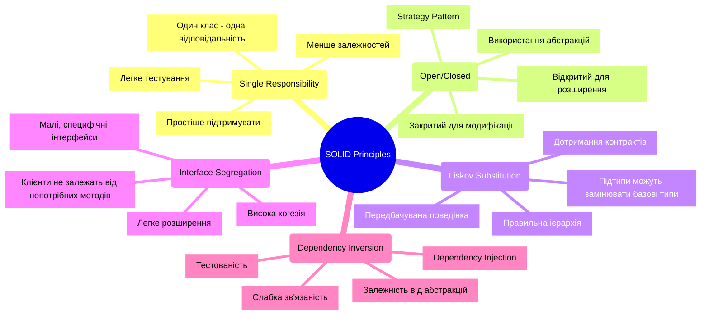

SOLID - це акронім п'яти фундаментальних принципів об'єктно-орієнтованого програмування та проєктування, представлених Робертом Мартіном.
Ці принципи допомагають створювати програмні системи, які є:

- Зрозумілими - код легко читати та розуміти
- Гнучкими - легко адаптуються до змін вимог
- Підтримуваними - просто вносити зміни та виправляти помилки
- Масштабованими - легко розширюються новою функціональністю
- Тестованими - добре покриваються автоматизованими тестами


```mermaid
mindmap
  root((SOLID Principles))
    (Single Responsibility)
        [Один клас - одна відповідальність]
        [Легке тестування]
        [Простіше підтримувати]
        [Менше залежностей]
    (Open/Closed)
        [Відкритий для розширення]
        [Закритий для модифікації]
        [Використання абстракцій]
        [Strategy Pattern]
    (Liskov Substitution)
        [Підтипи можуть замінювати базові типи]
        [Дотримання контрактів]
        [Передбачувана поведінка]
        [Правильна ієрархія]
    (Interface Segregation)
        [Малі, специфічні інтерфейси]
        [Клієнти не залежать від непотрібних методів]
        [Висока когезія]
        [Легке розширення]
    (Dependency Inversion)
        [Залежність від абстракцій]
        [Dependency Injection]
        [Слабка зв'язаність]
        [Тестованість]
```

Адаптивний код - це код, який витримує зміну вимог.
Зміни в ньому зачіпають мінімум існуючого функціоналу, бо відповідальності чітко розділені, а компоненти слабо зв'язані.
Нову функціональність можна додати без модифікації старого коду: абстракції та інтерфейси дозволяють гнучко підміняти реалізації.
Модульна архітектура дає змогу і масштабувати компоненти горизонтально, і нарощувати функціональність вертикально.
А ізольовані компоненти з легкою підміною залежностей просто покрити модульними тестами.

SOLID веде саме до такого коду.
Принципи допомагають керувати складністю: велика система розбивається на прості компоненти з чіткою структурою і зрозумілими зв'язками між частинами.
Гнучка архітектура дозволяє швидко реагувати на нові вимоги і не накопичувати технічний борг.
На практиці це означає менше помилок, надійнішу систему і продуктивнішу розробку.
Виграє й команда: новим розробникам легше увійти в проєкт, code review простіше, а сам код краще пояснює, що він робить.

---

## Single Responsibility Principle (SRP)

Принцип єдиної відповідальності стверджує, що кожен клас повинен мати лише одну причину для змін.
Іншими словами, клас повинен виконувати лише одну чітко визначену функцію або відповідати за один аспект функціональності системи.

На практиці це означає, що кожен клас має чітку роль, а його методи працюють з одним, чітко окресленим набором даних.
Тоді зміна в одній частині системи не дає несподіваних побічних ефектів в іншій.

Методи правильно спроєктованого класу логічно пов'язані між собою і працюють на спільну мету, тому його призначення можна описати одним реченням.
Якщо одного речення не вистачає, клас, найімовірніше, робить забагато.

Третя складова - інкапсуляція. Клас ховає деталі реалізації і показує назовні лише чіткий публічний інтерфейс.
Що менше інші частини системи знають про його нутрощі, то менше між ними залежностей і то легше клас змінювати.

### ❌ Приклад порушення принципу

```cs
public class UserManager
{
    private readonly string _connectionString;
    private readonly ILogger _logger;
    private readonly IEmailService _emailService;

    public UserManager(string connectionString, ILogger logger, IEmailService emailService)
    {
        _connectionString = connectionString;
        _logger = logger;
        _emailService = emailService;
    }

    public async Task RegisterUser(UserRegistrationDto dto)
    {
        // Валідація даних
        if (string.IsNullOrEmpty(dto.Email))
            throw new ValidationException("Email is required");
        if (string.IsNullOrEmpty(dto.Password))
            throw new ValidationException("Password is required");
        if (dto.Password.Length < 8)
            throw new ValidationException("Password must be at least 8 characters");

        // Хешування пароля
        var salt = GenerateSalt();
        var passwordHash = HashPassword(dto.Password, salt);

        // Збереження в базу даних
        using (var connection = new SqlConnection(_connectionString))
        {
            await connection.OpenAsync();
            using (var command = connection.CreateCommand())
            {
                command.CommandText = "INSERT INTO Users (Email, PasswordHash, Salt) VALUES (@Email, @PasswordHash, @Salt)";
                command.Parameters.AddWithValue("@Email", dto.Email);
                command.Parameters.AddWithValue("@PasswordHash", passwordHash);
                command.Parameters.AddWithValue("@Salt", salt);
                await command.ExecuteNonQueryAsync();
            }
        }

        // Відправка вітального email
        var emailMessage = new EmailMessage
        {
            To = dto.Email,
            Subject = "Welcome to our platform!",
            Body = "Thank you for registering..."
        };
        await _emailService.SendAsync(emailMessage);

        // Логування
        _logger.LogInformation($"User {dto.Email} registered successfully at {DateTime.UtcNow}");
    }

    private string GenerateSalt()
    {
        // Генерація солі
        byte[] salt = new byte[16];
        using (var rng = new RNGCryptoServiceProvider())
        {
            rng.GetBytes(salt);
        }
        return Convert.ToBase64String(salt);
    }

    private string HashPassword(string password, string salt)
    {
        // Хешування пароля
        using (var sha256 = SHA256.Create())
        {
            var passwordBytes = Encoding.UTF8.GetBytes(password + salt);
            var hashBytes = sha256.ComputeHash(passwordBytes);
            return Convert.ToBase64String(hashBytes);
        }
    }
}
```

### ✅ Правильна реалізація

```cs
// Модель даних
public class UserRegistrationDto
{
    public string Email { get; set; }
    public string Password { get; set; }
}

// Валідація
public class UserRegistrationValidator : IValidator<UserRegistrationDto>
{
    public ValidationResult Validate(UserRegistrationDto dto)
    {
        var result = new ValidationResult();

        if (string.IsNullOrEmpty(dto.Email))
            result.AddError("Email is required");

        if (string.IsNullOrEmpty(dto.Password))
            result.AddError("Password is required");
        else if (dto.Password.Length < 8)
            result.AddError("Password must be at least 8 characters");

        return result;
    }
}

// Сервіс для роботи з паролями
public interface IPasswordService
{
    string GenerateSalt();
    string HashPassword(string password, string salt);
}

public class PasswordService : IPasswordService
{
    public string GenerateSalt()
    {
        byte[] salt = new byte[16];
        using (var rng = new RNGCryptoServiceProvider())
        {
            rng.GetBytes(salt);
        }
        return Convert.ToBase64String(salt);
    }

    public string HashPassword(string password, string salt)
    {
        using (var sha256 = SHA256.Create())
        {
            var passwordBytes = Encoding.UTF8.GetBytes(password + salt);
            var hashBytes = sha256.ComputeHash(passwordBytes);
            return Convert.ToBase64String(hashBytes);
        }
    }
}

// Репозиторій для роботи з базою даних
public interface IUserRepository
{
    Task CreateAsync(User user);
    Task<User> GetByEmailAsync(string email);
}

public class UserRepository : IUserRepository
{
    private readonly string _connectionString;

    public UserRepository(string connectionString)
    {
        _connectionString = connectionString;
    }

    public async Task CreateAsync(User user)
    {
        using (var connection = new SqlConnection(_connectionString))
        {
            await connection.OpenAsync();
            using (var command = connection.CreateCommand())
            {
                command.CommandText = "INSERT INTO Users (Email, PasswordHash, Salt) VALUES (@Email, @PasswordHash, @Salt)";
                command.Parameters.AddWithValue("@Email", user.Email);
                command.Parameters.AddWithValue("@PasswordHash", user.PasswordHash);
                command.Parameters.AddWithValue("@Salt", user.Salt);
                await command.ExecuteNonQueryAsync();
            }
        }
    }

    public async Task<User> GetByEmailAsync(string email)
    {
        // Реалізація отримання користувача
    }
}

// Сервіс відправки email
public interface IEmailService
{
    Task SendWelcomeEmailAsync(string email);
}

public class EmailService : IEmailService
{
    private readonly IEmailClient _emailClient;
    private readonly IEmailTemplateService _templateService;

    public EmailService(IEmailClient emailClient, IEmailTemplateService templateService)
    {
        _emailClient = emailClient;
        _templateService = templateService;
    }

    public async Task SendWelcomeEmailAsync(string email)
    {
        var template = await _templateService.GetTemplateAsync("WelcomeEmail");
        var message = new EmailMessage
        {
            To = email,
            Subject = "Welcome to our platform!",
            Body = template
        };
        await _emailClient.SendAsync(message);
    }
}

// Основний сервіс реєстрації
public class UserRegistrationService
{
    private readonly IValidator<UserRegistrationDto> _validator;
    private readonly IPasswordService _passwordService;
    private readonly IUserRepository _userRepository;
    private readonly IEmailService _emailService;
    private readonly ILogger<UserRegistrationService> _logger;

    public UserRegistrationService(
        IValidator<UserRegistrationDto> validator,
        IPasswordService passwordService,
        IUserRepository userRepository,
        IEmailService emailService,
        ILogger<UserRegistrationService> logger)
    {
        _validator = validator;
        _passwordService = passwordService;
        _userRepository = userRepository;
        _emailService = emailService;
        _logger = logger;
    }

    public async Task RegisterUserAsync(UserRegistrationDto dto)
    {
        // Валідація
        var validationResult = _validator.Validate(dto);
        if (!validationResult.IsValid)
            throw new ValidationException(validationResult.Errors);

        // Створення користувача
        var salt = _passwordService.GenerateSalt();
        var passwordHash = _passwordService.HashPassword(dto.Password, salt);

        var user = new User
        {
            Email = dto.Email,
            PasswordHash = passwordHash,
            Salt = salt
        };

        // Збереження
        await _userRepository.CreateAsync(user);

        // Відправка email
        await _emailService.SendWelcomeEmailAsync(dto.Email);

        // Логування
        _logger.LogInformation($"User {dto.Email} registered successfully");
    }
}
```

### Переваги

Найпомітніше SRP впливає на організацію коду: коли в кожного класу одне призначення, в кодовій базі легко орієнтуватися і знаходити потрібне.

Тестувати теж простіше. Компонент з однією відповідальністю перевіряється ізольовано, без складних моків і стабів, тож і покриття тестами зростає.

І зміни стають безпечнішими. Зазвичай вони локалізовані в одному компоненті, тому ризик зачепити щось поруч мінімальний, а результат модифікації передбачуваний.

## Open/Closed Principle (OCP)

Принцип відкритості/закритості стверджує, що програмні сутності (класи, модулі, функції тощо) повинні бути:

- Відкриті для розширення: нову функціональність можна додати
- Закриті для модифікації: існуючий код не потрібно змінювати

Тримається цей принцип на абстракціях і поліморфізмі.
Інтерфейси та абстрактні класи формують стабільний фундамент системи, а конкретна поведінка підставляється через реалізації та успадкування.
Якщо абстракції обрані правильно, нова функціональність додається без змін в існуючому коді, через відповідні патерни проєктування та конфігуровану поведінку.

Друга половина ідеї - інкапсуляція змін.
Частини системи, які найімовірніше змінюватимуться, ізолюють за стабільними публічними інтерфейсами, щоб зміни в них не зачіпали решту компонентів.

### ❌ Приклад порушення принципу

```cs
public class OrderProcessor
{
    public decimal CalculateDiscount(Order order)
    {
        // Проблема: при додаванні нового типу знижки 
        // потрібно модифікувати існуючий код
        switch (order.DiscountType)
        {
            case DiscountType.None:
                return 0;
            case DiscountType.Fixed:
                return order.Amount > 100 ? 20 : 0;
            case DiscountType.Percentage:
                return order.Amount * 0.1m;
            case DiscountType.Seasonal:
                return DateTime.Now.Month == 12 ? order.Amount * 0.2m : 0;
            default:
                throw new ArgumentException("Unknown discount type");
        }
    }
}

// При додаванні нового типу знижки:
public enum DiscountType
{
    None,
    Fixed,
    Percentage,
    Seasonal,
    // Потрібно додати новий тип тут
    SpecialOffer // Новий тип
}
```

### ✅ Правильна реалізація

```cs
// 1. Визначаємо абстракцію для стратегії знижки
public interface IDiscountStrategy
{
    decimal CalculateDiscount(Order order);
}

// 2. Реалізуємо конкретні стратегії
public class NoDiscount : IDiscountStrategy
{
    public decimal CalculateDiscount(Order order) => 0;
}

public class FixedDiscount : IDiscountStrategy
{
    private readonly decimal _threshold;
    private readonly decimal _discountAmount;

    public FixedDiscount(decimal threshold, decimal discountAmount)
    {
        _threshold = threshold;
        _discountAmount = discountAmount;
    }

    public decimal CalculateDiscount(Order order)
    {
        return order.Amount > _threshold ? _discountAmount : 0;
    }
}

public class PercentageDiscount : IDiscountStrategy
{
    private readonly decimal _percentage;

    public PercentageDiscount(decimal percentage)
    {
        _percentage = percentage;
    }

    public decimal CalculateDiscount(Order order)
    {
        return order.Amount * (_percentage / 100);
    }
}

public class SeasonalDiscount : IDiscountStrategy
{
    private readonly int _month;
    private readonly decimal _percentage;

    public SeasonalDiscount(int month, decimal percentage)
    {
        _month = month;
        _percentage = percentage;
    }

    public decimal CalculateDiscount(Order order)
    {
        return DateTime.Now.Month == _month ? 
            order.Amount * (_percentage / 100) : 0;
    }
}

// 3. Фабрика для створення стратегій
public interface IDiscountStrategyFactory
{
    IDiscountStrategy CreateStrategy(DiscountType type);
}

public class DiscountStrategyFactory : IDiscountStrategyFactory
{
    public IDiscountStrategy CreateStrategy(DiscountType type)
    {
        return type switch
        {
            DiscountType.None => new NoDiscount(),
            DiscountType.Fixed => new FixedDiscount(100, 20),
            DiscountType.Percentage => new PercentageDiscount(10),
            DiscountType.Seasonal => new SeasonalDiscount(12, 20),
            _ => throw new ArgumentException("Unknown discount type")
        };
    }
}

// 4. Процесор замовлень, який використовує стратегії
public class OrderProcessor
{
    private readonly IDiscountStrategyFactory _strategyFactory;

    public OrderProcessor(IDiscountStrategyFactory strategyFactory)
    {
        _strategyFactory = strategyFactory;
    }

    public decimal CalculateDiscount(Order order)
    {
        var strategy = _strategyFactory.CreateStrategy(order.DiscountType);
        return strategy.CalculateDiscount(order);
    }
}

// 5. Додавання нової стратегії знижки без зміни існуючого коду
public class LoyaltyDiscount : IDiscountStrategy
{
    private readonly decimal _pointsPercentage;

    public LoyaltyDiscount(decimal pointsPercentage)
    {
        _pointsPercentage = pointsPercentage;
    }

    public decimal CalculateDiscount(Order order)
    {
        if (order.Customer?.LoyaltyPoints == null)
            return 0;

        return order.Amount * (order.Customer.LoyaltyPoints * _pointsPercentage / 100);
    }
}
```

### Переваги

З OCP нову функціональність можна додавати з мінімальним ризиком регресії, і систему простіше масштабувати.
При змінах виникає менше помилок, їх легше локалізувати й виправити, а рефакторинг стає значно простішим.
Існуючі модульні тести не доводиться переписувати, коли з'являється нова функціональність, а нові тести писати легше.
Компоненти менше зв'язані між собою і мають чіткі межі відповідальності, тому їх легше використовувати повторно.

> Як обирати точки розширення
{: .prompt-info }
Почніть з аналізу вимог і можливих змін, виділіть стабільні абстракції і спроєктуйте під них гнучкі інтерфейси.
З успадкуванням обережно: надавайте перевагу композиції та уникайте глибоких ієрархій класів.
Самі точки розширення зручно підключати через DI контейнери, конфігураційні файли, а також factory та builder для створення об'єктів.
> Типові помилки
{: .prompt-info }
Надмірна абстракція породжує непотрібні інтерфейси й занадто складні ієрархії.
Неправильно обрані точки розширення, як передчасна, так і недостатня абстракція, ускладнюють подальший розвиток системи.
І впроваджуючи OCP, легко порушити інші принципи SOLID.

## Liskov Substitution Principle (LSP)

Принцип підстановки Лісков стверджує, що об'єкти базового класу можуть бути замінені об'єктами його похідних класів без зміни правильності програми.
Іншими словами, якщо **A** є підтипом **B**, тоді об'єкти типу **B** можуть бути замінені об'єктами типу **A** без зміни бажаних властивостей програми.

На практиці це зводиться до двох груп правил.

Перша стосується контракту між базовим класом і нащадками.
Підклас не може посилювати передумови: його метод не має вимагати жорсткіших умов для виконання, ніж метод базового класу.
Постумови, навпаки, не можна послаблювати: результат методу підкласу мусить давати всі гарантії, які дає базовий клас.
А інваріанти базового класу мають лишатися правильними для підкласу протягом усього життєвого циклу об'єкта.

Друга група стосується поведінки.
Метод підкласу повинен приймати всі параметри, які приймає відповідний метод базового класу.
Повертати він може більш специфічний тип (підтип) - це уточнює результат, не порушуючи контракт.
І підклас не повинен кидати винятки, яких від базового класу ніхто не очікує, інакше код, що працює з базовим типом, поведеться непередбачувано.

Якщо ці правила дотримані, об'єкт базового класу можна безпечно замінити об'єктом підкласу, і програма працюватиме коректно.

### ❌ Приклад порушення принципу

```cs
// Класичний приклад порушення LSP
public class Rectangle
{
    public virtual int Width { get; set; }
    public virtual int Height { get; set; }

    public virtual int CalculateArea()
    {
        return Width * Height;
    }
}

public class Square : Rectangle
{
    private int _size;

    public override int Width
    {
        get => _size;
        set
        {
            _size = value;
            Height = value; // Порушення LSP
        }
    }

    public override int Height
    {
        get => _size;
        set
        {
            _size = value;
            Width = value; // Порушення LSP
        }
    }
}

// Код, який порушує очікувану поведінку
public class GeometryCalculator
{
    public void ProcessRectangle(Rectangle rectangle)
    {
        rectangle.Width = 4;
        rectangle.Height = 5;
        
        // Очікуємо, що площа буде 20
        // Але для Square отримаємо 25!
        var area = rectangle.CalculateArea();
    }
}
```

### ✅ Правильна реалізація

```cs
// 1. Визначаємо абстракцію для фігур
public interface IShape
{
    double CalculateArea();
    double CalculatePerimeter();
}

// 2. Окремі реалізації для різних фігур
public class Rectangle : IShape
{
    public double Width { get; }
    public double Height { get; }

    public Rectangle(double width, double height)
    {
        if (width <= 0) throw new ArgumentException("Width must be positive", nameof(width));
        if (height <= 0) throw new ArgumentException("Height must be positive", nameof(height));
        
        Width = width;
        Height = height;
    }

    public double CalculateArea() => Width * Height;
    public double CalculatePerimeter() => 2 * (Width + Height);
}

public class Square : IShape
{
    public double Side { get; }

    public Square(double side)
    {
        if (side <= 0) throw new ArgumentException("Side must be positive", nameof(side));
        Side = side;
    }

    public double CalculateArea() => Side * Side;
    public double CalculatePerimeter() => 4 * Side;
}

// 3. Приклад використання
public class AreaCalculator
{
    public double CalculateTotalArea(IEnumerable<IShape> shapes)
    {
        return shapes.Sum(shape => shape.CalculateArea());
    }
}
```

### Переваги

Коли підкласи чесно дотримуються контракту, компоненти стають незалежнішими, систему легше розширювати, а код простіше використовувати повторно.
Поведінка системи передбачуваніша, помилок менше, відлагоджувати легше.

Є й практичний бонус для тестів: один набір тестів можна прогнати для всіх реалізацій, тож тестового коду потрібно менше, а покриття краще.
Нові типи додаються легко, існуючий код простіше підтримувати, і система краще масштабується.

> Рекомендації
{: .prompt-info }

- Проєктуйте за контрактом: чітко визначайте передумови та постумови методів, документуйте очікувану поведінку і використовуйте інваріанти для цілісності системи.

- Надавайте перевагу інтерфейсам перед конкретними реалізаціями, визначайте чіткі контракти взаємодії та уникайте тісної зв'язаності між компонентами.

- Тестуйте підстановку: пишіть тести для базового класу так, щоб ними можна було перевірити всі похідні класи. Параметризовані тести допомагають переконатися, що всі реалізації поводяться однаково.

- Дотримуйтесь базових принципів об'єктно-орієнтованого програмування.

## Interface Segregation Principle (ISP)

Принцип розділення інтерфейсів стверджує, що клієнти не повинні залежати від методів, які вони не використовують.
Великі інтерфейси потрібно розділяти на менші та більш специфічні.

Тут важливі дві речі.

Перша - гранулярність. У кожного інтерфейсу має бути чітке, конкретне призначення.
Менші, сфокусовані інтерфейси на практиці працюють краще за великі універсальні: клієнтський код бачить лише ті методи, які йому справді потрібні, і не залежить від зайвого.

Друга - когезія, або зв'язність. Методи одного інтерфейсу повинні бути логічно пов'язані й працювати на спільну мету, а сам інтерфейс - представляти одну чітко визначену концепцію.
Такий інтерфейс розробнику легше зрозуміти, а система виходить гнучкішою: кожен компонент має чітку відповідальність і мінімум залежностей від інших.

### ❌ Приклад порушення принципу

```cs
// Занадто великий інтерфейс з різноманітною функціональністю
public interface IEmployee
{
    // Особисті дані
    string GetName();
    string GetAddress();
    DateTime GetBirthDate();
    
    // Зарплата та фінанси
    decimal CalculateSalary();
    void ProcessPayroll();
    decimal CalculateBonus();
    
    // Управління задачами
    void AssignTask(Task task);
    Task[] GetTasks();
    void CompleteTask(Task task);
    
    // Відпустки
    void RequestVacation(DateTime start, DateTime end);
    int GetRemainingVacationDays();
    
    // Звітність
    void GeneratePerformanceReport();
    void SubmitTimesheet();
}

// Проблемна реалізація
public class PartTimeEmployee : IEmployee
{
    public string GetName() => "John Doe";
    public string GetAddress() => "123 Street";
    public DateTime GetBirthDate() => new DateTime(1990, 1, 1);
    
    public decimal CalculateSalary() => 1000m;
    public void ProcessPayroll() { /* ... */ }
    public decimal CalculateBonus() => 0; // Не отримує бонуси
    
    public void AssignTask(Task task) { /* ... */ }
    public Task[] GetTasks() => Array.Empty<Task>();
    public void CompleteTask(Task task) { /* ... */ }
    
    // Методи, які не мають сенсу для часткової зайнятості
    public void RequestVacation(DateTime start, DateTime end) 
        => throw new NotSupportedException();
    public int GetRemainingVacationDays() 
        => throw new NotSupportedException();
    
    public void GeneratePerformanceReport() 
        => throw new NotSupportedException();
    public void SubmitTimesheet() { /* ... */ }
}
```

### ✅ Правильна реалізація

```cs
// 1. Розділені інтерфейси за функціональністю
public interface IPersonalInfo
{
    string GetName();
    string GetAddress();
    DateTime GetBirthDate();
}

public interface IPayable
{
    decimal CalculateSalary();
    void ProcessPayroll();
}

public interface IBonusEligible
{
    decimal CalculateBonus();
}

public interface ITaskManageable
{
    void AssignTask(Task task);
    Task[] GetTasks();
    void CompleteTask(Task task);
}

public interface IVacationManageable
{
    void RequestVacation(DateTime start, DateTime end);
    int GetRemainingVacationDays();
}

public interface IReportable
{
    void GeneratePerformanceReport();
}

public interface ITimesheetSubmittable
{
    void SubmitTimesheet();
}

// 2. Реалізації для різних типів працівників
public class FullTimeEmployee : 
    IPersonalInfo, 
    IPayable, 
    IBonusEligible, 
    ITaskManageable, 
    IVacationManageable, 
    IReportable,
    ITimesheetSubmittable
{
    // Реалізація всіх необхідних методів
}

public class PartTimeEmployee : 
    IPersonalInfo, 
    IPayable, 
    ITaskManageable,
    ITimesheetSubmittable
{
    // Реалізація тільки потрібних методів
}

public class Contractor : 
    IPersonalInfo, 
    IPayable, 
    ITaskManageable,
    ITimesheetSubmittable
{
    // Реалізація тільки потрібних методів
}
```

### Переваги

Коли інтерфейси правильно розділені, нові можливості додаються комбінуванням кількох інтерфейсів, а залежностей між компонентами лишається мінімум.
Малі інтерфейси простіше зрозуміти і змінити: модифікація зазвичай обмежена одним інтерфейсом і рідше зачіпає інші частини системи.

У тестах різниця відчувається одразу. Маленький інтерфейс легко замокати, сценарії тестування чіткіші, а покриття краще.
А оскільки компоненти працюють через чітко визначені контракти і менше залежать один від одного, рефакторинг стає значно простішим.

Складність ISP у балансі між розміром інтерфейсу та його функціональністю.
Орієнтуйтеся на потреби клієнтського коду, який буде цей інтерфейс використовувати.

## Dependency Inversion Principle (DIP)

Принцип інверсії залежностей складається з двох ключових правил:

- Модулі високого рівня не повинні залежати від модулів низького рівня. Обидва повинні залежати від абстракцій.
- Абстракції не повинні залежати від деталей. Деталі повинні залежати від абстракцій.

Поруч із DIP майже завжди згадують інверсію контролю та впровадження залежностей, і всі три ідеї спираються на абстракції.

Інтерфейси та абстрактні класи задають стабільні контракти між компонентами.
Завдяки цьому високорівневі модулі не залежать від конкретних реалізацій низькорівневих, і система легше переносить зміни.

Інверсія контролю (IoC) іде на крок далі: створення об'єктів і управління ними програма передає спеціалізованому фреймворку.
IoC контейнер конфігурує залежності й керує життєвим циклом об'єктів, що спрощує архітектуру і тестування.

Впровадження залежностей (Dependency Injection) - це конкретні способи передати залежності об'єкту:

- Constructor Injection - усі необхідні залежності передаються через конструктор, тож вимоги об'єкта видно явно.
- Property Injection - залежності встановлюються через властивості; це зручно для опціональних залежностей.
- Method Injection - залежність передається прямо в метод, коли вона потрібна лише для певної операції.

### ❌ Приклад порушення принципу

```cs
// Тісно зв'язаний код з прямими залежностями
public class CustomerService
{
    private readonly SqlConnection _connection;
    private readonly EmailClient _emailClient;
    private readonly FileLogger _logger;

    public CustomerService()
    {
        _connection = new SqlConnection("connection_string");
        _emailClient = new EmailClient("smtp.server.com");
        _logger = new FileLogger("app.log");
    }

    public void RegisterCustomer(CustomerDto dto)
    {
        try
        {
            // Пряма робота з SQL
            using (var command = _connection.CreateCommand())
            {
                command.CommandText = "INSERT INTO Customers...";
                // ...
            }

            // Пряма email
            _emailClient.Send(new EmailMessage
            {
                To = dto.Email,
                Subject = "Welcome!",
                Body = "Thank you for registering..."
            });

            // Пряме логування
            _logger.Log($"Customer {dto.Email} registered successfully");
        }
        catch (Exception ex)
        {
            _logger.Log($"Error registering customer: {ex.Message}");
            throw;
        }
    }
}
```

### ✅ Правильна реалізація

```cs
// 1. Визначення абстракцій
public interface ICustomerRepository
{
    Task<Customer> GetByIdAsync(int id);
    Task<Customer> GetByEmailAsync(string email);
    Task CreateAsync(Customer customer);
    Task UpdateAsync(Customer customer);
}

public interface IEmailService
{
    Task SendWelcomeEmailAsync(string email, string name);
    Task SendPasswordResetEmailAsync(string email, string resetToken);
}

public interface ILogger
{
    Task LogInfoAsync(string message);
    Task LogErrorAsync(string message, Exception exception = null);
}

// 2. Реалізації
public class SqlCustomerRepository : ICustomerRepository
{
    private readonly string _connectionString;
    private readonly ILogger _logger;

    public SqlCustomerRepository(string connectionString, ILogger logger)
    {
        _connectionString = connectionString;
        _logger = logger;
    }

    public async Task<Customer> GetByIdAsync(int id)
    {
        try
        {
            using var connection = new SqlConnection(_connectionString);
            await connection.OpenAsync();
            
            var customer = await connection.QuerySingleOrDefaultAsync<Customer>(
                "SELECT * FROM Customers WHERE Id = @Id",
                new { Id = id }
            );

            _logger.LogInformation($"Retrieved customer {id}");
            return customer;
        }
        catch (Exception ex)
        {
            _logger.LogError($"Error retrieving customer {Exception}", ex);
            throw;
        }
    }

    // Інші методи...
}

public class SmtpEmailService : IEmailService
{
    private readonly SmtpClient _smtpClient;
    private readonly ILogger _logger;
    private readonly IEmailTemplateService _templateService;

    public SmtpEmailService(
        SmtpClient smtpClient,
        ILogger logger,
        IEmailTemplateService templateService)
    {
        _smtpClient = smtpClient;
        _logger = logger;
        _templateService = templateService;
    }

    public async Task SendWelcomeEmailAsync(string email, string name)
    {
        try
        {
            var template = await _templateService.GetTemplateAsync("WelcomeEmail");
            var body = template.Replace("{Name}", name);

            var message = new MailMessage
            {
                To = { email },
                Subject = "Welcome to our platform!",
                Body = body,
                IsBodyHtml = true
            };

            await _smtpClient.SendMailAsync(message);
            _logger.LogInformation($"Welcome email sent to {email}");
        }
        catch (Exception ex)
        {
            _logger.LogError($"Error sending welcome email to {Exception}", ex);
            throw;
        }
    }

    // Інші методи...
}

// 3. Сервіс високого рівня
public class CustomerService
{
    private readonly ICustomerRepository _customerRepository;
    private readonly IEmailService _emailService;
    private readonly ILogger _logger;
    private readonly IValidator<CustomerDto> _validator;

    public CustomerService(
        ICustomerRepository customerRepository,
        IEmailService emailService,
        ILogger logger,
        IValidator<CustomerDto> validator)
    {
        _customerRepository = customerRepository;
        _emailService = emailService;
        _logger = logger;
        _validator = validator;
    }

    public async Task RegisterCustomerAsync(CustomerDto dto)
    {
        try
        {
            // Валідація
            var validationResult = await _validator.ValidateAsync(dto);
            if (!validationResult.IsValid)
            {
                throw new ValidationException(validationResult.Errors);
            }

            // Перевірка дублікатів
            var existingCustomer = await _customerRepository.GetByEmailAsync(dto.Email);
            if (existingCustomer != null)
            {
                throw new DuplicateEmailException(dto.Email);
            }

            // Створення клієнта
            var customer = new Customer
            {
                Name = dto.Name,
                Email = dto.Email,
                // Інші поля...
            };

            await _customerRepository.CreateAsync(customer);
            _logger.LogInformation($"Created new customer: {customer.Email}");

            // Відправка email
            await _emailService.SendWelcomeEmailAsync(customer.Email, customer.Name);
        }
        catch (Exception ex)
        {
            _logger.LogError(ex, "Error registering customer");
            throw;
        }
    }
}

// 4. Конфігурація залежностей
public class Startup
{
    public void ConfigureServices(IServiceCollection services)
    {
        // Реєстрація залежностей
        services.AddScoped<ICustomerRepository, SqlCustomerRepository>();
        services.AddScoped<IEmailService, SmtpEmailService>();
        services.AddSingleton<ILogger, ApplicationLogger>();
        services.AddTransient<IValidator<CustomerDto>, CustomerDtoValidator>();
        services.AddScoped<CustomerService>();

        // Конфігурація опцій
        services.Configure<SqlOptions>(configuration.GetSection("SqlDatabase"));
        services.Configure<SmtpOptions>(configuration.GetSection("SmtpSettings"));
    }
}
```

### Переваги

Головне, що дає DIP, - слабка зв'язаність.
Компоненти залежать від абстракцій, а не від конкретних реалізацій, тому їх легко замінити, а залежності в системі під контролем.

Звідси ж і тестованість. Тести працюють з абстракціями, тому підставити мок-об'єкт нескладно, і тести виходять по-справжньому ізольованими.

Реалізації можна міняти, нову функціональність додавати без переробок, а конфігурацією системи простіше керувати.
Межі відповідальності між компонентами стають чіткішими, структура зрозумілішою, а код простіше використовувати повторно.

Найбільше зусиль при застосуванні DIP іде на те, щоб визначити правильні абстракції і продумати взаємодію між компонентами.

## Висновок

Код, написаний за принципами SOLID, простіше підтримувати й змінювати протягом усього життя проєкту: в ньому менше зайвої складності, і його легше зрозуміти.

Найпомітніше це відчувається на тестах. Писати й підтримувати їх стає набагато простіше, а звідси вже випливають якість і надійність.
Розширювати такий код новою функціональністю зручно, а рефакторинг стає передбачуванішим і безпечнішим.

> Це принципи, а не правила
{: .prompt-info }
Застосовуйте їх зважено, з урахуванням специфіки проєкту, його масштабу, вимог та обмежень.
Догматичне слідування SOLID легко перетворює простий код на невиправдано складний і менш ефективний.
> Рекомендована література
{: .prompt-info }
[Adaptive Code via C#: Agile coding with design patterns and SOLID principles](https://www.amazon.com/Adaptive-Code-via-principles-Developer/dp/0735683204){:target="_blank"}
