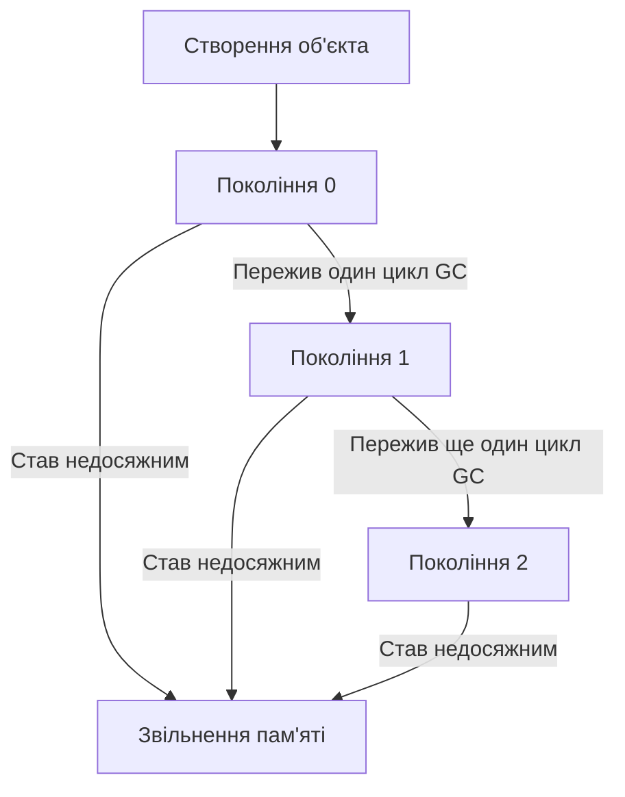
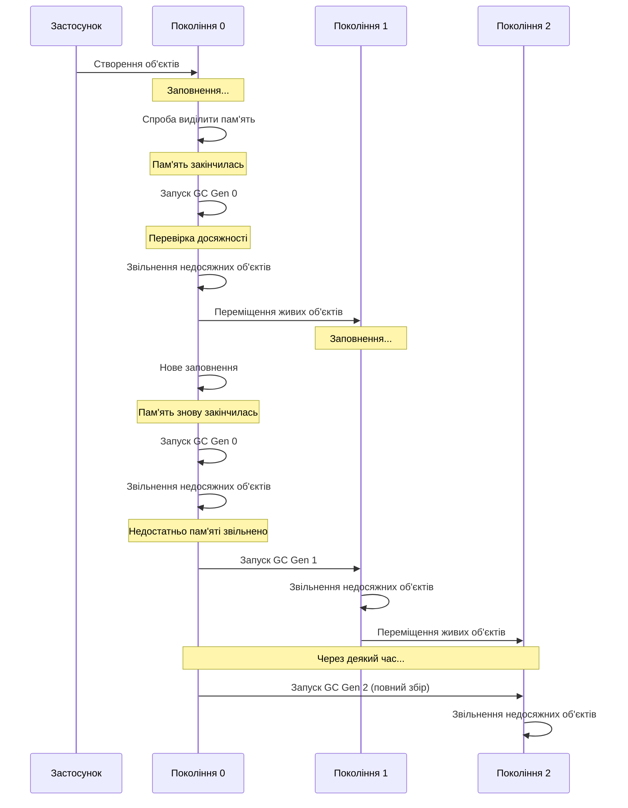
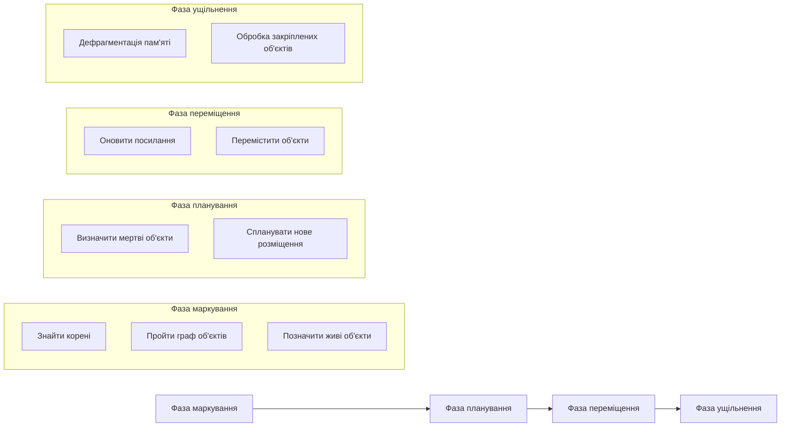
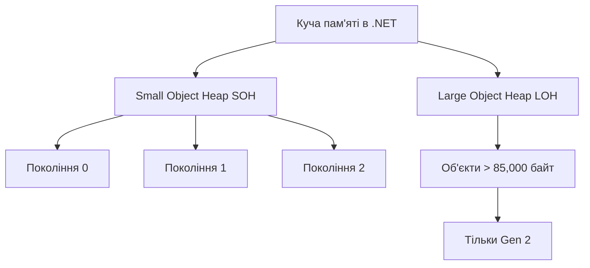
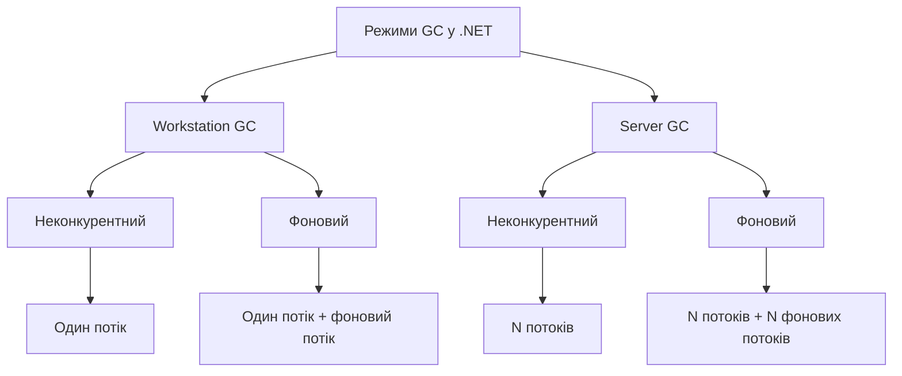
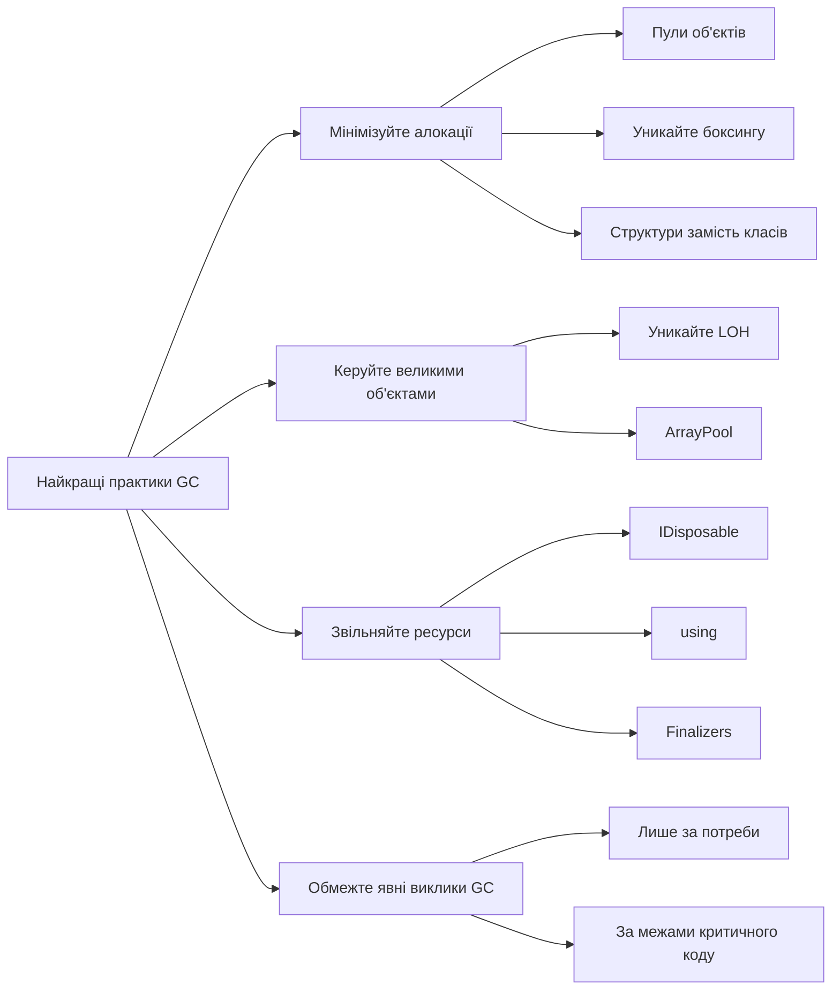

Збирання сміття (`Garbage Collection, GC`) – це автоматичний механізм керування пам'яттю, який звільняє розробників від необхідності вручну виділяти та звільняти пам'ять. У .NET це одна з ключових технологій, яка відрізняє платформу від мов, де керування пам'яттю відбувається вручну.

Куча пам'яті (`Heap`) – це область пам'яті, де зберігаються об'єкти, створені під час виконання програми. На відміну від стеку, де зберігаються значення типів-значень (int, float, struct тощо), куча використовується для зберігання об'єктів типів-посилань (класів).

## Основи кучі пам'яті в .NET

У .NET вся куча пам'яті є керованою, тобто `CLR (Common Language Runtime)` бере на себе відповідальність за її управління. Коли створюється новий об'єкт, `CLR` виділяє для нього пам'ять у кучі та повертає посилання на цей об'єкт.

```cs
class Program
{
    static void Main()
    {
        // Створення об'єкта у кучі
        Person person = new Person("Тарас", 32);
        
        // Використання об'єкта
        Console.WriteLine(person.Name);
        
        // Тут не потрібно вручну звільняти пам'ять!
        // GC зробить це автоматично, коли об'єкт стане недосяжним
    }
}

class Person(string name, int age)
{
    public string Name { get; set; } = name;
    
    public int Age { get; set; } = age;
}
```

У цьому прикладі об'єкт person створюється у кучі, а посилання на нього зберігається у локальній змінній. Коли метод `Main` завершиться, це посилання зникне, і об'єкт стане недоступним. У цей момент `GC` зможе звільнити пам'ять, зайняту цим об'єктом.

## Покоління об'єктів у .NET GC

Одна з головних особливостей .NET GC – це розподіл об'єктів за поколіннями.
Існує три генерації:

- Покоління 0 (`Gen 0`) – нові об'єкти, які щойно створені.
- Покоління 1 (`Gen 1`) – об'єкти, які пережили один цикл збору сміття.
- Покоління 2 (`Gen 2`) – об'єкти, які пережили два або більше циклів збору сміття.

Цей розподіл базується на гіпотезі, що нові об'єкти, ймовірно, будуть жити недовго, а старі об'єкти, ймовірно, залишаться живими ще довше.



## Цикли збору сміття

GC у .NET запускає цикли збору сміття за різних умов:

- Виділення пам'яті — якщо система намагається виділити пам'ять у `Gen 0`, але вона заповнена.
- Явний виклик — коли у коді викликається `GC.Collect()`.
- Низький тиск системної пам'яті — коли операційна система повідомляє про нестачу пам'яті.
- Зміна домену застосунку — коли `AppDomain` вивантажується.
- Завершення програми — коли програма закінчує роботу.

Існує три типи збору сміття залежно від генерації:

- `Gen 0` — найчастіший, перевіряє тільки найновіші об'єкти.
- `Gen 1` — відбувається, коли `Gen 0` не звільнила достатньо пам'яті.
- `Gen 2` — повний збір, який перевіряє всі об'єкти у кучі. Найдовший і найрідший.



## Фази GC: Від позначення до ущільнення

Процес збору сміття складається з декількох фаз:

- Фаза маркування (`Mark Phase`) — GC створює граф об'єктів, починаючи від "коренів" (`root references`) і позначає всі досяжні об'єкти як живі.
- Фаза планування (`Plan Phase`) — GC визначає, які з мертвих об'єктів можна звільнити і як компактно переорганізувати живі об'єкти.
- Фаза переміщення (`Relocate Phase`) — живі об'єкти переміщуються в нові місця для компактності.
- Фаза ущільнення (`Compact Phase`) — пам'ять ущільнюється, щоб запобігти фрагментації.



## Ущільнення та фрагментація пам'яті в контексті GC

### Фрагментація пам'яті

Фрагментація пам'яті — це явище, коли вільна пам'ять стає "роздробленою" на маленькі ділянки, розкидані між зайнятими об'єктами. Це схоже на паркінг, де є багато маленьких вільних місць, розкиданих між автомобілями, але немає жодного великого місця для паркування автобуса.

Уявіть пам'ять як лінійний масив комірок:

`[A][A][A][B][B][_][C][_][D][_][_][E]`

Де:

`[A], [B], [C], [D], [E]` — зайняті блоки пам'яті (живі об'єкти)

`[_]` — вільні блоки пам'яті

У цьому прикладі вільна пам'ять фрагментована на кілька маленьких шматків. Хоча загальний обсяг вільної пам'яті може бути достатнім для створення нового об'єкта, але жоден окремий фрагмент не має достатнього розміру для розміщення великого об'єкта.

Наслідки фрагментації:

Неефективне використання пам'яті

- Проблеми з розміщенням нових великих об'єктів
- Зниження швидкодії програми

### Ущільнення пам'яті (Compaction)

Ущільнення — це процес, коли `GC` переміщує живі об'єкти так, щоб вони були розташовані поруч один з одним, а вся вільна пам'ять об'єднувалася в один суцільний блок.

До ущільнення:

`[A][A][A][_][B][_][C][_][D][_][_][E]`

Після ущільнення:

`[A][A][A][B][C][D][E][_][_][_][_][_]`

Тепер всі вільні блоки об'єднані в один великий, що дозволяє ефективно розміщувати нові об'єкти, навіть великі.

### Як працює ущільнення в .NET

Процес ущільнення пам'яті в .NET представляє собою складну послідовність операцій. Спочатку `GC` визначає, які об'єкти залишаються досяжними в пам'яті. Потім він створює план переміщення цих живих об'єктів таким чином, щоб усунути прогалини ("дірки") в пам'яті. Згідно з планом, `GC` копіює живі об'єкти у нові, послідовні місця в пам'яті. Після переміщення збирач сміття оновлює всі посилання на ці об'єкти, щоб вони вказували на нові адреси пам'яті. Нарешті, система звільняє стару пам'ять, де раніше знаходились об'єкти, роблячи її доступною для нових алокацій.

Особливості ущільнення суттєво відрізняються для різних частин керованої кучі.
У `Small Object Heap` (SOH) ущільнення виконується регулярно під час кожного циклу збору сміття, що допомагає ефективно використовувати пам'ять для малих об'єктів.
`Large Object Heap` (LOH) історично не піддавалася ущільненню, оскільки переміщення великих об'єктів вимагає значних обчислювальних ресурсів. Саме через цю особливість `LOH` часто страждає від фрагментації пам'яті.

До версії .NET 4.5.1 ущільнення `LOH` взагалі не виконувалося. Починаючи з .NET 4.5.1, розробники отримали можливість увімкнути ущільнення `LOH` за допомогою параметра `GCSettings.LargeObjectHeapCompactionMode = GCLargeObjectHeapCompactionMode.CompactOnce;`.

У новіших версіях .NET механізм ущільнення LOH став значно ефективнішим, хоча за замовчуванням він все ще вимкнений.

### Приклад

```cs
class Program
{
    static void Main()
    {
        // Створюємо і звільняємо об'єкти різного розміру, що призводить до фрагментації
        var references = new List<byte[]>();
        
        // Створення 100 об'єктів по 1MB (викликає фрагментацію)
        for (int i = 0; i < 100; i++)
        {
            // 1MB
            references.Add(new byte[1024 * 1024]);
            
            // Видаляємо об'єкти через один, створюючи "дірки"
            if (i % 2 == 0)
            {
              references.RemoveAt(references.Count - 1);
            }
        }
        
        // Спроба створити великий об'єкт (може не вдатися через фрагментацію)
        try
        {
            // 50MB
            var largeObject = new byte[50 * 1024 * 1024];
            Console.WriteLine("Великий об'єкт успішно створено");
        }
        catch (OutOfMemoryException)
        {
            Console.WriteLine("Помилка: недостатньо пам'яті (ймовірно через фрагментацію)");
            
            // Викликаємо повний GC з ущільненням
            GCSettings.LargeObjectHeapCompactionMode = GCLargeObjectHeapCompactionMode.CompactOnce;
            GC.Collect(2, GCCollectionMode.Forced, true, true);
            
            try
            {
                // 50MB
                var largeObject = new byte[50 * 1024 * 1024];
                Console.WriteLine("Після ущільнення великий об'єкт успішно створено");
            }
            catch
            {
                Console.WriteLine("Все одно недостатньо пам'яті");
            }
        }
    }
}
```

### Як запобігти проблемам з фрагментацією

- Використовуйте пули об'єктів — повторно використовуйте об'єкти замість створення нових (`ArrayPool<T>`, `ObjectPool<T>`)
- Мінімізуйте використання закріплення об'єктів, зафіксовані через `fixed` або `GCHandle.Alloc(obj, GCHandleType.Pinned)`, створюють "дірки" при ущільненні
- Враховуйте розмір об'єктів — уникайте створення об'єктів, розмір яких близький до межі LOH (85KB)
- Структуруйте дані — організовуйте дані таким чином, щоб об'єкти, які використовуються разом, створювалися разом
- Використовуйте структури — для маленьких типів даних використовуйте структури замість класів, щоб зменшити навантаження на кучу

## Сегменти пам'яті та Large Object Heap (LOH)

Куча пам'яті в .NET розділена на два основних типи:

- `Small Object Heap (SOH)` — для об'єктів менше 85,000 байт. Ця куча поділена на три генерації (0, 1, 2).
- `Large Object Heap (LOH)` — для об'єктів більше 85,000 байт. Ця куча працює інакше:

Об'єкти в LOH одразу потрапляють до Gen 2

- LOH не проходить ущільнення за замовчуванням (це можна змінити в .NET 4.5.1+)
- LOH частіше страждає від фрагментації



## Режими GC: Workstation vs. Server

.NET підтримує два режими GC:

Workstation GC:

- Оптимізований для клієнтських програм
- Мінімізує паузи для кращого інтерактивного досвіду
- Зазвичай використовує один потік для GC

Server GC:

- Оптимізований для серверів
- Підвищує загальну продуктивність системи
- Використовує кілька потоків (по одному на процесор)
- Більші паузи, але вища загальна пропускна здатність

Також є два варіанти GC:

- Неконкурентний GC — призупиняє всі потоки програми під час роботи GC.
- Фоновий GC — намагається виконувати частину роботи паралельно з програмою.



## Найкращі практики роботи з GC

Ось кілька порад, як ефективно працювати з GC у .NET:

- Уникайте непотрібних виділень пам'яті:
  - Використовуйте пули об'єктів для частих алокацій (`ObjectPool<T>`)
  - Уникайте боксингу типів-значень
  - Використовуйте `StringBuilder` замість конкатенації рядків у циклах

- Контролюйте великі об'єкти:
  - Уникайте створення тимчасових великих масивів і колекцій
  - Розгляньте варіант розбиття великих об'єктів на менші
  - Використовуйте `ArrayPool<T>` для роботи з тимчасовими великими масивами

- Правильно реалізуйте IDisposable:
  - Використовуйте шаблон using для об'єктів, які потрібно звільнити
  - Завжди звільняйте некеровані ресурси

- Рідко використовуйте явний GC:
  - Уникайте викликів `GC.Collect()` у більшості випадків
  - Використовуйте його тільки в особливих ситуаціях (наприклад, після великих операцій з пам'яттю)

- Використовуйте WeakReference:
  - Для кешування даних, які можуть бути видалені GC при нестачі пам'яті

- Уникайте циклічних посилань:
  - Хоча GC може їх обробляти, вони можуть затримати звільнення пам'яті

- Використовуйте `Span<T>` і `Memory<T>`:
  - У .NET для роботи з блоками пам'яті без копіювання



## Типові помилки та їх вирішення

### Витік пам'яті через забуті події

```cs
// Помилка: підписуємось на подію і не відписуємось
public void Initialize()
{
    EventSource.SomeEvent += HandleEvent;
}

// Вирішення: правильно відписуємось
public void Initialize()
{
    EventSource.SomeEvent += HandleEvent;
}

public void Dispose()
{
    EventSource.SomeEvent -= HandleEvent;
}
```

### Створення тимчасових рядків у циклах

```cs
// Помилка: багато тимчасових рядків
string result = "";
for (int i = 0; i < 1000; i++)
{
    result += i.ToString();
}

// Вирішення: StringBuilder
StringBuilder sb = new StringBuilder();
for (int i = 0; i < 1000; i++)
{
    sb.Append(i);
}
string result = sb.ToString();
```

### Неправильне керування некерованими ресурсами

```cs
// Помилка: відсутнє звільнення ресурсів
public class ResourceHandler
{
    private IntPtr nativeResource;
    
    public ResourceHandler()
    {
        nativeResource = NativeMethods.Allocate();
    }
}

// Вирішення: правильна реалізація IDisposable
public class ResourceHandler : IDisposable
{
    private IntPtr nativeResource;
    private bool disposed = false;
    
    public ResourceHandler()
    {
        nativeResource = NativeMethods.Allocate();
    }
    
    public void Dispose()
    {
        Dispose(true);
        GC.SuppressFinalize(this);
    }
    
    protected virtual void Dispose(bool disposing)
    {
        if (!disposed)
        {
            if (nativeResource != IntPtr.Zero)
            {
                NativeMethods.Free(nativeResource);
                nativeResource = IntPtr.Zero;
            }
            disposed = true;
        }
    }
    
    ~ResourceHandler()
    {
        Dispose(false);
    }
}
```

## Висновки

Збір сміття в .NET – це потужний механізм, який звільняє розробників від необхідності вручну керувати пам'яттю.
Розуміння його принципів роботи та вдумливе проектування системи з урахуванням особливостей керування пам'яттю допоможе уникнути проблем з фрагментацією та забезпечить ефективну роботу програми навіть під великим навантаженням.

Ключові моменти:

- GC у .NET використовує систему поколінь (0, 1, 2) для оптимізації процесу збору сміття.
- Цикли GC запускаються при потребі в пам'яті, явному виклику або системних подіях.
- Фази GC включають маркування, планування, переміщення та ущільнення.
- Різні режими `GC` (`Workstation` vs. `Server`, неконкурентний vs. фоновий) оптимізовані для різних сценаріїв.
- Дотримання найкращих практик допомагає зменшити навантаження на GC та підвищити продуктивність.

Пам'ятайте, що хоча `GC` автоматизує керування пам'яттю, відповідальність за ефективне використання ресурсів все ще лежить на розробнику.
