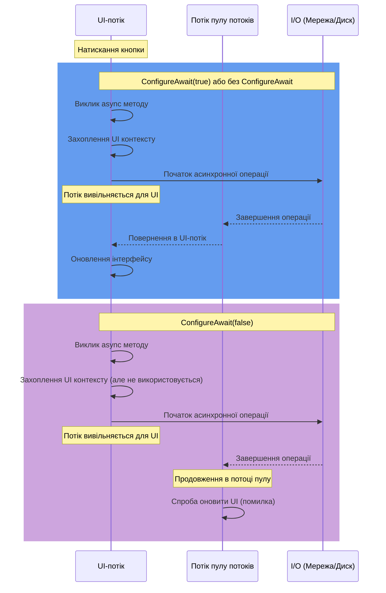
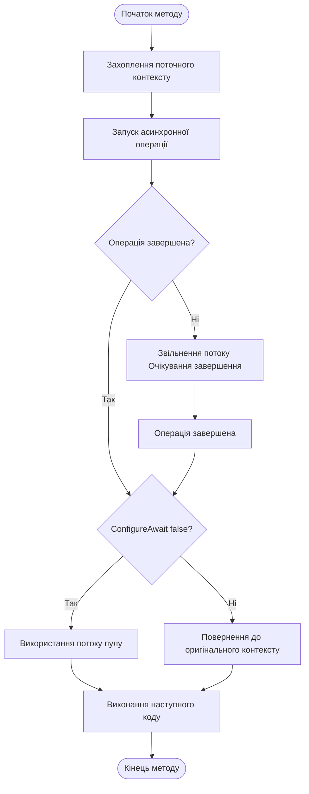

Асинхронне програмування стало основою сучасної розробки на платформі .NET.
Механізм `async/await` значно спростив роботу з асинхронними операціями, але приніс з собою певні нюанси, які важливо розуміти для створення ефективних додатків. Одним із ключових аспектів асинхронного програмування в .NET є метод `ConfigureAwait`, який дозволяє контролювати, де продовжиться виконання асинхронного методу після `await`.

## Контекст синхронізації та поведінка await

### Що таке контекст синхронізації?

Контекст синхронізації (`SynchronizationContext`) — це абстракція, яка керує тим, де виконуватиметься код після повернення з асинхронної операції. Це своєрідний "маршрутизатор", який визначає, на якому потоці продовжити виконання коду.
У різних типах додатків використовуються різні реалізації контексту синхронізації:

- `Windows Forms`, `WPF`, `MAUI` мають контекст синхронізації UI потоку, який забезпечує, що код після `await` виконується в потоці користувацького інтерфейсу, дозволяючи безпечно оновлювати UI елементи
- Класичний `ASP.NET` має власний контекст синхронізації, пов'язаний із запитом, який зберігає контекст `HttpContext`
- `ASP.NET Core`, консольні додатки та сервіси зазвичай не мають спеціального контексту синхронізації і використовують потоки з пулу потоків

Коли ви використовуєте `await` в асинхронному методі, .NET за замовчуванням:

- Захоплює поточний контекст синхронізації
- Виконує очікувану асинхронну операцію
- Повертає виконання коду після await у захоплений контекст

Це зручно для розробників, оскільки дозволяє природно працювати з `UI` компонентами після асинхронних операцій. Однак така поведінка має свою ціну з точки зору продуктивності.

### Проблеми з контекстом синхронізації

Повернення до захопленого контексту може створювати декілька проблем:

- Додаткові накладні витрати — переключення між контекстами вимагає ресурсів системи
- Потенційні дедлоки — в деяких сценаріях (особливо з блокуючим кодом) може виникнути взаємне блокування
- Непотрібне навантаження — у багатьох випадках код не потребує оригінального контексту для продовження роботи

Саме для вирішення цих проблем і був створений метод `ConfigureAwait`.

## ConfigureAwait(bool continueOnCapturedContext)

Метод `ConfigureAwait` дозволяє змінити стандартну поведінку `await` щодо повернення у захоплений контекст.
Він має один булевий параметр, який визначає, чи слід повертатися до оригінального контексту після `await`:

```cs
// Захоплює контекст і повертається до нього після await (стандартна поведінка)
await someTask.ConfigureAwait(true);
// або просто
await someTask;

// НЕ повертається до захопленого контексту, продовжує на будь-якому доступному потоці
await someTask.ConfigureAwait(false);
```

### Як працює ConfigureAwait(false)

Коли ви використовуєте ConfigureAwait(false):

- Контекст все одно захоплюється при виклику `await`
- Асинхронна операція виконується так само, як і завжди
- Після завершення операції, замість повернення в захоплений контекст, продовження виконується на будь-якому доступному потоці з пулу потоків
- Це дозволяє уникнути витрат на переключення контексту і потенційних дедлоків



### Потік виконання з ConfigureAwait



## Коли використовувати ConfigureAwait(false)

ConfigureAwait(false) найкраще підходить для наступних сценаріїв:

### У коді бібліотек

Бібліотечний код часто використовується в різних типах додатків. Ви не знаєте наперед, чи буде ваша бібліотека використовуватися в `WPF, ASP.NET`, консольному додатку чи мобільному додатку. Використовуючи `ConfigureAwait(false)`, ви забезпечуєте, що ваша бібліотека не накладає непотрібних обмежень на додаток, який її використовує.
Розробка бібліотек вимагає особливої уваги до контексту, оскільки різні додатки можуть очікувати різної поведінки. Якщо ви розробляєте бібліотеку загального призначення, найкращим підходом є повне та послідовне використання `ConfigureAwait(false)` для всіх await у вашому коді, щоб зробити його найбільш гнучким та ефективним.

### Для операцій, які не взаємодіють з контекстом

Багато асинхронних операцій не потребують оригінального контексту для продовження виконання. Наприклад, читання з файлу, обробка даних, HTTP-запити – все це можна робити в будь-якому потоці. Використання `ConfigureAwait(false)` в таких сценаріях покращує продуктивність, не впливаючи на функціональність.

```cs
public async Task<ProcessedData> ProcessDataAsync(string filePath)
{
    // Читання файлу не вимагає спеціального контексту
    string content = await File.ReadAllTextAsync(filePath).ConfigureAwait(false);
    
    // Аналіз даних також можна виконувати в будь-якому потоці
    var parsedData = await JsonSerializer.DeserializeAsync<RawData>(
        new MemoryStream(Encoding.UTF8.GetBytes(content))).ConfigureAwait(false);
    
    // Обробка даних не залежить від контексту
    return await TransformDataAsync(parsedData).ConfigureAwait(false);
}
```

### Для підвищення продуктивності

Навіть якщо ваш додаток не має ризику дедлоків, `ConfigureAwait(false)` може покращити продуктивність, особливо в високонавантажених сценаріях, де велика кількість асинхронних операцій виконується одночасно.
У великих веб-додатках, які обробляють тисячі запитів, усунення непотрібних переключень контексту може значно підвищити пропускну здатність системи. Кожне переключення контексту має невеликі накладні витрати, але в масштабі вони можуть суттєво впливати на загальну продуктивність.

### Для запобігання дедлокам у специфічних сценаріях

В деяких архітектурних шаблонах можуть виникати дедлоки при змішуванні синхронних та асинхронних операцій. `ConfigureAwait(false)` може допомогти уникнути таких дедлоків, хоча це не рекомендований підхід для вирішення проблеми.

Типовий сценарій дедлоку виникає, коли:

- Синхронний метод блокує потік, чекаючи результату асинхронного методу
- Асинхронний метод намагається повернутися до захопленого контексту, який вже заблокований

`ConfigureAwait(false)` розриває цей зв'язок, дозволяючи асинхронному методу продовжити виконання на будь-якому потоці, а не чекати на звільнення заблокованого контексту.

## Коли НЕ потрібно використовувати ConfigureAwait(false)

Не всі сценарії підходять для `ConfigureAwait(false)`.
У деяких випадках важливо зберегти захоплений контекст:

- У коді користувацького інтерфейсу

Якщо ви розробляєте код для Windows Forms, WPF, UWP, MAUI або інших UI фреймворків, вам, ймовірно, потрібно оновлювати елементи інтерфейсу після асинхронних операцій. У таких випадках не використовуйте `ConfigureAwait(false)` для операцій, після яких йде взаємодія з UI.

```cs
private async void Button_Click(object sender, RoutedEventArgs e)
{
    // НЕ використовуємо ConfigureAwait(false), оскільки далі працюємо з UI
    var result = await LoadDataAsync();
    
    // Ці операції повинні виконуватися в UI-потоці
    ResultTextBlock.Text = result;
    ProgressBar.Visibility = Visibility.Collapsed;
    
    // Тут можна використовувати ConfigureAwait(false), оскільки далі не працюємо з UI
    await LogOperationAsync().ConfigureAwait(false);
}
```

- У ASP.NET (класичному)

У ASP.NET Web Forms та інших застарілих ASP.NET технологіях контекст синхронізації зберігає важливу інформацію про поточний запит.
Якщо ви використовуєте `ConfigureAwait(false)`, ви можете втратити доступ до `HttpContext.Current` та інших властивостей, прив'язаних до запиту.

```cs
protected async void Page_Load(object sender, EventArgs e)
{
    // Без ConfigureAwait(false), щоб зберегти HttpContext
    var userData = await GetUserDataAsync();
    
    // Використовуємо HttpContext після await
    if (HttpContext.Current.User.Identity.IsAuthenticated)
    {
        // Показуємо дані користувача
    }
}
```

- У тестах, які перевіряють контекст

Якщо ви пишете тести, які перевіряють правильність роботи з контекстом синхронізації, вам також слід уникати `ConfigureAwait(false)` в самих тестах, щоб забезпечити захоплення та відновлення контексту як очікується.

## Нові можливості ConfigureAwait в .NET 8.0

У .NET 8.0 Microsoft розширила функціональність `ConfigureAwait`, додавши нове перерахування `ConfigureAwaitOptions`:

```cs
public enum ConfigureAwaitOptions
{
  /// <summary>No options specified.</summary>
  None = 0,
  /// <summary>Attempts to marshal the continuation back to the original <see cref="T:System.Threading.SynchronizationContext" /> or <see cref="T:System.Threading.Tasks.TaskScheduler" /> present on the originating thread at the time of the await.</summary>
  ContinueOnCapturedContext = 1,
  /// <summary>Avoids throwing an exception at the completion of awaiting a <see cref="T:System.Threading.Tasks.Task" /> that ends in the <see cref="F:System.Threading.Tasks.TaskStatus.Faulted" /> or <see cref="F:System.Threading.Tasks.TaskStatus.Canceled" /> state.</summary>
  SuppressThrowing = 2,
  /// <summary>Forces an await on an already completed <see cref="T:System.Threading.Tasks.Task" /> to behave as if the <see cref="T:System.Threading.Tasks.Task" /> wasn't yet completed, such that the current asynchronous method will be forced to yield its execution.</summary>
  ForceYielding = 4,
}
```

Ці опції надають більш гнучкий контроль над поведінкою `await`.
Розглянемо кожну з них детальніше.

### None і ContinueOnCapturedContext

Ці опції відповідають класичним `ConfigureAwait(false)` і `ConfigureAwait(true)`:

```cs
// Еквівалентні виклики
await task.ConfigureAwait(false);
await task.ConfigureAwait(ConfigureAwaitOptions.None);

// Еквівалентні виклики
await task;
await task.ConfigureAwait(true);
await task.ConfigureAwait(ConfigureAwaitOptions.ContinueOnCapturedContext);
```

Важливо зазначити, що за замовчуванням для нового `ConfigureAwait(ConfigureAwaitOptions)`, якщо не вказано `ContinueOnCapturedContext`, контекст не захоплюється. Це протилежно до поведінки звичайного `await` без `ConfigureAwait`, де контекст захоплюється за замовчуванням.

### SuppressThrowing

Ця опція пригнічує винятки, які зазвичай виникають при `await` завдання, що завершилося з помилкою:

```cs
// Очікування завдання без генерації винятку
await task.ConfigureAwait(ConfigureAwaitOptions.SuppressThrowing);

// Еквівалентний код без використання SuppressThrowing
try 
{ 
    await task.ConfigureAwait(false); 
} 
catch 
{ 
    // Ігноруємо помилку
}
```

`SuppressThrowing` особливо корисний для сценаріїв, коли потрібно дочекатися завершення завдання незалежно від результату.
Наприклад, при скасуванні операції часто потрібно дочекатися завершення завдання перед запуском нової операції:

```cs
// Скасування старого завдання і очікування його завершення, ігноруючи винятки
_cts.Cancel();
await _task.ConfigureAwait(ConfigureAwaitOptions.SuppressThrowing);

// Запуск нового завдання
_cts = new CancellationTokenSource();
_task = PerformOperationAsync(_cts.Token);
```

> Важливо пам'ятати
{: .prompt-info }
`SuppressThrowing` працює тільки з `Task`, але не з `Task<T>`. Для `Task<T>` спроба використання `SuppressThrowing` призведе до помилки компіляції `(CA2261)` та винятку `ArgumentOutOfRangeException` під час виконання. Це пов'язано з тим, що у випадку винятку незрозуміло, яке значення типу `T` слід повернути.

```cs
public new ConfiguredTaskAwaitable<TResult> ConfigureAwait(ConfigureAwaitOptions options)
{
    if ((options & ~(ConfigureAwaitOptions.ContinueOnCapturedContext |
                      ConfigureAwaitOptions.ForceYielding)) != 0)
    {
        ThrowForInvalidOptions(options);
    }

    return new ConfiguredTaskAwaitable<TResult>(this, options);

    static void ThrowForInvalidOptions(ConfigureAwaitOptions options) =>
        throw ((options & ConfigureAwaitOptions.SuppressThrowing) == 0 ?
            new ArgumentOutOfRangeException(nameof(options)) :
            new ArgumentOutOfRangeException(nameof(options), SR.TaskT_ConfigureAwait_InvalidOptions));
}
```

### ForceYielding

Ця опція змушує await завжди поводитися асинхронно, навіть якщо завдання вже завершено:

```cs
// Завжди перемикається на потік пулу, навіть якщо завдання вже завершено
await task.ConfigureAwait(ConfigureAwaitOptions.ForceYielding);
```

За звичайних умов, якщо завдання вже завершене на момент `await`, продовження виконується синхронно в тому ж потоці.
`ForceYielding` змінює цю поведінку, змушуючи `await` завжди діяти асинхронно, що може бути корисним для:

- Юніт-тестування асинхронного коду
- Запобігання занадто глибокої рекурсії
- Реалізації асинхронних примітивів координації
- Примусового перемикання потоків

`ForceYielding` схожий на `Task.Yield()`, але з деякими відмінностями:

- `Task.Yield()` продовжить на захопленому контексті
- `ForceYielding` за замовчуванням НЕ використовує захоплений контекст

```cs
// Еквівалентні виклики
await Task.Yield();
await Task.CompletedTask.ConfigureAwait(ConfigureAwaitOptions.ForceYielding | ConfigureAwaitOptions.ContinueOnCapturedContext);
```

Ця опція особливо корисна, коли потрібно гарантувати, що код після `await` завжди виконується в окремому циклі повідомлень, незалежно від стану завдання.

## Поширені помилки з ConfigureAwait

При роботі з `ConfigureAwait` часто зустрічаються деякі поширені помилки:

---

- `ConfigureAwait` НЕ є надійним способом уникнення дедлоків

  ```cs
  // Помилка: ConfigureAwait НЕ є надійним способом уникнення дедлоків
  public string GetData()
  {
      // Це все одно може призвести до дедлоку, якщо внутрішні
      // методи не використовують ConfigureAwait(false)
      return GetDataAsync().ConfigureAwait(false).GetAwaiter().GetResult();
  }
  ```

  `ConfigureAwait(false)` допомагає уникнути дедлоків лише якщо ВЕСЬ код, включаючи код у внутрішніх бібліотеках, також використовує `ConfigureAwait(false)`.
  Оскільки це неможливо гарантувати, цей підхід не є надійним вирішенням проблеми дедлоків.

- ConfigureAwait налаштовує `await`, а НЕ завдання

  ```cs
  // Помилка: ConfigureAwait не має жодного ефекту без await
  public string GetData()
  {
      // ConfigureAwait не має жодного ефекту тут, оскільки await відсутній!
      return SomethingAsync().ConfigureAwait(false).GetAwaiter().GetResult();
  }

  // Також помилка: ConfigureAwait впливає тільки на await, якому належить
  var task = SomethingAsync();
  task.ConfigureAwait(false); // Це не має ефекту!
  await task; // Все одно продовжує на захопленому контексті
  ```

  `ConfigureAwait` налаштовує поведінку оператора `await`, а не самого завдання.
  Виклик `ConfigureAwait` без подальшого `await` не має жодного ефекту.

- ConfigureAwait(false) не гарантує зміну потоку

  ```cs
  // Помилка: Думати, що ConfigureAwait(false) завжди перемикає потік
  async Task DoWorkAsync()
  {
      // Якщо завдання вже завершено, код продовжить виконання
      // на тому ж потоці, незважаючи на ConfigureAwait(false)
      await Task.FromResult(42).ConfigureAwait(false);
      
      // Код тут НЕ обов'язково виконується на іншому потоці!
  }
  ```
  
  `ConfigureAwait(false)` не гарантує виконання на іншому потоці.
  Якщо завдання вже завершено на момент `await`, код продовжить виконуватися на тому ж потоці, навіть з `ConfigureAwait(false)`.

---

## Еволюція рекомендацій щодо ConfigureAwait

Рекомендації щодо використання ConfigureAwait(false) змінювалися з часом:

- Початкові рекомендації
  На початку впровадження `async/await`, спільнота рекомендувала використовувати `ConfigureAwait(false)` всюди, де не потрібен захоплений контекст. Це було зумовлено частими дедлоками, з якими стикалися перші користувачі асинхронного програмування, та істотним впливом `ConfigureAwait(false)` на підвищення продуктивності додатків.

- Середній період (2015-2019)
  З часом, рекомендації стали більш нюансованими:

  - Використовуйте `ConfigureAwait(false)` у бібліотечному коді
  - Не використовуйте `ConfigureAwait(false)` у прикладному коді

  Це спростило правила та зробило їх більш зрозумілими для розробників.

- Сучасні рекомендації (з виходом ASP.NET Core)
  ASP.NET Core не має `SynchronizationContext`, тому в ньому `ConfigureAwait(false)` має менший вплив. Деякі бібліотеки навіть відмовилися від послідовного використання `ConfigureAwait(false)` через:
  - Надмірну зашумленість коду
  - Меншу необхідність у середовищах без SynchronizationContext
  - Ускладнення підтримки коду

З виходом .NET 8.0 та нових опцій `ConfigureAwait`, розробники отримали більш гнучкі інструменти для тонкого налаштування асинхронної поведінки.

- Загальний сучасний консенсус
  - Використовуйте `ConfigureAwait(false)` у бібліотечних проектах
  - Розгляньте його використання у великих додатках для підвищення продуктивності
  - У .NET 8.0+ використовуйте нові опції `ConfigureAwait` для специфічних сценаріїв
  - У UI додатках будьте обережні з `ConfigureAwait(false)`, щоб не втратити контекст UI

## Приклади використання

Бібліотека для роботи з даними:

```cs
public class DataProcessor
{
    public async Task<ProcessedData> ProcessFileAsync(string filePath)
    {
        // Операція введення/виведення - використовуємо ConfigureAwait(false)
        var fileData = await File.ReadAllBytesAsync(filePath).ConfigureAwait(false);
        
        // Обробка даних не потребує контексту
        var processedData = await ProcessBytesAsync(fileData).ConfigureAwait(false);
        
        // Збереження даних також не потребує контексту
        await SaveToDbAsync(processedData).ConfigureAwait(false);
        
        return processedData;
    }
    
    private async Task<ProcessedData> ProcessBytesAsync(byte[] data)
    {
        // CPU-інтенсивна операція запускається в окремому потоці
        return await Task.Run(() => 
        {
            // Обробка даних
            return new ProcessedData();
        // ConfigureAwait(false) для консистентності
        }).ConfigureAwait(false);
    }
    
    private async Task SaveToDbAsync(ProcessedData data)
    {
        using var connection = new SqlConnection(_connectionString);
        await connection.OpenAsync().ConfigureAwait(false);
        
        using var command = connection.CreateCommand();
        command.CommandText = "INSERT INTO...";
        // ... налаштування параметрів
        
        await command.ExecuteNonQueryAsync().ConfigureAwait(false);
    }
}
```

UI додаток з фоновою обробкою

```cs
public class MainViewModel : INotifyPropertyChanged
{
    private string _status;
    public string Status
    {
        get => _status;
        set
        {
            _status = value;
            PropertyChanged?.Invoke(this, new PropertyChangedEventArgs(nameof(Status)));
        }
    }
    
    public event PropertyChangedEventHandler PropertyChanged;
    
    public async Task LoadDataAsync()
    {
        Status = "Завантаження...";
        
        try
        {
            // Завантаження даних - не взаємодіє з UI
            var data = await _dataService.GetDataAsync().ConfigureAwait(false);
            
            // Обробка даних - не взаємодіє з UI
            var processedData = await ProcessDataAsync(data).ConfigureAwait(false);
            
            // Повертаємося до UI контексту для оновлення інтерфейсу
            await _dispatcherService.RunOnUIThreadAsync(() =>
            {
                DataItems = new ObservableCollection<DataItem>(processedData);
                Status = "Готово";
            });
        }
        catch (Exception ex)
        {
            // Повертаємося до UI контексту для показу помилки
            await _dispatcherService.RunOnUIThreadAsync(() =>
            {
                Status = $"Помилка: {ex.Message}";
            });
        }
    }
}
```

## Висновок

`ConfigureAwait` є важливим інструментом для оптимізації асинхронного коду в .NET.

Правильне його використання допоможе вам:

- Підвищити продуктивність шляхом уникнення непотрібних переключень контексту
- Запобігти потенційним дедлокам у складних сценаріях
- Створювати гнучкі бібліотеки, які можуть ефективно працювати в різних середовищах

У .NET 8.0 з появою нових опцій `ConfigureAwaitOptions`, розробники отримали ще більше контролю над асинхронною поведінкою, що дозволяє тонко налаштовувати код для специфічних сценаріїв.

> Пам'ятайте головні правила:
{: .prompt-info }

- Використовуйте `ConfigureAwait(false)` у бібліотечному коді
- Будьте обережні з `ConfigureAwait(false)` у UI-коді
- `ConfigureAwait` налаштовує `await`, а не завдання
- Вивчіть нові можливості `ConfigureAwait` в .NET 8.0 для більш складних сценаріїв

Опанувавши правильні підходи до асинхронного програмування та використання `ConfigureAwait`, ви зможете розробляти високопродуктивні та добре масштабовані .NET-додатки, які ефективно використовують системні ресурси та забезпечують відмінний досвід користувача.
