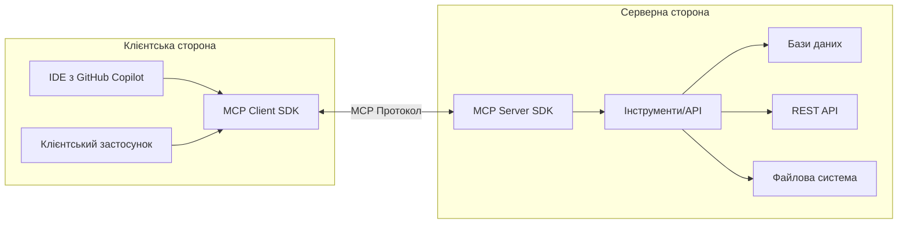

Model Context Protocol (MCP) відкриває нові можливості для взаємодії з ШІ моделями та інтеграції їх у ваші .NET застосунки. У цій статті ми розглянемо, що таке MCP, які проблеми він вирішує, та як ви можете використовувати його у своїх проектах.

## Що таке Model Context Protocol?

MCP - це стандартизований протокол, розроблений для забезпечення структурованого обміну контекстом і даними між ШІ моделями та клієнтськими застосунками. У світі, де ШІ стає невід'ємною частиною програмного забезпечення, MCP допомагає вирішити одну з ключових проблем - ефективну комунікацію між різними компонентами ШІ систем.

Концептуальну схему роботи MCP можна зобразити так:



## Основні переваги та юз-кейси MCP

Стандартизована комунікація через MCP забезпечує єдиний інтерфейс для взаємодії з різними ШІ моделями, що робить інтеграцію більш ефективною та прозорою. Розробники отримують можливість розширювати функціональність ШІ систем, надаючи їм доступ до зовнішніх даних та API через структуровані інструменти. Завдяки цьому, ваші існуючі сервіси, бази даних та інфраструктура можуть бути безпосередньо інтегровані з ШІ моделями. Особливо корисним MCP стає при розробці з використанням AI асистентів, таких як Copilot, claude та інших, у режимі агента.

### Типові сценарії використання

Корпоративна інтеграція дозволяє надати ШІ моделям безпечний доступ до внутрішніх корпоративних даних та API, зберігаючи при цьому контроль над автентифікацією та авторизацією. Інтеграція з розробницькими інструментами відкриває нові можливості для взаємодії з Git, GitHub, системами тестування та файловою системою безпосередньо з інтерфейсу IDE. Розробники також можуть створювати спеціалізовані інструменти для автоматизації специфічних задач, таких як обробка даних, генерація коду або взаємодія з зовнішніми сервісами.

## Створення MCP сервера з C# SDK

C# SDK для MCP значно спрощує процес створення як серверів, так і клієнтів, що працюють з цим протоколом.
Розглянемо покроковий приклад створення простого MCP сервера.

### Налаштування проекту

Почнемо зі створення консольного застосунку та додавання необхідних пакетів:

```bash
dotnet new console -n MyFirstMCP
dotnet add package ModelContextProtocol --prerelease
dotnet add package Microsoft.Extensions.Hosting
```

### Налаштування MCP сервера

Створимо базову структуру сервера в файлі Program.cs:

```csharp
using Microsoft.Extensions.DependencyInjection;
using Microsoft.Extensions.Hosting;

var builder = Host.CreateEmptyApplicationBuilder(settings: null);
builder.Services
    .AddMcpServer()
    .WithStdioServerTransport()
    .WithToolsFromAssembly();

await builder.Build().RunAsync();
```

Цей код:

- Створює екземпляр хоста застосунку
- Додає сервіси MCP сервера
- Налаштовує стандартний транспорт (stdio)
- Налаштовує пошук інструментів у поточній збірці

### Створення інструментів (Tools)

Інструменти - це основа функціональності MCP сервера. Вони представляють собою методи, які можуть бути викликані клієнтами:

```csharp
[McpServerTool, Description("Отримати список всіх проектів")]
public static string GetAllProjects()
{
    return JsonSerializer.Serialize(_projects, new JsonSerializerOptions
    {
        WriteIndented = true
    });
}
```

Кожен метод з атрибутом [McpServerTool] стає доступним для виклику через MCP протокол.
Цей приклад інструменту повертає список проектів у форматі JSON.

## Реальний приклад: MCP сервер для роботи з даними

Розглянемо більш складний приклад - MCP сервера, який працює як посередник для доступ та модифікації даних.

```csharp
[McpServerToolType]
public static class ProjectTools
{
    private static readonly List<ProjectDto> _projects =
    [
        new()
        {
            StartDate = DateTime.Today,
            Description = "Project 1 description",
            Status = ProjectStatus.Planning,
            Name = "Project 1"
        },
        new()
        {
            StartDate = DateTime.UtcNow.AddDays(-25),
            Description = "Project 2 description",
            Status = ProjectStatus.InProgress,
            Name = "Project 2"
        },
        new()
        {
            StartDate = DateTime.UtcNow.AddYears(-1),
            Description = "Project 3 description",
            Status = ProjectStatus.Completed,
            Name = "Project 3"
        },
        new()
        {
            StartDate = DateTime.UtcNow.AddMonths(-2),
            Description = "Project 4 description",
            Status = ProjectStatus.Cancelled,
            Name = "Project 4"
        },
    ];

    [McpServerTool, Description("Отримати список всіх проектів")]
    public static string GetAllProjects()
    {
        return JsonSerializer.Serialize(_projects, new JsonSerializerOptions
        {
            WriteIndented = true
        });
    }

    [McpServerTool, Description("Отримати проeкти за статусом")]
    public static string GetProjectsByStatus(
        [Description("Статус проєкту (Planning, InProgress, OnHold, Completed, Cancelled)")] string status)
    {
        if (Enum.TryParse<ProjectStatus>(status, out var projectStatus))
        {
            var projects = _projects.Where(p => p.Status == projectStatus);
            return JsonSerializer.Serialize(projects, new JsonSerializerOptions
            {
                WriteIndented = true
            });
        }
        
        return "Некоректний статус проєкту. Доступні варіанти: Planning, InProgress, OnHold, Completed, Cancelled";
    }
    
    [McpServerTool, Description("Змінити статус проeкту")]
    public static string UpdateProjectStatus(
        [Description("ID проeкту")] string projectId,
        [Description("Новий статус (Planning, InProgress, OnHold, Completed, Cancelled)")] string newStatus)
    {
        if (!Guid.TryParse(projectId, out var id))
        {
            return "Некоректний ID проeкту";
        }
        
        var project = _projects.FirstOrDefault(p => p.Id == id);
        if (project == null)
        {
            return "Проeкт не знайдено";
        }
        
        if (!Enum.TryParse<ProjectStatus>(newStatus, out var status))
        {
            return "Некоректний статус проєкту. Доступні варіанти: Planning, InProgress, OnHold, Completed, Cancelled";
        }
        
        var oldStatus = project.Status;
        // Оновити статус проекта
        
        return $"Статус проєкту '{project.Name}' змінено з {oldStatus} на {status}";
    }
}

public enum ProjectStatus
{
    Planning,
    InProgress,
    OnHold,
    Completed,
    Cancelled
}

public class ProjectDto
{
    public Guid Id { get; set; } = Guid.NewGuid();

    public string Name { get; set; }

    public string Description { get; set; }

    public ProjectStatus Status { get; set; }

    public DateTime StartDate { get; set; }
}
```

Для спрощення прикладу я не використовую БД але ідея повинна бути зрозумілою.
Отже ми створили MCP сервер, який може отримати список проектів, отримати проекти за статусом та змінити статус проекта.

Ми можемо запустити сервер та викликати його методи з клієнта. Для цього ми можемо використовувати будь-який клієнт, який підтримує MCP протокол, наприклад, AI агент.
Також ми можемо викликати методи сервера використовуючи MCP Inspector, для цього ми можемо виконати наступну команду:

```bash
npx @modelcontextprotocol/inspector dotnet run
```

Ця команда запустить MCP Inspector, який дозволить нам викликати методи сервера та переглядати їх документацію.

{: width="640" height="480"}

## Конфігурація та використання MCP в Claude Desktop

MCP сервер може бути налаштований для роботи з Claude Desktop. Для цього ми можемо використовувати наступний код:

1. Відкрити `%APPDATA%/Claude/claude_desktop_config.json`
2. Додати наступний код:

```json
{
  "mcpServers": {
    "MyFirstMCP": {
        "type": "stdio",
        "command": "шлях до файлу\\MyFirstMCP.exe",
        "args": []
    }
  }
}
```

Цей код налаштує Claude Desktop для роботи з MCP сервером. Тепер ми можемо викликати методи сервера використовуючи Claude Desktop.

{: width="640" height="480"}

{: width="640" height="480"}

## Висновок

Model Context Protocol (MCP) разом із .NET SDK відкриває безліч можливостей для розробників, які прагнуть інтегрувати ШІ можливості у свої застосунки. Стандартизована комунікація між ШІ моделями та прикладними програмами дозволяє розширити функціональність систем, надаючи ШІ асистентам доступ до корпоративних даних, API та інструментів через безпечний та контрольований інтерфейс.

Розглянутий приклад демонструє широкий спектр можливих застосувань MCP: від аналізу бізнес-даних до автоматизації розробки та підтримки користувачів. Завдяки простоті створення як серверів, так і клієнтів, MCP стає важливим компонентом в екосистемі інструментів сучасного розробника.

Особливо цінним MCP стає при інтеграції з інструментами розробки, такими як Copilot/Claude, дозволяючи програмістам ефективніше взаємодіяти з кодовою базою, автоматизувати рутинні задачі та отримувати доступ до корпоративних знань безпосередньо з IDE.
Почніть використовувати MCP у своїх проектах вже сьогодні, щоб відкрити нові можливості для інтеграції ШІ у ваші застосунки та підвищити ефективність вашої команди!
