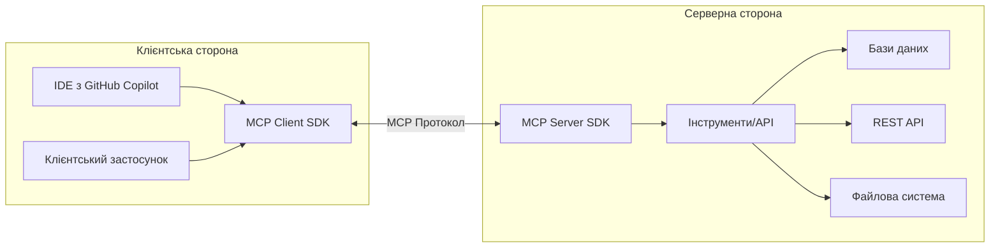

Model Context Protocol (MCP) дозволяє ШІ моделям працювати з вашими даними й сервісами, і в .NET для цього вже є SDK. Розберемо, що це за протокол, яку проблему він вирішує і як зібрати власний MCP сервер на C#.

## Що таке Model Context Protocol?

MCP - це стандартизований протокол для структурованого обміну контекстом і даними між ШІ моделями та клієнтськими застосунками. ШІ дедалі частіше стає звичайною частиною програмного забезпечення, і постає практичне питання: як різні компоненти ШІ систем обмінюються даними між собою. MCP відповідає саме на нього.

Концептуальну схему роботи MCP можна зобразити так:


```mermaid
flowchart LR
    subgraph "Клієнтська сторона"
        A[IDE з GitHub Copilot] --> B[MCP Client SDK]
        F[Клієнтський застосунок] --> B
    end
    subgraph "Серверна сторона"
        C[MCP Server SDK] --> D[Інструменти/API]
        D --> E1[Бази даних]
        D --> E2[REST API]
        D --> E3[Файлова система]
    end
    B <--> |MCP Протокол| C
```

## Основні переваги та юз-кейси MCP

MCP дає єдиний інтерфейс для роботи з різними ШІ моделями, тож не потрібно будувати окрему інтеграцію під кожну. Через структуровані інструменти ви відкриваєте моделі доступ до зовнішніх даних та API, і ваші існуючі сервіси, бази даних та інфраструктура підключаються до ШІ напряму. Найбільше користі MCP дає, коли ви працюєте з AI асистентами, такими як Copilot, claude та інші, у режимі агента.

### Типові сценарії використання

Найочевидніший сценарій - корпоративна інтеграція: модель отримує безпечний доступ до внутрішніх даних та API, а автентифікація й авторизація лишаються під вашим контролем. Другий - інструменти розробника: з Git, GitHub, системами тестування та файловою системою можна працювати прямо з інтерфейсу IDE. А для специфічних задач, як-от обробка даних, генерація коду чи виклики зовнішніх сервісів, можна написати власні інструменти.

## Створення MCP сервера з C# SDK

C# SDK для MCP спрощує створення і серверів, і клієнтів.
Ось як крок за кроком зібрати простий MCP сервер.

### Налаштування проекту

Почнемо зі створення консольного застосунку та додавання необхідних пакетів:

```bash
dotnet new console -n MyFirstMCP
dotnet add package ModelContextProtocol --prerelease
dotnet add package Microsoft.Extensions.Hosting
```

### Налаштування MCP сервера

Створимо базову структуру сервера в файлі Program.cs:

```csharp
using Microsoft.Extensions.DependencyInjection;
using Microsoft.Extensions.Hosting;

var builder = Host.CreateEmptyApplicationBuilder(settings: null);
builder.Services
    .AddMcpServer()
    .WithStdioServerTransport()
    .WithToolsFromAssembly();

await builder.Build().RunAsync();
```

Цей код:

- Створює екземпляр хоста застосунку
- Додає сервіси MCP сервера
- Налаштовує стандартний транспорт (stdio)
- Налаштовує пошук інструментів у поточній збірці

### Створення інструментів (Tools)

Інструменти - основа MCP сервера. Це методи, які можуть викликати клієнти:

```csharp
[McpServerTool, Description("Отримати список всіх проектів")]
public static string GetAllProjects()
{
    return JsonSerializer.Serialize(_projects, new JsonSerializerOptions
    {
        WriteIndented = true
    });
}
```

Кожен метод з атрибутом [McpServerTool] стає доступним для виклику через MCP протокол.
Цей приклад інструменту повертає список проектів у форматі JSON.

## Реальний приклад: MCP сервер для роботи з даними

Тепер складніший приклад: MCP сервер, який працює посередником для доступу до даних і їх модифікації.

```csharp
[McpServerToolType]
public static class ProjectTools
{
    private static readonly List<ProjectDto> _projects =
    [
        new()
        {
            StartDate = DateTime.Today,
            Description = "Project 1 description",
            Status = ProjectStatus.Planning,
            Name = "Project 1"
        },
        new()
        {
            StartDate = DateTime.UtcNow.AddDays(-25),
            Description = "Project 2 description",
            Status = ProjectStatus.InProgress,
            Name = "Project 2"
        },
        new()
        {
            StartDate = DateTime.UtcNow.AddYears(-1),
            Description = "Project 3 description",
            Status = ProjectStatus.Completed,
            Name = "Project 3"
        },
        new()
        {
            StartDate = DateTime.UtcNow.AddMonths(-2),
            Description = "Project 4 description",
            Status = ProjectStatus.Cancelled,
            Name = "Project 4"
        },
    ];

    [McpServerTool, Description("Отримати список всіх проектів")]
    public static string GetAllProjects()
    {
        return JsonSerializer.Serialize(_projects, new JsonSerializerOptions
        {
            WriteIndented = true
        });
    }

    [McpServerTool, Description("Отримати проeкти за статусом")]
    public static string GetProjectsByStatus(
        [Description("Статус проєкту (Planning, InProgress, OnHold, Completed, Cancelled)")] string status)
    {
        if (Enum.TryParse<ProjectStatus>(status, out var projectStatus))
        {
            var projects = _projects.Where(p => p.Status == projectStatus);
            return JsonSerializer.Serialize(projects, new JsonSerializerOptions
            {
                WriteIndented = true
            });
        }
        
        return "Некоректний статус проєкту. Доступні варіанти: Planning, InProgress, OnHold, Completed, Cancelled";
    }
    
    [McpServerTool, Description("Змінити статус проeкту")]
    public static string UpdateProjectStatus(
        [Description("ID проeкту")] string projectId,
        [Description("Новий статус (Planning, InProgress, OnHold, Completed, Cancelled)")] string newStatus)
    {
        if (!Guid.TryParse(projectId, out var id))
        {
            return "Некоректний ID проeкту";
        }
        
        var project = _projects.FirstOrDefault(p => p.Id == id);
        if (project == null)
        {
            return "Проeкт не знайдено";
        }
        
        if (!Enum.TryParse<ProjectStatus>(newStatus, out var status))
        {
            return "Некоректний статус проєкту. Доступні варіанти: Planning, InProgress, OnHold, Completed, Cancelled";
        }
        
        var oldStatus = project.Status;
        // Оновити статус проекта
        
        return $"Статус проєкту '{project.Name}' змінено з {oldStatus} на {status}";
    }
}

public enum ProjectStatus
{
    Planning,
    InProgress,
    OnHold,
    Completed,
    Cancelled
}

public class ProjectDto
{
    public Guid Id { get; set; } = Guid.NewGuid();

    public string Name { get; set; }

    public string Description { get; set; }

    public ProjectStatus Status { get; set; }

    public DateTime StartDate { get; set; }
}
```

Щоб не ускладнювати приклад, я не використовую БД, але ідея, думаю, зрозуміла.
Сервер уміє повертати список проектів, шукати проекти за статусом і змінювати статус проекту.

Викликати його методи можна з будь-якого клієнта, що підтримує MCP протокол, наприклад з AI агента.
Або через MCP Inspector, запустивши таку команду:

```bash
npx @modelcontextprotocol/inspector dotnet run
```

MCP Inspector дозволяє викликати методи сервера й переглядати їхню документацію.

{: width="640" height="480"}

## Конфігурація та використання MCP в Claude Desktop

MCP сервер можна підключити до Claude Desktop. Для цього потрібно:

1. Відкрити `%APPDATA%/Claude/claude_desktop_config.json`
2. Додати наступний код:

```json
{
  "mcpServers": {
    "MyFirstMCP": {
        "type": "stdio",
        "command": "шлях до файлу\\MyFirstMCP.exe",
        "args": []
    }
  }
}
```

Після цього Claude Desktop бачить MCP сервер і може викликати його методи.

{: width="640" height="480"}

{: width="640" height="480"}

## Висновок

MCP разом із .NET SDK дає ШІ асистентам доступ до корпоративних даних, API та інструментів через безпечний і контрольований інтерфейс. Застосувань багато, від аналізу бізнес-даних до автоматизації розробки та підтримки користувачів, а сервери й клієнти пишуться просто, тому MCP швидко стає звичним інструментом розробника.

Найцінніший він в інструментах розробки на кшталт Copilot/Claude: з ними простіше працювати з кодовою базою, автоматизувати рутинні задачі й діставати корпоративні знання прямо з IDE. Якщо хочете спробувати, почніть з одного інструмента для свого внутрішнього API.
