Коли ви пишете код на C#, F# чи VB.NET і натискаєте F5, за лаштунками відбувається справжня магія. Ваш код не виконується безпосередньо процесором, а проходить через складний і водночас елегантний процес трансформації. Спочатку він перетворюється на проміжний код, який називається `IL` (Intermediate Language), а потім `JIT`-компілятор (Just-In-Time) перетворює цей `IL` на машинний код, який може виконати ваш процесор. Цей процес дозволяє .NET бути одночасно швидким, переносимим та безпечним.

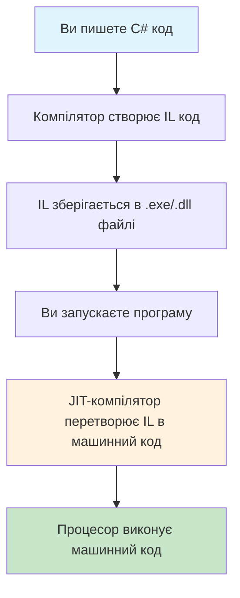

## Що таке .NET IL та чому він існує

`Intermediate Language (IL)`, також відомий як `Common Intermediate Language (CIL)`, є низькорівневою байт-кодовою мовою, яка служить універсальним мостом між вашим високорівневим кодом і машинними інструкціями процесора. Уявіть собі міжнародну конференцію, де люди говорять різними мовами, але всі використовують один універсальний переклад. `IL` виконує саме таку роль у .NET екосистемі.
Замість того, щоб компілювати код C# одразу в машинні інструкції для конкретного процесора, компілятор спочатку перетворює його в `IL`. Це рішення має кілька важливих переваг. По-перше, воно забезпечує переносимість коду між різними платформами і архітектурами процесорів. Той самий IL-код може працювати на Windows x64, Linux ARM або будь-якій іншій підтримуваній платформі. По-друге, це дозволяє коду, написаному на різних .NET мовах, безпроблемно взаємодіяти один з одним, оскільки всі вони компілюються в один і той же `IL`.

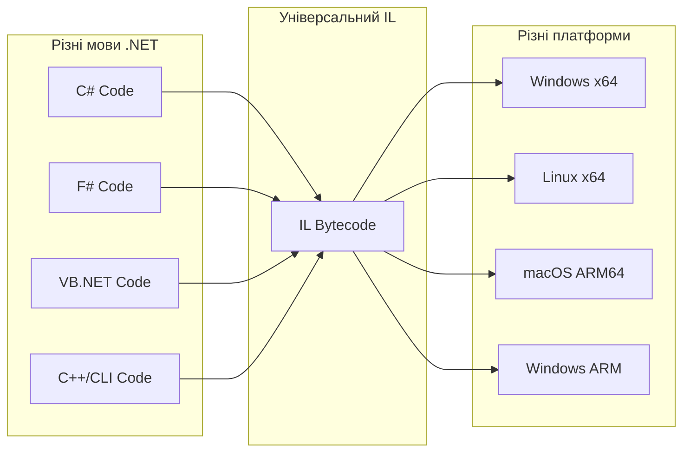

`IL` працює як стекова машина: обчислення виконуються шляхом завантаження операндів на стек, виконання над ними операцій та збереження результату назад на стек. Аргументи та локальні змінні мають свої окремі слоти в пам’яті, але взаємодіють із обчисленнями через стек. Такий підхід спрощує генерацію коду та забезпечує гнучкість при виконанні.

## Детальний розбір структури IL коду

Щоб краще зрозуміти, як працює IL, розглянемо простий приклад методу на C# і його IL еквівалент:

```cs
public class Calculator
{
    public int Add(int a, int b)
    {
        return a + b;
    }
}
```

```assembly
.class public auto ansi beforefieldinit Calculator
    extends [System.Runtime]System.Object
{
    // Methods
    .method public hidebysig 
        instance int32 Add (
            int32 a,
            int32 b
        ) cil managed 
    {
        // Method begins at RVA 0x2050
        // Code size 9 (0x9)
        .maxstack 2
        .locals init (
            [0] int32
        )

        IL_0000: ldarg.1 // Завантажити аргумент 'a' на стек
        IL_0001: ldarg.2 // Завантажити аргумент 'b' на стек
        IL_0002: add     // Додати два верхніх значення зі стеку
        IL_0003: ret     // Повернути результат і завершити метод
    } // end of method Calculator::Add
}
```

Розберемо цей код детально.
Директива `.method` визначає початок методу з усіма його характеристиками: `public` означає, що метод доступний ззовні, `hidebysig` вказує на те, що метод приховується за сигнатурою, instance означає, що це не статичний метод, `int32` вказує тип повернення, а `cil managed` означає, що це керований код `Common Intermediate Language`.
Директива `.maxstack 2` визначає максимальну кількість елементів, які одночасно можуть бути на стеку під час виконання цього методу.

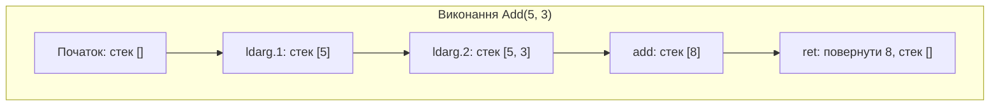

Інструкція `ldarg.1` завантажує перший аргумент методу на стек. У .NET нумерація аргументів починається з 0, але для не-статичних методів аргумент 0 зарезервований для посилання `this`, тому перший реальний аргумент має індекс 1. Аналогічно, `ldarg.2` завантажує другий аргумент. Інструкція `add` бере два верхніх значення зі стеку, додає їх і кладе результат назад на стек. Нарешті, `ret` повертає верхнє значення зі стеку як результат методу і завершує його виконання.

Розглянемо більш складний приклад з локальними змінними:

```cs
public int Multiply(int x, int y)
{
    int result = x * y;
    return result;
}
```

IL код для цього методу:

```assembly
    .method public hidebysig 
        instance int32 Multiply (
            int32 x,
            int32 y
        ) cil managed 
    {
        // Method begins at RVA 0x2050
        // Code size 11 (0xb)
        .maxstack 2
        .locals init (
            [0] int32 result,
            [1] int32
        )

        IL_0000: nop
        IL_0001: ldarg.1      // Завантажити x на стек
        IL_0002: ldarg.2      // Завантажити y на стек
        IL_0003: mul          // Перемножити два значення (x * y)
        IL_0004: stloc.0      // Зберегти результат у result
        IL_0005: ldloc.0      // Завантажити result
        IL_0006: stloc.1      // Зберегти його в другу локальну змінну
        IL_0007: br.s IL_0009 // Безумовний перехід до IL_0009

        IL_0009: ldloc.1      // Завантажити змінну [1]
        IL_000a: ret          // Повернути її як результат методу
    } // end of method Calculator::Multiply
```

Тут ми бачимо нову директиву `.locals init ([0] int32 result, [1] int32)`, яка визначає локальні змінні методу. Змінна `result` має індекс 0 і тип int32. Інструкція `stloc.0` зберігає верхнє значення зі стеку в локальну змінну з індексом 0, а `ldloc.1` завантажує значення цієї змінної назад на стек.

## Умовна логіка та управління потоком в IL

Коли ваш код містить умовні конструкції, такі як `if-else`, компілятор генерує IL код з мітками та інструкціями переходу. 

Розглянемо приклад:

```cs
public string CheckAge(int age)
{
    if (age >= 18)
        return "Adult";
    else
        return "Minor";
}
```

Цей код компілюється в наступний IL:

```assembly
.method public hidebysig 
        instance string CheckAge (
            int32 age
        ) cil managed 
    {
        .custom instance void [System.Runtime]System.Runtime.CompilerServices.NullableContextAttribute::.ctor(uint8) = (
            01 00 01 00 00
        )
        // Method begins at RVA 0x2050
        // Code size 31 (0x1f)
        .maxstack 2
        .locals init (
            [0] bool,
            [1] string
        )

        IL_0000: nop
        IL_0001: ldarg.1
        IL_0002: ldc.i4.s 18
        IL_0004: clt
        IL_0006: ldc.i4.0
        IL_0007: ceq
        IL_0009: stloc.0
        // sequence point: hidden
        IL_000a: ldloc.0
        IL_000b: brfalse.s IL_0015

        IL_000d: ldstr "Adult"
        IL_0012: stloc.1
        IL_0013: br.s IL_001d

        IL_0015: ldstr "Minor"
        IL_001a: stloc.1
        IL_001b: br.s IL_001d

        IL_001d: ldloc.1
        IL_001e: ret
    } // end of method Calculator::CheckAge
```

Інструкція `ldc.i4.s 18` завантажує константу `18` на стек. Префікс `ldc` означає `load constant`, `i4` вказує на 32-бітне ціле число, а `s` означає, що константа занесена в коротку форму. Інструкція `bge.s` (branch if greater or equal, short form) порівнює два верхніх значення зі стеку і переходить до вказаної мітки, якщо перше значення більше або дорівнює другому.
Інструкція `br.s` виконує безумовний перехід до вказаної мітки. Це необхідно, щоб після виконання блоку для неповнолітніх уникнути виконання блоку для дорослих.

## Цикли в IL коді

Цикли в IL реалізуються за допомогою міток та інструкцій переходу. 

Розглянемо приклад циклу `for`:

```cs
public int Sum(int n)
{
    int sum = 0;
    for (int i = 1; i <= n; i++)
    {
        sum += i;
    }
    return sum;
}
```

IL код для цього методу виглядає приблизно так:

```assembly
.method public hidebysig 
        instance int32 Sum (
            int32 n
        ) cil managed 
    {
        // Method begins at RVA 0x2050
        // Code size 34 (0x22)
        .maxstack 2
        .locals init (
            [0] int32 sum,
            [1] int32 i,
            [2] bool,
            [3] int32
        )

        IL_0000: nop
         // Ініціалізація sum = 0
        IL_0001: ldc.i4.0   // Завантажити 0
        IL_0002: stloc.0    // sum = 0

         // Ініціалізація i = 1
        IL_0003: ldc.i4.1   // Завантажити 1
        IL_0004: stloc.1    // i = 1

        // sequence point: hidden
        // Перехід до перевірки умови
        IL_0005: br.s IL_0011   // Перейти до перевірки умови
        // loop start (head: IL_0011)
            IL_0007: nop
            IL_0008: ldloc.0    // Завантажити sum
            IL_0009: ldloc.1    // Завантажити i
            IL_000a: add        // sum + i
            IL_000b: stloc.0    // sum = sum + i
            
            // Інкремент i++
            IL_000c: nop        
            IL_000d: ldloc.1    // Завантажити i
            IL_000e: ldc.i4.1   // Завантажити 1
            IL_000f: add        // i + 1
            IL_0010: stloc.1    // i = i + 1

            // Перевірка умови i <= n
            IL_0011: ldloc.1    // Завантажити i
            IL_0012: ldarg.1    // Завантажити n
            IL_0013: cgt
            IL_0015: ldc.i4.0
            IL_0016: ceq
            IL_0018: stloc.2
            // sequence point: hidden
            IL_0019: ldloc.2
            IL_001a: brtrue.s IL_0007   // Якщо i <= n, повернутися до тіла циклу
        // end loop

        IL_001c: ldloc.0
        IL_001d: stloc.3
        IL_001e: br.s IL_0020

        IL_0020: ldloc.3
        IL_0021: ret
    } // end of method Calculator::Sum
```

Цей приклад демонструє, як компілятор оптимізує цикли, переміщуючи перевірку умови в кінець циклу, що зменшує кількість переходів та покращує продуктивність.

## CLR: Серце .NET екосистеми

Перш ніж розбиратися з `JIT`-компілятором, важливо зрозуміти, що таке `Common Language Runtime (CLR)` - це фундаментальна платформа, на якій працюють всі .NET додатки. `CLR` можна порівняти з операційною системою для керованого коду, яка забезпечує всі необхідні сервіси для виконання .NET програм.
`CLR` відповідає за завантаження та виконання збірок (`assemblies`), управління пам'яттю через `garbage collector`, забезпечення безпеки типів, обробку винятків, і що найважливіше для нашої теми - `JIT`-компіляцію `IL` коду в машинний код. Коли ви запускаєте .NET додаток, насправді запускається CLR, який потім завантажує ваш код і починає його виконання.


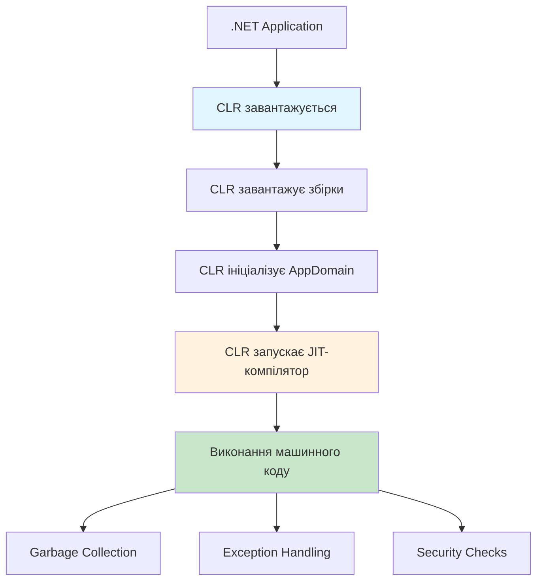

CLR надає єдине середовище виконання для всіх .NET мов, що дозволяє коду, написаному на C#, взаємодіяти з кодом на F# або VB.NET без будь-яких додаткових зусиль. Це досягається завдяки `Common Type System (CTS)`, який визначає, як типи оголошуються, використовуються та управляються в runtime, і `Common Language Specification (CLS)`, який визначає підмножину функцій, доступних для всіх .NET мов.

## JIT-компілятор: від IL до машинного коду

`JIT`-компілятор (`Just-In-Time`) є ключовим компонентом CLR і відповідає за перетворення IL коду в машинний код, який може виконати процесор. На відміну від традиційних компіляторів, які перетворюють весь код перед виконанням, `JIT` працює під час виконання програми, компілюючи методи тільки тоді, коли вони вперше викликаються.

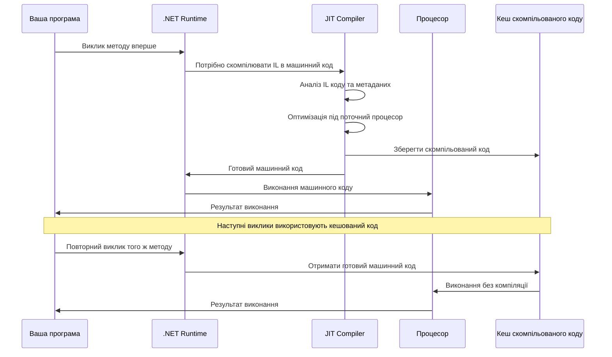

Процес JIT-компіляції розпочинається, коли .NET runtime вперше намагається викликати метод. Спочатку `JIT` аналізує `IL` код методу разом з його метаданими, щоб зрозуміти, які операції потрібно виконати. Далі він аналізує характеристики поточного процесора, включаючи доступні інструкції, кількість регістрів, розмір кешу та інші особливості архітектури. Базуючись на цій інформації, `JIT` генерує оптимізований машинний код, який максимально ефективно використовує ресурси конкретного процесора.

Одна з найважливіших особливостей `JIT` полягає в тому, що він може виконувати оптимізації, недоступні традиційним компіляторам. Наприклад, він може вбудовувати (inline) невеликі методи безпосередньо в код, який їх викликає, усуваючи накладні витрати на виклик методу. Він також може оптимізувати цикли, переставляти інструкції для кращого використання конвеєра процесора і навіть видаляти код, який ніколи не виконується.

`JIT` використовує кілька стратегій оптимізації. Оптимізація констант дозволяє обчислювати значення під час компіляції, якщо вони відомі заздалегідь. Оптимізація мертвого коду видаляє інструкції, результат яких ніде не використовується. `Common Subexpression Elimination` уникає повторного обчислення однакових виразів. `Loop unrolling` розгортає невеликі цикли для зменшення накладних витрат на перевірку умов.

## Рівнева компіляція (Tiered JIT)

Сучасні версії .NET використовують підхід, який називається `Tiered JIT` або рівнева компіляція. Ця технологія дозволяє балансувати між швидкістю запуску програми та її максимальною продуктивністю під час виконання.

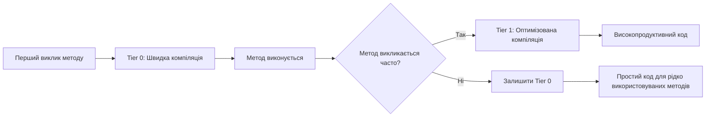

Коли метод викликається вперше, `JIT` компілює його з мінімальними оптимізаціями (`Tier 0`). Це дозволяє швидко почати виконання без витрат часу на складні оптимізації. Якщо метод викликається часто, `JIT` помічає це і перекомпілює метод з повним набором оптимізацій (`Tier 1`). Цей підхід дозволяє програмам швидко запускатися, але водночас досягати максимальної продуктивності для критично важливих частин коду.

## Інструменти для аналізу IL коду

Для вивчення та аналізу IL коду існує кілька потужних інструментів. 

- ILSpy є одним з найпопулярніших безкоштовних інструментів для декомпіляції .NET збірок. Він дозволяє переглядати IL код поруч з декомпільованим C# кодом, що робить його ідеальним для навчання та розуміння того, як компілятор перетворює ваш код.

- ILDasm (IL Disassembler) є офіційним інструментом від Microsoft, який входить до складу .NET SDK. Він може розбирати збірки .NET і створювати текстові файли з IL кодом, які можна потім редагувати і збирати назад за допомогою ILAsm.

- dotPeek від JetBrains є потужною альтернативою, яка пропонує розширені можливості навігації та аналізу коду. Він може створювати проекти Visual Studio з декомпільованого коду і має інтеграцію з іншими інструментами JetBrains.

Для швидких експериментів ідеально підходить `SharpLab.io` - онлайн інструмент, який дозволяє бачити IL код в реальному часі під час написання C# коду. Це дуже корисно для розуміння того, як різні конструкції C# перетворюються в IL.

## Практичні сценарії використання знань про IL

Розуміння IL стає особливо корисним при оптимізації продуктивності додатків. Наприклад, якщо ви помітили, що певна частина коду працює повільно, аналіз IL може показати, чи генерує компілятор ефективні інструкції, чи є зайві операції `boxing/unboxing`, чи правильно працюють оптимізації компілятора.

При розробці високопродуктивних додатків знання IL допомагає уникати конструкцій, які генерують неефективний код. Наприклад, використання `foreach` для масивів генерує різний IL код порівняно з традиційним циклом `for`, і розуміння цієї різниці може допомогти зробити правильний вибір.

Debugging складних проблем іноді вимагає аналізу IL коду, особливо коли проблема пов'язана з неочікуваною поведінкою компілятора або runtime. Наприклад, проблеми з `closure` в лямбда-виразах часто стають зрозумілими тільки після аналізу згенерованого IL коду.

При розробці власних компіляторів, код-генераторів або інструментів статичного аналізу глибоке розуміння IL є необхідним. Багато інструментів, таких як Entity Framework, генерують IL код динамічно, і розуміння цього процесу допомагає ефективно використовувати ці інструменти.

## Оптимізації та підводні камені

JIT-компілятор виконує безліч оптимізацій, але деякі з них можуть бути неочевидними. `Method inlining` автоматично вбудовує невеликі методи в місця їх виклику, усуваючи накладні витрати на виклик методу. Однак це може призвести до збільшення розміру коду, тому JIT використовує евристики для прийняття рішення про inlining.

`Dead code elimination` видаляє код, який ніколи не виконується, але цей процес може бути складним у присутності `reflection` або динамічного завантаження кода. `Constant folding` дозволяє обчислювати константні вирази під час компіляції, але може бути обмежений у присутності побічних ефектів.

Важливо розуміти, що оптимізації JIT можуть відрізнятися між Debug і Release режимами. У Debug режимі багато оптимізацій вимкнено для полегшення налагодження, тому аналіз продуктивності слід завжди проводити з Release збірками.

## AOT: Альтернатива JIT-компіляції

`Ahead-of-Time (AOT)` компіляція представляє кардинально інший підхід до виконання .NET коду. Замість компіляції `IL` в машинний код під час виконання, `AOT` компілює весь код заздалегідь, під час збірки додатка. Це створює самодостатні виконувані файли, які не потребують встановлення .NET runtime на цільовій машині.

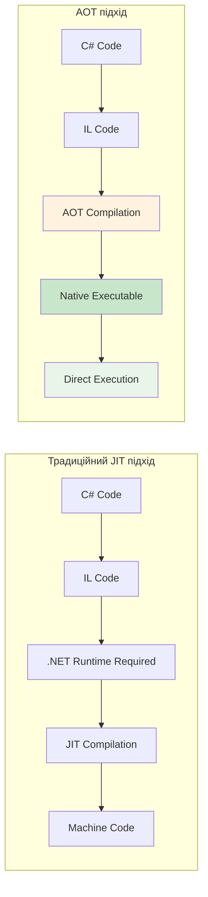

AOT компіляція має кілька значних переваг. Найголовніша з них - це швидкість запуску додатків, оскільки не потрібно витрачати час на JIT-компіляцію під час виконання. Це особливо важливо для серверних додатків, мікросервісів та контейнерних середовищ, де швидкий запуск критично важливий. Крім того, AOT дозволяє створювати менші за розміром додатки, оскільки включає тільки той код, який реально використовується.

Однак AOT має і свої обмеження. Головне з них - це втрата гнучкості динамічного коду. Reflection, динамічна генерація коду, і деякі інші функції можуть працювати обмежено або взагалі не працювати в AOT середовищі. Також AOT не може виконувати оптимізації на основі профілю виконання, які доступні JIT-компілятору.

## Native AOT в .NET

Починаючи з .NET 8, Microsoft представила Native AOT, який дозволяє компілювати .NET додатки в нативний код без потреби в .NET runtime. Це досягається через складний процес статичного аналізу, який визначає, який код реально використовується, і генерує мінімальний нативний executable.

Приклад проекту з Native AOT:

```xml
<Project Sdk="Microsoft.NET.Sdk">
  <PropertyGroup>
    <OutputType>Exe</OutputType>
    <TargetFramework>net8.0</TargetFramework>
    <PublishAot>true</PublishAot>
    <InvariantGlobalization>true</InvariantGlobalization>
  </PropertyGroup>
</Project>
```

Процес Native AOT включає кілька етапів. Спочатку компілятор аналізує весь код додатка і його залежності, щоб визначити, які типи і методи реально використовуються. Цей процес називається `tree shaking` і дозволяє значно зменшити розмір фінального `executable`. Далі IL код компілюється в нативний код за допомогою спеціальних AOT компіляторів, таких як `CoreRT` або `RyuJIT` в AOT режимі.

## ReadyToRun: Гібридний підхід

`ReadyToRun (R2R)` представляє компромісний підхід між JIT і повним AOT. `R2R` збірки містять як IL код, так і попередньо скомпільований нативний код для найбільш поширених сценаріїв. Це дозволяє додаткам швидше запускатися, оскільки багато коду вже скомпільовано, але зберігає гнучкість JIT для коду, який не був попередньо скомпільований.

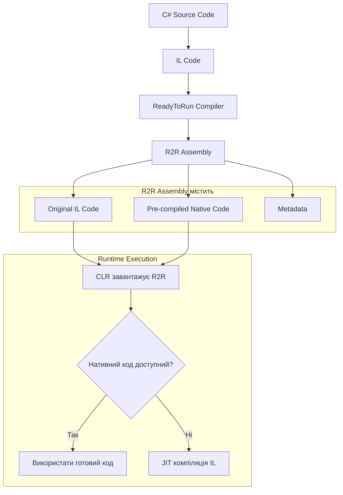

R2R особливо ефективний для великих додатків і фреймворків, таких як ASP.NET Core, де можна попередньо скомпілювати найбільш часто використовувані кодові шляхи, залишаючи рідко використовувані частини для JIT-компіляції.

## Profile-Guided Optimization (PGO)

`Profile-Guided Optimization` є передовою технологією, яка використовує інформацію про реальне використання коду для покращення оптимізацій. PGO працює у два етапи: спочатку додаток виконується з інструментацією, яка збирає статистику про те, які частини коду виконуються найчастіше, а потім ця інформація використовується для генерації оптимізованого коду.

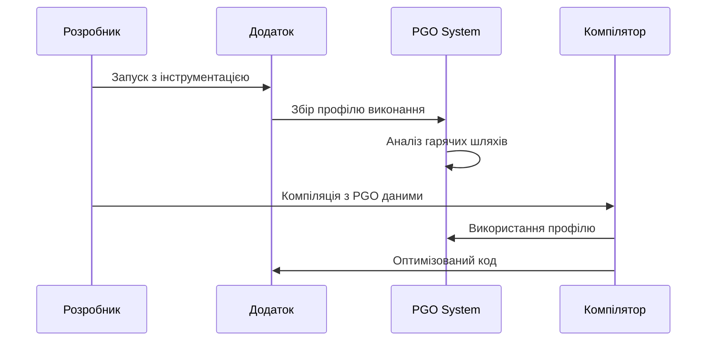

`PGO` може значно покращити продуктивність, особливо для складних додатків з багатьма гілками виконання. Наприклад, якщо певна умова в if блоці майже завжди істинна, PGO може оптимізувати код таким чином, щоб цей шлях виконувався найшвидше.

## Майбутнє технологій компіляції в .NET

Розвиток .NET продовжує еволюціонувати в напрямку більшої гнучкості та продуктивності. `Crossgen2` є новим поколінням інструментів для AOT компіляції, який забезпечує кращу продуктивність і меншу пам'ять використання порівняно з попередніми рішеннями.

`Dynamic PGO` дозволяє JIT-компілятору адаптуватися до змін у профілі виконання під час роботи додатка. Це означає, що код може автоматично оптимізуватися, якщо поведінка додатка змінюється з часом.

`Blazor WebAssembly AOT` дозволяє компілювати .NET код безпосередньо в WebAssembly, забезпечуючи близьку до нативної продуктивність веб-додатків.

Майбутні версії .NET також працюють над покращенням підтримки reflection і динамічного коду в AOT середовищах через використання source generators і compile-time рефлексії, що дозволить більшій кількості існуючого коду працювати в AOT режимі без модифікацій.

## Порівняння підходів: JIT vs AOT

Вибір між JIT і AOT компіляцією залежить від конкретних потреб вашого додатка. JIT забезпечує максимальну гнучкість і можливість динамічних оптимізацій, але потребує часу на компіляцію під час виконання. AOT дає швидкий запуск і не потребує runtime, але може мати обмеження в функціональності.

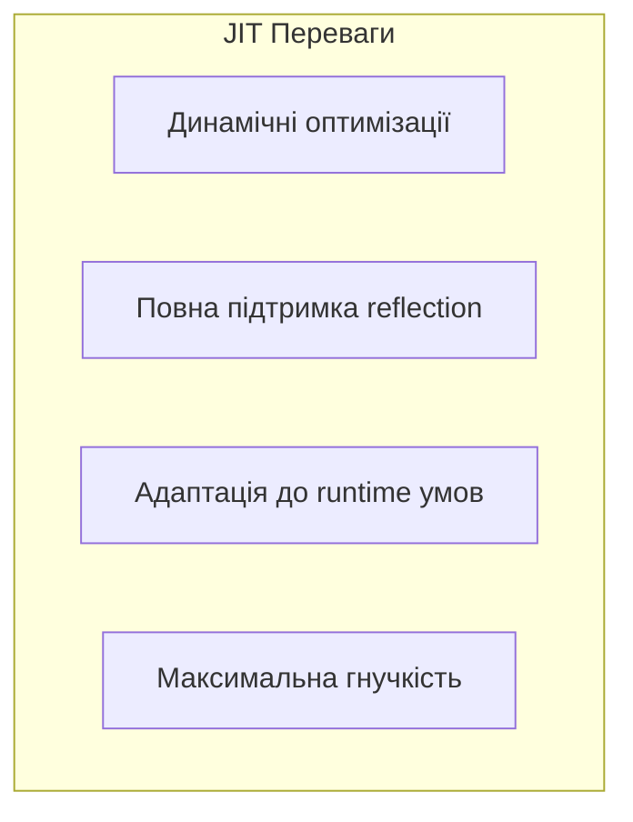

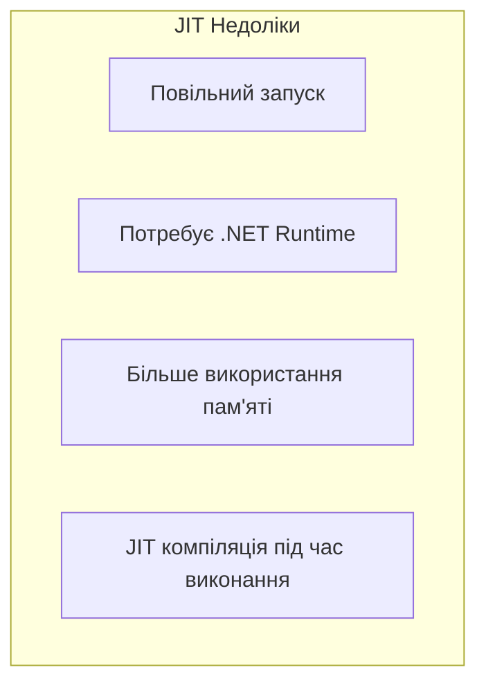


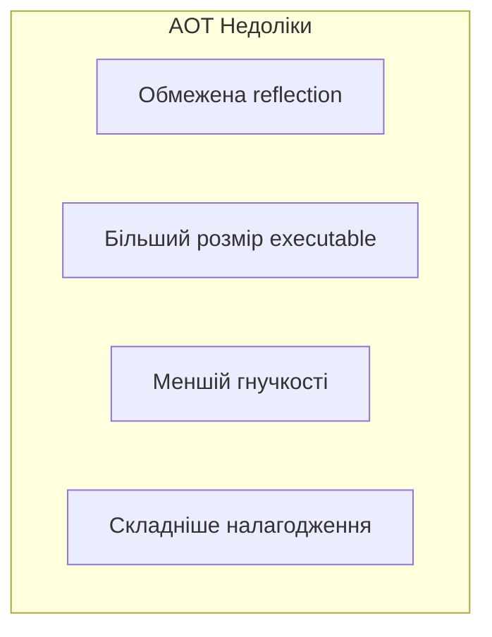

Для веб-додатків з високим навантаженням JIT часто є кращим вибором, оскільки час запуску амортизується протягом тривалого часу роботи, а динамічні оптимізації можуть значно покращити продуктивність. Для мікросервісів і контейнерних додатків AOT може бути кращим вибором через швидкий запуск і менші вимоги до ресурсів.

## Практичні рекомендації

При виборі між різними підходами компіляції врахуйте наступні фактори. Якщо ваш додаток використовує багато reflection, динамічної генерації коду або залежить від сторонніх бібліотек, які активно використовують ці функції, JIT буде кращим вибором. Якщо критично важливий швидкий запуск, мінімальне використання пам'яті, або ви розгортаєте в контейнерному середовищі, розгляньте AOT.

Для багатьох enterprise додатків гібридний підхід з `ReadyToRun` може бути оптимальним, оскільки він поєднує швидкий запуск з повною функціональністю. Також можна використовувати AOT для критично важливих мікросервісів і JIT для основних додатків, які потребують максимальної гнучкості.

Тестування продуктивності з різними підходами компіляції є ключовим для прийняття правильного рішення. Профілюйте ваш додаток в реальних умовах і вимірюйте не тільки швидкість виконання, але й час запуску, використання пам'яті і розмір розгортання.
