Коли ви пишете код на C#, F# чи VB.NET і натискаєте F5, процесор не виконує цей код напряму. Спочатку компілятор перетворює його на проміжний код `IL` (Intermediate Language), а вже потім `JIT`-компілятор (Just-In-Time) перетворює цей `IL` на машинний код, який може виконати ваш процесор. Завдяки такій схемі .NET водночас швидкий, переносимий і безпечний.

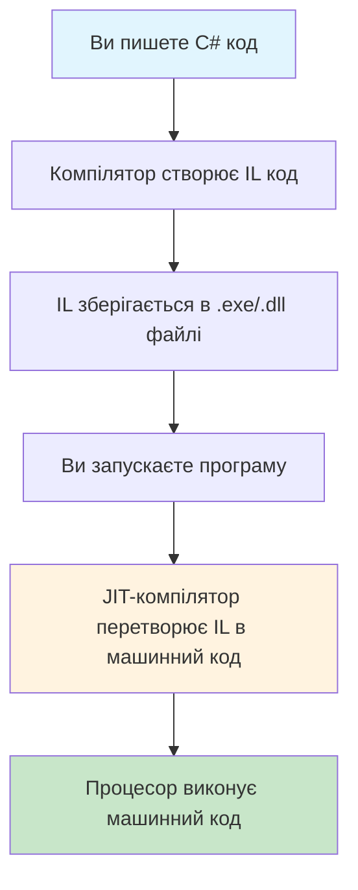
```mermaid
graph TD
    A[Ви пишете C# код] --> B[Компілятор створює IL код]
    B --> C[IL зберігається в .exe/.dll файлі]
    C --> D[Ви запускаєте програму]
    D --> E[JIT-компілятор перетворює IL в машинний код]
    E --> F[Процесор виконує машинний код]
    
    style A fill:#e1f5fe
    style F fill:#c8e6c9
    style E fill:#fff3e0
```

## Що таке .NET IL та чому він існує

`Intermediate Language (IL)`, також відомий як `Common Intermediate Language (CIL)`, - це низькорівнева байт-кодова мова між вашим високорівневим кодом і машинними інструкціями процесора. `IL` у .NET відіграє роль спільного перекладу, який розуміють усі.
Компілятор C# не генерує одразу машинні інструкції для конкретного процесора, а спершу перетворює код в `IL`. Тому код переноситься між платформами й архітектурами процесорів: той самий IL-код працює на Windows x64, Linux ARM або будь-якій іншій підтримуваній платформі. А оскільки всі .NET мови компілюються в один і той же `IL`, код на різних мовах без проблем взаємодіє між собою.

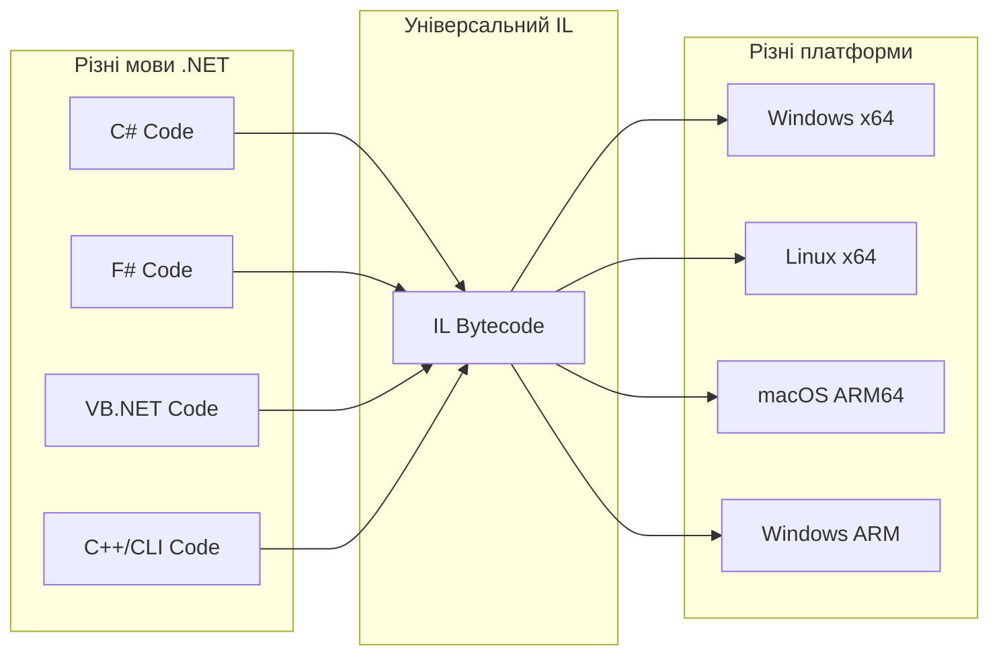
```mermaid
graph LR
    subgraph "Різні мови .NET"
        A[C# Code]
        B[F# Code] 
        C[VB.NET Code]
        D[C++/CLI Code]
    end
    
    subgraph "Універсальний IL"
        E[IL Bytecode]
    end
    
    subgraph "Різні платформи"
        F[Windows x64]
        G[Linux x64]
        H[macOS ARM64]
        I[Windows ARM]
    end
    
    A --> E
    B --> E
    C --> E
    D --> E
    E --> F
    E --> G
    E --> H
    E --> I
```

`IL` працює як стекова машина: обчислення виконуються шляхом завантаження операндів на стек, виконання над ними операцій та збереження результату назад на стек. Аргументи та локальні змінні мають свої окремі слоти в пам'яті, але взаємодіють із обчисленнями через стек. Це спрощує генерацію коду і дає гнучкість під час виконання.

## Детальний розбір структури IL коду

Візьмемо простий метод на C# і подивимося на його IL-еквівалент:

```cs
public class Calculator
{
    public int Add(int a, int b)
    {
        return a + b;
    }
}
```

```assembly
.class public auto ansi beforefieldinit Calculator
    extends [System.Runtime]System.Object
{
    // Methods
    .method public hidebysig 
        instance int32 Add (
            int32 a,
            int32 b
        ) cil managed 
    {
        // Method begins at RVA 0x2050
        // Code size 9 (0x9)
        .maxstack 2
        .locals init (
            [0] int32
        )

        IL_0000: ldarg.1 // Завантажити аргумент 'a' на стек
        IL_0001: ldarg.2 // Завантажити аргумент 'b' на стек
        IL_0002: add     // Додати два верхніх значення зі стеку
        IL_0003: ret     // Повернути результат і завершити метод
    } // end of method Calculator::Add
}
```

Директива `.method` визначає початок методу з усіма його характеристиками: `public` означає, що метод доступний ззовні, `hidebysig` вказує на те, що метод приховується за сигнатурою, instance означає, що це не статичний метод, `int32` вказує тип повернення, а `cil managed` означає, що це керований код `Common Intermediate Language`.
Директива `.maxstack 2` визначає максимальну кількість елементів, які одночасно можуть бути на стеку під час виконання цього методу. Для виклику `Add(5, 3)` стек змінюється так:

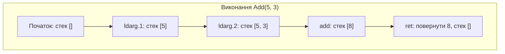
```mermaid
graph TD
    subgraph "Виконання Add(5, 3)"
        A["Початок: стек []"] 
        B["ldarg.1: стек [5]"]
        C["ldarg.2: стек [5, 3]"] 
        D["add: стек [8]"]
        E["ret: повернути 8, стек []"]
    end
    
    A --> B --> C --> D --> E
```

`ldarg.1` завантажує на стек перший аргумент методу. У .NET нумерація аргументів починається з 0, але для не-статичних методів аргумент 0 зарезервований для посилання `this`, тому перший реальний аргумент має індекс 1. Аналогічно, `ldarg.2` завантажує другий аргумент. Інструкція `add` бере два верхніх значення зі стеку, додає їх і кладе результат назад на стек. Нарешті, `ret` повертає верхнє значення зі стеку як результат методу і завершує його виконання.

З локальними змінними IL стає трохи довшим:

```cs
public int Multiply(int x, int y)
{
    int result = x * y;
    return result;
}
```

Його IL:

```assembly
    .method public hidebysig 
        instance int32 Multiply (
            int32 x,
            int32 y
        ) cil managed 
    {
        // Method begins at RVA 0x2050
        // Code size 11 (0xb)
        .maxstack 2
        .locals init (
            [0] int32 result,
            [1] int32
        )

        IL_0000: nop
        IL_0001: ldarg.1      // Завантажити x на стек
        IL_0002: ldarg.2      // Завантажити y на стек
        IL_0003: mul          // Перемножити два значення (x * y)
        IL_0004: stloc.0      // Зберегти результат у result
        IL_0005: ldloc.0      // Завантажити result
        IL_0006: stloc.1      // Зберегти його в другу локальну змінну
        IL_0007: br.s IL_0009 // Безумовний перехід до IL_0009

        IL_0009: ldloc.1      // Завантажити змінну [1]
        IL_000a: ret          // Повернути її як результат методу
    } // end of method Calculator::Multiply
```

Тут з'являється нова директива `.locals init ([0] int32 result, [1] int32)`, яка визначає локальні змінні методу. Змінна `result` має індекс 0 і тип int32. Інструкція `stloc.0` зберігає верхнє значення зі стеку в локальну змінну з індексом 0, а `ldloc.1` завантажує значення цієї змінної назад на стек.

## Умовна логіка та управління потоком в IL

Для умовних конструкцій на кшталт `if-else` компілятор генерує IL з мітками та інструкціями переходу. Наприклад:

```cs
public string CheckAge(int age)
{
    if (age >= 18)
        return "Adult";
    else
        return "Minor";
}
```

В IL це виглядає так:

```assembly
.method public hidebysig 
        instance string CheckAge (
            int32 age
        ) cil managed 
    {
        .custom instance void [System.Runtime]System.Runtime.CompilerServices.NullableContextAttribute::.ctor(uint8) = (
            01 00 01 00 00
        )
        // Method begins at RVA 0x2050
        // Code size 31 (0x1f)
        .maxstack 2
        .locals init (
            [0] bool,
            [1] string
        )

        IL_0000: nop
        IL_0001: ldarg.1
        IL_0002: ldc.i4.s 18
        IL_0004: clt
        IL_0006: ldc.i4.0
        IL_0007: ceq
        IL_0009: stloc.0
        // sequence point: hidden
        IL_000a: ldloc.0
        IL_000b: brfalse.s IL_0015

        IL_000d: ldstr "Adult"
        IL_0012: stloc.1
        IL_0013: br.s IL_001d

        IL_0015: ldstr "Minor"
        IL_001a: stloc.1
        IL_001b: br.s IL_001d

        IL_001d: ldloc.1
        IL_001e: ret
    } // end of method Calculator::CheckAge
```

Інструкція `ldc.i4.s 18` завантажує константу `18` на стек. Префікс `ldc` означає `load constant`, `i4` вказує на 32-бітне ціле число, а `s` означає, що константа занесена в коротку форму. Інструкція `bge.s` (branch if greater or equal, short form) порівнює два верхніх значення зі стеку і переходить до вказаної мітки, якщо перше значення більше або дорівнює другому.
`br.s` робить безумовний перехід до вказаної мітки. Без нього після блоку для неповнолітніх виконався б і блок для дорослих.

## Цикли в IL коді

Цикли будуються з тих самих міток та інструкцій переходу. Ось цикл `for`:

```cs
public int Sum(int n)
{
    int sum = 0;
    for (int i = 1; i <= n; i++)
    {
        sum += i;
    }
    return sum;
}
```

IL код для цього методу виглядає приблизно так:

```assembly
.method public hidebysig 
        instance int32 Sum (
            int32 n
        ) cil managed 
    {
        // Method begins at RVA 0x2050
        // Code size 34 (0x22)
        .maxstack 2
        .locals init (
            [0] int32 sum,
            [1] int32 i,
            [2] bool,
            [3] int32
        )

        IL_0000: nop
         // Ініціалізація sum = 0
        IL_0001: ldc.i4.0   // Завантажити 0
        IL_0002: stloc.0    // sum = 0

         // Ініціалізація i = 1
        IL_0003: ldc.i4.1   // Завантажити 1
        IL_0004: stloc.1    // i = 1

        // sequence point: hidden
        // Перехід до перевірки умови
        IL_0005: br.s IL_0011   // Перейти до перевірки умови
        // loop start (head: IL_0011)
            IL_0007: nop
            IL_0008: ldloc.0    // Завантажити sum
            IL_0009: ldloc.1    // Завантажити i
            IL_000a: add        // sum + i
            IL_000b: stloc.0    // sum = sum + i
            
            // Інкремент i++
            IL_000c: nop        
            IL_000d: ldloc.1    // Завантажити i
            IL_000e: ldc.i4.1   // Завантажити 1
            IL_000f: add        // i + 1
            IL_0010: stloc.1    // i = i + 1

            // Перевірка умови i <= n
            IL_0011: ldloc.1    // Завантажити i
            IL_0012: ldarg.1    // Завантажити n
            IL_0013: cgt
            IL_0015: ldc.i4.0
            IL_0016: ceq
            IL_0018: stloc.2
            // sequence point: hidden
            IL_0019: ldloc.2
            IL_001a: brtrue.s IL_0007   // Якщо i <= n, повернутися до тіла циклу
        // end loop

        IL_001c: ldloc.0
        IL_001d: stloc.3
        IL_001e: br.s IL_0020

        IL_0020: ldloc.3
        IL_0021: ret
    } // end of method Calculator::Sum
```

Зверніть увагу: компілятор переніс перевірку умови в кінець циклу. Так переходів менше, і цикл працює швидше.

## CLR: Серце .NET екосистеми

Перш ніж переходити до `JIT`-компілятора, варто розібратися з `Common Language Runtime (CLR)`, платформою, на якій працюють усі .NET додатки. `CLR` можна порівняти з операційною системою для керованого коду: він дає .NET програмам усі сервіси, потрібні для виконання.
`CLR` відповідає за завантаження та виконання збірок (`assemblies`), управління пам'яттю через `garbage collector`, безпеку типів, обробку винятків і, що для нас головне, за `JIT`-компіляцію `IL` коду в машинний код. Коли ви запускаєте .NET додаток, насправді запускається CLR, який потім завантажує ваш код і починає його виконання.


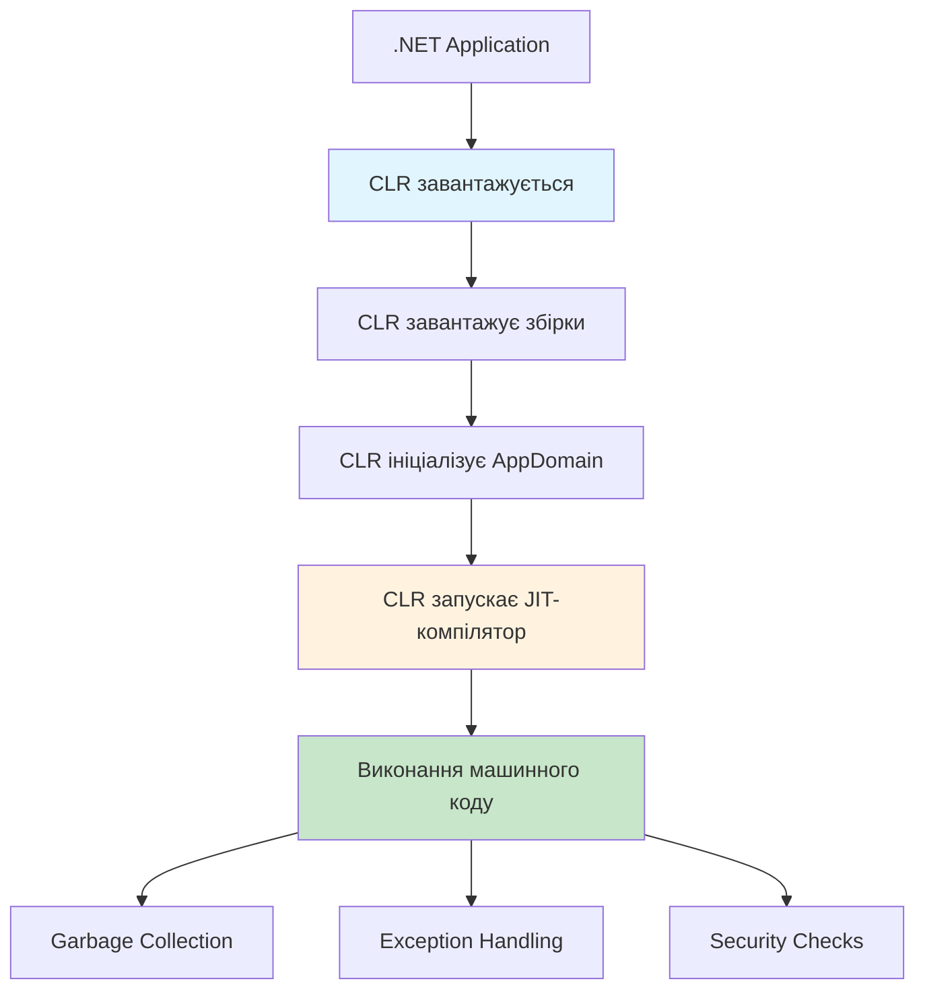
```mermaid
graph TD
    A[.NET Application] --> B[CLR завантажується]
    B --> C[CLR завантажує збірки]
    C --> D[CLR ініціалізує AppDomain]
    D --> E[CLR запускає JIT-компілятор]
    E --> F[Виконання машинного коду]
    F --> G[Garbage Collection]
    F --> H[Exception Handling]
    F --> I[Security Checks]
    
    style B fill:#e1f5fe
    style E fill:#fff3e0
    style F fill:#c8e6c9
```

CLR надає єдине середовище виконання для всіх .NET мов, що дозволяє коду, написаному на C#, взаємодіяти з кодом на F# або VB.NET без будь-яких додаткових зусиль. Це досягається завдяки `Common Type System (CTS)`, який визначає, як типи оголошуються, використовуються та управляються в runtime, і `Common Language Specification (CLS)`, який визначає підмножину функцій, доступних для всіх .NET мов.

## JIT-компілятор: від IL до машинного коду

`JIT`-компілятор (`Just-In-Time`) - це частина CLR, яка перетворює IL код на машинний код для процесора. Традиційні компілятори перетворюють весь код до запуску, а `JIT` працює під час виконання програми і компілює метод лише тоді, коли його вперше викликають:

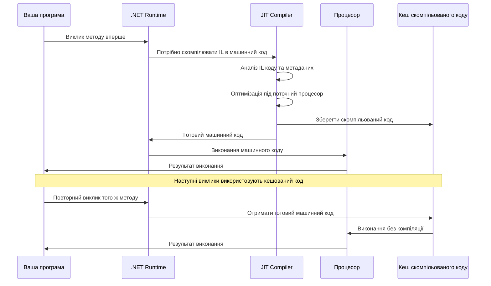
```mermaid
sequenceDiagram
    participant App as Ваша програма
    participant CLR as .NET Runtime
    participant JIT as JIT Compiler
    participant CPU as Процесор
    participant Cache as Кеш скомпільованого коду
    
    App->>CLR: Виклик методу вперше
    CLR->>JIT: Потрібно скомпілювати IL в машинний код
    JIT->>JIT: Аналіз IL коду та метаданих
    JIT->>JIT: Оптимізація під поточний процесор
    JIT->>Cache: Зберегти скомпільований код
    JIT->>CLR: Готовий машинний код
    CLR->>CPU: Виконання машинного коду
    CPU->>App: Результат виконання
    
    Note over App,Cache: Наступні виклики використовують кешований код
    App->>CLR: Повторний виклик того ж методу
    CLR->>Cache: Отримати готовий машинний код
    Cache->>CPU: Виконання без компіляції
    CPU->>App: Результат виконання
```

Усе починається з першого виклику методу. `JIT` читає `IL` код методу разом з метаданими, щоб зрозуміти, які операції потрібно виконати. Потім дивиться на поточний процесор: доступні інструкції, кількість регістрів, розмір кешу та інші особливості архітектури. З цього `JIT` генерує машинний код, оптимізований саме під цей процесор.

А ще `JIT` вміє оптимізації, недоступні традиційним компіляторам. Наприклад, він може вбудовувати (inline) невеликі методи безпосередньо в код, який їх викликає, усуваючи накладні витрати на виклик методу. Він також може оптимізувати цикли, переставляти інструкції для кращого використання конвеєра процесора і навіть видаляти код, який ніколи не виконується.

Серед стратегій оптимізації, які використовує `JIT`, є такі. Оптимізація констант дозволяє обчислювати значення під час компіляції, якщо вони відомі заздалегідь. Оптимізація мертвого коду видаляє інструкції, результат яких ніде не використовується. `Common Subexpression Elimination` уникає повторного обчислення однакових виразів. `Loop unrolling` розгортає невеликі цикли для зменшення накладних витрат на перевірку умов.

## Рівнева компіляція (Tiered JIT)

Сучасні версії .NET використовують рівневу компіляцію (`Tiered JIT`), щоб програма і швидко запускалася, і згодом працювала з максимальною продуктивністю. Метод проходить такий шлях:

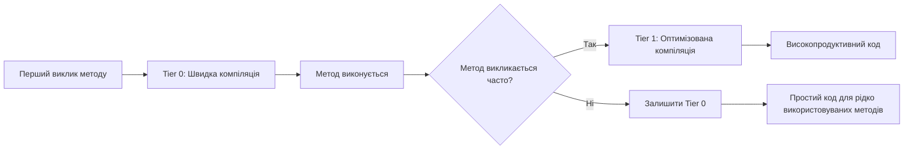
```mermaid
graph LR
    A[Перший виклик методу] --> B[Tier 0: Швидка компіляція]
    B --> C[Метод виконується]
    C --> D{Метод викликається часто?}
    D -->|Так| E[Tier 1: Оптимізована компіляція]
    D -->|Ні| F[Залишити Tier 0]
    E --> G[Високопродуктивний код]
    F --> H[Простий код для рідко використовуваних методів]
```

Під час першого виклику `JIT` компілює метод з мінімальними оптимізаціями (`Tier 0`), щоб не витрачати час на складні оптимізації на старті. Якщо метод викликають часто, `JIT` це помічає і перекомпілює його з повним набором оптимізацій (`Tier 1`). Рідко викликані методи так і лишаються простим кодом, а гарячі отримують повну оптимізацію.

## Інструменти для аналізу IL коду

Подивитися на IL код можна кількома інструментами.

- ILSpy є одним з найпопулярніших безкоштовних інструментів для декомпіляції .NET збірок. Він показує IL код поруч з декомпільованим C# кодом, тому з ним зручно вчитися і розбиратися, як компілятор перетворює ваш код.

- ILDasm (IL Disassembler) є офіційним інструментом від Microsoft, який входить до складу .NET SDK. Він може розбирати збірки .NET і створювати текстові файли з IL кодом, які можна потім редагувати і збирати назад за допомогою ILAsm.

- dotPeek від JetBrains - альтернатива з розширеними можливостями навігації та аналізу коду. Він може створювати проекти Visual Studio з декомпільованого коду і має інтеграцію з іншими інструментами JetBrains.

Для швидких експериментів зручний `SharpLab.io`: онлайн-інструмент, який показує IL код у реальному часі, поки ви пишете C#. Так найпростіше побачити, у що перетворюються різні конструкції C#.

## Практичні сценарії використання знань про IL

Найчастіше знання IL стає в пригоді, коли ви оптимізуєте продуктивність. Наприклад, якщо ви помітили, що певна частина коду працює повільно, аналіз IL може показати, чи генерує компілятор ефективні інструкції, чи є зайві операції `boxing/unboxing`, чи правильно працюють оптимізації компілятора.

У високопродуктивному коді воно допомагає уникати конструкцій, які генерують неефективний IL. Наприклад, використання `foreach` для масивів генерує різний IL код порівняно з традиційним циклом `for`, і розуміння цієї різниці може допомогти зробити правильний вибір.

Debugging складних проблем іноді вимагає аналізу IL коду, особливо коли проблема пов'язана з неочікуваною поведінкою компілятора або runtime. Наприклад, проблеми з `closure` в лямбда-виразах часто стають зрозумілими тільки після аналізу згенерованого IL коду.

А якщо ви пишете власний компілятор, генератор коду чи інструмент статичного аналізу, без розуміння IL не обійтися. Багато інструментів, як-от Entity Framework, генерують IL код динамічно, і коли знаєш, як це працює, ними простіше правильно користуватися.

## Оптимізації та підводні камені

JIT-компілятор виконує безліч оптимізацій, але деякі з них можуть бути неочевидними. `Method inlining` автоматично вбудовує невеликі методи в місця їх виклику, усуваючи накладні витрати на виклик методу. Однак це може призвести до збільшення розміру коду, тому JIT використовує евристики для прийняття рішення про inlining.

`Dead code elimination` видаляє код, який ніколи не виконується, але цей процес може бути складним у присутності `reflection` або динамічного завантаження кода. `Constant folding` дозволяє обчислювати константні вирази під час компіляції, але може бути обмежений у присутності побічних ефектів.

Врахуйте, що оптимізації JIT можуть відрізнятися між Debug і Release режимами: у Debug багато з них вимкнено для зручності налагодження. Тому продуктивність завжди міряйте на Release збірках.

## AOT: Альтернатива JIT-компіляції

`Ahead-of-Time (AOT)` компіляція підходить до виконання .NET коду зовсім інакше. `AOT` не компілює `IL` в машинний код під час виконання, а робить це заздалегідь, під час збірки додатка. На виході маємо самодостатні виконувані файли, яким не потрібен встановлений .NET runtime на цільовій машині. Порівняйте два шляхи:

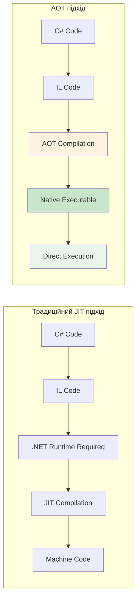
```mermaid
graph LR
    subgraph "Традиційний JIT підхід"
        A1[C# Code] --> B1[IL Code]
        B1 --> C1[.NET Runtime Required]
        C1 --> D1[JIT Compilation]
        D1 --> E1[Machine Code]
    end
    
    subgraph "AOT підхід"
        A2[C# Code] --> B2[IL Code]
        B2 --> C2[AOT Compilation]
        C2 --> D2[Native Executable]
        D2 --> E2[Direct Execution]
    end
    
    style C2 fill:#fff3e0
    style D2 fill:#c8e6c9
    style E2 fill:#e8f5e8
```

Головний виграш AOT - швидкий запуск, бо на JIT-компіляцію під час виконання час не витрачається. Це найпомітніше в серверних додатках, мікросервісах і контейнерних середовищах, де від швидкості запуску багато залежить. Крім того, з AOT додатки виходять меншими, бо в них потрапляє тільки той код, який реально використовується.

Платити за це доводиться гнучкістю динамічного коду. Reflection, динамічна генерація коду, і деякі інші функції можуть працювати обмежено або взагалі не працювати в AOT середовищі. Також AOT не може виконувати оптимізації на основі профілю виконання, які доступні JIT-компілятору.

## Native AOT в .NET

Починаючи з .NET 8, Microsoft представила Native AOT, який дозволяє компілювати .NET додатки в нативний код без потреби в .NET runtime. Для цього статичний аналіз визначає, який код реально використовується, і генерується мінімальний нативний executable.

Так виглядає проєкт з Native AOT:

```xml
<Project Sdk="Microsoft.NET.Sdk">
  <PropertyGroup>
    <OutputType>Exe</OutputType>
    <TargetFramework>net8.0</TargetFramework>
    <PublishAot>true</PublishAot>
    <InvariantGlobalization>true</InvariantGlobalization>
  </PropertyGroup>
</Project>
```

Збірка з Native AOT іде в кілька етапів. Спочатку компілятор аналізує весь код додатка і його залежності, щоб визначити, які типи і методи реально використовуються. Цей процес називається `tree shaking` і дозволяє значно зменшити розмір фінального `executable`. Далі IL код компілюється в нативний код за допомогою спеціальних AOT компіляторів, таких як `CoreRT` або `RyuJIT` в AOT режимі.

## ReadyToRun: Гібридний підхід

`ReadyToRun (R2R)` - компроміс між JIT і повним AOT. `R2R` збірки містять і IL код, і попередньо скомпільований нативний код для найпоширеніших сценаріїв. Додаток запускається швидше, бо багато коду вже скомпільовано, а для решти лишається JIT з усією його гнучкістю. Під час запуску CLR просто перевіряє, чи є для методу готовий нативний код:

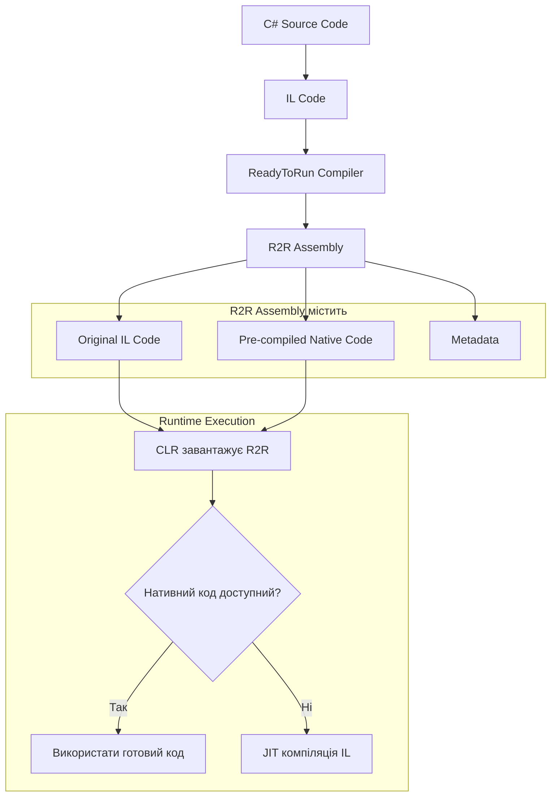
```mermaid
graph TD
    A[C# Source Code] --> B[IL Code]
    B --> C[ReadyToRun Compiler]
    C --> D[R2R Assembly]
    
    subgraph "R2R Assembly містить"
        E[Original IL Code]
        F[Pre-compiled Native Code]
        G[Metadata]
    end
    
    D --> E
    D --> F
    D --> G
    
    subgraph "Runtime Execution"
        H[CLR завантажує R2R]
        I{Нативний код доступний?}
        I -->|Так| J[Використати готовий код]
        I -->|Ні| K[JIT компіляція IL]
    end
    
    E --> H
    F --> H
    H --> I
```

Найбільше R2R дає великим додаткам і фреймворкам на кшталт ASP.NET Core, де можна попередньо скомпілювати найбільш часто використовувані кодові шляхи, залишаючи рідко використовувані частини для JIT-компіляції.

## Profile-Guided Optimization (PGO)

`Profile-Guided Optimization` покращує оптимізації на основі даних про те, як код використовується насправді. PGO працює у два етапи: спочатку додаток виконується з інструментацією, яка збирає статистику про те, які частини коду виконуються найчастіше, а потім ця інформація використовується для генерації оптимізованого коду.

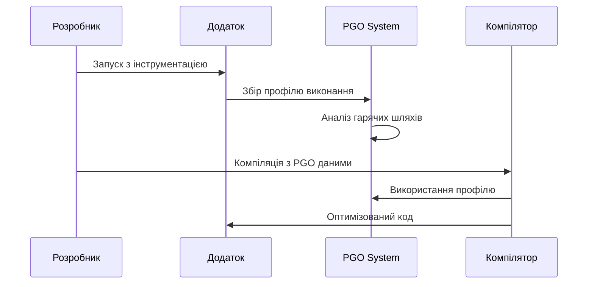
```mermaid
sequenceDiagram
    participant Dev as Розробник
    participant App as Додаток
    participant PGO as PGO System
    participant Compiler as Компілятор
    
    Dev->>App: Запуск з інструментацією
    App->>PGO: Збір профілю виконання
    PGO->>PGO: Аналіз гарячих шляхів
    Dev->>Compiler: Компіляція з PGO даними
    Compiler->>PGO: Використання профілю
    Compiler->>App: Оптимізований код
```

Найбільше `PGO` дає складним додаткам з багатьма гілками виконання. Скажімо, якщо умова в if блоці майже завжди істинна, PGO може зробити саме цей шлях найшвидшим.

## Майбутнє технологій компіляції в .NET

`Crossgen2` - нове покоління інструментів для AOT компіляції, з кращою продуктивністю і меншим використанням пам'яті порівняно з попередніми рішеннями.

`Dynamic PGO` дозволяє JIT-компілятору адаптуватися до змін у профілі виконання під час роботи додатка. Це означає, що код може автоматично оптимізуватися, якщо поведінка додатка змінюється з часом.

`Blazor WebAssembly AOT` дозволяє компілювати .NET код безпосередньо в WebAssembly, забезпечуючи близьку до нативної продуктивність веб-додатків.

У наступних версіях .NET також покращують підтримку reflection і динамічного коду в AOT середовищах через використання source generators і compile-time рефлексії, що дозволить більшій кількості існуючого коду працювати в AOT режимі без модифікацій.

## Порівняння підходів: JIT vs AOT

Вибір між JIT і AOT компіляцією залежить від конкретних потреб вашого додатка. JIT забезпечує максимальну гнучкість і можливість динамічних оптимізацій, але потребує часу на компіляцію під час виконання. AOT дає швидкий запуск і не потребує runtime, але може мати обмеження в функціональності. Коротко про сильні та слабкі сторони кожного:

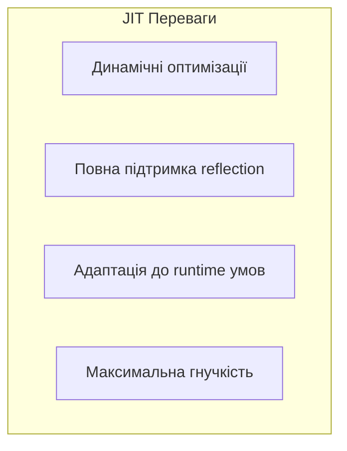
```mermaid
graph TD
    subgraph "JIT Переваги"
        A1[Динамічні оптимізації]
        A2[Повна підтримка reflection]
        A3[Адаптація до runtime умов]
        A4[Максимальна гнучкість]
    end
```

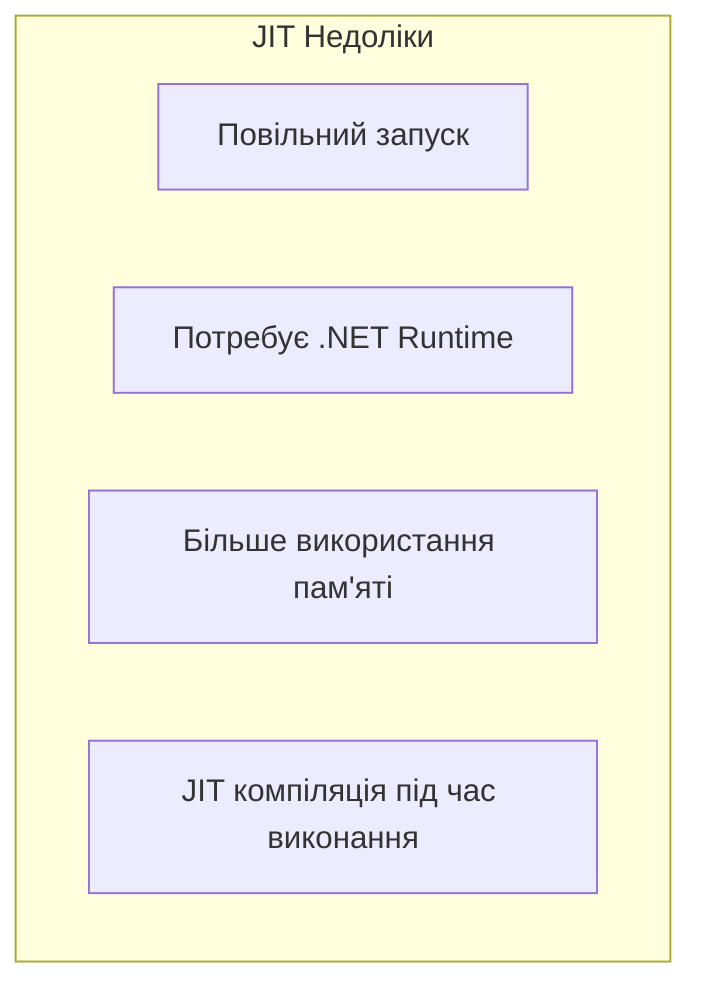
```mermaid
graph TD
    subgraph "JIT Недоліки"
        B1[Повільний запуск]
        B2[Потребує .NET Runtime]
        B3[Більше використання пам'яті]
        B4[JIT компіляція під час виконання]
    end
```

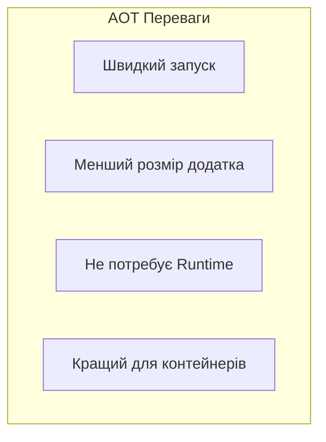
```mermaid
graph TD
    subgraph "AOT Переваги"
        C1[Швидкий запуск]
        C2[Менший розмір додатка]
        C3[Не потребує Runtime]
        C4[Кращий для контейнерів]
    end
```

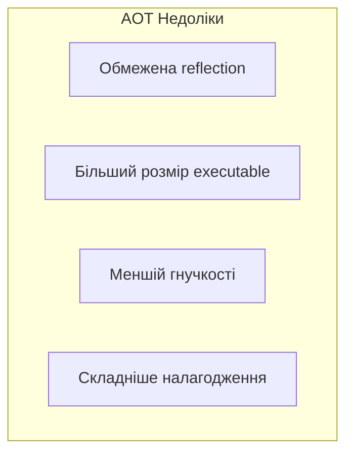
```mermaid
graph TD    
    subgraph "AOT Недоліки"
        D1[Обмежена reflection]
        D2[Більший розмір executable]
        D3[Меншій гнучкості]
        D4[Складніше налагодження]
    end
```

Для веб-додатків з високим навантаженням JIT часто є кращим вибором, оскільки час запуску амортизується протягом тривалого часу роботи, а динамічні оптимізації можуть значно покращити продуктивність. Для мікросервісів і контейнерних додатків AOT може бути кращим вибором через швидкий запуск і менші вимоги до ресурсів.

## Практичні рекомендації

Якщо ваш додаток активно використовує reflection чи динамічну генерацію коду або залежить від сторонніх бібліотек, які на цьому побудовані, беріть JIT. Якщо на першому місці швидкий запуск, мінімальне використання пам'яті або розгортання в контейнерах, розгляньте AOT.

Для багатьох enterprise додатків найкращим варіантом може бути гібрид з `ReadyToRun`: швидкий запуск без втрати функціональності. Підходи можна й поєднувати: AOT для мікросервісів, яким важливий швидкий старт, і JIT для основних додатків, яким потрібна гнучкість.

Остаточну відповідь дасть тільки вимірювання. Профілюйте додаток у реальних умовах з різними підходами компіляції і дивіться не лише на швидкість виконання, а й на час запуску, використання пам'яті та розмір розгортання.
