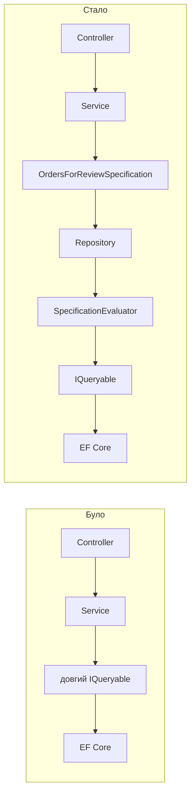

Запити до бази даних рідко залишаються простими. Спочатку нам потрібно отримати активні замовлення користувача. Потім додається фільтр за датою, статусом і сумою, пошук за email, завантаження пов'язаних сутностей, сортування, пагінація та окремий запит для експорту. Через кілька місяців один бізнес-критерій уже живе у controller, background job і report service - причому в трьох трохи різних варіантах.

`Specification Pattern` виносить правила вибірки в окремий іменований об'єкт. Замість відповіді на питання "який LINQ треба написати?" application code говорить: "дай замовлення, що відповідають `OrdersForReviewSpecification`".

У цій статті розберемо, яку проблему вирішує Specification Pattern, напишемо мінімальну реалізацію для EF Core та перетворимо громіздкий query на код, у якому видно бізнес-намір.

## До Specification: коли EF Core query знає забагато

Уявімо сторінку адміністрування замовлень. Вона підтримує необов'язкові фільтри, сортування та пагінацію:

```cs
public sealed record SearchOrdersRequest(
    Guid TenantId,
    string? CustomerEmail,
    DateTime? CreatedFrom,
    DateTime? CreatedTo,
    decimal? MinimumTotal,
    IReadOnlyCollection<OrderStatus>? Statuses,
    bool OnlyWithUnpaidBalance,
    int Page,
    int PageSize);
```

Без окремої абстракції query часто виростає безпосередньо в service:

```cs
public async Task<PagedResult<Order>> SearchAsync(
    SearchOrdersRequest request,
    CancellationToken cancellationToken)
{
    IQueryable<Order> query = dbContext.Orders
        .Where(order => order.TenantId == request.TenantId);

    if (!string.IsNullOrWhiteSpace(request.CustomerEmail))
    {
        var email = request.CustomerEmail.Trim();

        query = query.Where(order =>
            order.Customer.Email.Contains(email));
    }

    if (request.CreatedFrom is not null)
    {
        query = query.Where(order =>
            order.CreatedAt >= request.CreatedFrom);
    }

    if (request.CreatedTo is not null)
    {
        query = query.Where(order =>
            order.CreatedAt < request.CreatedTo);
    }

    if (request.MinimumTotal is not null)
    {
        query = query.Where(order =>
            order.Total >= request.MinimumTotal);
    }

    if (request.Statuses is { Count: > 0 })
    {
        query = query.Where(order =>
            request.Statuses.Contains(order.Status));
    }

    if (request.OnlyWithUnpaidBalance)
    {
        query = query.Where(order =>
            order.Payments.Sum(payment => payment.Amount) < order.Total);
    }

    var totalCount = await query.CountAsync(cancellationToken);

    var orders = await query
        .Include(order => order.Customer)
        .Include(order => order.Items)
        .Include(order => order.Payments)
        .AsNoTracking()
        .OrderByDescending(order => order.CreatedAt)
        .ThenByDescending(order => order.Id)
        .Skip((request.Page - 1) * request.PageSize)
        .Take(request.PageSize)
        .ToListAsync(cancellationToken);

    return new PagedResult<Order>(
        orders,
        totalCount,
        request.Page,
        request.PageSize);
}
```

Сам по собі цей LINQ не неправильний. Проблема з'являється навколо нього:

- service одночасно знає бізнес-критерії, структуру EF Core query та правила pagination
- умову "не повністю оплачене замовлення" складно знайти й повторно використати
- export service майже напевно скопіює більшу частину фільтрів
- зміна визначення активного замовлення потребує знайти всі копії
- unit test application service мусить перевіряти деталі побудови запиту
- назва `SearchAsync` не пояснює, який саме набір даних вона формує

Після кількох копіювань запити починають непомітно розходитися. Наприклад, API використовує верхню межу дати через `<`, а export - через `<=`; background job забуває `TenantId`; один endpoint додає `AsNoTracking`, інший ні.

## Що таке Specification Pattern

Specification - це об'єкт, який описує критерії вибірки даних. Для query до нього також можуть входити:

- `Where` criteria
- eager loading через `Include`
- сортування
- pagination
- tracking behavior

Головна зміна полягає не у скороченні кількості рядків. Код запиту нікуди не зникає - він отримує назву, межі та одне місце відповідальності.

У [.NET Architecture Guide](https://learn.microsoft.com/en-us/dotnet/architecture/microservices/microservice-ddd-cqrs-patterns/infrastructure-persistence-layer-implementation-entity-framework-core) Query Specification так само описана як об'єкт, що інкапсулює criteria, optional sorting і paging.



Specification відповідає на питання **що вибрати**, evaluator - **як перетворити опис на IQueryable**, а EF Core - **як виконати його для конкретної бази даних**.

## Базовий контракт Specification

Почнемо з невеликого контракту. Він підтримує фільтр, `Include`, сортування з tie-breaker, pagination, read-only mode і split query:

```cs
public interface ISpecification<T>
    where T : class
{
    Expression<Func<T, bool>>? Criteria { get; }

    IReadOnlyCollection<Expression<Func<T, object>>> Includes { get; }

    Expression<Func<T, object>>? OrderBy { get; }

    Expression<Func<T, object>>? OrderByDescending { get; }

    Expression<Func<T, object>>? ThenBy { get; }

    Expression<Func<T, object>>? ThenByDescending { get; }

    int? Skip { get; }

    int? Take { get; }

    bool IsNoTracking { get; }

    bool IsSplitQuery { get; }
}
```

Вирази зберігаються як `Expression<Func<...>>`, а не як звичайні `Func`. Завдяки цьому EF Core бачить expression tree та може перетворити його на SQL. Якщо скомпілювати criteria у delegate і виконати його через `IEnumerable`, фільтрація відбудеться вже в пам'яті.

Тепер додамо базовий клас із захищеними методами:

```cs
public abstract class Specification<T> : ISpecification<T>
    where T : class
{
    private readonly List<Expression<Func<T, object>>> _includes = [];

    public Expression<Func<T, bool>>? Criteria { get; private set; }

    public IReadOnlyCollection<Expression<Func<T, object>>> Includes => _includes;

    public Expression<Func<T, object>>? OrderBy { get; private set; }

    public Expression<Func<T, object>>? OrderByDescending { get; private set; }

    public Expression<Func<T, object>>? ThenBy { get; private set; }

    public Expression<Func<T, object>>? ThenByDescending { get; private set; }

    public int? Skip { get; private set; }

    public int? Take { get; private set; }

    public bool IsNoTracking { get; private set; }

    public bool IsSplitQuery { get; private set; }

    protected void SetCriteria(Expression<Func<T, bool>> criteria)
    {
        Criteria = criteria;
    }

    protected void AddInclude(Expression<Func<T, object>> include)
    {
        _includes.Add(include);
    }

    protected void ApplyOrderBy(
        Expression<Func<T, object>> orderBy,
        Expression<Func<T, object>>? thenBy = null)
    {
        OrderBy = orderBy;
        ThenBy = thenBy;
    }

    protected void ApplyOrderByDescending(
        Expression<Func<T, object>> orderByDescending,
        Expression<Func<T, object>>? thenByDescending = null)
    {
        OrderByDescending = orderByDescending;
        ThenByDescending = thenByDescending;
    }

    protected void ApplyPaging(int skip, int take)
    {
        Skip = skip;
        Take = take;
    }

    protected void AsNoTracking()
    {
        IsNoTracking = true;
    }

    protected void AsSplitQuery()
    {
        IsSplitQuery = true;
    }
}
```

Це навмисно мінімальна реалізація. Вона показує механіку патерна, а не намагається одразу стати універсальним query framework.

## SpecificationEvaluator: перетворюємо опис на EF Core query

Specification сама не виконує запит. Для цього створимо evaluator, який послідовно застосує її налаштування до `IQueryable<T>`:

```cs
public static class SpecificationEvaluator
{
    public static IQueryable<T> GetQuery<T>(
        IQueryable<T> inputQuery,
        ISpecification<T> specification,
        bool criteriaOnly = false)
        where T : class
    {
        var query = inputQuery;

        if (specification.Criteria is not null)
        {
            query = query.Where(specification.Criteria);
        }

        if (criteriaOnly)
        {
            return query;
        }

        query = specification.Includes.Aggregate(
            query,
            (current, include) => current.Include(include));

        query = ApplyOrdering(query, specification);

        if (specification.Skip is not null)
        {
            query = query.Skip(specification.Skip.Value);
        }

        if (specification.Take is not null)
        {
            query = query.Take(specification.Take.Value);
        }

        if (specification.IsSplitQuery)
        {
            query = query.AsSplitQuery();
        }

        if (specification.IsNoTracking)
        {
            query = query.AsNoTracking();
        }

        return query;
    }

    private static IQueryable<T> ApplyOrdering<T>(
        IQueryable<T> query,
        ISpecification<T> specification)
        where T : class
    {
        if (specification.OrderBy is not null)
        {
            return ApplyThenBy(query.OrderBy(specification.OrderBy), specification);
        }

        if (specification.OrderByDescending is not null)
        {
            return ApplyThenBy(
                query.OrderByDescending(specification.OrderByDescending),
                specification);
        }

        return query;
    }

    private static IQueryable<T> ApplyThenBy<T>(
        IOrderedQueryable<T> ordered,
        ISpecification<T> specification)
        where T : class
    {
        if (specification.ThenBy is not null)
        {
            return ordered.ThenBy(specification.ThenBy);
        }

        if (specification.ThenByDescending is not null)
        {
            return ordered.ThenByDescending(specification.ThenByDescending);
        }

        return ordered;
    }
}
```

Порядок операторів тут важливий. Criteria застосовується до підрахунку і сторінки, але `CountAsync` не має враховувати `Skip`, `Take`, `Include` та сортування. Саме тому evaluator підтримує режим `criteriaOnly`.

### А чи не отримаємо ми catch-all SQL?

Один великий expression з `email == null || ...` виглядає підозріло: здається, у базу піде запит із купою `@p IS NULL OR`, який жоден індекс не врятує. Це найчастіше заперечення проти такого підходу - і воно не справджується.

Значення фільтрів відомі під час компіляції запиту, тому EF Core обчислює порівняння параметра з `null` заздалегідь і вирізає непотрібні гілки. Ось справжній SQL для запиту, у якому задано лише `TenantId`:

```sql
SELECT "s"."Id", "s"."CreatedAt", "s"."CustomerId", "s"."Status", ...
FROM (
    SELECT ...
    FROM "Orders" AS "o"
    WHERE "o"."TenantId" = @request_TenantId
    ORDER BY "o"."CreatedAt" DESC, "o"."Id" DESC
    LIMIT @p7 OFFSET @p
) AS "s"
```

Жодного `IS NULL`. Кожна комбінація заповнених фільтрів дає власний план і власний запис у query cache. Розплата за це - більше варіантів у кеші, а не гірший план.

Repository залишається тонким:

```cs
public sealed class EfRepository<T>(AppDbContext dbContext)
    where T : class
{
    public Task<List<T>> ListAsync(
        ISpecification<T> specification,
        CancellationToken cancellationToken)
    {
        return SpecificationEvaluator
            .GetQuery(dbContext.Set<T>(), specification)
            .ToListAsync(cancellationToken);
    }

    public Task<int> CountAsync(
        ISpecification<T> specification,
        CancellationToken cancellationToken)
    {
        return SpecificationEvaluator
            .GetQuery(
                dbContext.Set<T>(),
                specification,
                criteriaOnly: true)
            .CountAsync(cancellationToken);
    }
}
```

Generic repository не є обов'язковою частиною Specification Pattern. `DbContext` уже надає `Set<T>()`, change tracking і unit of work behavior, тому evaluator можна викликати безпосередньо з query service. Repository тут лише показує зручну точку інтеграції.

## Переносимо страшний query у конкретну Specification

Для пошуку замовлень створимо окрему іменовану specification:

```cs
public sealed class OrdersForReviewSpecification
    : Specification<Order>
{
    public OrdersForReviewSpecification(SearchOrdersRequest request)
    {
        ArgumentOutOfRangeException.ThrowIfLessThan(request.Page, 1);
        ArgumentOutOfRangeException.ThrowIfLessThan(request.PageSize, 1);

        var email = request.CustomerEmail?.Trim();
        var statuses = request.Statuses;

        SetCriteria(order =>
            order.TenantId == request.TenantId &&
            (email == null ||
                order.Customer.Email.Contains(email)) &&
            (request.CreatedFrom == null ||
                order.CreatedAt >= request.CreatedFrom) &&
            (request.CreatedTo == null ||
                order.CreatedAt < request.CreatedTo) &&
            (request.MinimumTotal == null ||
                order.Total >= request.MinimumTotal) &&
            (statuses == null ||
                statuses.Count == 0 ||
                statuses.Contains(order.Status)) &&
            (!request.OnlyWithUnpaidBalance ||
                order.Payments.Sum(payment => payment.Amount) <
                    order.Total));

        AddInclude(order => order.Customer);
        AddInclude(order => order.Items);

        ApplyOrderByDescending(
            order => order.CreatedAt,
            thenByDescending: order => order.Id);

        ApplyPaging(
            (request.Page - 1) * request.PageSize,
            request.PageSize);

        AsNoTracking();
    }
}
```

Після цього application service виглядає так:

```cs
public async Task<PagedResult<Order>> SearchAsync(
    SearchOrdersRequest request,
    CancellationToken cancellationToken)
{
    var specification =
        new OrdersForReviewSpecification(request);

    var totalCount = await orderRepository.CountAsync(
        specification,
        cancellationToken);

    var orders = await orderRepository.ListAsync(
        specification,
        cancellationToken);

    return new PagedResult<Order>(
        orders,
        totalCount,
        request.Page,
        request.PageSize);
}
```

Рядків у системі не стало суттєво менше. Натомість service тепер координує use case, specification містить правила вибірки, а evaluator - EF Core plumbing.

Назва `OrdersForReviewSpecification` також стає частиною мови системи. Її легше знайти, обговорити на code review і повторно використати, ніж анонімний ланцюжок `Where`.

## Готовий приклад на SQLite

Увесь код зі статті зібраний у готовому console project: [specification-pattern-ef-core](https://github.com/TarasKovalenko/taraskovalenko.github.io/tree/main/examples/specification-pattern-ef-core).

Приклад містить domain models, `AppDbContext`, повну реалізацію specification, evaluator, repository, seed data, application service та сім тестів. Сервер бази даних не потрібен: SQLite працює в пам'яті всередині процесу. InMemory provider я свідомо не використовую - він приймає вирази, які реальний provider не перекладе, тобто ховає саме ті помилки, заради яких пишеться такий приклад.

Запустити приклад із кореня репозиторію можна однією командою:

```bash
dotnet run \
  --project examples/specification-pattern-ef-core/src/SpecificationExample
```

Програма спочатку друкує SQL, який згенерувала specification, а потім результат:

```text
Found 2 orders; page 1:
- bob@example.com      total=300.00 status=Processing
- alice@example.com    total=150.00 status=Pending
```

SQLite обрано, щоб приклад залишався автономним і запускався без Docker, але при цьому лишався справжнім relational provider: він перевіряє SQL translation і виконує саме той запит, який ви бачите в консолі. Вашою production database він від цього не стає - типи даних, обмеження та семантика частини функцій відрізняються. Тому Microsoft [радить тестувати query behavior на тій самій СУБД, що й у production](https://learn.microsoft.com/en-us/ef/core/testing/choosing-a-testing-strategy), а SQLite розглядати як компроміс, а не як еквівалент.

## Повторне використання без копіювання

Припустимо, export повинен використовувати ті самі фільтри, але не pagination і не завантажувати цілі entity. Є спокуса додати до конструктора прапорець `forExport`. Після кількох таких прапорців specification знову перетвориться на складний service.

Краще розділити спільний criteria та різні форми результату. Наприклад, винести expression у фабрику:

```cs
public static class OrderCriteria
{
    public static Expression<Func<Order, bool>> ForReview(
        SearchOrdersRequest request)
    {
        var email = request.CustomerEmail?.Trim();
        var statuses = request.Statuses;

        return order =>
            order.TenantId == request.TenantId &&
            (email == null ||
                order.Customer.Email.Contains(email)) &&
            (request.CreatedFrom == null ||
                order.CreatedAt >= request.CreatedFrom) &&
            (request.CreatedTo == null ||
                order.CreatedAt < request.CreatedTo) &&
            (request.MinimumTotal == null ||
                order.Total >= request.MinimumTotal) &&
            (statuses == null ||
                statuses.Count == 0 ||
                statuses.Contains(order.Status)) &&
            (!request.OnlyWithUnpaidBalance ||
                order.Payments.Sum(payment => payment.Amount) <
                    order.Total);
    }
}
```

Основна specification використовує цей criteria:

```cs
SetCriteria(OrderCriteria.ForReview(request));
```

А export query може застосувати той самий expression і зробити projection:

```cs
var rows = await dbContext.Orders
    .Where(OrderCriteria.ForReview(request))
    .OrderByDescending(order => order.CreatedAt)
    .Select(order => new OrderExportRow(
        order.Id,
        order.Customer.Email,
        order.CreatedAt,
        order.Total,
        order.Status))
    .AsNoTracking()
    .ToListAsync(cancellationToken);
```

Це важливий компроміс: повторно використовуємо бізнес-критерій, але не змушуємо export завантажувати entity з `Include`. Для read model projection у DTO часто кращий за універсальний repository.

## Як тестувати Specification

Оскільки specification є окремим об'єктом, її можна перевірити без controller або application service. Але компіляція `Criteria` у звичайний delegate перевіряє лише логіку C#, а не те, що EF Core здатний перетворити expression на SQL.

Швидкий unit test корисний для бізнес-правила:

```cs
[Fact]
public void Criteria_Rejects_Order_From_Another_Tenant()
{
    var tenantId = Guid.NewGuid();
    var request = new SearchOrdersRequest(
        tenantId,
        CustomerEmail: null,
        CreatedFrom: null,
        CreatedTo: null,
        MinimumTotal: null,
        Statuses: null,
        OnlyWithUnpaidBalance: false,
        Page: 1,
        PageSize: 20);

    var specification =
        new OrdersForReviewSpecification(request);

    var predicate = specification.Criteria!.Compile();
    var order = new Order { TenantId = Guid.NewGuid() };

    Assert.False(predicate(order));
}
```

Для впевненості в трансляції потрібен integration test із реальним relational provider, наприклад SQLite або тим самим engine, що використовується у production:

```cs
[Fact]
public async Task Query_Returns_Only_Matching_Orders()
{
    await using var dbContext = CreateSqliteDbContext();
    await SeedOrdersAsync(dbContext);

    var request = new SearchOrdersRequest(
        TenantId: SeedData.DemoTenantId,
        CustomerEmail: null,
        CreatedFrom: null,
        CreatedTo: null,
        MinimumTotal: null,
        Statuses: null,
        OnlyWithUnpaidBalance: false,
        Page: 1,
        PageSize: 20);

    var query = SpecificationEvaluator.GetQuery(
        dbContext.Orders,
        new OrdersForReviewSpecification(request));

    var sql = query.ToQueryString();
    var orders = await query.ToListAsync();

    Assert.NotEmpty(sql);
    Assert.All(orders, order =>
        Assert.Equal(request.TenantId, order.TenantId));
}
```

EF Core InMemory provider не відтворює поведінку relational database: він може прийняти expression, який реальний provider не перекладе, і має іншу семантику частини операцій. Тому для query-heavy коду SQLite test зазвичай дає значно корисніший сигнал.

Але й у SQLite є власні обмеження. `DateTimeOffset` у `ORDER BY` він не перекладає взагалі:

```text
System.NotSupportedException: SQLite does not support expressions of type
'DateTimeOffset' in ORDER BY clauses.
```

SQL Server і PostgreSQL сортують його без проблем. Тому в прикладі до статті `CreatedAt` - це `DateTime` в UTC; альтернатива - ганяти ці тести на тому самому engine, що й production, через Testcontainers.

## Specification не оптимізує SQL автоматично

Перенесення query в окремий клас не робить його швидшим. Specification може так само створити:

- зайві `Include`
- cartesian explosion
- повільний `Contains`
- pagination через великий `OFFSET`
- фільтр по колонці без індексу
- завантаження цілих entity замість projection

Патерн покращує організацію query logic, а не execution plan. Після рефакторингу все одно перевіряйте SQL через `ToQueryString()`, логи EF Core та execution plan бази даних.

Офіційна документація EF Core про [ефективні запити](https://learn.microsoft.com/en-us/ef/core/performance/efficient-querying) окремо рекомендує проєктувати лише потрібні поля, обмежувати result set та контролювати спосіб завантаження navigation properties.

Для read-only списків проєктуйте лише потрібні поля:

```cs
var query = dbContext.Orders
    .Where(OrderCriteria.ForReview(request))
    .Select(order => new OrderListItem(
        order.Id,
        order.Customer.Email,
        order.Total,
        order.Status,
        order.CreatedAt))
    .AsNoTracking();
```

Для великих послідовних списків розгляньте keyset pagination замість `Skip`. Якщо завантажуєте кілька collection navigation, оцініть `AsSplitQuery`. Specification може зберігати ці налаштування, але рішення все одно має виходити з реального профілю запиту.

## Переваги Specification Pattern

- **Явний бізнес-намір**  
  `OrdersForReviewSpecification` передає значення краще, ніж безіменний набір `Where`.

- **Одне місце для query rules**  
  Tenant isolation, status та date boundaries не розповзаються між endpoint, job і export.

- **Повторне використання**  
  Criteria можна застосувати в кількох сценаріях без копіювання LINQ.

- **Тестованість**  
  Бізнес-умови перевіряються окремо, а translation - integration tests із relational provider.

- **Тонший application code**  
  Service координує сценарій, а не конструює запит на десятки рядків.

## Недоліки та обмеження

- **Додаткова абстракція**  
  Для двох простих `Where` окремий клас може бути дорожчим за сам query.

- **Ризик створити власний LINQ framework**  
  Підтримка `ThenInclude`, projection, group by, split queries, tags і compiled queries швидко ускладнює базову реалізацію.

- **Не кожна specification справді повторно використовується**  
  Іноді query належить одному endpoint і найкраще читається поруч із ним.

- **Композиція expression нетривіальна**  
  Наївне об'єднання дерев через `Expression.Invoke` підтримується не всіма provider однаково. Композицію потрібно тестувати на реальній базі.

- **Generic repository може приховати можливості EF Core**  
  Якщо abstraction не дозволяє projection або provider-specific optimization, вона починає заважати.

## Коли використовувати Specification Pattern

Використовуйте Specification, коли:

- критерій має бізнес-назву
- однакові правила вибірки потрібні в кількох місцях
- query містить багато необов'язкових фільтрів
- важливо централізувати tenant або access criteria
- application service перевантажений деталями EF Core
- потрібні окремі тести query behavior

Не використовуйте Specification лише тому, що в проєкті є EF Core. Простий endpoint цілком може залишитися простим:

```cs
var customer = await dbContext.Customers
    .SingleOrDefaultAsync(
        customer => customer.Id == customerId,
        cancellationToken);
```

Окремий `CustomerByIdSpecification` тут не дає нової мови чи повторного використання - лише додає файл і перехід між абстракціями.

## Готові бібліотеки

Для production-проєкту не обов'язково підтримувати власний evaluator. [Ardalis.Specification](https://github.com/ardalis/Specification) уже має інтеграцію з EF Core, projection, pagination, caching metadata та інші можливості.

Власна мінімальна реалізація корисна, щоб зрозуміти патерн і точно контролювати невеликий набір функцій. Готова бібліотека доречна, коли requirements виходять за межі `Where`, `Include`, ordering і pagination.

## Висновок

Specification Pattern не прибирає складність запиту - він дає їй ім'я та правильне місце. До патерна бізнес-критерії, EF Core plumbing і orchestration часто змішані в одному service. Після - service працює з наміром, specification описує вибірку, evaluator будує `IQueryable`, а EF Core виконує SQL.

Найкращий сигнал для використання патерна - не довжина LINQ сама по собі, а поява стабільного бізнес-поняття, яке повторюється в системі. Якщо команда регулярно говорить "замовлення для перевірки", це хороший кандидат на `OrdersForReviewSpecification`. Якщо query використовується один раз і читається за десять секунд, додаткова abstraction, найімовірніше, не потрібна.

Specification робить складні запити красивішими на рівні application code. Але красивий виклик `ListAsync(specification)` не звільняє від обов'язку подивитися, який SQL насправді пішов у базу.
