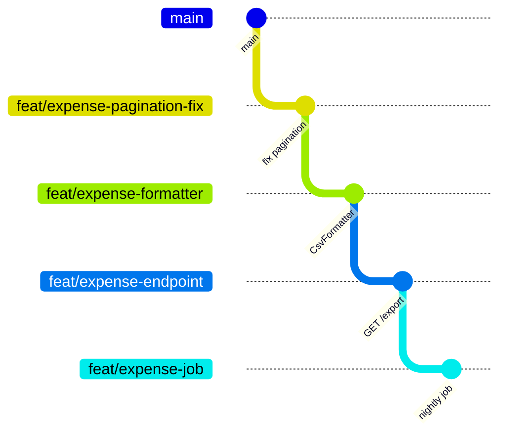

Знайома ситуація. Ви два тижні робили експорт витрат у CSV. Довелося додати новий endpoint, витягнути форматування в окремий сервіс, підправити міграцію, дописати background job і заодно виправити баг у пагінації, бо без нього експорт віддавав дублікати.

Виходить pull request на 47 файлів і +2100/-680 рядків. Ви відкриваєте його в п'ятницю. У понеділок під ним один коментар: "LGTM". У середу хтось нарешті читає уважно, знаходить проблему в міграції, і ви переробляєте половину. Ще через два дні PR мерджиться, і ніхто в команді не має жодного уявлення, що саме туди потрапило.

Проблема не в тому, що розробник ледачий. Проблема в тому, що робота була однією логічною послідовністю, а інструмент запропонував запакувати її в один атомарний блок.

Stacked PRs - це спроба перестати вибирати між "великий PR, який ніхто не читає" і "чекаю три дні на review, поки нічого не роблю".

До літа 2026 стек треба було збирати руками або сторонніми інструментами. 30 липня GitHub [додав стеки в public preview](https://github.blog/changelog/2026-07-30-stacked-pull-requests-are-now-in-public-preview/), і тепер розуміє стек як окрему сутність. Половина порад із блогів останніх п'яти років після цього просто застаріла.

## Що таке stack

Stacked PR - це ланцюжок гілок, де кожна наступна відгалужена від попередньої, а не від `main`. Кожна гілка отримує свій pull request, і base branch цього PR - не `main`, а гілка нижче в стеку.



Чотири PR замість одного:

| PR | Гілка | Base | Розмір |
|----|-------|------|--------|
| #101 | `feat/expense-pagination-fix` | `main` | +30/-12 |
| #102 | `feat/expense-formatter` | `feat/expense-pagination-fix` | +180/-4 |
| #103 | `feat/expense-endpoint` | `feat/expense-formatter` | +90/-0 |
| #104 | `feat/expense-job` | `feat/expense-endpoint` | +140/-6 |

Ключовий момент, через який це взагалі працює: GitHub рахує diff відносно merge-base з base branch. Якщо base для #103 - це `feat/expense-formatter`, то у вкладці Files changed буде рівно 90 доданих рядків нового endpoint. Код форматера туди не потрапить, хоч фізично він є в гілці.

Тобто рев'ювер бачить одну зміну за раз, навіть якщо ви вже пішли писати наступні три.

## Навіщо це, якщо є feature branch

Три конкретні речі, які стек вирішує, а звичайна велика гілка - ні.

**Review не блокує роботу.** Ви відкрили #101, і замість того, щоб чекати, стартуєте #102 поверх нього. Час очікування review перестає бути простоєм. Це головна причина, чому стеки популярні в командах, де review займає день і більше.

**Розмір PR падає до розміру, який реально читають.** [Дослідження SmartBear на 2500 review в Cisco](https://smartbear.com/learn/code-review/best-practices-for-peer-code-review/) дало цифру, яку відтоді цитують усі: після приблизно 400 рядків за раз здатність знаходити дефекти падає. Це не магічне число, але напрямок правильний: 90 рядків читають, 2100 - проглядають.

**Історія стає зрозумілою.** `feat/expense-pagination-fix` мерджиться окремо. Через півроку, коли ви робите `git bisect` по регресії в пагінації, ви отримуєте комміт на 30 рядків, а не мега-комміт, у якому пагінація змішана з CSV і cron.

Є ще один ефект, менш очевидний. Стек змушує думати про порядок. Питання "що з цього можна змерджити першим, не ламаючи main?" - це фактично питання про залежності у вашому дизайні. Якщо відповідь "нічого, воно все зчеплене", це сигнал про сам код, а не про Git.

## Нативний шлях: gh stack

Розширення до GitHub CLI ставиться однією командою:

```bash
gh extension install github/gh-stack
```

Далі той самий приклад з експортом, але вже стеком:

```bash
git switch main
git pull --ff-only

# створюємо стек; trunk за замовчуванням - default branch репозиторію
gh stack init

# перша гілка
# ... правки ...
gh stack add feat/expense-pagination-fix -A -m "fix: skip duplicates in expense pagination"

# друга поверх першої
# ... правки ...
gh stack add feat/expense-formatter -A -m "feat: add CsvExpenseFormatter"

# третя
# ... правки ...
gh stack add feat/expense-endpoint -A -m "feat: GET /expenses/export"

# пушимо все і створюємо зв'язані PR
gh stack submit --open
```

`gh stack add` створює гілку поверх поточної верхівки стеку, `-A` стейджить усі зміни, `-m` одразу робить комміт. `gh stack submit` пушить гілки, створює або оновлює PR і зв'язує їх у стек на боці GitHub. Без `--open` нові PR створюються як draft, тому прапорець варто ставити одразу, якщо ви не збиралися ховати роботу.

Подивитися стан:

```bash
gh stack view
```

Навігація по стеку без ручного `git switch`: `gh stack up`, `gh stack down`, `gh stack top`, `gh stack bottom`, `gh stack switch`, `gh stack checkout <pr-number>`.

Переструктурувати стек інтерактивно (видалити гілку, схлопнути дві сусідні, вставити нову посередині, переставити порядок) - `gh stack modify`.

Синхронізація з remote після чужих змін у `main`:

```bash
gh stack sync --prune
```

Одна команда робить fetch, каскадний rebase усього стеку, push і оновлення стану PR. `--prune` видаляє локальні гілки тих PR, які вже змерджені.

CLI не обов'язковий. Стек можна зібрати з веб-інтерфейсу: створюєте перший PR на `main`, далі при створенні наступного ставите base на гілку першого і відмічаєте чекбокс. GitHub також сам помічає ланцюжки, які виглядають як стек, і показує банер із пропозицією їх зв'язати.

У шапці PR з'являється **stack map**: усі PR стеку по порядку, поточний підсвічений, решта клікабельні. Саме тому ручний список стеку в описі PR, який радили раніше, більше не потрібен.

## Якщо PR уже створені

Стек - це звичайні гілки і звичайні PR, просто з правильним ланцюжком base. Тому ланцюжок, зібраний руками через `gh pr create --base`, можна зареєструвати як стек заднім числом:

```bash
gh stack link 101 102 103 104
```

Порядок аргументів - знизу вгору, від найближчого до `main`. Локального трекінгу ця команда не заводить, тільки зв'язує PR на боці GitHub.

## Правки в нижньому PR

Рев'ювер у #101 просить перейменувати метод. Ви правите гілку внизу, і всі гілки вище тепер відгалужені від старого комміта.

З розширенням це `gh stack rebase` (каскадний rebase знизу вгору, з `--continue` і `--abort` для конфліктів) або кнопка **Rebase Stack** у merge box, коли GitHub бачить, що історія перестала бути лінійною. Кнопка запускає серверний каскадний rebase і force-push усіх гілок.

Без розширення це ланцюжок ручних rebase, force-push і пояснень рев'юверам, що саме змінилося між версіями. Рутина, яку `gh stack` і знімає.

## Merge

Стеки мерджаться знизу вгору. Але поведінка відрізняється від того, до чого ви звикли на звичайних PR.

Коли ви натискаєте merge на якомусь PR у стеку, разом із ним приземляються **всі незмерджені PR нижче**. Тобто merge на #103 змерджить #101, #102 і #103 однією операцією. PR вище лишаються відкритими, і стек автоматично перебазовується так, щоб найнижчий незмерджений PR цілився в base branch.

Прямий merge атомарний: або вся група проходить, або не проходить нічого. У merge queue логіка інша - PR заходять у чергу разом і оцінюються поокремо; якщо один падає, він і все, що над ним, виштовхується, а нижні продовжують рух.

Підтримуються всі три методи: merge commit, squash і rebase merge. Squash тут працює так, як хочеться: кожен PR стеку дає один охайний squash-комміт, а незмерджені гілки GitHub перебазовує через `git rebase --onto`, щоб не отримати штучних конфліктів через новий SHA.

Ось той момент, який раніше був найбільшою пасткою стеків і на якому люди досі губляться.

**Якщо ваш ланцюжок не зареєстрований як стек**, автоматики немає. GitHub переставить base у #102 на `main` після мерджу #101 і видалення гілки, але історія `feat/expense-formatter` усе ще міститиме оригінальні комміти пагінації, яких у `main` після squash не існує. Diff #102 покаже і форматер, і пагінацію вдруге, іноді ще й з конфліктами. Далі ви розбираєте це вручну через `git rebase --onto`, попередньо десь знайшовши SHA старої гілки до мерджу.

Мораль проста: якщо працюєте стеками, реєструйте їх як стеки. Різниця між `gh stack link` і його відсутністю - це різниця між "GitHub сам розрулить squash" і "ви розрулюєте squash руками щоразу".

## Rules і CI

Тут головна зміна порівняно з саморобними стеками.

Кожен PR у стеку оцінюється так, ніби він цілиться в base стеку, а не в гілку прямо під ним. Це стосується required reviews, status checks, CODEOWNERS і code scanning. Тобто branch protection на `main` більше не обходиться тим, що ваш PR формально цілиться в чужу feature-гілку.

Workflows теж тригеряться так, ніби кожен PR стеку цілиться в base. Раніше зелений CI на середньому PR означав "працює разом з гілкою під ним", і це була постійна плутанина. Тепер він означає те, що очікує людина.

Щоб змерджити PR, усі PR під ним теж мають мати зелені перевірки і задовольняти merge requirements.

У workflow доступні метадані стеку через `github.event.pull_request.stack`:

```yaml
- name: Run migrations check only on the lowest unmerged PR
  if: github.event.pull_request.stack.base.ref == github.event.pull_request.base.ref
  run: ./scripts/check-migrations.sh
```

Об'єкт містить `number` (ідентифікатор стеку), `size` (скільки всього PR), `position` (позиція, рахується з 1), `base.ref` і `base.sha`. На цьому будується економія CI: важкі кроки можна ганяти тільки на найнижчому незмердженому PR або тільки на верхньому (`position == size`).

Одна деталь, на якій легко зламати автоматизацію: у події `pull_request.opened` даних про стек ще немає, бо PR створюється до того, як приєднується до стеку. Для цього є окремий action-тип `stacked` у події `pull_request`.

І базова гігієна, яка не залежить від стеків. Кожен rebase породжує пуш у кожну гілку, тому без скасування застарілих запусків стек з'їсть бюджет Actions:

```yaml
concurrency:
  group: ci-${{ github.workflow }}-${{ github.ref }}
  cancel-in-progress: true
```

## Обмеження на вересень 2026

Фіча в public preview, і частина речей ще не доїхала:

- **Auto-merge для стеків не працює.** Обіцяють.
- **Bypass merge rules не працює.** Теж обіцяють.
- **Merge queue підтримується**, але розкочувався поступово після 30 липня. Варто перевірити на своєму репозиторії, а не вірити на слово.
- **Максимум 100 PR у стеку.** Якщо вам мало, проблема не в GitHub.
- **Стеки між форками не працюють.** Усі гілки мають бути в одному репозиторії, тому для типового OSS-контриб'ютора з форка це поки не варіант.
- **GitHub Desktop не підтримує стеки.**
- **Потрібна лінійна історія.** Якщо вона зламалася, чекайте кнопку Rebase Stack або робіть `gh stack rebase`.
- **Merge через API - тільки новий асинхронний Merge API.** Старі REST і GraphQL мутації стеків не знають, тому власні скрипти мерджу доведеться переписати.

## Відома проблема: "Merge stack" не працює при суворому branch protection

У репозиторії gh-stack є [обговорення](https://github.com/github/gh-stack/discussions/404) проблеми, на яку легко натрапити в добре захищеному репозиторії. Автор початкового звіту використовував gh-stack v0.1.0 у приватному репозиторії: стек із п'яти PR, merge commits. На default branch були увімкнені обов'язковий review від CODEOWNER, approval від когось, хто не робив останній push, і лінійна історія. Згодом ще троє людей написали, що бачать те саме у приватних проєктах, один із них зі squash merge. Станом на середину вересня GitHub у треді не відповів.

На що натрапив автор:

- **Статус окремих PR і merge стеку суперечать одне одному.** Кожен PR показував `mergeStateStatus=CLEAN` і `reviewDecision=APPROVED`, зі свіжими approval від CODEOWNER на поточних head SHA, зробленими вже після останньої зміни base. Проте `gh stack merge` і кнопка "Merge stack" падали з повідомленням "Waiting on reapproval from someone other than the last pusher. Review is stale because it was submitted before the merge base changed. Waiting on code owner review."
- **UI показує Ready, а потім здається.** Stack map позначав усі PR як Ready, кнопка була активна. Після натискання в timeline PR лише з'являвся запис "stack merge was automatically disabled".
- **Стан "у черзі", якого не бачить API.** `gh stack unstack` відмовлявся працювати, бо деякі PR нібито "queued for merge or have auto-merge enabled". Водночас GraphQL повертав `autoMergeRequest=null` і `mergeQueueEntry=null` для кожного PR, а merge queue в репозиторії не налаштований. Прихований стан зник після `gh pr merge --disable-auto` на кожному PR.
- **Unstack спотикається об змерджені PR.** Коли нижні PR уже були змерджені, `gh stack unstack` падав саме на них, замість того щоб прибрати лише відкриті. Пізніше стек таки розпався на сервері, але `gh stack view` локально й далі його показував.
- **Статуси скачуть хвилинами.** `mergeable`, `reviewDecision` і `mergeStateStatus` перемикалися між `UNKNOWN`, `BLOCKED` і `CLEAN`, тож важко було відрізнити справжнє блокування від затримки.
- **Кожен retarget скидає approval від CODEOWNER.** Коли нижній PR мерджиться і наступний перенацілюється на trunk, його approval скидається, тож кожен PR по черзі потребує нового approval.

Змерджити стек цілком автору так і не вдалося. Спрацював інший шлях: `gh pr merge --disable-auto` на кожному PR, дочекатися, поки стек розпадеться на сервері, а потім мерджити PR по одному знизу вгору через `gh pr merge`, перенацілюючи кожен на trunk.

Якщо на default branch вимагається review від CODEOWNER і approval від когось, хто не робив останній push, спершу спробуйте "Merge stack" на маленькому тестовому стеку й тримайте цей шлях відступу під рукою.

## Це вже робили до GitHub

Стеки не нова ідея. Graphite, git-town, ghstack, spr, Sapling - усе це роками закривало ту саму проблему поверх звичайного GitHub, і нікуди не поділося. GitHub прямо каже, що будь-який інструмент, який створює PR із правильним ланцюжком base, сумісний, а результат зв'язується в стек через `gh stack link`.

Якщо ви починаєте зараз і сидите на GitHub, брати щось стороннє сенсу мало: нативна підтримка закриває базові сценарії, і їй не треба давати окремий доступ до репозиторію.

## Коли стек - погана ідея

Стек має ціну. Він додає роботи автору й трохи роботи рев'юверу.

Не варто робити стек, якщо:

- Зміна справді атомарна. Рефакторинг перейменування на 40 файлів не стає зрозумілішим, якщо порізати його на п'ять PR.
- У команді немає культури швидкого review. Стек із п'яти PR, кожен з яких чекає три дні, це не паралелізм, це п'ятнадцять днів і купа rebase.
- Ви контриб'ютите з форка. Просто не спрацює.
- Гілки живуть довго й розходяться з `main`. Чим довший стек, тим дорожчий кожен sync.

Розумна межа для більшості команд - три-чотири PR у стеку, хоч технічно дозволено сто. Далі вартість підтримки росте швидше за користь.

Окремо: якщо у вас trunk-based development з коммітами прямо в `main` за feature flags, стеки вам, найімовірніше, не потрібні взагалі. Ви вже вирішуєте ту саму проблему іншим способом.

## Checklist перед першим стеком

- [ ] `gh extension install github/gh-stack`, або хоча б перевірено, що стеки доступні у вашому репозиторії.
- [ ] Ланцюжок зареєстрований як стек, а не просто PR з ручними base. Інакше вся автоматика rebase і squash повз вас.
- [ ] У CI налаштований `concurrency` з `cancel-in-progress`.
- [ ] Важкі кроки CI обмежені по `github.event.pull_request.stack.position`.
- [ ] Скрипти автоматичного мерджу переведені на асинхронний Merge API або на `gh stack merge`.
- [ ] Команда знає, що merge середнього PR тягне за собою всі незмерджені PR під ним.
- [ ] Стек не довший за чотири PR, поки практика не прижилася.
- [ ] Якщо на default branch суворі правила review, "Merge stack" спершу перевірено на тестовому стеку.

Найбільша зміна від стеків не технічна. Вона в тому, що ви перестаєте накопичувати роботу до моменту "ну тепер уже можна показувати" і починаєте віддавати її шматками, які людина здатна прочитати за один підхід. Git тут тільки інструмент, а перейменувати метод у PR на 30 рядків просто дешевше, ніж у PR на 2100.
