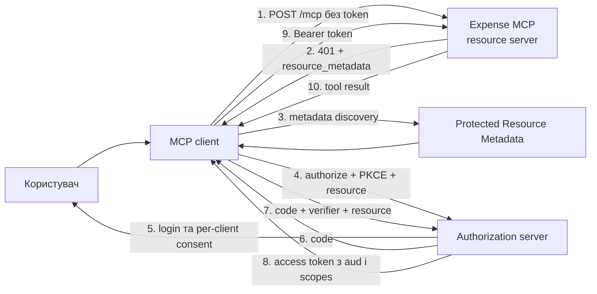

Уявімо, що ми підключили до корпоративного AI-асистента MCP server для роботи з витратами. Один tool показує список чеків, інший затверджує виплату. На демо все виглядає чудово: сервер приймає bearer token, `[Authorize]` не пускає анонімних користувачів, а модель нарешті перестає вигадувати статуси заявок.

Проблеми з'являються пізніше. Token, виданий для файлового API, раптом працює і в expense server. Desktop client, якому дозволяли лише читання, викликає `approve_expense`. У логах є весь заголовок `Authorization` разом з аргументами tool. А один активний цикл агента за хвилину створює кілька тисяч запитів.

Автентифікація була. Меж доступу не було.

Тож побудуємо HTTP-based MCP server на ASP.NET Core, у якому:

- OAuth client використовує authorization code flow із PKCE
- `resource` прив'язує token до конкретного MCP server
- API перевіряє підпис, issuer, термін придатності та `aud`
- `expenses.read` і `expenses.approve` відкривають різні tools
- consent і дозволені scopes зберігаються окремо для кожного client
- privileged tool проходить authorization двічі: на межі HTTP і перед самою дією
- audit не перетворюється на сховище tokens та чутливих аргументів
- rate limiting розділяє користувачів і clients
- тести безпеки перевіряють не happy path, а межі довіри

Повний перевірений приклад лежить у [репозиторії](https://github.com/TarasKovalenko/taraskovalenko.github.io/tree/main/examples/secure-mcp-oauth-dotnet). Він використовує .NET 10 та офіційний MCP C# SDK 2.0.0.

## Хто за що відповідає

Перша корисна межа: не намагатися перетворити MCP server на все одразу.



Тут три різні ролі:

- **MCP client** запускає authorization flow, генерує PKCE verifier і викликає server
- **authorization server** автентифікує користувача, показує consent і випускає token
- **MCP server** є OAuth resource server: він не автентифікує користувача, а лише перевіряє token і дозволяє конкретну операцію

Production API не повинен самостійно створювати access tokens із логіна та пароля. [Документація ASP.NET Core](https://learn.microsoft.com/en-us/aspnet/core/security/authentication/configure-jwt-bearer-authentication?view=aspnetcore-10.0) прямо рекомендує використовувати стандартизований OIDC/OAuth flow та повністю перевіряти підпис, issuer, audience і термін придатності.

Тому наш .NET-проєкт реалізує resource server. Authorization server беремо готовий, попередньо перевіривши підтримку потрібного OAuth profile, Resource Indicators і способу реєстрації clients. Самописна сторінка `/token`, що підписує JWT після перевірки пароля, не є коротким шляхом до production. Це ще один продукт безпеки, який команді доведеться підтримувати.

## OAuth 2.1 тут ще не RFC

На вересень 2026 року OAuth 2.1 залишається IETF Internet-Draft. Актуальна [MCP Authorization specification 2026-07-28](https://modelcontextprotocol.io/specification/2026-07-28/basic/authorization) посилається на draft OAuth 2.1 і збирає профіль із кількох стабільних RFC: bearer tokens, authorization server metadata, Resource Indicators та Protected Resource Metadata.

Але вимоги від цього не стають необов'язковими. Базові захисні механізми вже зафіксовані в [OAuth 2.0 Security Best Current Practice, RFC 9700](https://www.rfc-editor.org/rfc/rfc9700.html):

- public clients використовують PKCE
- authorization server підтримує PKCE та не допускає downgrade
- для PKCE використовується `S256`
- redirect URI порівнюється точним збігом рядка, крім змінного порту localhost для native apps
- access token не передається в query string

PKCE вирішує конкретну проблему. Client створює випадковий `code_verifier`, надсилає його SHA-256 challenge в authorization request, а сам verifier показує лише token endpoint. Перехопленого authorization code недостатньо, щоб отримати token.

Але PKCE не визначає, для якого API призначений token. Для цього потрібен `resource`.

## Resource Indicator та audience: одна межа з двох боків

MCP client має додати canonical URI сервера в обидва запити:

```http
GET /authorize?
  response_type=code&
  client_id=finance-desktop&
  redirect_uri=http%3A%2F%2F127.0.0.1%3A49152%2Fcallback&
  code_challenge=...&
  code_challenge_method=S256&
  scope=expenses.read&
  resource=https%3A%2F%2Fexpenses.example.com%2Fmcp
```

Під час обміну code параметр повторюється:

```http
POST /token
Content-Type: application/x-www-form-urlencoded

grant_type=authorization_code&
client_id=finance-desktop&
code=...&
code_verifier=...&
redirect_uri=http%3A%2F%2F127.0.0.1%3A49152%2Fcallback&
resource=https%3A%2F%2Fexpenses.example.com%2Fmcp
```

[RFC 8707](https://www.rfc-editor.org/rfc/rfc8707.html) визначає `resource` як абсолютний URI без fragment. Authorization server використовує його, щоб випустити audience-restricted token. У нашому випадку очікуваний `aud`:

```json
{
  "iss": "https://identity.example.com",
  "aud": "https://expenses.example.com/mcp",
  "sub": "user-42",
  "client_id": "finance-admin",
  "tenant_id": "tenant-a",
  "scope": "expenses.read expenses.approve",
  "exp": 1785562200
}
```

З боку client працює `resource`, з боку API працює перевірка `aud`. Якщо перевірити лише підпис та issuer, token для `https://files.example.com/mcp` може пройти в expense server. Він справжній, не прострочений і виданий довіреним issuer. Просто виданий не нам.

Саме тому MCP specification вимагає приймати лише tokens, випущені для поточного resource, і забороняє token passthrough. Якщо tool викликає downstream API, не передавайте туди вхідний MCP token. Отримайте інший token для audience downstream service через відповідний delegation flow.

## Як client знаходить authorization server

Client не повинен вгадувати issuer із доменного імені. Перший запит без token отримує `401`:

```http
HTTP/1.1 401 Unauthorized
WWW-Authenticate: Bearer
  resource_metadata="https://expenses.example.com/.well-known/oauth-protected-resource",
  scope="expenses.read"
```

Після цього client читає Protected Resource Metadata:

```json
{
  "resource": "https://expenses.example.com/mcp",
  "resource_name": "Expense MCP",
  "authorization_servers": ["https://identity.example.com"],
  "scopes_supported": ["expenses.read"]
}
```

[RFC 9728](https://www.rfc-editor.org/rfc/rfc9728.html) задає формат документа і правила його перевірки. Значення `resource` має точно відповідати ідентифікатору ресурсу. Перевірка TLS теж є частиною межі: metadata з правильним JSON, отримана від зловмисника, не стає довіреною.

Чому в `scopes_supported` лише `expenses.read`, хоча сервер знає про approve? Поточна MCP specification рекомендує показувати там мінімальний набір для базової функціональності. Додаткове право client може отримати через step-up після `403 insufficient_scope`. Так consent не починається з прохання "дайте все".

## Per-client consent: користувач не може видати client будь-які права

Consent часто помилково сприймають як один прапорець: користувач натиснув Allow, отже застосунку дозволено все. Практичний grant має щонайменше чотири виміри:

```text
user + client_id + resource + approved scopes
```

Для нашого сценарію реєстрації виглядають так:

| Client | Дозволені scopes | Типовий consent |
|---|---|---|
| `finance-desktop` | `expenses.read` | Перегляд витрат |
| `finance-admin` | `expenses.read expenses.approve` | Перегляд та окремо затвердження |

Authorization server не повинен показувати `expenses.approve` для `finance-desktop` взагалі. Навіть якщо client вручну додасть scope в URL, результатом має бути відмова, а не розширений consent screen.

Resource server повторює цю перевірку як defense in depth. Однієї помилки в mapping або перетворенні claims на боці IdP не має вистачати, щоб read-only client став адміністративним.

У прикладі entitlement зберігається в налаштуваннях:

```json
"ClientScopes": {
  "finance-desktop": [ "expenses.read" ],
  "finance-admin": [ "expenses.read", "expenses.approve" ]
}
```

У реальній системі це може бути policy store, але правило залишається тим самим. Потрібний scope має одночасно бути в token і в allowlist конкретного `client_id`.

## Налаштовуємо ASP.NET Core resource server

Для HTTP server потрібен пакет `ModelContextProtocol.AspNetCore`:

```xml
<ItemGroup>
  <PackageReference Include="Microsoft.AspNetCore.Authentication.JwtBearer" />
  <PackageReference Include="ModelContextProtocol.AspNetCore" />
</ItemGroup>
```

JWT bearer handler перевіряє чотири основні властивості token. Для наочності значення тут вписані напряму, а в репозиторії вони беруться з налаштувань:

```cs
builder.Services.AddAuthentication(options =>
{
    options.DefaultAuthenticateScheme = JwtBearerDefaults.AuthenticationScheme;
    options.DefaultChallengeScheme = McpAuthenticationDefaults.AuthenticationScheme;
})
.AddJwtBearer(options =>
{
    options.Authority = "https://identity.example.com";
    options.RequireHttpsMetadata = true;
    options.MapInboundClaims = false;
    options.TokenValidationParameters = new TokenValidationParameters
    {
        ValidateIssuer = true,
        ValidIssuer = "https://identity.example.com",
        ValidateAudience = true,
        ValidAudience = "https://expenses.example.com/mcp",
        ValidateLifetime = true,
        ValidateIssuerSigningKey = true,
        ClockSkew = TimeSpan.FromMinutes(1)
    };
})
.AddMcp(options =>
{
    options.ResourceMetadataUri = new Uri(
        "https://expenses.example.com/.well-known/oauth-protected-resource");
    options.ResourceMetadata = new()
    {
        Resource = "https://expenses.example.com/mcp",
        ResourceName = "Expense MCP",
        AuthorizationServers = { "https://identity.example.com" },
        ScopesSupported = ["expenses.read"]
    };
});
```

`Authority` дозволяє handler отримати ключі підпису через metadata issuer. Симетричний ключ приклад підставляє лише у двох середовищах: `Testing` для інтеграційних тестів і `Development` для локальних експериментів. Усі інші середовища, зокрема production, ідуть через `Authority`.

Сам MCP server залишається невеликим:

```cs
builder.Services.AddMcpServer()
    .WithTools<ExpenseTools>()
    .WithHttpTransport(options => options.Stateless = true);

app.UseMiddleware<InitialScopeChallengeMiddleware>();
app.UseAuthentication();
app.UseRateLimiter();
app.UseAuthorization();
app.UseMiddleware<AuditMiddleware>();
app.UseMiddleware<ToolAuthorizationMiddleware>();

app.MapMcp("/mcp")
    .RequireAuthorization()
    .RequireRateLimiting("mcp");
```

Порядок тут має значення. `InitialScopeChallengeMiddleware` стоїть першим лише тому, що редагує відповідь на виході: коли MCP challenge scheme уже сформувала `401` з `resource_metadata`, middleware дописує до нього `scope="expenses.read"`, щоб client побачив мінімальний потрібний scope.

Stateless mode тут підходить, бо tools не роблять server-to-client sampling або elicitation. Це спрощує горизонтальне масштабування: немає session affinity та MCP-сесії на сервері, яку треба десь зберігати.

## Scope належить операції, а не всьому endpoint

`RequireAuthorization()` відповідає на питання "чи є валідна identity?". Але всі MCP tools приходять на один `POST /mcp`, тому policy на рівні endpoint сама не відрізнить `list_expenses` від `approve_expense`.

Тому зв'язок tool зі scope задаємо явно:

```json
"ToolScopes": {
  "list_expenses": [ "expenses.read" ],
  "approve_expense": [ "expenses.approve" ]
}
```

Middleware читає обмежене за розміром JSON-тіло запиту, знаходить `tools/call`, звіряє scopes із token і entitlement client. Якщо scope бракує, відповідь має бути корисною на рівні протоколу:

```http
HTTP/1.1 403 Forbidden
WWW-Authenticate: Bearer
  error="insufficient_scope",
  scope="expenses.approve",
  resource_metadata="https://expenses.example.com/.well-known/oauth-protected-resource"
```

401 і 403 тут не взаємозамінні:

- `401` означає, що token відсутній, протермінований, має неправильний підпис, issuer або audience
- `403` означає, що token валідний, але поточній операції бракує scope чи прав

MCP client може використати цей challenge для step-up authorization і попросити об'єднання вже виданих та нових scopes. Користувач побачить новий consent саме тоді, коли агент уперше спробує затвердити витрату.

Невідомий tool у middleware блокується за замовчуванням. Якщо розробник додасть новий `[McpServerTool]` і забуде прописати policy, цей tool не має випадково стати доступним для всіх автентифікованих clients.

Client завжди бачить `insufficient_scope`, бо RFC 6750 визначає лише три коди помилок для цього заголовка. Справжня причина, чи то tool без policy, чи невідомий `client_id`, чи scope поза entitlement, потрапляє в security log, а не у відповідь.

## Authorization повторюється перед самою дією

HTTP middleware потрібен, щоб повернути правильний step-up challenge. Але він не повинен бути єдиним захистом бізнес-операції. Tool перевіряє policy ще раз:

```cs
[McpServerTool(Name = "approve_expense", Destructive = true, Idempotent = true),
 Description("Approve a pending expense in the current tenant.")]
public Expense ApproveExpense(
    [Description("Expense identifier returned by list_expenses.")] Guid expenseId)
{
    var principal = GetPrincipal();
    Demand(principal, "expenses.approve");
    return store.Approve(expenseId, GetRequiredClaim(principal, "tenant_id"));
}
```

`GetRequiredClaim` дістає `tenant_id` з перевіреного principal і кидає помилку, якщо claim відсутній. Зверніть увагу: tenant не є аргументом tool. Модель може вибрати `expenseId`, але межа tenant береться з identity. Рівень даних знову перевіряє, що витрата належить саме цьому tenant.

Ці дві перевірки роблять різну роботу. Рівень HTTP формує відповідь транспорту, рівень застосунку захищає саму дію. Якщо завтра з'явиться інший route або transport, бізнес-операція не залишиться без authorization.

## Audit: достатньо для розслідування, замало для витоку

Корисний audit event відповідає на питання:

- хто викликав tool
- через який client
- який tool
- коли це сталося
- яким був результат та HTTP-статус
- який trace ID пов'язує подію з telemetry
- скільки тривав виклик

У прикладі подія має такий контракт:

```cs
public sealed record AuditEvent(
    DateTimeOffset Timestamp,
    string TraceId,
    string Subject,
    string ClientId,
    string Tool,
    string Outcome,
    int StatusCode,
    long DurationMs);
```

Тут навмисно немає bearer token, сирого запиту й аргументів tool. Для фінансової операції може знадобитися окремий бізнесовий audit з `expenseId`, старим і новим статусом та версією policy. Але це має бути типізована подія з власними правилами зберігання та доступу, а не копія всього HTTP-тіла "про всяк випадок".

`LoggerAuditSink` у прикладі показує межу інтеграції, а не обіцяє незмінне сховище. У production замініть його на надійне append-only сховище з контролем доступу, термінами зберігання та alerting.

## Rate limiting за identity, а не лише за IP

За одним NAT може стояти весь офіс, а один користувач може змінювати IP. Тому ліміт для MCP у прикладі розділений за парою `client_id:sub`, а для IdP, які не видають `client_id`, використовується `azp`:

```cs
options.AddPolicy("mcp", httpContext =>
{
    var clientId = httpContext.User.FindFirst("client_id")?.Value ??
                   httpContext.User.FindFirst("azp")?.Value ??
                   "anonymous";
    var subject = httpContext.User.FindFirst("sub")?.Value ??
                  httpContext.Connection.RemoteIpAddress?.ToString() ?? "unknown";

    return RateLimitPartition.GetFixedWindowLimiter(
        $"{clientId}:{subject}",
        _ => new FixedWindowRateLimiterOptions
        {
            PermitLimit = 60,
            Window = TimeSpan.FromMinutes(1),
            QueueLimit = 0,
            AutoReplenishment = true
        });
});
```

У репозиторії обидва числа беруться з налаштувань, тому тести можуть звузити вікно до одного дозволеного запиту.

Вбудований [ASP.NET Core rate limiting middleware](https://learn.microsoft.com/en-us/aspnet/core/performance/rate-limit?view=aspnetcore-10.0) зручний для локального обмеження. Проте його лічильники живуть у пам'яті процесу і не стають спільними після додавання трьох реплік. Якщо ліміт має діяти на весь кластер, перенесіть його в API gateway або розподілений limiter.

Один запит теж може бути дорогим, тому rate limit не замінює тайм-аути, обмеження одночасних викликів, ліміт на розмір тіла запиту і бюджет на downstream calls.

## Тести безпеки, які ловлять реальні помилки

У прикладі вісім інтеграційних тестів. Вони запускають справжній ASP.NET Core pipeline і підписують короткочасні tokens ключем, що існує лише в тестах.

Найважливіший тест перевіряє audience confusion:

```cs
[Fact]
public async Task TokenForAnotherAudienceIsRejected()
{
    await using var factory = new ExpenseMcpFactory();
    using var client = factory.CreateClient();
    using var request = CreateToolCall(
        "list_expenses",
        TestTokens.Create(audience: "https://files.example.com/mcp"));

    using var response = await client.SendAsync(
        request,
        TestContext.Current.CancellationToken);

    Assert.Equal(HttpStatusCode.Unauthorized, response.StatusCode);
}
```

Окремий тест видає `finance-desktop` token, у якому навмисно присутній `expenses.approve`. Сервер все одно відповідає 403, бо entitlement цього client не дозволяє такий scope. Це імітація помилки на authorization server, а не нормальний token.

Ще один тест перевіряє, що з audit прибрано зайве: успішна відповідь містить опис витрати, а серіалізована audit-подія його не містить.

Для протоколу `2026-07-28` сирий HTTP-запит також містить `Mcp-Method`, `Mcp-Name` та `_meta` рівня запиту з версією протоколу, client info і capabilities. Без них офіційний SDK 2.0.0 відхиляє запит. Тестування через реальний transport допомагає помітити таку зміну раніше, ніж production client перестане підключатися.

Запуск прикладу:

```bash
cd examples/secure-mcp-oauth-dotnet
dotnet test SecureMcpOAuth.slnx
```

## Спробуйте самі

Цей приклад можна навмисно ламати й одразу бачити, на якій межі зупинився запит. Для перевірки resource server локальний IdP не потрібен: у середовищі `Development` сервер використовує окремий симетричний ключ з `appsettings.Development.json`.

Відкрийте перший terminal і запустіть MCP server:

```bash
cd examples/secure-mcp-oauth-dotnet

ASPNETCORE_ENVIRONMENT=Development \
  dotnet run --project src/ExpenseMcp --urls http://localhost:5099
```

У другому terminal створіть token для `finance-admin`:

```bash
cd examples/secure-mcp-oauth-dotnet
TOKEN=$(dotnet run --project tools/DevToken -- --client finance-admin)
```

`DevToken` винесений в окремий console project і нічого не додає до самого MCP server. Він не емулює login, PKCE чи consent, а лише підписує короткочасний development token, щоб ми могли перевірити захист resource server без зовнішньої інфраструктури.

Спочатку переконайтеся, що discovery працює без автентифікації:

```bash
curl -s http://localhost:5099/.well-known/oauth-protected-resource | jq
```

У [README прикладу](https://github.com/TarasKovalenko/taraskovalenko.github.io/tree/main/examples/secure-mcp-oauth-dotnet#try-the-boundaries-by-hand) є готова Bash-функція `call_tool` з усіма заголовками MCP 2026-07-28. Скопіюйте її в terminal і викличте обидва tools:

```bash
call_tool list_expenses '{}'
call_tool approve_expense \
  '{"expenseId":"7fce98d1-d91e-44b0-aab7-440af78d18af"}'
```

З `finance-admin` обидва запити завершаться успішно. Далі міняємо лише token і дивимося, який рівень захисту відхилить запит.

### 1. Валідний token, але недостатній scope

```bash
TOKEN=$(dotnet run --project tools/DevToken -- \
  --client finance-desktop \
  --scope expenses.read)

call_tool approve_expense \
  '{"expenseId":"7fce98d1-d91e-44b0-aab7-440af78d18af"}'
```

Сервер поверне `403 insufficient_scope` і підкаже потрібний `expenses.approve`. Signature, issuer та audience правильні. Запит зупинився саме на authorization цієї операції.

### 2. Scope є в token, але заборонений цьому client

```bash
TOKEN=$(dotnet run --project tools/DevToken -- \
  --client finance-desktop \
  --scope "expenses.read expenses.approve")

call_tool approve_expense \
  '{"expenseId":"7fce98d1-d91e-44b0-aab7-440af78d18af"}'
```

Знову `403`. Цього разу scope присутній, але entitlement не дозволяє `finance-desktop` затверджувати витрати. Так виглядає defense in depth на випадок помилки в authorization server.

### 3. Справжній token для чужого resource

```bash
TOKEN=$(dotnet run --project tools/DevToken -- \
  --audience https://files.example.com/mcp)

call_tool list_expenses '{}'
```

Тут відповіддю буде `401`. Перевірка audience відхилить token раніше, ніж код дістанеться до scopes або tool. Саме цей експеримент найкраще показує різницю між «token валідний» і «token виданий для мене».

Development key потрібен лише для навчання. Production-конфігурація не читає його й отримує signing keys через `Authority` по HTTPS. Якщо хочете перевірити весь authorization flow разом із PKCE, consent і `resource`, підключіть справжній IdP за контрактом із попередніх розділів.

## Що ще потрібно перед production

### Authorization server

- [ ] Authorization code flow, PKCE `S256` і захист від downgrade PKCE
- [ ] Точні redirect URIs без wildcard
- [ ] `resource` в authorization та token requests
- [ ] Access tokens, обмежені за audience
- [ ] Заздалегідь зареєстровані clients або Client ID Metadata Documents
- [ ] DCR лише для IdP без підтримки Client ID Metadata Documents (специфікація 2026-07-28 позначає його як deprecated) і під контролем policy
- [ ] Consent окремо для user, client, resource і scopes
- [ ] Відкликання grants та безпечна ротація refresh tokens

### MCP resource server

- [ ] HTTPS і коректна політика forwarded headers від відомих proxies
- [ ] Перевірка підпису, issuer, audience і терміну придатності
- [ ] Мінімальний початковий scope та step-up для privileged tools
- [ ] Entitlement client поверх scopes із token
- [ ] Перевірка tenant і власника на рівні даних
- [ ] Відмова за замовчуванням для нового tool без scope
- [ ] Відсутній token passthrough

### Експлуатація

- [ ] Надійний audit без сирих tokens і зайвих даних
- [ ] Бюджети на частоту, паралельність, розмір тіла та downstream calls
- [ ] Alert на серію 401, 403, 429 і незвичні privileged calls
- [ ] Ротація ключів перевірена без downtime
- [ ] Регресійні тести безпеки запускаються в CI
- [ ] Ліміти перевірені навантажувальними тестами, а не вибрані навмання

## Висновок

Bearer token сам по собі не робить MCP server безпечним. PKCE гарантує, що authorization code обміняє той самий client. `resource` і `aud` відповідають за те, кому призначений token. Scope і entitlement визначають, які операції може виконувати цей client, а перевірка tenant і власника на рівні даних стосується вже конкретного об'єкта. Audit і rate limiting працюють після того, як доступ дозволено: перший допомагає відновити подію після інциденту, другий не дає легальному доступу перетворитися на вичерпання ресурсів.

Найнебезпечніша конфігурація виглядає майже правильно: валідний підпис, автентифікований користувач і один широкий scope для всіх tools. Перш ніж довіряти token, server має перевірити, для кого його видали, який client його використовує і чи має цей client право на конкретну дію.

## Джерела та подальше читання

- [Робочий приклад: Secure MCP OAuth resource server (.NET 10)](https://github.com/TarasKovalenko/taraskovalenko.github.io/tree/main/examples/secure-mcp-oauth-dotnet)
- [MCP Authorization specification 2026-07-28](https://modelcontextprotocol.io/specification/2026-07-28/basic/authorization)
- [MCP Authorization tutorial](https://modelcontextprotocol.io/docs/2026-07-28/tutorials/security/authorization)
- [RFC 9728: OAuth 2.0 Protected Resource Metadata](https://www.rfc-editor.org/rfc/rfc9728.html)
- [RFC 8707: Resource Indicators for OAuth 2.0](https://www.rfc-editor.org/rfc/rfc8707.html)
- [RFC 9700: Best Current Practice for OAuth 2.0 Security](https://www.rfc-editor.org/rfc/rfc9700.html)
- [OAuth 2.1 Internet-Draft](https://datatracker.ietf.org/doc/draft-ietf-oauth-v2-1/)
- [Official MCP C# SDK](https://github.com/modelcontextprotocol/csharp-sdk)
- [ASP.NET Core JWT bearer authentication](https://learn.microsoft.com/en-us/aspnet/core/security/authentication/configure-jwt-bearer-authentication?view=aspnetcore-10.0)
- [ASP.NET Core rate limiting](https://learn.microsoft.com/en-us/aspnet/core/performance/rate-limit?view=aspnetcore-10.0)
