When you write code in C#, F# or VB.NET and press F5, real magic happens behind the scenes. Your code is not executed directly by the processor, but goes through a complex yet elegant transformation process. First, it is converted into intermediate code called `IL` (Intermediate Language), and then the `JIT` (Just-In-Time) compiler converts this `IL` into machine code that your processor can execute. This process allows .NET to be fast, portable, and secure at the same time.

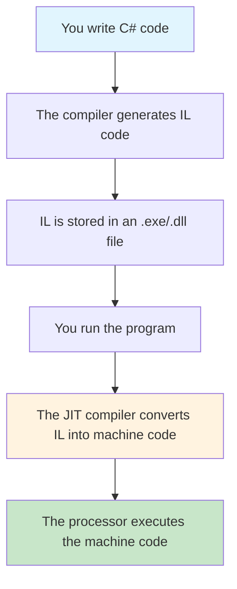

## What is .NET IL and why does it exist

`Intermediate Language (IL)`, also known as `Common Intermediate Language (CIL)`, is a low-level bytecode language that serves as a universal bridge between your high-level code and the processor's machine instructions. Imagine an international conference where people speak different languages ​​but everyone uses one universal translation. `IL` fulfills just such a role in the .NET ecosystem.
Instead of immediately compiling C# code into machine instructions for a specific processor, the compiler first converts it to `IL`. This solution has several important advantages. First, it provides code portability between different platforms and processor architectures. The same IL code can run on Windows x64, Linux ARM, or any other supported platform. Second, it allows code written in different .NET languages ​​to seamlessly interact with each other because they all compile to the same `IL`.

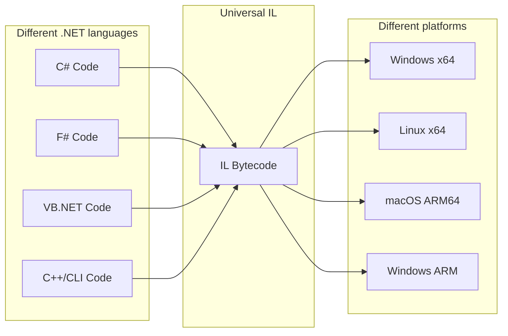

`IL` works as a stack machine: calculations are performed by loading operands onto the stack, performing operations on them, and saving the result back onto the stack. Arguments and local variables have their own separate slots in memory, but interact with calculations across the stack. This approach simplifies code generation and provides flexibility in execution.

## Detailed analysis of the IL code structure

To better understand how IL works, consider a simple example of a method in C# and its IL equivalent:

```cs
public class Calculator
{
    public int Add(int a, int b)
    {
        return a + b;
    }
}
```


```assembly
.class public auto ansi beforefieldinit Calculator
    extends [System.Runtime]System.Object
{
    // Methods
    .method public hidebysig 
        instance int32 Add (
            int32 a,
            int32 b
        ) cil managed 
    {
        // Method begins at RVA 0x2050
        // Code size 9 (0x9)
        .maxstack 2
        .locals init (
            [0] int32
        )

        IL_0000: ldarg.1 // Load the argument 'a' onto the stack
        IL_0001: ldarg.2 // Load the argument 'b' onto the stack
        IL_0002: add     // Add the top two values ​​from the stack
        IL_0003: ret     // Return the result and end the method
    } // end of method Calculator::Add
}
```

Let's analyze this code in detail.
The `.method` directive defines the beginning of a method with all its characteristics: `public` means that the method is accessible from the outside, `hidebysig` indicates that the method is hidden behind a signature, instance means that it is not a static method, `int32` indicates the return type, and `cil managed` indicates that it is managed code. `Common Intermediate Language`.
The `.maxstack 2` directive specifies the maximum number of elements that can be on the stack at the time this method is executed.

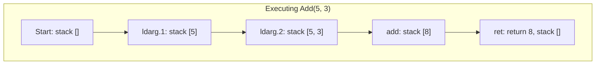

The instruction `ldarg.1` loads the first argument of the method onto the stack. In .NET, argument numbering starts at 0, but for non-static methods, argument 0 is reserved for reference `this`, so the first real argument has index 1. Similarly, `ldarg.2` loads the second argument. The `add` instruction takes the top two values ​​from the stack, adds them, and puts the result back on the stack. Finally, `ret` returns the top value from the stack as the result of the method and terminates its execution.

Consider a more complex example with local variables:

```cs
public int Multiply(int x, int y)
{
    int result = x * y;
    return result;
}
```

IL code for this method:

```assembly
    .method public hidebysig 
        instance int32 Multiply (
            int32 x,
            int32 y
        ) cil managed 
    {
        // Method begins at RVA 0x2050
        // Code size 11 (0xb)
        .maxstack 2
        .locals init (
            [0] int32 result,
            [1] int32
        )

        IL_0000: nop
        IL_0001: ldarg.1      // Push x onto the stack
        IL_0002: ldarg.2      // Push y onto the stack
        IL_0003: mul          // Multiply two values ​​(x * y)
        IL_0004: stloc.0      // Save the result in result
        IL_0005: ldloc.0      // Download result
        IL_0006: stloc.1      // Save it to a second local variable
        IL_0007: br.s IL_0009 // Unconditional transition to IL_0009

        IL_0009: ldloc.1      // Load variable [1]
        IL_000a: ret          // Return it as the result of the method
    } // end of method Calculator::Multiply
```

Here we see a new directive `.locals init ([0] int32 result, [1] int32)` that defines local method variables. The variable `result` has index 0 and type int32. The instruction `stloc.0` stores the top value from the stack into a local variable at index 0, and `ldloc.1` loads the value of that variable back onto the stack.

## Conditional logic and flow control in IL

When your code contains conditional constructs such as `if-else`, the compiler generates IL code with labels and jump instructions. 

Consider an example:

```cs
public string CheckAge(int age)
{
    if (age >= 18)
        return "Adult";
    else
        return "Minor";
}
```

This code compiles to the following IL:

```assembly
.method public hidebysig 
        instance string CheckAge (
            int32 age
        ) cil managed 
    {
        .custom instance void [System.Runtime]System.Runtime.CompilerServices.NullableContextAttribute::.ctor(uint8) = (
            01 00 01 00 00
        )
        // Method begins at RVA 0x2050
        // Code size 31 (0x1f)
        .maxstack 2
        .locals init (
            [0] bool,
            [1] string
        )

        IL_0000: nop
        IL_0001: ldarg.1
        IL_0002: ldc.i4.s 18
        IL_0004: clt
        IL_0006: ldc.i4.0
        IL_0007: ceq
        IL_0009: stloc.0
        // sequence point: hidden
        IL_000a: ldloc.0
        IL_000b: brfalse.s IL_0015

        IL_000d: ldstr "Adult"
        IL_0012: stloc.1
        IL_0013: br.s IL_001d

        IL_0015: ldstr "Minor"
        IL_001a: stloc.1
        IL_001b: br.s IL_001d

        IL_001d: ldloc.1
        IL_001e: ret
    } // end of method Calculator::CheckAge
```

Instruction `ldc.i4.s 18` loads a constant `18` on the stack The prefix `ldc` means `load constant`, `i4` indicates a 32-bit integer, and `s` means that the constant is written in short form. The `bge.s` (branch if greater or equal, short form) instruction compares the top two values ​​​​from the stack and moves to the specified label if the first value is greater than or equal to the second.
The instruction `br.s` performs an unconditional jump to the specified label. This is necessary so that after completing the block for minors, the block for adults can be avoided.

## Loops in IL code

Loops in IL are implemented using labels and jump instructions.

Consider a `for` loop:

```cs
public int Sum(int n)
{
    int sum = 0;
    for (int i = 1; i <= n; i++)
    {
        sum += i;
    }
    return sum;
}
```

The IL code for this method looks something like this:

```assembly
.method public hidebysig 
        instance int32 Sum (
            int32 n
        ) cil managed 
    {
        // Method begins at RVA 0x2050
        // Code size 34 (0x22)
        .maxstack 2
        .locals init (
            [0] int32 sum,
            [1] int32 i,
            [2] bool,
            [3] int32
        )

        IL_0000: nop
         // Initialization sum = 0
        IL_0001: ldc.i4.0   // Download 0
        IL_0002: stloc.0    // sum = 0

         // Initialization i = 1
        IL_0003: ldc.i4.1   // Download 1
        IL_0004: stloc.1    // i = 1

        // sequence point: hidden
        // Go to condition check
        IL_0005: br.s IL_0011   // Go to condition check
        // loop start (head: IL_0011)
            IL_0007: nop
            IL_0008: ldloc.0    // Download sum
            IL_0009: ldloc.1    // Download i
            IL_000a: add        // sum + i
            IL_000b: stloc.0    // sum = sum + i
            
            // Increment i++
            IL_000c: nop        
            IL_000d: ldloc.1    // Download i
            IL_000e: ldc.i4.1   // Download 1
            IL_000f: add        // i + 1
            IL_0010: stloc.1    // i = i + 1

            // Checking the condition i <= n
            IL_0011: ldloc.1    // Download i
            IL_0012: ldarg.1    // Download n
            IL_0013: cgt
            IL_0015: ldc.i4.0
            IL_0016: ceq
            IL_0018: stloc.2
            // sequence point: hidden
            IL_0019: ldloc.2
            IL_001a: brtrue.s IL_0007   // If i <= n, return to loop body
        // end loop

        IL_001c: ldloc.0
        IL_001d: stloc.3
        IL_001e: br.s IL_0020

        IL_0020: ldloc.3
        IL_0021: ret
    } // end of method Calculator::Sum
```

This example demonstrates how the compiler optimizes loops by moving the condition check to the end of the loop, which reduces the number of jumps and improves performance.

## CLR: The heart of the .NET ecosystem

Before dealing with the `JIT` compiler, it is important to understand that `Common Language Runtime (CLR)` is the fundamental platform on which all .NET applications run. `CLR` can be compared to an operating system for managed code that provides all the necessary services to run .NET applications.
`CLR` is responsible for loading and executing assemblies (`assemblies`), memory management via `garbage collector`, type safety, exception handling, and most importantly for our topic - `JIT`-compiling `IL` code into machine code. When you start a .NET application, the CLR is actually started, which then loads your code and starts executing it.

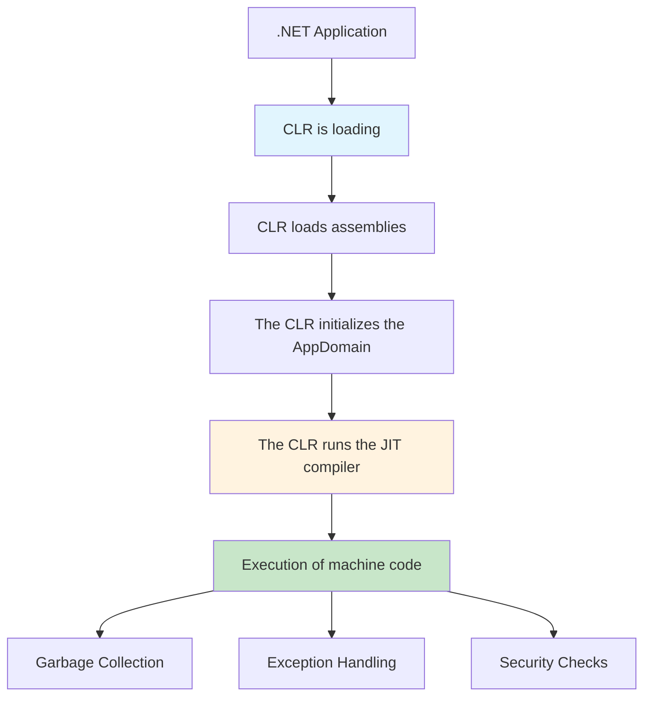

The CLR provides a single runtime environment for all .NET languages, allowing code written in C# to interoperate with code in F# or VB.NET without any additional effort. This is achieved by `Common Type System (CTS)`, which defines how types are declared, used, and managed at runtime, and `Common Language Specification (CLS)`, which defines a subset of features available to all .NET languages.

## JIT Compiler: From IL to Machine Code

The `JIT` compiler (`Just-In-Time`) is a key component of the CLR and is responsible for converting IL code into machine code that can be executed by the processor. Unlike traditional compilers that convert all code before execution, `JIT` works at runtime, compiling methods only when they are first called.

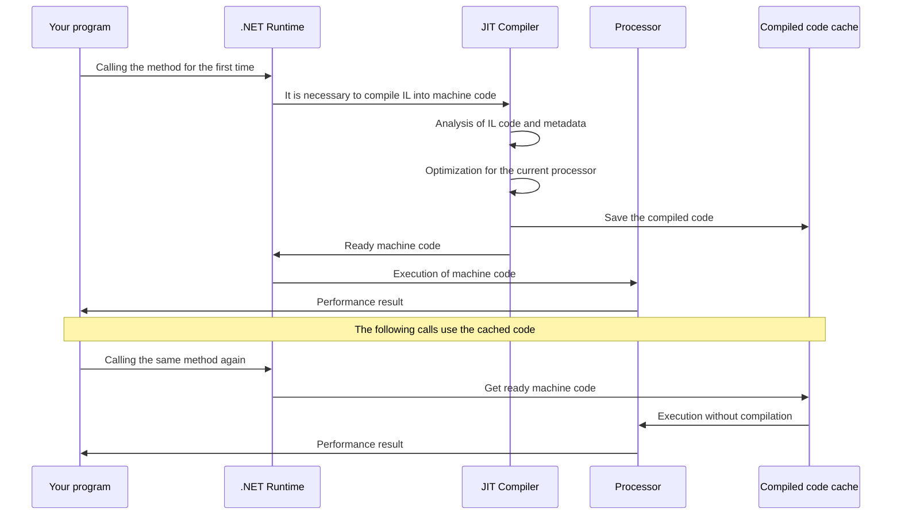

The JIT compilation process starts when the .NET runtime first tries to call a method. First, `JIT` parses the `IL` method code along with its metadata to understand what operations to perform. It then analyzes the characteristics of the current processor, including available instructions, number of registers, cache size, and other architectural features. Based on this information, `JIT` generates optimized machine code that makes the most efficient use of the resources of a particular processor.

One of the most important features of `JIT` is that it can perform optimizations not available to traditional compilers. For example, it can inline small methods directly into the code that calls them, eliminating the overhead of calling the method. It can also optimize loops, rearrange instructions to make better use of the CPU pipeline, and even remove code that never executes.

`JIT` uses several optimization strategies. Optimizing constants allows values ​​to be calculated at compile time if they are known in advance. Dead code optimization removes instructions whose output is not used anywhere. `Common Subexpression Elimination` avoids re-evaluating identical expressions. `Loop unrolling` deploys small loops to reduce the overhead of checking conditions.

## Tiered compilation (Tiered JIT)

Modern versions of .NET use an approach called `Tiered JIT` or layered compilation. This technology allows you to balance between the speed of the application launch and its maximum performance during execution.

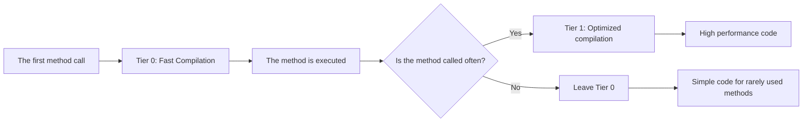

When the method is called for the first time, `JIT` compiles it with minimal optimizations (`Tier 0`). This allows you to quickly start execution without spending time on complex optimizations. If a method is called frequently, `JIT` notices this and recompiles the method with a full set of optimizations (`Tier 1`). This approach allows applications to run quickly, but at the same time achieve maximum performance for mission-critical parts of the code.

## Tools for analyzing IL code

There are several powerful tools for studying and analyzing IL code. 

- ILSpy is one of the most popular free tools for decompiling .NET assemblies. It allows you to view IL code next to decompiled C# code, making it ideal for learning and understanding how the compiler transforms your code.

- ILDasm (IL Disassembler) is an official tool from Microsoft that is part of the .NET SDK. It can disassemble .NET assemblies and create text files with IL code that can then be edited and reassembled using ILAsm.

- dotPeek by JetBrains is a powerful alternative that offers advanced navigation and code analysis capabilities. It can build Visual Studio projects from decompiled code and has integration with other JetBrains tools.

For quick experiments, `SharpLab.io` is an online tool that allows you to see IL code in real time while writing C# code. This is very useful for understanding how various C# constructs translate to IL.

## Practical scenarios for using IL knowledge

Understanding IL becomes especially useful when optimizing application performance. For example, if you notice that a certain part of your code is running slowly, an IL analysis can show whether the compiler is generating efficient instructions, whether there are redundant `boxing/unboxing` operations, or whether compiler optimizations are working correctly.

When developing high-performance applications, knowledge of IL helps avoid designs that generate inefficient code. For example, using `foreach` for arrays generates different IL code compared to the traditional `for` loop, and understanding this difference can help you make the right choice.

Debugging complex problems sometimes requires analyzing the IL code, especially when the problem is related to unexpected compiler or runtime behavior. For example, problems with `closure` in lambda expressions often become clear only after analyzing the generated IL code.

When developing custom compilers, code generators, or static analysis tools, a deep understanding of IL is essential. Many tools, such as Entity Framework, generate IL code dynamically, and understanding this process helps you use these tools effectively.

## Optimizations and pitfalls

The JIT compiler performs many optimizations, but some of them may not be obvious. `Method inlining` automatically nests small methods at their call points, eliminating method call overhead. However, this can increase the size of the code, so the JIT uses heuristics to decide on inlining.

`Dead code elimination` removes code that is never executed, but this process can be difficult in the presence of `reflection` or dynamic code loading. `Constant folding` allows constant expressions to be evaluated at compile time, but may be limited in the presence of side effects. It is important to understand that JIT optimizations may differ between Debug and Release modes. In Debug mode, many optimizations are disabled to facilitate debugging, so performance analysis should always be done with Release builds.

## AOT: An alternative to JIT compilation

`Ahead-of-Time (AOT)` compilation represents a fundamentally different approach to executing .NET code. Instead of compiling `IL` to machine code at runtime, `AOT` compiles all the code in advance, when the application is built. This creates self-contained executables that do not require the .NET runtime to be installed on the target machine.

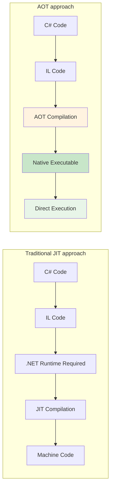

AOT compilation has several significant advantages. The most important of them is the speed of launching applications, since there is no need to spend time on JIT compilation at runtime. This is especially important for server-side applications, microservices, and container environments where fast startup is critical. In addition, AOT allows you to create smaller applications because it includes only the code that is actually used.

However, AOT has its limitations. The main one is the loss of flexibility of dynamic code. Reflection, dynamic code generation, and some other features may work to a limited extent or not at all in an AOT environment. Also, AOT cannot perform the execution profile-based optimizations that are available to the JIT compiler.

## Native AOT in .NET

Starting with .NET 8, Microsoft introduced Native AOT, which allows .NET applications to be compiled to native code without the need for a .NET runtime. This is achieved through a complex static analysis process that determines what code is actually being used and generates a minimal native executable.

An example of a project with Native AOT:

```xml
<Project Sdk="Microsoft.NET.Sdk">
  <PropertyGroup>
    <OutputType>Exe</OutputType>
    <TargetFramework>net8.0</TargetFramework>
    <PublishAot>true</PublishAot>
    <InvariantGlobalization>true</InvariantGlobalization>
  </PropertyGroup>
</Project>
```

The Native AOT process involves several steps. First, the compiler analyzes all the application code and its dependencies to determine which types and methods are actually used. This process is called `tree shaking` and allows you to significantly reduce the size of the final `executable`. The IL code is then compiled into native code using special AOT compilers such as `CoreRT` or `RyuJIT` in AOT mode.

## ReadyToRun: A hybrid approach

`ReadyToRun (R2R)` represents a compromise between JIT and full AOT. `R2R` assemblies contain both IL code and precompiled native code for the most common scenarios. This allows applications to run faster because much of the code is already compiled, but retains the flexibility of JIT for code that has not been precompiled.

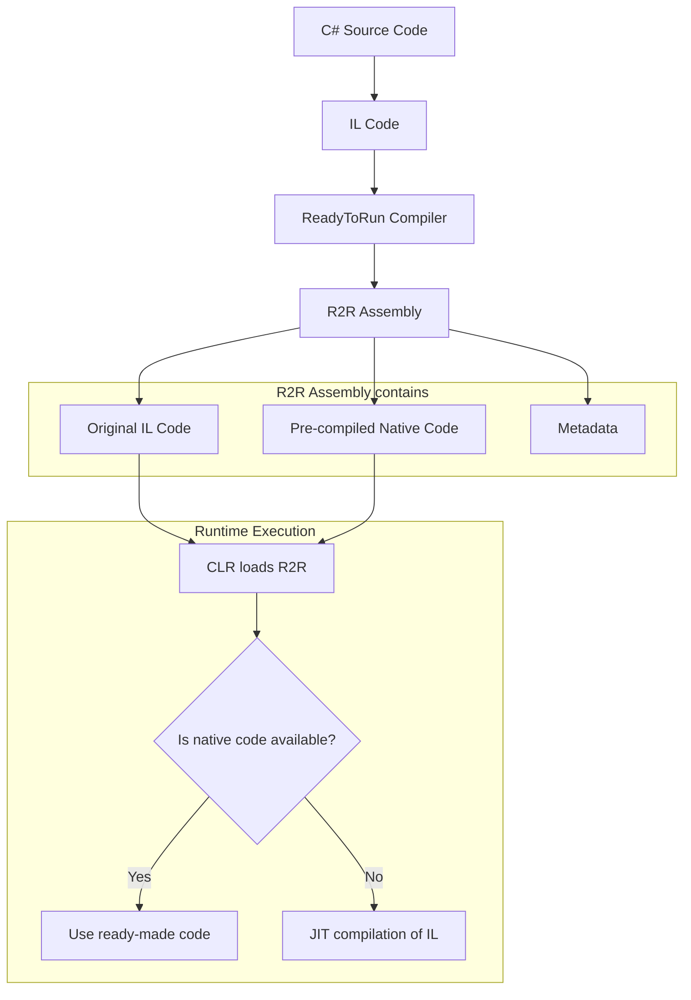

R2R is particularly effective for large applications and frameworks such as ASP.NET Core, where the most frequently used code paths can be precompiled, leaving infrequently used parts for JIT compilation.

## Profile-Guided Optimization (PGO)

`Profile-Guided Optimization` is an advanced technology that uses information about real-world code usage to improve optimizations. PGO works in two steps: first, the application is executed with instrumentation that collects statistics about which parts of the code are executed most often, and then this information is used to generate optimized code.

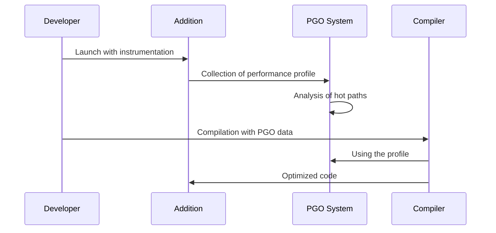

`PGO` can significantly improve performance, especially for complex applications with many execution branches. For example, if a certain condition in an if block is almost always true, PGO can optimize the code so that this path is executed the fastest.

## The future of compilation technologies in .NET

.NET development continues to evolve toward greater flexibility and performance. `Crossgen2` is a new generation of AOT compilation tools that provides better performance and lower memory usage compared to previous solutions.

`Dynamic PGO` allows the JIT compiler to adapt to changes in the execution profile while the application is running. This means that the code can automatically optimize itself if the application's behavior changes over time.

`Blazor WebAssembly AOT` allows you to compile .NET code directly into WebAssembly, providing near-native performance of web applications.

Future versions of .NET are also working to improve support for reflection and dynamic code in AOT environments through the use of source generators and compile-time reflection, which will allow more existing code to run in AOT mode without modification.

## Comparison of approaches: JIT vs AOT

The choice between JIT and AOT compilation depends on the specific needs of your application. JIT provides maximum flexibility and the possibility of dynamic optimizations, but requires time to compile at runtime. AOT provides fast startup and does not require a runtime, but may have limitations in functionality.

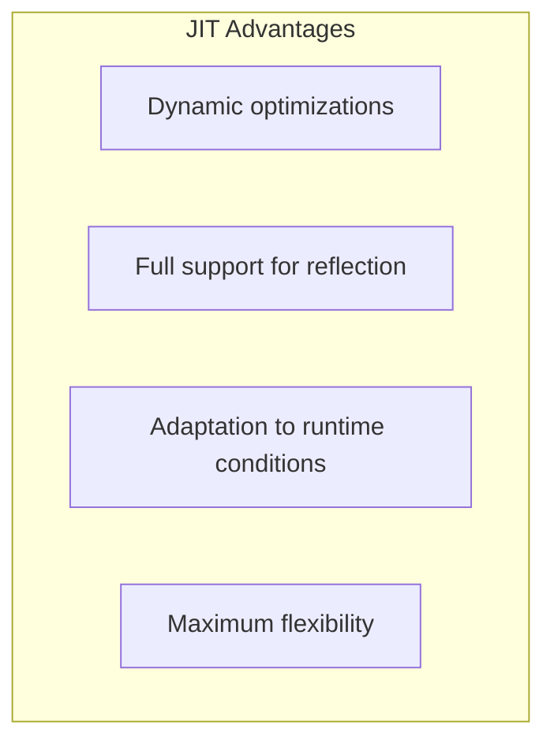


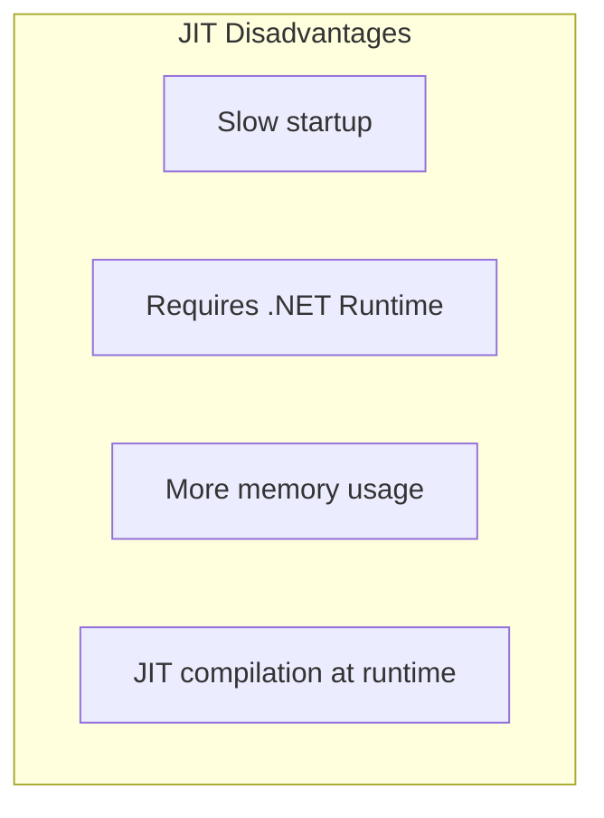


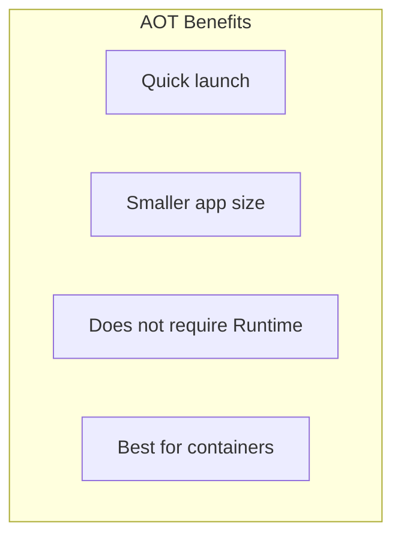


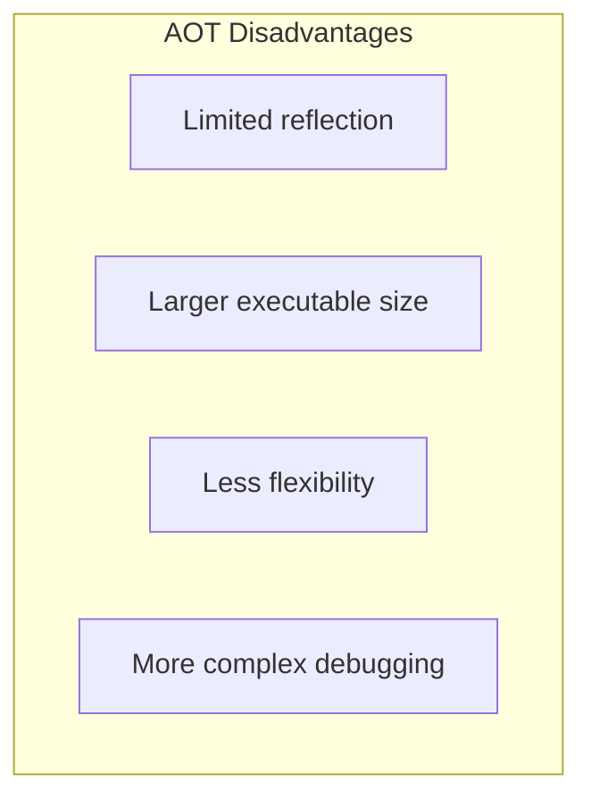

For high-load web applications, JIT is often the better choice because startup time is amortized over long runtimes, and dynamic optimizations can significantly improve performance. For microservices and containerized applications, AOT may be a better choice due to its fast startup and lower resource requirements.

## Practical recommendations

Consider the following factors when choosing between different compilation approaches. If your application uses a lot of reflection, dynamic code generation, or depends on third-party libraries that heavily use these features, JIT is a better choice. If fast startup, minimal memory usage, or you're deploying in a containerized environment are critical, consider AOT.

For many enterprise applications, a hybrid approach with `ReadyToRun` may be optimal, as it combines fast startup with full functionality. You can also use AOT for critical microservices and JIT for core applications that need maximum flexibility.

Performance testing with different compilation approaches is key to making the right decision. Profile your application in real-world conditions and measure not only execution speed, but also startup time, memory usage, and deployment size.