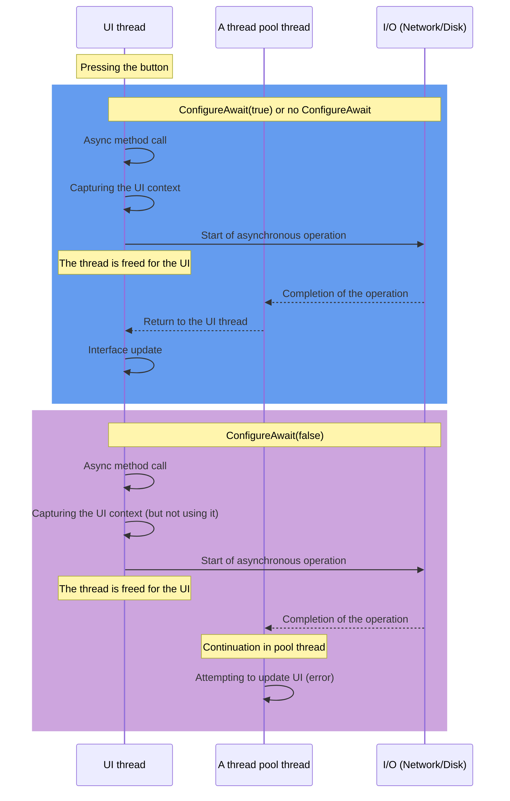
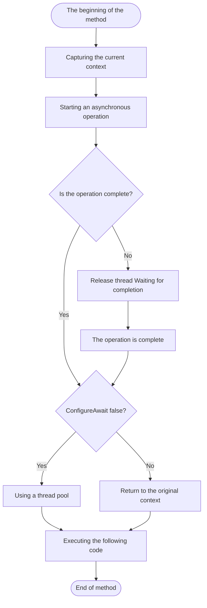

The `async/await` mechanism made asynchronous operations in .NET much simpler, but it came with nuances you need to know if you want to write efficient code. One of them is the `ConfigureAwait` method, which controls where an asynchronous method continues after `await`.

## Synchronization context and await behavior

### What is a synchronization context?

The synchronization context (`SynchronizationContext`) is an abstraction that controls where code will execute after returning from an asynchronous operation. This is a kind of "router" that determines on which thread to continue the execution of the code.
Different types of applications use different implementations of the synchronization context:

- `Windows Forms`, `WPF`, `MAUI` have a UI thread synchronization context that ensures that code after `await` is executed on the UI thread, allowing UI elements to be updated safely
- Classic `ASP.NET` has its own synchronization context associated with the request that stores the `HttpContext` context
- `ASP.NET Core`, console applications and services usually do not have a dedicated synchronization context and use threads from the thread pool

When you use `await` in an asynchronous method, by default .NET:

- Captures the current sync context
- Runs the awaited asynchronous operation
- Resumes the code after await on the captured context

That's convenient, because you can work with `UI` components after an asynchronous operation without thinking about it. But the convenience costs performance.

### Problems with the synchronization context

Returning to a captured context can create several problems:

- Additional overhead - switching between contexts requires system resources
- Potential deadlocks - deadlocks can occur in some scenarios (especially with blocking code)
- Unnecessary overhead - in many cases the code does not need the original context to continue working

That's what the `ConfigureAwait` method is for.

## ConfigureAwait(bool continueOnCapturedContext)

The `ConfigureAwait` method allows you to override the default behavior of `await` to return to the captured context.
It has one boolean parameter that specifies whether to return to the original context after `await`:

```cs
// Grabs the context and returns to it after await (default behavior)
await someTask.ConfigureAwait(true);
// or simply
await someTask;

// Does NOT return to captured context, continues on any available thread
await someTask.ConfigureAwait(false);
```

### How ConfigureAwait(false) works

When you use ConfigureAwait(false):

- The context is still captured when calling `await`
- An asynchronous operation is performed in the same way as always
- After the operation completes, instead of returning to the captured context, continuation is performed on any available thread from the thread pool
- This allows you to avoid the costs of context switching and potential deadlocks



### Execution flow with ConfigureAwait



## When to use ConfigureAwait(false)

ConfigureAwait(false) makes sense in these scenarios.

### In the library code

You don't know in advance where your library will end up: in `WPF, ASP.NET`, a console app, or a mobile app. With `ConfigureAwait(false)`, it doesn't impose unnecessary restrictions on the application that uses it.
So for a general-purpose library, the best approach is to put `ConfigureAwait(false)` on every await in your code, consistently and without exceptions.

### For operations that do not interact with the context

Reading from a file, processing data and HTTP requests don't need the original context; they can continue on any thread. Here `ConfigureAwait(false)` saves you context switches and doesn't break anything.

```cs
public async Task<ProcessedData> ProcessDataAsync(string filePath)
{
    // Reading a file does not require a special context
    string content = await File.ReadAllTextAsync(filePath).ConfigureAwait(false);
    
    // Data analysis can also be performed in any thread
    var parsedData = await JsonSerializer.DeserializeAsync<RawData>(
        new MemoryStream(Encoding.UTF8.GetBytes(content))).ConfigureAwait(false);
    
    // Data processing is context-independent
    return await TransformDataAsync(parsedData).ConfigureAwait(false);
}
```

### To increase productivity

Even without any deadlock risk, `ConfigureAwait(false)` pays off when many asynchronous operations run at the same time.
A single context switch is cheap, but in a web application handling thousands of requests those costs add up and eat noticeably into throughput.

### To prevent deadlocks in specific scenarios

In some architectural patterns, deadlocks may occur when mixing synchronous and asynchronous operations. `ConfigureAwait(false)` can help avoid such deadlocks, although it is not a recommended approach to solve the problem.

A typical deadlock scenario occurs when:

- A synchronous method blocks a thread while waiting for the result of an asynchronous method
- An asynchronous method tries to return to a captured context that is already locked

`ConfigureAwait(false)` breaks this connection, allowing the asynchronous method to continue execution on any thread rather than waiting for the locked context to be released.

## When NOT to use ConfigureAwait(false)

In some cases `ConfigureAwait(false)` hurts, because you need the captured context:

- In user interface code

If you develop code for Windows Forms, WPF, UWP, MAUI, or other UI frameworks, you probably need to update UI elements after asynchronous operations. In such cases, do not use `ConfigureAwait(false)` for operations followed by UI interaction.

```cs
private async void Button_Click(object sender, RoutedEventArgs e)
{
    // We do NOT use ConfigureAwait(false), since we are still working with the UI
    var result = await LoadDataAsync();
    
    // These operations must be performed in the UI thread
    ResultTextBlock.Text = result;
    ProgressBar.Visibility = Visibility.Collapsed;
    
    // Here you can use ConfigureAwait(false), since we are not working with the UI anymore
    await LogOperationAsync().ConfigureAwait(false);
}
```

- In ASP.NET (classic)

In ASP.NET Web Forms and other legacy ASP.NET technologies, the synchronization context holds the current request's data.
If you use `ConfigureAwait(false)`, you may lose access to `HttpContext.Current` and other properties associated with the request.

```cs
protected async void Page_Load(object sender, EventArgs e)
{
    // Without ConfigureAwait(false) to save the HttpContext
    var userData = await GetUserDataAsync();
    
    // We use HttpContext after await
    if (HttpContext.Current.User.Identity.IsAuthenticated)
    {
        // We show user data
    }
}
```

- In tests that check the context

If you are writing tests that verify that the synchronization context is correct, don't use `ConfigureAwait(false)` in the tests themselves, or they won't check that the context is captured and restored as expected.

## New features of ConfigureAwait in .NET 8.0

In .NET 8.0, Microsoft extended the functionality of `ConfigureAwait` by adding a new enumeration, `ConfigureAwaitOptions`:

```cs
public enum ConfigureAwaitOptions
{
  /// <summary>No options specified.</summary>
  None = 0,
  /// <summary>Attempts to marshal the continuation back to the original <see cref="T:System.Threading.SynchronizationContext" /> or <see cref="T:System.Threading.Tasks.TaskScheduler" /> present on the originating thread at the time of the await.</summary>
  ContinueOnCapturedContext = 1,
  /// <summary>Avoids throwing an exception at the completion of awaiting a <see cref="T:System.Threading.Tasks.Task" /> that ends in the <see cref="F:System.Threading.Tasks.TaskStatus.Faulted" /> or <see cref="F:System.Threading.Tasks.TaskStatus.Canceled" /> state.</summary>
  SuppressThrowing = 2,
  /// <summary>Forces an await on an already completed <see cref="T:System.Threading.Tasks.Task" /> to behave as if the <see cref="T:System.Threading.Tasks.Task" /> wasn't yet completed, such that the current asynchronous method will be forced to yield its execution.</summary>
  ForceYielding = 4,
}
```

These `ConfigureAwait` options give you finer control over `await`. Here's what each one does.

### None and ContinueOnCapturedContext

These options correspond to the classic `ConfigureAwait(false)` and `ConfigureAwait(true)`:

```cs
// Equivalent calls
await task.ConfigureAwait(false);
await task.ConfigureAwait(ConfigureAwaitOptions.None);

// Equivalent calls
await task;
await task.ConfigureAwait(true);
await task.ConfigureAwait(ConfigureAwaitOptions.ContinueOnCapturedContext);
```

Note that the new `ConfigureAwait(ConfigureAwaitOptions)` doesn't capture the context by default unless you specify `ContinueOnCapturedContext`. A plain `await` without `ConfigureAwait` does the opposite.

### SuppressThrowing

This option suppresses the exceptions that normally occur when a `await` task terminates with an error:

```cs
// Waiting for a task without throwing an exception
await task.ConfigureAwait(ConfigureAwaitOptions.SuppressThrowing);

// Equivalent code without using SuppressThrowing
try 
{ 
    await task.ConfigureAwait(false); 
} 
catch 
{ 
    // Ignore the error
}
```

`SuppressThrowing` comes in handy when you need to wait for a task to finish no matter how it ends.
The typical case is cancellation: before starting a new operation, you wait for the old one to finish:

```cs
// Canceling the old task and waiting for it to complete, ignoring exceptions
_cts.Cancel();
await _task.ConfigureAwait(ConfigureAwaitOptions.SuppressThrowing);

// Start a new task
_cts = new CancellationTokenSource();
_task = PerformOperationAsync(_cts.Token);
```

> Limitation
{: .prompt-info }
`SuppressThrowing` only works with `Task`, not with `Task<T>`. For `Task<T>` with `SuppressThrowing` you get compile error `(CA2261)` and, at runtime, `ArgumentOutOfRangeException`. The reason is simple: if the task failed, there's no sensible value of type `T` to return.

```cs
public new ConfiguredTaskAwaitable<TResult> ConfigureAwait(ConfigureAwaitOptions options)
{
    if ((options & ~(ConfigureAwaitOptions.ContinueOnCapturedContext |
                      ConfigureAwaitOptions.ForceYielding)) != 0)
    {
        ThrowForInvalidOptions(options);
    }

    return new ConfiguredTaskAwaitable<TResult>(this, options);

    static void ThrowForInvalidOptions(ConfigureAwaitOptions options) =>
        throw ((options & ConfigureAwaitOptions.SuppressThrowing) == 0 ?
            new ArgumentOutOfRangeException(nameof(options)) :
            new ArgumentOutOfRangeException(nameof(options), SR.TaskT_ConfigureAwait_InvalidOptions));
}
```

### ForceYielding

This option forces await to always behave asynchronously, even if the task has already completed:

```cs
// Always switches to the pool thread, even if the task has already completed
await task.ConfigureAwait(ConfigureAwaitOptions.ForceYielding);
```

Normally, if the task has already completed at the point of `await`, the continuation is executed synchronously in the same thread.
`ForceYielding` makes `await` always act asynchronously. That's useful for:

- Unit testing of asynchronous code
- Avoiding too deep recursion
- Implementation of asynchronous coordination primitives
- Forcing a thread switch

`ForceYielding` is similar to `Task.Yield()`, but with some differences:

- `Task.Yield()` will continue on captured context
- `ForceYielding` does NOT use captured context by default

```cs
// Equivalent calls
await Task.Yield();
await Task.CompletedTask.ConfigureAwait(ConfigureAwaitOptions.ForceYielding | ConfigureAwaitOptions.ContinueOnCapturedContext);
```

You need it when the code after `await` must run in a separate message loop, whatever state the task is in.

## Common errors with ConfigureAwait

Here are the three most common `ConfigureAwait` mistakes:

---

- `ConfigureAwait` is NOT a reliable way to avoid deadlocks

```cs
  // Bug: ConfigureAwait is NOT a reliable way to avoid deadlocks
  public string GetData()
  {
      // It can still deadlock if internal
      // methods do not use ConfigureAwait(false)
      return GetDataAsync().ConfigureAwait(false).GetAwaiter().GetResult();
  }
  ```

`ConfigureAwait(false)` helps avoid deadlocks only if ALL code, including code in internal libraries, also uses `ConfigureAwait(false)`.
  Since this cannot be guaranteed, this approach is not a reliable solution to deadlocks.

- ConfigureAwait configures `await`, NOT the task

```cs
  // Error: ConfigureAwait has no effect without await
  public string GetData()
  {
      // ConfigureAwait has no effect here because await is missing!
      return SomethingAsync().ConfigureAwait(false).GetAwaiter().GetResult();
  }

  // Also bug: ConfigureAwait only affects the await it belongs to
  var task = SomethingAsync();
  task.ConfigureAwait(false); // It has no effect!
  await task; // Still continues on the captured context
  ```

`ConfigureAwait` configures the behavior of the `await` statement, not the task itself.
  Calling `ConfigureAwait` without following `await` has no effect.

- ConfigureAwait(false) does not guarantee a thread change

```cs
  // Bug: Thinking that ConfigureAwait(false) always switches the thread
  async Task DoWorkAsync()
  {
      // If the task has already completed, the code will continue execution
      // on the same thread despite ConfigureAwait(false)
      await Task.FromResult(42).ConfigureAwait(false);
      
      // The code here is NOT necessarily executed on another thread!
  }
  ```

`ConfigureAwait(false)` does not guarantee execution on another thread.
  If the task has already completed at time `await`, the code will continue to execute on the same thread, even with `ConfigureAwait(false)`.

---

## Evolution of ConfigureAwait recommendations

Recommendations for using ConfigureAwait(false) have changed over time:

- Initial recommendations
  Early in the implementation of `async/await`, the community recommended using `ConfigureAwait(false)` wherever a captured context was not required. This was due to the frequent deadlocks experienced by early adopters of asynchronous programming and the significant impact `ConfigureAwait(false)` had on application performance.

- Transitional period (2015-2019)
  Over time, the recommendations have become more nuanced:

  - Use `ConfigureAwait(false)` in library code
  - Do not use `ConfigureAwait(false)` in application code

  This simplified the rules and made them more understandable for developers.

- Modern recommendations (with the release of ASP.NET Core)
  ASP.NET Core does not have `SynchronizationContext`, so `ConfigureAwait(false)` has less impact in it. Some libraries have even abandoned the consistent use of `ConfigureAwait(false)` due to:
  - Excessive code noise
  - Less need in environments without SynchronizationContext
  - Higher maintenance complexity

With the release of .NET 8.0 and the new `ConfigureAwait` options, developers have gained more flexible tools for fine-tuning asynchronous behavior.

- General modern consensus
  - Use `ConfigureAwait(false)` in library projects
  - Consider using it in large applications to improve performance
  - In .NET 8.0+ use new options `ConfigureAwait` for specific scenarios
  - In UI applications, be careful with `ConfigureAwait(false)` to avoid losing UI context

## Usage examples

Library for working with data:

```cs
public class DataProcessor
{
    public async Task<ProcessedData> ProcessFileAsync(string filePath)
    {
        // Input/output operation - we use ConfigureAwait(false)
        var fileData = await File.ReadAllBytesAsync(filePath).ConfigureAwait(false);
        
        // Data processing needs no context
        var processedData = await ProcessBytesAsync(fileData).ConfigureAwait(false);
        
        // Saving data is also context-free
        await SaveToDbAsync(processedData).ConfigureAwait(false);
        
        return processedData;
    }
    
    private async Task<ProcessedData> ProcessBytesAsync(byte[] data)
    {
        // A CPU-intensive operation is run in a separate thread
        return await Task.Run(() => 
        {
            // Data processing
            return new ProcessedData();
        // ConfigureAwait(false) for consistency
        }).ConfigureAwait(false);
    }
    
    private async Task SaveToDbAsync(ProcessedData data)
    {
        using var connection = new SqlConnection(_connectionString);
        await connection.OpenAsync().ConfigureAwait(false);
        
        using var command = connection.CreateCommand();
        command.CommandText = "INSERT INTO...";
        // ... setting parameters
        
        await command.ExecuteNonQueryAsync().ConfigureAwait(false);
    }
}
```

UI application with background processing

```cs
public class MainViewModel : INotifyPropertyChanged
{
    private string _status;
    public string Status
    {
        get => _status;
        set
        {
            _status = value;
            PropertyChanged?.Invoke(this, new PropertyChangedEventArgs(nameof(Status)));
        }
    }
    
    public event PropertyChangedEventHandler PropertyChanged;
    
    public async Task LoadDataAsync()
    {
        Status = "Loading...";
        
        try
        {
            // Data loading - does not interact with the UI
            var data = await _dataService.GetDataAsync().ConfigureAwait(false);
            
            // Data processing - does not interact with the UI
            var processedData = await ProcessDataAsync(data).ConfigureAwait(false);
            
            // We return to the UI context to update the interface
            await _dispatcherService.RunOnUIThreadAsync(() =>
            {
                DataItems = new ObservableCollection<DataItem>(processedData);
                Status = "done";
            });
        }
        catch (Exception ex)
        {
            // We return to the UI context to display the error
            await _dispatcherService.RunOnUIThreadAsync(() =>
            {
                Status = $"Error: {ex.Message}";
            });
        }
    }
}
```

## Conclusion

If you're writing a library, put `ConfigureAwait(false)` on every `await`: the library won't depend on the app's context, and you avoid needless context switches. In UI code, be careful with `ConfigureAwait(false)`: after it you can't touch the interface. For more complex scenarios, .NET 8.0 has `ConfigureAwaitOptions`, and the new capabilities of `ConfigureAwait` are worth learning.

> `ConfigureAwait` configures `await`, not tasks. And `ConfigureAwait` on its own doesn't protect you from deadlocks: if even one inner method doesn't use it, you can still block.
{: .prompt-info }
