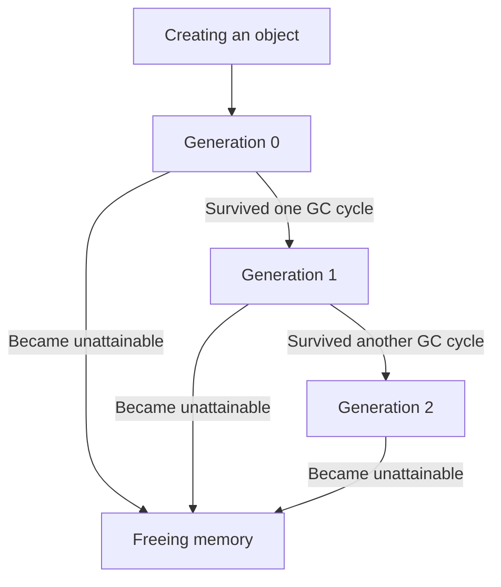
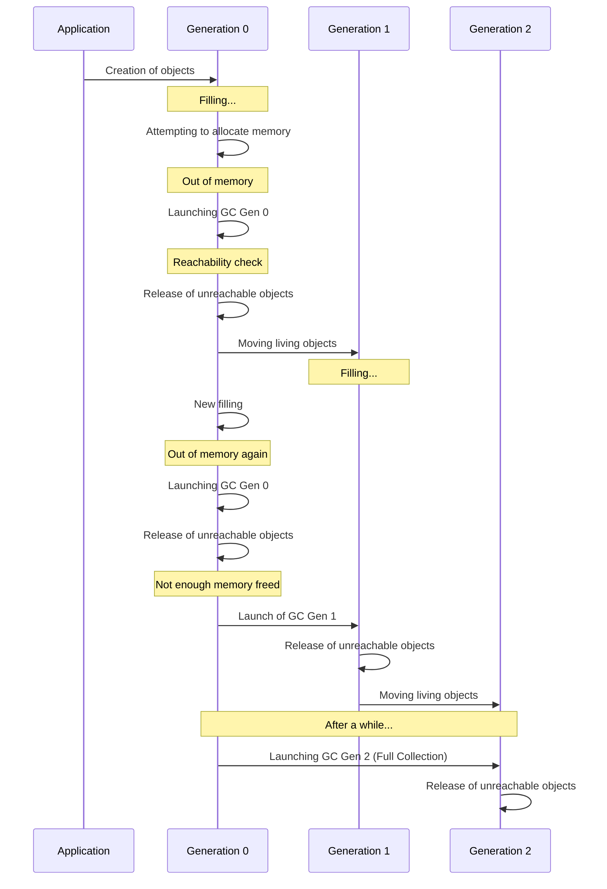
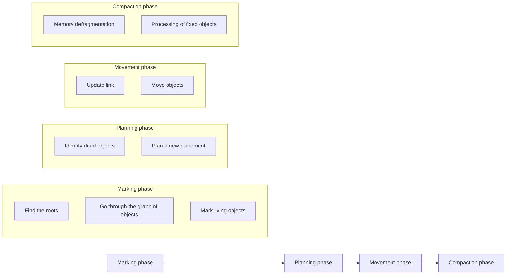
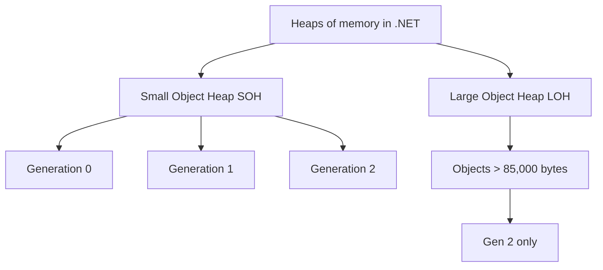
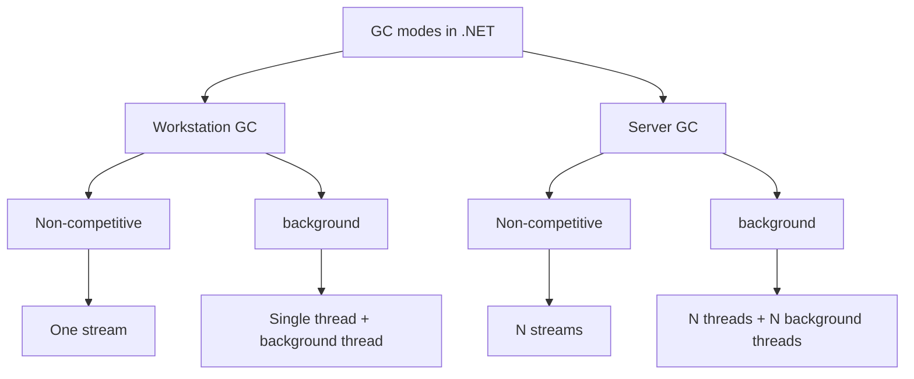
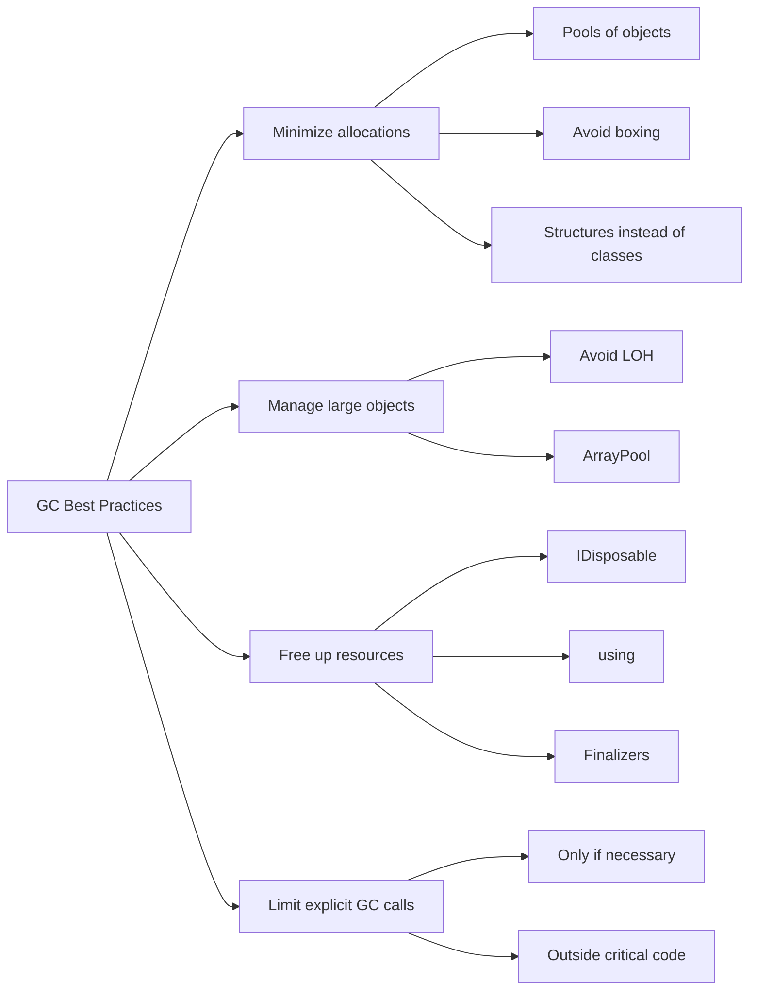

Garbage collection (`Garbage Collection, GC`) is an automatic memory management mechanism that frees developers from having to manually allocate and deallocate memory. It's what sets .NET apart from languages where memory is managed manually.

The memory heap (`Heap`) is an area of memory where objects created during program execution are stored. Unlike the stack, which stores values of value types (int, float, struct, etc.), the heap is used to store objects of reference types (classes).

## Heap basics in .NET

In .NET, the entire memory heap is managed, meaning `CLR (Common Language Runtime)` takes responsibility for managing it. When a new object is created, `CLR` allocates memory for it on the heap and returns a reference to that object.

```cs
class Program
{
    static void Main()
    {
        // Creating an object on the heap
        Person person = new Person("Taras", 32);
        
        // Use of the object
        Console.WriteLine(person.Name);
        
        // There is no need to manually release the memory!
        // GC will do this automatically when the object becomes unreachable
    }
}

class Person(string name, int age)
{
    public string Name { get; set; } = name;
    
    public int Age { get; set; } = age;
}
```

In this example, a person object is created on the heap and a reference to it is stored in a local variable. When the `Main` method completes, this reference will disappear and the object will become unavailable. At this point, `GC` will be able to release the memory occupied by this object.

## Object generation in .NET GC

.NET GC splits objects into generations. There are three:

- Generation 0 (`Gen 0`) - new objects that have just been created.
- Generation 1 (`Gen 1`) - objects that have survived one garbage collection cycle.
- Generation 2 (`Gen 2`) - objects that have survived two or more garbage collection cycles.

This distribution is based on the hypothesis that new objects are likely to be short lived and old objects are likely to be alive even longer.



## Garbage collection cycles

GC in .NET triggers garbage collection cycles under various conditions:

- Memory allocation - if the system tries to allocate memory in `Gen 0`, but it is full.
- Explicit call - when `GC.Collect()` is called in the code.
- Low system memory pressure - when the operating system reports a lack of memory.
- Application domain change - when `AppDomain` is unloaded.
- Termination of the program - when the program stops working.

There are three types of garbage collection depending on generation:

- `Gen 0` is the most frequent, checks only the newest objects.
- `Gen 1` - occurs when `Gen 0` has not freed enough memory.
- `Gen 2` is a full collection that checks all objects in the heap. The longest and rarest.



## Phases of GC: From Marking to Compaction

The garbage collection process consists of several phases:

- Marking Phase (`Mark Phase`) - The GC creates a graph of objects starting from the "roots" (`root references`) and marks all reachable objects as alive.
- Planning Phase (`Plan Phase`) - The GC determines which of the dead objects can be freed and how to compactly reorganize the living objects.
- Move phase (`Relocate Phase`) - living objects are moved to new locations for compactness.
- Compaction Phase (`Compact Phase`) - Memory is compacted to prevent fragmentation.



## Compaction and fragmentation of memory in the context of GC

### Memory fragmentation

Memory fragmentation is a phenomenon where free memory becomes "fragmented" into small areas scattered among busy objects. It's like a parking lot where there are lots of small spaces scattered between the cars, but no big space for the bus to park.

Think of memory as a linear array of cells:

`[A][A][A][B][B][_][C][_][D][_][_][E]`

Where:

`[A], [B], [C], [D], [E]` - occupied memory blocks (live objects)

`[_]` - free memory blocks

In this example, free memory is fragmented into several small pieces. There may be enough free memory in total for a new object, but no single chunk is large enough to hold a large one.

As a result, memory is used inefficiently, new large objects are hard to place, and the program slows down.

### Memory compaction (Compaction)

Compaction is a process where `GC` moves live objects so that they are located next to each other and all free memory is combined into one continuous block.

Before compaction:

`[A][A][A][_][B][_][C][_][D][_][_][E]`

After compaction:

`[A][A][A][B][C][D][E][_][_][_][_][_]`

Now all free blocks are merged into one, and a new object fits there, even a large one.

### How compaction works in .NET

Compaction in .NET takes several steps. First, `GC` determines which objects remain reachable in memory. It then creates a plan to move these living objects in such a way as to close the gaps ("holes") in the memory. Following that plan, `GC` copies live objects to new, sequential locations in memory. After the move, the garbage collector updates all references to these objects to point to the new memory addresses. Finally, the system frees the old memory where the objects were previously located, making it available for new allocations.

Compaction works differently in different parts of the managed heap.
In the `Small Object Heap` (SOH) it runs during every garbage collection cycle, so memory for small objects stays tightly packed.
The `Large Object Heap` (LOH) historically wasn't compacted, because moving large objects is expensive. That's why the `LOH` often suffers from fragmentation.

Prior to .NET 4.5.1, `LOH` compaction was not performed at all. Starting with .NET 4.5.1, you can enable `LOH` compaction using the `GCSettings.LargeObjectHeapCompactionMode = GCLargeObjectHeapCompactionMode.CompactOnce;` option.

In newer versions of .NET, the LOH compaction mechanism has become much more efficient, although it is still disabled by default.

### Example

```cs
class Program
{
    static void Main()
    {
        // We create and free objects of various sizes, which leads to fragmentation
        var references = new List<byte[]>();
        
        // Creation of 100 objects of 1MB each (causes fragmentation)
        for (int i = 0; i < 100; i++)
        {
            // 1MB
            references.Add(new byte[1024 * 1024]);
            
            // We remove objects one at a time, creating "holes"
            if (i % 2 == 0)
            {
              references.RemoveAt(references.Count - 1);
            }
        }
        
        // Attempting to create a large object (may fail due to fragmentation)
        try
        {
            // 50MB
            var largeObject = new byte[50 * 1024 * 1024];
            Console.WriteLine("A large object has been successfully created");
        }
        catch (OutOfMemoryException)
        {
            Console.WriteLine("Error: Not enough memory (probably due to fragmentation)");
            
            // We call a full GC with compaction
            GCSettings.LargeObjectHeapCompactionMode = GCLargeObjectHeapCompactionMode.CompactOnce;
            GC.Collect(2, GCCollectionMode.Forced, true, true);
            
            try
            {
                // 50MB
                var largeObject = new byte[50 * 1024 * 1024];
                Console.WriteLine("After compaction, a large object is successfully created");
            }
            catch
            {
                Console.WriteLine("Still not enough memory");
            }
        }
    }
}
```

### How to prevent fragmentation problems

- Use object pools - reuse objects instead of creating new ones (`ArrayPool<T>`, `ObjectPool<T>`)
- Minimize object pinning - objects pinned with `fixed` or `GCHandle.Alloc(obj, GCHandleType.Pinned)` leave "holes" during compaction
- Consider the size of objects - avoid creating objects that are close to the LOH limit (85KB)
- Structure data - organize data so that objects that are used together are created together
- Use structs - For small data types, use structs instead of classes to reduce heap load

## Memory segments and Large Object Heap (LOH)

Heap memory in .NET is divided into two main types:

- `Small Object Heap (SOH)` - for objects less than 85,000 bytes. This heap is divided into three generations (0, 1, 2).
- `Large Object Heap (LOH)` - for objects larger than 85,000 bytes. This heap works differently:

- Objects in LOH immediately go to Gen 2
- LOH is not compacted by default (this can be changed in .NET 4.5.1+)
- LOH is more likely to suffer from fragmentation



## GC modes: Workstation vs. Server

.NET supports two GC modes:

Workstation GC:

- Optimized for client applications
- Minimizes pauses for a better interactive experience
- Usually uses one thread for GC

Server GC:

- Optimized for servers
- Increases overall system performance
- Uses multiple threads (one per processor)
- Longer pauses, but higher overall throughput

There are also two GC variants:

- Non-concurrent GC - suspends all application threads while the GC is running.
- Background GC - tries to do part of the work in parallel with the program.



## GC best practices

The cheapest memory for the GC is memory you never allocated. For frequent allocations, use object pools (`ObjectPool<T>`), avoid boxing value types, and build strings in loops with `StringBuilder` instead of concatenation. For working with blocks of memory without copying, there's `Span<T>` and `Memory<T>`.

Be more careful with large objects: don't create temporary large arrays and collections, consider splitting a large object into smaller ones, and take temporary large arrays from `ArrayPool<T>`.

Unmanaged resources always have to be released, so implement IDisposable correctly and use the using pattern for those objects. In most cases you shouldn't call `GC.Collect()` at all; save it for special situations, such as right after large memory operations.

WeakReference works for a cache that the GC may clear when memory runs low. And avoid circular references: the GC can handle them, but they can delay freeing memory.



## Typical errors and their solutions

### Memory leak due to forgotten events

```cs
// Error: we subscribe to the event and do not unsubscribe
public void Initialize()
{
    EventSource.SomeEvent += HandleEvent;
}

// Solution: we unsubscribe correctly
public void Initialize()
{
    EventSource.SomeEvent += HandleEvent;
}

public void Dispose()
{
    EventSource.SomeEvent -= HandleEvent;
}
```

### Creation of temporary strings in loops

```cs
// Error: Too many temp strings
string result = "";
for (int i = 0; i < 1000; i++)
{
    result += i.ToString();
}

// Solution: StringBuilder
StringBuilder sb = new StringBuilder();
for (int i = 0; i < 1000; i++)
{
    sb.Append(i);
}
string result = sb.ToString();
```

### Improper management of unmanaged resources

```cs
// Error: Missing release of resources
public class ResourceHandler
{
    private IntPtr nativeResource;
    
    public ResourceHandler()
    {
        nativeResource = NativeMethods.Allocate();
    }
}

// Solution: Correct implementation of IDisposable
public class ResourceHandler : IDisposable
{
    private IntPtr nativeResource;
    private bool disposed = false;
    
    public ResourceHandler()
    {
        nativeResource = NativeMethods.Allocate();
    }
    
    public void Dispose()
    {
        Dispose(true);
        GC.SuppressFinalize(this);
    }
    
    protected virtual void Dispose(bool disposing)
    {
        if (!disposed)
        {
            if (nativeResource != IntPtr.Zero)
            {
                NativeMethods.Free(nativeResource);
                nativeResource = IntPtr.Zero;
            }
            disposed = true;
        }
    }
    
    ~ResourceHandler()
    {
        Dispose(false);
    }
}
```

## Conclusions

`GC` takes manual memory management off your hands, but not the responsibility for how that memory gets used. Once you understand generations, collection phases and compaction, it's much easier to design a system that doesn't suffer from fragmentation and keeps running well under heavy load.

In practice that mostly means avoiding unnecessary allocations, especially large objects on the LOH, and picking the `GC` mode that fits your scenario (`Workstation` or `Server`, non-concurrent or background).