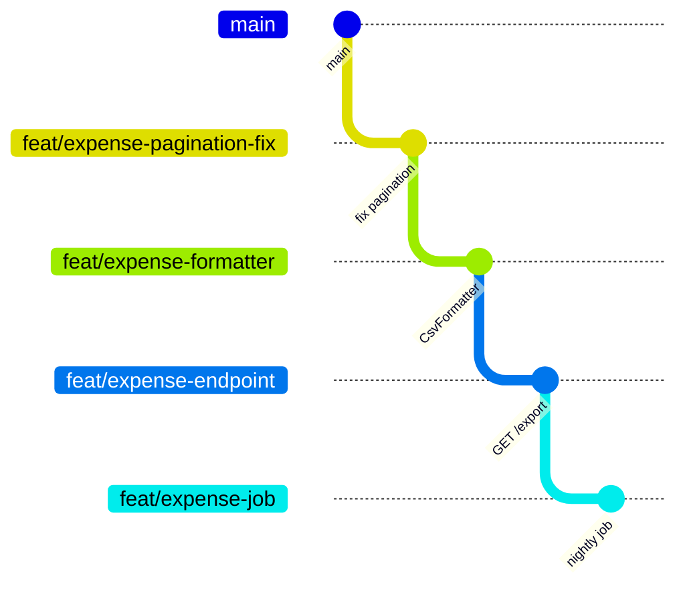

You know the situation. You spent two weeks building CSV export for expenses. It needed a new endpoint, so you extracted formatting into a separate service, adjusted a migration, wrote a background job, and fixed a pagination bug along the way, because without that fix the export returned duplicates.

The result is a pull request with 47 files and +2100/-680 lines. You open it on Friday. On Monday it has one comment: "LGTM". On Wednesday someone finally reads it properly, finds a problem in the migration, and you rewrite half of it. Two days later the PR merges, and nobody on the team has any idea what actually went in.

The problem isn't a lazy developer. The problem is that the work was one logical sequence, and the tool suggested packing it into a single atomic block.

Stacked PRs are an attempt to stop choosing between "a big PR nobody reads" and "waiting three days for review while doing nothing".

Until the summer of 2026 you assembled stacks by hand or with third-party tools. On July 30 GitHub [added stacks in public preview](https://github.blog/changelog/2026-07-30-stacked-pull-requests-are-now-in-public-preview/), and it now treats a stack as a first-class object. Half the advice in blog posts from the last five years went stale that day.

## What a stack is

A stacked PR is a chain of branches where each one is cut from the previous branch instead of `main`. Every branch gets its own pull request, and the base branch of that PR is the branch below it in the stack.



Four PRs instead of one:

| PR | Branch | Base | Size |
|----|--------|------|------|
| #101 | `feat/expense-pagination-fix` | `main` | +30/-12 |
| #102 | `feat/expense-formatter` | `feat/expense-pagination-fix` | +180/-4 |
| #103 | `feat/expense-endpoint` | `feat/expense-formatter` | +90/-0 |
| #104 | `feat/expense-job` | `feat/expense-endpoint` | +140/-6 |

Here's the mechanic that makes the whole thing work: GitHub computes the diff against the merge-base with the base branch. If the base of #103 is `feat/expense-formatter`, then Files changed shows exactly the 90 new lines of the endpoint. The formatter code stays out of it, even though it physically lives in the branch.

So the reviewer sees one change at a time, while you've already moved on to writing the next three.

## Why bother, when feature branches exist

Three concrete things a stack solves that a single long-lived branch doesn't.

**Review stops blocking you.** You open #101 and instead of waiting, you start #102 on top of it. Review latency is no longer idle time. That's the main reason stacks caught on in teams where review takes a day or more.

**PR size drops to something people actually read.** [SmartBear's study of 2,500 reviews at Cisco](https://smartbear.com/learn/code-review/best-practices-for-peer-code-review/) produced the number everyone has been quoting since: past roughly 400 lines in one sitting, your ability to spot defects drops off. It isn't a magic number, but the direction is right: 90 lines get read, 2100 get skimmed.

**History becomes legible.** `feat/expense-pagination-fix` merges on its own. Six months later, when you `git bisect` a pagination regression, you land on a 30-line commit instead of a mega-commit where pagination is tangled up with CSV and cron.

There's a subtler effect too. A stack forces you to think about ordering. The question "which of these can merge first without breaking main?" is really a question about the dependencies in your design. If the answer is "none of it, everything is welded together", that says something about the code, not about Git.

## The native path: gh stack

The GitHub CLI extension installs with one command:

```bash
gh extension install github/gh-stack
```

Here's the same export example, as a stack this time:

```bash
git switch main
git pull --ff-only

# create the stack; the trunk defaults to the repository's default branch
gh stack init

# first branch
# ... changes ...
gh stack add feat/expense-pagination-fix -A -m "fix: skip duplicates in expense pagination"

# second, on top of the first
# ... changes ...
gh stack add feat/expense-formatter -A -m "feat: add CsvExpenseFormatter"

# third
# ... changes ...
gh stack add feat/expense-endpoint -A -m "feat: GET /expenses/export"

# push everything and open linked PRs
gh stack submit --open
```

`gh stack add` creates a branch on top of the current tip of the stack, `-A` stages everything, `-m` commits in the same step. `gh stack submit` pushes the branches, creates or updates the PRs, and links them into a stack on GitHub's side. Without `--open` the new PRs come out as drafts, so pass the flag unless you meant to hide the work.

To see the current state:

```bash
gh stack view
```

Moving around the stack without manual `git switch`: `gh stack up`, `gh stack down`, `gh stack top`, `gh stack bottom`, `gh stack switch`, `gh stack checkout <pr-number>`.

To restructure the stack interactively (drop a branch, fold two neighbours together, insert one in the middle, reorder), there's `gh stack modify`.

Syncing after someone else lands changes in `main`:

```bash
gh stack sync --prune
```

One command does the fetch, the cascading rebase across the stack, the push, and the PR state update. `--prune` deletes the local branches of PRs that already merged.

The CLI is optional. You can build a stack from the web UI: open the first PR against `main`, then set the base of the next PR to the first PR's branch and tick the checkbox. GitHub also spots chains that look like a stack on its own and shows a banner offering to link them.

A **stack map** appears in the PR header: every PR in order, the current one highlighted, the rest clickable. That's why the hand-written stack listing in the PR description, which everyone used to recommend, is no longer needed.

## If the PRs already exist

A stack is ordinary branches and ordinary PRs, just with the right base chain. So a chain you assembled by hand with `gh pr create --base` can be registered as a stack after the fact:

```bash
gh stack link 101 102 103 104
```

Argument order is bottom to top, starting from the one closest to `main`. The command sets up no local tracking, it only links the PRs on GitHub's side.

## Changes to the bottom PR

A reviewer on #101 asks you to rename a method. You fix the bottom branch, and every branch above it now points at an old commit.

With the extension that's `gh stack rebase` (a cascading bottom-up rebase, with `--continue` and `--abort` for conflicts) or the **Rebase Stack** button in the merge box, which appears when GitHub notices the history is no longer linear. The button runs a server-side cascading rebase and force-pushes every branch.

Without the extension it's a chain of manual rebases, force-pushes and explaining to reviewers what changed between versions. That's the busywork `gh stack` takes off your hands.

## Merging

Stacks merge bottom-up. But the behaviour differs from what you're used to on regular PRs.

When you hit merge on a PR in a stack, **every unmerged PR below it lands too**. Merging #103 merges #101, #102 and #103 in one operation. PRs above stay open, and the stack rebases automatically so that the lowest unmerged PR targets the base branch.

A direct merge is atomic: either the whole group lands or nothing does. In a merge queue the logic differs. PRs enter the queue together and are evaluated individually; if one fails, it and everything above it gets ejected while the ones below carry on.

All three methods are supported: merge commit, squash and rebase merge. Squash behaves the way you'd want: each PR in the stack produces one clean squashed commit, and GitHub rebases the unmerged branches with `git rebase --onto` so the new SHAs don't cause artificial conflicts.

Now the part that used to be the biggest trap with stacks, and still catches people out.

**If your chain isn't registered as a stack**, none of that automation applies. GitHub will retarget the base of #102 to `main` after #101 merges and its branch is deleted, but the history of `feat/expense-formatter` still carries the original pagination commits, which don't exist in `main` after a squash. The diff of #102 shows the formatter *and* the pagination changes all over again, sometimes with conflicts on top. From there you untangle it by hand with `git rebase --onto`, after digging up the old branch's pre-merge SHA from somewhere.

The moral is simple: if you work in stacks, register them as stacks. The difference between running `gh stack link` and not running it is the difference between "GitHub sorts out the squash" and "you sort out the squash by hand, every time".

## Rules and CI

This is the biggest change compared to homemade stacks.

Every PR in a stack is evaluated as if it targets the base of the stack, not the branch directly beneath it. That covers required reviews, status checks, CODEOWNERS and code scanning. Branch protection on `main` can no longer be sidestepped by pointing your PR at somebody's feature branch.

Workflows trigger the same way, as if each PR targeted the stack base. Previously a green check on a middle PR meant "works together with the branch below it", which was a constant source of confusion. Now it means what a person expects it to mean.

To merge a PR, every PR below it also needs green checks and has to satisfy the merge requirements.

Stack metadata is available in workflows through `github.event.pull_request.stack`:

```yaml
- name: Run migrations check only on the lowest unmerged PR
  if: github.event.pull_request.stack.base.ref == github.event.pull_request.base.ref
  run: ./scripts/check-migrations.sh
```

The object carries `number` (the stack identifier), `size` (how many PRs in total), `position` (1-based), `base.ref` and `base.sha`. That's what CI savings are built on: expensive steps can run only on the lowest unmerged PR, or only on the top one (`position == size`).

One detail that quietly breaks automation: the `pull_request.opened` event has no stack data, because a PR is created before it joins a stack. There's a separate `stacked` action type on the `pull_request` event for that.

And the basic hygiene that has nothing to do with stacks. Every rebase pushes to every branch, so without cancelling stale runs a stack will eat your Actions budget:

```yaml
concurrency:
  group: ci-${{ github.workflow }}-${{ github.ref }}
  cancel-in-progress: true
```

## Limitations as of September 2026

The feature is in public preview, and some pieces haven't landed yet:

- **Auto-merge doesn't work for stacks.** Promised.
- **Bypassing merge rules doesn't work.** Also promised.
- **Merge queue is supported**, but it rolled out progressively after July 30. Check it on your own repository instead of taking anyone's word for it.
- **Maximum 100 PRs per stack.** If that's not enough, the problem isn't GitHub.
- **No cross-fork stacks.** All branches must live in the same repository, which rules this out for the typical open source contributor working from a fork.
- **GitHub Desktop doesn't support stacks.**
- **Linear history is required.** When it breaks, use the Rebase Stack button or `gh stack rebase`.
- **Merging through the API means the new asynchronous Merge API only.** The old REST and GraphQL mutations know nothing about stacks, so your own merge scripts need rewriting.

## Known issue: "Merge stack" fails under strict branch protection

A [discussion in the gh-stack repository](https://github.com/github/gh-stack/discussions/404) collects reports of a problem that's easy to hit on a well-protected repository. The original report used gh-stack v0.1.0 on a private repository with a five-PR stack and merge commits. Its default branch required a CODEOWNER review, approval from someone other than the last pusher, and linear history. Three more people have since said they see the same thing in private projects, one of them with squash merge. As of mid-September GitHub hasn't replied in the thread.

What the author ran into:

- **Per-PR status and the stack merge disagree.** Every PR reported `mergeStateStatus=CLEAN` and `reviewDecision=APPROVED`, with fresh CODEOWNER approvals on the current head SHAs, dated after the base last moved. `gh stack merge` and the "Merge stack" button still failed with "Waiting on reapproval from someone other than the last pusher. Review is stale because it was submitted before the merge base changed. Waiting on code owner review."
- **The UI says Ready, then gives up.** The stack map marked every layer Ready and enabled the button. Clicking it only added "stack merge was automatically disabled" entries to the PR timeline.
- **A queued state the API can't see.** `gh stack unstack` refused because some PRs were "queued for merge or have auto-merge enabled". GraphQL returned `autoMergeRequest=null` and `mergeQueueEntry=null` for every PR, and the repository has no merge queue. Running `gh pr merge --disable-auto` on each PR cleared that hidden state.
- **Unstack trips over merged PRs.** With the bottom PRs already merged, `gh stack unstack` failed on those instead of removing only the open ones. The stack did dissolve on the server later, but `gh stack view` kept showing it locally.
- **Status flips for minutes.** `mergeable`, `reviewDecision` and `mergeStateStatus` bounced between `UNKNOWN`, `BLOCKED` and `CLEAN`, so it was hard to tell a real block from a delay.
- **Each retarget dismisses the CODEOWNER approval.** When a lower PR merges and the next one is retargeted to the trunk, its approval gets dismissed, so every layer needs a fresh approval in turn.

The author never got the stack merge through. What worked was running `gh pr merge --disable-auto` on every PR, waiting for the stack to dissolve on the server, and then merging the PRs one at a time from the bottom with `gh pr merge`, retargeting each one to the trunk.

If your default branch requires CODEOWNER review and approval from someone other than the last pusher, try "Merge stack" on a small test stack first, and keep that unwind path in mind.

## People were already doing this

Stacks aren't a new idea. Graphite, git-town, ghstack, spr and Sapling have been solving the same problem on top of plain GitHub for years, and none of them went away. GitHub says outright that any tool producing PRs with a correct base chain is compatible, and the result links into a stack with `gh stack link`.

If you're starting now and you're on GitHub, reaching for a third-party tool makes little sense: native support covers the basic scenarios, and there's no separate service to grant repository access to.

## When a stack is a bad idea

Stacks cost something. They add work for the author and a little for the reviewer.

Skip the stack if:

- The change really is atomic. A 40-file rename refactor doesn't get clearer when you slice it into five PRs.
- The team has no culture of fast review. A five-PR stack where each one waits three days isn't parallelism, it's fifteen days plus a pile of rebases.
- You're contributing from a fork. It just won't work.
- Branches live long and drift from `main`. The longer the stack, the more expensive every sync.

A sane ceiling for most teams is three or four PRs, even though a hundred are technically allowed. Past that, maintenance cost grows faster than the benefit.

One more thing: if you practice trunk-based development with commits going straight into `main` behind feature flags, you probably don't need stacks at all. You're already solving the same problem another way.

## Checklist before your first stack

- [ ] `gh extension install github/gh-stack`, or at least confirm stacks are available on your repository.
- [ ] The chain is registered as a stack, not just PRs with hand-set bases. Otherwise none of the rebase and squash automation applies to you.
- [ ] CI has `concurrency` with `cancel-in-progress`.
- [ ] Expensive CI steps are gated on `github.event.pull_request.stack.position`.
- [ ] Automated merge scripts moved to the asynchronous Merge API or to `gh stack merge`.
- [ ] The team knows that merging a middle PR drags every unmerged PR below it along with it.
- [ ] Stacks stay under four PRs until the practice sticks.
- [ ] If the default branch has strict review rules, "Merge stack" has been tried on a test stack first.

The biggest change stacks bring isn't technical. It's that you stop hoarding work until it reaches "okay, now I can show this" and start shipping it in pieces a person can read in one pass. Git is just the tool here, and renaming a method in a 30-line PR is simply cheaper than doing it in a 2100-line one.
