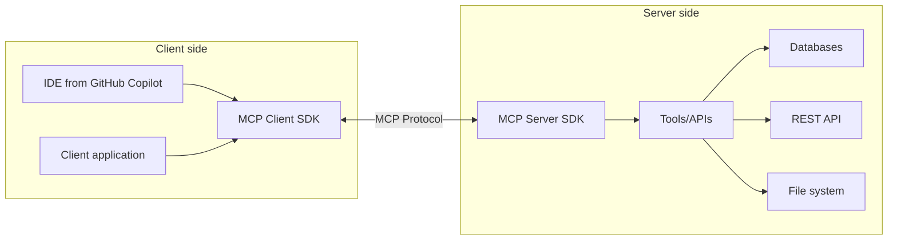

Model Context Protocol (MCP) lets AI models work with your data and services, and .NET already has an SDK for it. Here's what the protocol is, which problem it solves, and how to build your own MCP server in C#.

## What is Model Context Protocol?

MCP is a standardized protocol for structured exchange of context and data between AI models and client applications. As AI becomes an ordinary part of software, there's a practical question of how the different components of AI systems exchange data with each other. MCP answers exactly that.

The conceptual scheme of MCP operation can be depicted as follows:



## Key benefits and use cases of MCP

MCP gives you a single interface for working with different AI models, so you don't have to build a separate integration for each one. Through structured tools you give the model access to external data and APIs, and your existing services, databases and infrastructure plug into AI directly. MCP is most useful when you work with AI assistants such as Copilot, claude and others in agent mode.

### Typical usage scenarios

The most obvious scenario is enterprise integration: the model gets secure access to internal data and APIs, while authentication and authorization stay under your control. The second is developer tooling: you can work with Git, GitHub, test systems and the file system right from the IDE. And for specific tasks such as data processing, code generation or calling external services, you can write your own tools.

## Creating an MCP server with the C# SDK

The C# SDK for MCP makes it simple to build both servers and clients.
Here's how to build a simple MCP server step by step.

### Project settings

Start by creating a console application and adding the packages you need:

```bash
dotnet new console -n MyFirstMCP
dotnet add package ModelContextProtocol --prerelease
dotnet add package Microsoft.Extensions.Hosting
```

### MCP server settings

Next, the basic server structure in Program.cs:

```csharp
using Microsoft.Extensions.DependencyInjection;
using Microsoft.Extensions.Hosting;

var builder = Host.CreateEmptyApplicationBuilder(settings: null);
builder.Services
    .AddMcpServer()
    .WithStdioServerTransport()
    .WithToolsFromAssembly();

await builder.Build().RunAsync();
```

This code:

- Creates an application host instance
- Adds MCP server services
- Configures the standard transport (stdio)
- Configures discovery of tools in the current assembly

### Creation of tools (Tools)

Tools are the core of an MCP server. They're methods that clients can call:

```csharp
[McpServerTool, Description("Get a list of all projects")]
public static string GetAllProjects()
{
    return JsonSerializer.Serialize(_projects, new JsonSerializerOptions
    {
        WriteIndented = true
    });
}
```

Each method with the [McpServerTool] attribute becomes available for calling via the MCP protocol.
This example tool returns a list of projects in JSON format.

## Real example: MCP server for working with data

Now a more complex example: an MCP server that acts as an intermediary for reading and modifying data.

```csharp
[McpServerToolType]
public static class ProjectTools
{
    private static readonly List<ProjectDto> _projects =
    [
        new()
        {
            StartDate = DateTime.Today,
            Description = "Project 1 description",
            Status = ProjectStatus.Planning,
            Name = "Project 1"
        },
        new()
        {
            StartDate = DateTime.UtcNow.AddDays(-25),
            Description = "Project 2 description",
            Status = ProjectStatus.InProgress,
            Name = "Project 2"
        },
        new()
        {
            StartDate = DateTime.UtcNow.AddYears(-1),
            Description = "Project 3 description",
            Status = ProjectStatus.Completed,
            Name = "Project 3"
        },
        new()
        {
            StartDate = DateTime.UtcNow.AddMonths(-2),
            Description = "Project 4 description",
            Status = ProjectStatus.Cancelled,
            Name = "Project 4"
        },
    ];

    [McpServerTool, Description("Get a list of all projects")]
    public static string GetAllProjects()
    {
        return JsonSerializer.Serialize(_projects, new JsonSerializerOptions
        {
            WriteIndented = true
        });
    }

    [McpServerTool, Description("Get projects by status")]
    public static string GetProjectsByStatus(
        [Description("Project status (Planning, InProgress, OnHold, Completed, Cancelled)")] string status)
    {
        if (Enum.TryParse<ProjectStatus>(status, out var projectStatus))
        {
            var projects = _projects.Where(p => p.Status == projectStatus);
            return JsonSerializer.Serialize(projects, new JsonSerializerOptions
            {
                WriteIndented = true
            });
        }
        
        return "Incorrect project status. Available options: Planning, InProgress, OnHold, Completed, Cancelled";
    }
    
    [McpServerTool, Description("Change project status")]
    public static string UpdateProjectStatus(
        [Description("Project ID")] string projectId,
        [Description("New status (Planning, InProgress, OnHold, Completed, Cancelled)")] string newStatus)
    {
        if (!Guid.TryParse(projectId, out var id))
        {
            return "Incorrect project ID";
        }
        
        var project = _projects.FirstOrDefault(p => p.Id == id);
        if (project == null)
        {
            return "Project not found";
        }
        
        if (!Enum.TryParse<ProjectStatus>(newStatus, out var status))
        {
            return "Incorrect project status. Available options: Planning, InProgress, OnHold, Completed, Cancelled";
        }
        
        var oldStatus = project.Status;
        // Update project status
        
        return $"Project status '{project.Name}' changed from {oldStatus} to {status}";
    }
}

public enum ProjectStatus
{
    Planning,
    InProgress,
    OnHold,
    Completed,
    Cancelled
}

public class ProjectDto
{
    public Guid Id { get; set; } = Guid.NewGuid();

    public string Name { get; set; }

    public string Description { get; set; }

    public ProjectStatus Status { get; set; }

    public DateTime StartDate { get; set; }
}
```

To keep the example simple, I'm not using a database, but I think the idea is clear.
The server can return a list of projects, find projects by status and change a project's status.

You can call its methods from any client that supports the MCP protocol, for example an AI agent.
Or use MCP Inspector by running this command:

```bash
npx @modelcontextprotocol/inspector dotnet run
```

MCP Inspector lets you call server methods and view their documentation.

{: width="640" height="480"}

## Configuration and use of MCP in Claude Desktop

You can connect the MCP server to Claude Desktop. To do that:

1. Open `%APPDATA%/Claude/claude_desktop_config.json`
2. Add the following code:

```json
{
  "mcpServers": {
    "MyFirstMCP": {
        "type": "stdio",
        "command": "file path\\MyFirstMCP.exe",
        "args": []
    }
  }
}
```

After that, Claude Desktop sees the MCP server and can call its methods.

{: width="640" height="480"}

{: width="640" height="480"}

## Conclusion

MCP with the .NET SDK gives AI assistants access to corporate data, APIs and tools through a secure, controlled interface. There are plenty of uses, from business data analysis to development automation and user support, and servers and clients are simple to write, so MCP is quickly becoming a standard developer tool.

It's most valuable in development tools like Copilot/Claude: they make it easier to work with the code base, automate routine tasks and pull in enterprise knowledge right from the IDE. If you want to try it, start with a single tool for one of your internal APIs.