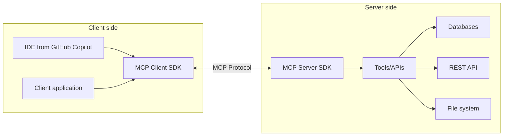

Model Context Protocol (MCP) opens up new possibilities for interacting with AI models and integrating them into your .NET applications. In this article, we'll look at what MCP is, what problems it solves, and how you can use it in your projects.

## What is Model Context Protocol?

MCP is a standardized protocol designed to provide a structured exchange of context and data between AI models and client applications. In a world where AI is becoming an integral part of software, MCP helps to solve one of the key problems - effective communication between different components of AI systems.

The conceptual scheme of MCP operation can be depicted as follows:



## Key benefits and use cases of MCP

Standardized communication through MCP provides a single interface for interacting with different AI models, making integration more efficient and transparent. Developers get the opportunity to extend the functionality of AI systems by giving them access to external data and APIs through structured tools. Thanks to this, your existing services, databases and infrastructure can be directly integrated with AI models. MCP becomes especially useful when developing using AI assistants, such as Copilot, claude and others, in agent mode.

### Typical usage scenarios

Enterprise integration allows AI models to securely access internal enterprise data and APIs while maintaining control over authentication and authorization. Integration with development tools opens up new opportunities to interact with Git, GitHub, test systems, and the file system directly from the IDE. Developers can also create specialized tools to automate specific tasks, such as data processing, code generation, or interaction with external services.

## Creating an MCP server with the C# SDK

The C# SDK for MCP greatly simplifies the process of creating both servers and clients that work with this protocol.
Consider a step-by-step example of creating a simple MCP server.

### Project settings

Let's start by creating a console application and adding the necessary packages:

```bash
dotnet new console -n MyFirstMCP
dotnet add package ModelContextProtocol --prerelease
dotnet add package Microsoft.Extensions.Hosting
```

### MCP server settings

Let's create the basic structure of the server in the Program.cs file:

```csharp
using Microsoft.Extensions.DependencyInjection;
using Microsoft.Extensions.Hosting;

var builder = Host.CreateEmptyApplicationBuilder(settings: null);
builder.Services
    .AddMcpServer()
    .WithStdioServerTransport()
    .WithToolsFromAssembly();

await builder.Build().RunAsync();
```

This code:

- Creates an application host instance
- Adds MCP server services
- Configures the standard transport (stdio)
- Configures the search for tools in the current build

### Creation of tools (Tools)

Tools are the basis of MCP server functionality. They represent methods that can be called by clients:

```csharp
[McpServerTool, Description("Get a list of all projects")]
public static string GetAllProjects()
{
    return JsonSerializer.Serialize(_projects, new JsonSerializerOptions
    {
        WriteIndented = true
    });
}
```

Each method with the [McpServerTool] attribute becomes available for calling via the MCP protocol.
This example tool returns a list of projects in JSON format.

## Real example: MCP server for working with data

Let's consider a more complex example - an MCP server that works as an intermediary for data access and modification.

```csharp
[McpServerToolType]
public static class ProjectTools
{
    private static readonly List<ProjectDto> _projects =
    [
        new()
        {
            StartDate = DateTime.Today,
            Description = "Project 1 description",
            Status = ProjectStatus.Planning,
            Name = "Project 1"
        },
        new()
        {
            StartDate = DateTime.UtcNow.AddDays(-25),
            Description = "Project 2 description",
            Status = ProjectStatus.InProgress,
            Name = "Project 2"
        },
        new()
        {
            StartDate = DateTime.UtcNow.AddYears(-1),
            Description = "Project 3 description",
            Status = ProjectStatus.Completed,
            Name = "Project 3"
        },
        new()
        {
            StartDate = DateTime.UtcNow.AddMonths(-2),
            Description = "Project 4 description",
            Status = ProjectStatus.Cancelled,
            Name = "Project 4"
        },
    ];

    [McpServerTool, Description("Get a list of all projects")]
    public static string GetAllProjects()
    {
        return JsonSerializer.Serialize(_projects, new JsonSerializerOptions
        {
            WriteIndented = true
        });
    }

    [McpServerTool, Description("Get projects by status")]
    public static string GetProjectsByStatus(
        [Description("Project status (Planning, InProgress, OnHold, Completed, Cancelled)")] string status)
    {
        if (Enum.TryParse<ProjectStatus>(status, out var projectStatus))
        {
            var projects = _projects.Where(p => p.Status == projectStatus);
            return JsonSerializer.Serialize(projects, new JsonSerializerOptions
            {
                WriteIndented = true
            });
        }
        
        return "Incorrect project status. Available options: Planning, InProgress, OnHold, Completed, Cancelled";
    }
    
    [McpServerTool, Description("Change project status")]
    public static string UpdateProjectStatus(
        [Description("Project ID")] string projectId,
        [Description("New status (Planning, InProgress, OnHold, Completed, Cancelled)")] string newStatus)
    {
        if (!Guid.TryParse(projectId, out var id))
        {
            return "Incorrect project ID";
        }
        
        var project = _projects.FirstOrDefault(p => p.Id == id);
        if (project == null)
        {
            return "Project not found";
        }
        
        if (!Enum.TryParse<ProjectStatus>(newStatus, out var status))
        {
            return "Incorrect project status. Available options: Planning, InProgress, OnHold, Completed, Cancelled";
        }
        
        var oldStatus = project.Status;
        // Update project status
        
        return $"Project status '{project.Name}' changed from {oldStatus} to {status}";
    }
}

public enum ProjectStatus
{
    Planning,
    InProgress,
    OnHold,
    Completed,
    Cancelled
}

public class ProjectDto
{
    public Guid Id { get; set; } = Guid.NewGuid();

    public string Name { get; set; }

    public string Description { get; set; }

    public ProjectStatus Status { get; set; }

    public DateTime StartDate { get; set; }
}
```

To simplify the example, I am not using a database, but the idea should be clear.
So we created an MCP server that can get a list of projects, get projects by status and change project status.

We can start the server and call its methods from the client. For this, we can use any client that supports the MCP protocol, for example, AI agent.
We can also call server methods using MCP Inspector, for this we can execute the following command:

```bash
npx @modelcontextprotocol/inspector dotnet run
```

This command will launch the MCP Inspector, which will allow us to call server methods and view their documentation.

{: width="640" height="480"}

## Configuration and use of MCP in Claude Desktop

The MCP server can be configured to work with Claude Desktop. For this we can use the following code:

1. Open `%APPDATA%/Claude/claude_desktop_config.json`
2. Add the following code:

```json
{
  "mcpServers": {
    "MyFirstMCP": {
        "type": "stdio",
        "command": "file path\\MyFirstMCP.exe",
        "args": []
    }
  }
}
```

This code will configure Claude Desktop to work with the MCP server. Now we can call server methods using Claude Desktop.

{: width="640" height="480"}

{: width="640" height="480"}

## Conclusion

The Model Context Protocol (MCP) together with the .NET SDK opens up many possibilities for developers who want to integrate AI capabilities into their applications. Standardized communication between AI models and application programs allows you to expand the functionality of systems, giving AI assistants access to corporate data, APIs and tools through a secure and controlled interface.

The example discussed demonstrates a wide range of possible applications of MCP: from business data analysis to development automation and user support. With the ease of creating both servers and clients, MCP is becoming an important component in the ecosystem of modern developer tools.

MCP becomes especially valuable when integrated with development tools such as Copilot/Claude, allowing programmers to more efficiently interact with the code base, automate routine tasks, and access enterprise knowledge directly from the IDE.
Start using MCP in your projects today to unlock new possibilities for integrating AI into your applications and increase your team's efficiency!