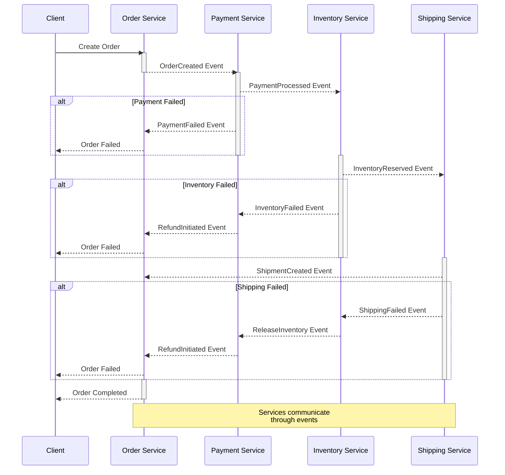
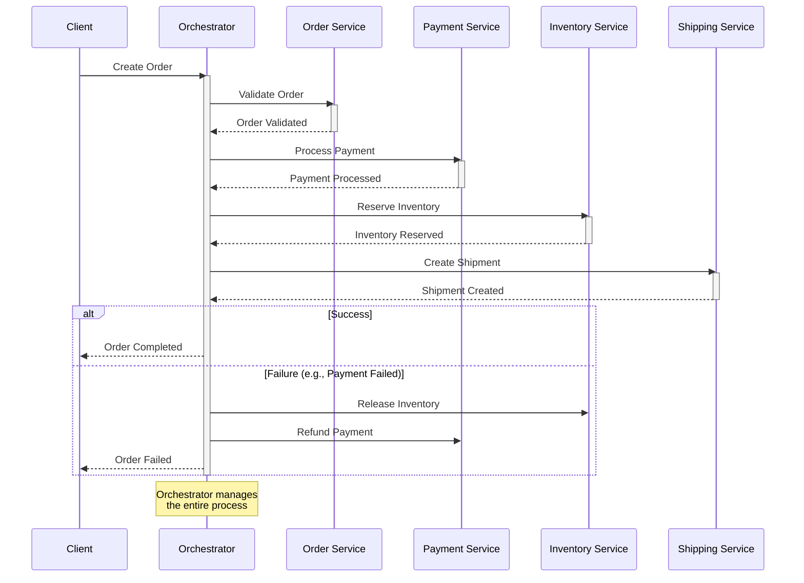

## What is the SAGA pattern?

SAGA is a design pattern that helps manage distributed transactions in a microservice architecture. Instead of using classic ACID transactions, which can block resources for a long time, SAGA breaks a large transaction into a sequence of local transactions, where each local transaction updates data within the same service.

Basic principles of the pattern:

* **S**emantic - each transaction has a clear semantic meaning in the context of the business process.
* **A**synchronous - operations are performed asynchronously, without blocking resources.
* **G**radual - the process is broken down into a sequence of smaller steps.
* **A**ctions - each step is an atomic action with the possibility of rollback.

The term "SAGA" was first introduced in 1987 by Hector Garcia-Molina and Kenneth Salem in their article "Sagas". It was originally designed to manage long-running transactions in traditional databases, but with the advent of microservices architectures, it took on new life as a pattern for managing distributed transactions.

## What problems does it solve?

---

SAGA deals with several problems that almost every distributed system runs into.

The main one is keeping data consistent ([eventual consistency](https://en.wikipedia.org/wiki/Eventual_consistency){:target="_blank"}) across services without distributed ACID transactions.
When data is spread across many services, classic transactions run into long locks and scale poorly. SAGA replaces them with a sequence of local transactions.

The second is long-running business processes. In real systems a business operation can take hours or even days: it talks to external systems and waits for users to respond. SAGA coordinates these processes, keeps their state, and lets them recover after a failure.

If something goes wrong in the middle of a distributed operation, compensating transactions roll the changes back in the correct order. In microservices this matters a lot: one failed service shouldn't leave the whole system with inconsistent data.

The rest follows from the structure of the pattern. There are no global locks and each service handles its part of the transaction independently, so the system scales horizontally and load is spread across nodes. Every step is clearly defined and has its own state, which makes it easier to track progress and find where an error happened, and that's valuable in a system with many interconnected services. The process itself is also easier to change: you can add a new step or processing option without rewriting the whole transaction logic.

---

## Approaches to implementing Saga

### Choreography

The choreography in the SAGA pattern is a decentralized approach to managing distributed transactions, where each service independently decides on its actions based on events from other services.

In this approach, there is no central coordinator, and services interact directly with each other through events. Each service publishes events about its state changes, and other services subscribe to these events and respond according to their business logic.

For example, when the order service creates a new order, it publishes the event `OrderCreated`. The payment service subscribed to this event receives it and initiates the payment process. After a successful payment, it publishes the event `PaymentProcessed`, which is received by the inventory service to reserve the goods.

When an error occurs, the service publishes a failure event, and other services that have already completed their operations trigger compensatory actions based on this event. For example, if the product reservation is not possible, the inventory service publishes the event `InventoryReservationFailed`, and the payment service, upon receiving this event, initiates a refund.

Choreography is especially effective in systems with simple data flows and a small number of interacting services. It provides high autonomy of services and natural scalability, as each service can independently process its part of the business process.

However, with the increase in the number of services and the complexity of business processes, the choreography can become difficult to understand and debug, since the logic of the process is distributed among all participants. In such cases, it may be more appropriate to use an orchestration approach.

Diagram of choreography implementation:



Example of choreography implementation:

```cs
// Events
public record OrderCreated(
    string OrderId,
    string CustomerId,
    decimal TotalAmount,
    List<OrderItem> Items
);

public record PaymentProcessed(
    string OrderId,
    string TransactionId,
    decimal Amount,
    DateTime ProcessedAt
);

public record PaymentFailed(
    string OrderId,
    string Reason,
    DateTime FailedAt
);

public record InventoryReserved(
    string OrderId,
    string ReservationId,
    List<OrderItem> Items,
    DateTime ReservedAt
);

public record OrderCompleted(
    string OrderId,
    string TransactionId,
    string ReservationId,
    DateTime CompletedAt
);

// Order service
public class OrderService
{
    private readonly IEventBus _eventBus;
    private readonly IOrderRepository _orderRepo;
    private readonly ILogger<OrderService> _logger;

    public async Task CreateOrder(CreateOrderRequest request)
    {
        try
        {
            // Create an order
            var order = new Order
            {
                Id = Guid.NewGuid().ToString(),
                CustomerId = request.CustomerId,
                Items = request.Items,
                TotalAmount = request.Items.Sum(i => i.Price * i.Quantity),
                Status = OrderStatus.Created,
                CreatedAt = DateTime.UtcNow
            };

            await _orderRepo.SaveOrder(order);

            // Publication of the event
            await _eventBus.Publish(new OrderCreated(
                order.Id,
                order.CustomerId,
                order.TotalAmount,
                order.Items
            ));

            _logger.LogInformation(
                "Order {OrderId} created and published for customer {CustomerId}", 
                order.Id, 
                order.CustomerId
            );
        }
        catch (Exception ex)
        {
            _logger.LogError(ex, "Failed to create order for customer {CustomerId}", 
                request.CustomerId);
            throw;
        }
    }

    // Successful payment event handler
    public async Task HandlePaymentProcessed(PaymentProcessed @event)
    {
        var order = await _orderRepo.GetOrder(@event.OrderId);
        if (order == null)
        {
            _logger.LogWarning("Order {@OrderId} not found for payment processing", 
                @event.OrderId);
            return;
        }

        order.Status = OrderStatus.PaymentCompleted;
        order.PaymentTransactionId = @event.TransactionId;
        order.UpdatedAt = DateTime.UtcNow;

        await _orderRepo.UpdateOrder(order);
        _logger.LogInformation(
            "Order {OrderId} payment processed with transaction {TransactionId}", 
            order.Id, 
            @event.TransactionId
        );
    }

    // Payment failed event handler
    public async Task HandlePaymentFailed(PaymentFailed @event)
    {
        var order = await _orderRepo.GetOrder(@event.OrderId);
        if (order == null) return;

        order.Status = OrderStatus.PaymentFailed;
        order.FailureReason = @event.Reason;
        order.UpdatedAt = DateTime.UtcNow;

        await _orderRepo.UpdateOrder(order);
        _logger.LogWarning(
            "Order {OrderId} payment failed: {Reason}", 
            order.Id, 
            @event.Reason
        );
    }
}

// Payment service
public class PaymentService
{
    private readonly IEventBus _eventBus;
    private readonly IPaymentProcessor _paymentProcessor;
    private readonly IPaymentRepository _paymentRepo;
    private readonly ILogger<PaymentService> _logger;

    public async Task HandleOrderCreated(OrderCreated @event)
    {
        try
        {
            // Check for duplicate payment
            var existingPayment = await _paymentRepo.GetByOrderId(@event.OrderId);
            if (existingPayment != null)
            {
                _logger.LogWarning(
                    "Duplicate payment attempt for order {OrderId}", 
                    @event.OrderId
                );
                return;
            }

            // Creating a payment record
            var payment = new Payment
            {
                OrderId = @event.OrderId,
                Amount = @event.TotalAmount,
                Status = PaymentStatus.Processing,
                CreatedAt = DateTime.UtcNow
            };

            await _paymentRepo.SavePayment(payment);

            // Payment processing
            var result = await _paymentProcessor.ProcessPayment(new ProcessPaymentRequest
            {
                OrderId = @event.OrderId,
                CustomerId = @event.CustomerId,
                Amount = @event.TotalAmount
            });

            if (result.Success)
            {
                payment.Status = PaymentStatus.Completed;
                payment.TransactionId = result.TransactionId;
                await _paymentRepo.UpdatePayment(payment);

                await _eventBus.Publish(new PaymentProcessed(
                    @event.OrderId,
                    result.TransactionId,
                    @event.TotalAmount,
                    DateTime.UtcNow
                ));

                _logger.LogInformation(
                    "Payment processed for order {OrderId} with transaction {TransactionId}", 
                    @event.OrderId, 
                    result.TransactionId
                );
            }
            else
            {
                payment.Status = PaymentStatus.Failed;
                payment.FailureReason = result.ErrorMessage;
                await _paymentRepo.UpdatePayment(payment);

                await _eventBus.Publish(new PaymentFailed(
                    @event.OrderId,
                    result.ErrorMessage,
                    DateTime.UtcNow
                ));

                _logger.LogWarning(
                    "Payment failed for order {OrderId}: {Reason}", 
                    @event.OrderId, 
                    result.ErrorMessage
                );
            }
        }
        catch (Exception ex)
        {
            _logger.LogError(ex, "Error processing payment for order {OrderId}", 
                @event.OrderId);

            await _eventBus.Publish(new PaymentFailed(
                @event.OrderId,
                "Internal payment processing error",
                DateTime.UtcNow
            ));
        }
    }
}

// Inventory service
public class InventoryService
{
    private readonly IEventBus _eventBus;
    private readonly IInventoryRepository _inventoryRepo;
    private readonly ILogger<InventoryService> _logger;

    public async Task HandlePaymentProcessed(PaymentProcessed @event)
    {
        try
        {
            // Checking the availability of goods
            var order = await _orderRepo.GetOrder(@event.OrderId);
            foreach (var item in order.Items)
            {
                var inventory = await _inventoryRepo.GetInventory(item.ProductId);
                if (inventory.AvailableQuantity < item.Quantity)
                {
                    throw new InsufficientInventoryException(item.ProductId);
                }
            }

            // Reservation of goods
            var reservationId = Guid.NewGuid().ToString();
            foreach (var item in order.Items)
            {
                await _inventoryRepo.UpdateInventory(
                    item.ProductId,
                    -item.Quantity,
                    reservationId
                );
            }

            // Publication of the successful reservation event
            await _eventBus.Publish(new InventoryReserved(
                @event.OrderId,
                reservationId,
                order.Items,
                DateTime.UtcNow
            ));

            _logger.LogInformation(
                "Inventory reserved for order {OrderId} with reservation {ReservationId}", 
                @event.OrderId, 
                reservationId
            );
        }
        catch (InsufficientInventoryException ex)
        {
            _logger.LogWarning(
                "Insufficient inventory for product {ProductId} in order {OrderId}", 
                ex.ProductId, 
                @event.OrderId
            );

            // Initiating a compensation transaction
            await _eventBus.Publish(new InventoryReservationFailed(
                @event.OrderId,
                $"Insufficient inventory for product {ex.ProductId}",
                DateTime.UtcNow
            ));
        }
        catch (Exception ex)
        {
            _logger.LogError(ex, "Error reserving inventory for order {OrderId}", 
                @event.OrderId);

            // Initiating a compensation transaction
            await _eventBus.Publish(new InventoryReservationFailed(
                @event.OrderId,
                "Internal inventory processing error",
                DateTime.UtcNow
            ));
        }
    }

    // Compensation transaction handler
    public async Task HandleInventoryReservationFailed(InventoryReservationFailed @event)
    {
        try
        {
            var reservations = await _inventoryRepo
                .GetReservationsByOrderId(@event.OrderId);

            foreach (var reservation in reservations)
            {
                await _inventoryRepo.ReleaseReservation(reservation.Id);
            }

            _logger.LogInformation(
                "Released inventory reservations for failed order {OrderId}", 
                @event.OrderId
            );
        }
        catch (Exception ex)
        {
            _logger.LogError(ex, 
                "Error releasing inventory reservations for order {OrderId}", 
                @event.OrderId
            );
        }
    }
}
```

### Orchestration

SAGA orchestration uses a central coordinator (orchestrator) that manages the entire process of executing a distributed transaction and is aware of all the steps that need to be performed.

The orchestrator is responsible for calling the required services in the correct order, tracking their state, and handling errors. It preserves all the logic of the process and the sequence of steps, which makes the process more transparent and easier to understand.

If an error occurs at any stage, the orchestrator takes responsibility for performing compensatory actions in the correct order. It knows which steps have already been taken and which compensatory actions need to be called for each of them.

This approach is especially useful in complex business processes, where there are many participants and complex execution logic.

Orchestration simplifies monitoring and debugging because all information about the state of the process is concentrated in one place.

Orchestration implementation diagram:



Example of orchestration implementation:

```cs
// Commands for services
public record ValidateOrderCommand(
    string OrderId,
    string CustomerId,
    decimal TotalAmount,
    List<OrderItem> Items
);

public record ProcessPaymentCommand(
    string OrderId,
    string CustomerId,
    decimal Amount
);

public record ReserveInventoryCommand(
    string OrderId,
    List<OrderItem> Items
);

public record ShipOrderCommand(
    string OrderId,
    string ShippingAddress,
    List<OrderItem> Items
);

// Answers from services
public record ValidationResponse(
    bool IsValid,
    List<string> Errors
);

public record PaymentResponse(
    bool Success,
    string TransactionId,
    string ErrorMessage
);

public record InventoryResponse(
    bool Success,
    string ReservationId,
    string ErrorMessage
);

public record ShippingResponse(
    bool Success,
    string TrackingNumber,
    string ErrorMessage
);

// SAGA status
public class OrderSagaState
{
    public string OrderId { get; set; }
    public string CustomerId { get; set; }
    public decimal TotalAmount { get; set; }
    public List<OrderItem> Items { get; set; }
    public string CurrentStep { get; set; }
    public Dictionary<string, bool> CompletedSteps { get; set; } = new();
    
    // Data on steps taken
    public string PaymentTransactionId { get; set; }
    public string InventoryReservationId { get; set; }
    public string ShippingTrackingNumber { get; set; }
    
    // Data for compensation
    public List<string> CompensatingActions { get; set; } = new();
    
    // Metadata
    public DateTime StartedAt { get; set; }
    public DateTime? CompletedAt { get; set; }
    public int RetryCount { get; set; }
    public string ErrorMessage { get; set; }
}

// Orchestrator SAGA
public class OrderSagaOrchestrator
{
    private readonly IOrderService _orderService;
    private readonly IPaymentService _paymentService;
    private readonly IInventoryService _inventoryService;
    private readonly IShippingService _shippingService;
    private readonly ISagaStateRepository _stateRepo;
    private readonly ILogger<OrderSagaOrchestrator> _logger;

    public async Task<Result> StartOrderSaga(CreateOrderRequest request)
    {
        var sagaState = new OrderSagaState
        {
            OrderId = Guid.NewGuid().ToString(),
            CustomerId = request.CustomerId,
            TotalAmount = request.TotalAmount,
            Items = request.Items,
            StartedAt = DateTime.UtcNow,
            CurrentStep = "Started"
        };

        await _stateRepo.SaveState(sagaState);

        try
        {
            // Step 1: Order validation
            var validationResult = await ValidateOrder(sagaState);
            if (!validationResult.IsValid)
            {
                await FailSaga(sagaState, 
                    $"Order validation failed: {string.Join(", ", validationResult.Errors)}");
                return Result.Failure(sagaState.ErrorMessage);
            }

            // Step 2: Payment processing
            var paymentResult = await ProcessPayment(sagaState);
            if (!paymentResult.Success)
            {
                await FailSaga(sagaState, 
                    $"Payment failed: {paymentResult.ErrorMessage}");
                return Result.Failure(sagaState.ErrorMessage);
            }

            // Step 3: Reservation of goods
            var inventoryResult = await ReserveInventory(sagaState);
            if (!inventoryResult.Success)
            {
                await FailSaga(sagaState, 
                    $"Inventory reservation failed: {inventoryResult.ErrorMessage}");
                return Result.Failure(sagaState.ErrorMessage);
            }

            // Step 4: Order delivery
            var shippingResult = await ArrangeShipping(sagaState);
            if (!shippingResult.Success)
            {
                await FailSaga(sagaState, 
                    $"Shipping arrangement failed: {shippingResult.ErrorMessage}");
                return Result.Failure(sagaState.ErrorMessage);
            }

            // Completion of the SAGA
            await CompleteSaga(sagaState);
            return Result.Success();
        }
        catch (Exception ex)
        {
            _logger.LogError(ex, "Unexpected error in saga for order {OrderId}", 
                sagaState.OrderId);
            await FailSaga(sagaState, "Unexpected error occurred");
            return Result.Failure(sagaState.ErrorMessage);
        }
    }

    private async Task<ValidationResponse> ValidateOrder(OrderSagaState state)
    {
        try
        {
            state.CurrentStep = "Validating";
            await _stateRepo.UpdateState(state);

            var result = await _orderService.ValidateOrder(new ValidateOrderCommand(
                state.OrderId,
                state.CustomerId,
                state.TotalAmount,
                state.Items
            ));

            if (result.IsValid)
            {
                state.CompletedSteps["Validation"] = true;
                await _stateRepo.UpdateState(state);
            }

            return result;
        }
        catch (Exception ex)
        {
            _logger.LogError(ex, "Error validating order {OrderId}", state.OrderId);
            throw;
        }
    }

    private async Task<PaymentResponse> ProcessPayment(OrderSagaState state)
    {
        try
        {
            state.CurrentStep = "ProcessingPayment";
            await _stateRepo.UpdateState(state);

            var result = await _paymentService.ProcessPayment(new ProcessPaymentCommand(
                state.OrderId,
                state.CustomerId,
                state.TotalAmount
            ));

            if (result.Success)
            {
                state.PaymentTransactionId = result.TransactionId;
                state.CompletedSteps["Payment"] = true;
                state.CompensatingActions.Add("RefundPayment");
                await _stateRepo.UpdateState(state);
            }

            return result;
        }
        catch (Exception ex)
        {
            _logger.LogError(ex, "Error processing payment for order {OrderId}", 
                state.OrderId);
            throw;
        }
    }

    private async Task<InventoryResponse> ReserveInventory(OrderSagaState state)
    {
        try
        {
            state.CurrentStep = "ReservingInventory";
            await _stateRepo.UpdateState(state);

            var result = await _inventoryService.ReserveInventory(
                new ReserveInventoryCommand(
                    state.OrderId,
                    state.Items
                ));

            if (result.Success)
            {
                state.InventoryReservationId = result.ReservationId;
                state.CompletedSteps["Inventory"] = true;
                state.CompensatingActions.Add("ReleaseInventory");
                await _stateRepo.UpdateState(state);
            }

            return result;
        }
        catch (Exception ex)
        {
            _logger.LogError(ex, "Error reserving inventory for order {OrderId}", 
                state.OrderId);
            throw;
        }
    }

    private async Task FailSaga(OrderSagaState state, string reason)
    {
        state.ErrorMessage = reason;
        state.CurrentStep = "Failed";

        // Execution of compensatory actions in the reverse order
        foreach (var action in state.CompensatingActions.AsEnumerable().Reverse())
        {
            try
            {
                await ExecuteCompensatingAction(state, action);
            }
            catch (Exception ex)
            {
                _logger.LogError(ex, 
                    "Error executing compensating action {Action} for order {OrderId}", 
                    action, 
                    state.OrderId);
            }
        }

        await _stateRepo.UpdateState(state);
    }

    private async Task ExecuteCompensatingAction(OrderSagaState state, string action)
    {
        switch (action)
        {
            case "RefundPayment":
                if (!string.IsNullOrEmpty(state.PaymentTransactionId))
                {
                    await _paymentService.RefundPayment(state.PaymentTransactionId);
                    _logger.LogInformation(
                        "Refunded payment for order {OrderId}, transaction {TransactionId}", 
                        state.OrderId, 
                        state.PaymentTransactionId);
                }
                break;

            case "ReleaseInventory":
                if (!string.IsNullOrEmpty(state.InventoryReservationId))
                {
                    await _inventoryService.ReleaseReservation(
                        state.InventoryReservationId);
                    _logger.LogInformation(
                        "Released inventory for order {OrderId}, reservation {ReservationId}", 
                        state.OrderId, 
                        state.InventoryReservationId);
                }
                break;
        }
    }

    private async Task CompleteSaga(OrderSagaState state)
    {
        state.CurrentStep = "Completed";
        state.CompletedAt = DateTime.UtcNow;
        await _stateRepo.UpdateState(state);

        _logger.LogInformation(
            "Successfully completed saga for order {OrderId}, duration: {Duration}ms", 
            state.OrderId, 
            (state.CompletedAt - state.StartedAt)?.TotalMilliseconds);
    }
}
```

API for interacting with the process:

```cs
public static class OrderEndpoints
{
    public static void MapOrderEndpoints(this IEndpointRouteBuilder app)
    {
        var group = app.MapGroup("/api/orders")
            .WithTags("Orders")
            .WithOpenApi();

        group.MapPost("/", async (
            CreateOrderRequest request,
            OrderSagaOrchestrator sagaOrchestrator) =>
        {
            var result = await sagaOrchestrator.StartOrderSaga(request);

            return result.Success
                ? Results.Ok(new { Message = "Order processing started" })
                : Results.BadRequest(new { Error = result.ErrorMessage });
        })
        .WithName("CreateOrder")
        .WithDescription("Initiates a new order process")
        .Produces<object>(StatusCodes.Status200OK)
        .Produces<object>(StatusCodes.Status400BadRequest);

        group.MapGet("/{orderId}/status", async (
            string orderId,
            OrderSagaOrchestrator sagaOrchestrator) =>
        {
            var state = await sagaOrchestrator.GetSagaState(orderId);

            return state is null
                ? Results.NotFound()
                : Results.Ok(new
                {
                    state.OrderId,
                    state.CurrentStep,
                    state.CompletedSteps,
                    state.StartedAt,
                    state.CompletedAt,
                    state.ErrorMessage
                });
        })
        .WithName("GetOrderStatus")
        .WithDescription("Gets the current status of an order")
        .Produces<object>(StatusCodes.Status200OK)
        .Produces(StatusCodes.Status404NotFound);
    }
}
```

This example demonstrates the following:

* Centralized process management through an orchestrator
* Clear definition of steps and their sequence
* Saving process state
* Error handling and compensatory actions
* Monitoring and logging
* API to interact with the process

## Comparison of approaches

### Choreography

Advantages:

* Loose coupling between services
* High autonomy of services
* Easier implementation for small systems
* Natural scalability

Disadvantages:

* It is difficult to track the entire process
* Potential cyclical dependencies
* Complex debugging
* Distributed business logic

### Orchestration

Advantages:

* Centralized process management
* Easier tracking and monitoring
* Isolated business logic
* Easier debugging

Disadvantages:

* Tighter coupling between services
* The orchestrator can become a bottleneck
* More complex implementation
* Less autonomy of services

## How to use SAGA pattern?

Start by analyzing the business process: identify all the steps, participants, possible execution and error scenarios, the order of operations, and the compensating action for each step.

Then pick an approach based on the complexity of the process and the number of participants. Choreography works for simple processes with a few participants; for complex ones, orchestration is the better choice.

At the design stage, define the message format between services, the storage structure for SAGA state, and the error handling mechanisms. Set timeouts right away, both for each step and for the process as a whole.

For the implementation you need basic messaging infrastructure, the SAGA steps themselves, and their compensating actions. Pay particular attention to idempotency and to handling concurrent requests.
To see what state your processes are in, set up monitoring and logging: metrics collection, error alerts, and dashboards for operational support.

Tests should cover successful execution, the various error cases, and compensating actions.
Recovery after failures and data consistency checks need the most attention.

Finally, document the process: steps, message formats, compensating actions and possible states. Without that, supporting and evolving the system gets hard.

## Best practices

The most important practice is making every operation idempotent, so it can be safely retried after a failure.
Each operation should check its previous state and not repeat an action that's already done.

Keep the full SAGA state: the current step, the operations already performed, and the data needed for compensating actions. Store it somewhere reliable that supports transactions.

Error handling has to account for every failure scenario you can think of.

The system must cope with temporary network problems, unavailable services and partial failures.

Log every step of the process, and have monitoring track operation duration, errors and the overall state of processes. Without that, figuring out at which step a SAGA stopped, and why, is very hard.

In the .NET ecosystem, there are several popular libraries for implementing SAGA:

`MassTransit` is one of the most popular libraries that provides a ready infrastructure for SAGA implementation.

It offers:

* Built-in support for various transports (RabbitMQ, Azure Service Bus, and others)
* Convenient API for defining state machines
* Automatic state management
* Built-in error handling and retries

### Example of a simple SAGA using MassTransit

```cs
public class OrderSaga : MassTransitStateMachine<OrderState>
{
    public OrderSaga()
    {
        Event(() => OrderSubmitted, x => x.CorrelateById(m => m.Message.OrderId));
        Event(() => PaymentProcessed, x => x.CorrelateById(m => m.Message.OrderId));

        Initially(
            When(OrderSubmitted)
                .Then(context => 
                {
                    context.Instance.OrderId = context.Data.OrderId;
                    context.Instance.Amount = context.Data.Amount;
                })
                .TransitionTo(AwaitingPayment)
                .PublishAsync(context => context.Init<ProcessPayment>(new 
                {
                    OrderId = context.Instance.OrderId,
                    Amount = context.Instance.Amount
                }))
        );

        During(AwaitingPayment,
            When(PaymentProcessed)
                .TransitionTo(Completed)
                .Then(context => context.Instance.PaymentId = context.Data.PaymentId)
        );

        SetCompensation(AwaitingPayment, 
            x => x.PublishAsync(context => context.Init<RefundPayment>(new 
            {
                PaymentId = context.Instance.PaymentId
            })));
    }
}

// Azure Service Bus configuration
services.AddMassTransit(x =>
{
    x.UsingAzureServiceBus((context, cfg) =>
    {
        cfg.Host("connection-string");
        cfg.ConfigureEndpoints(context);
    });
});

// Amazon SQS configuration
services.AddMassTransit(x =>
{
    x.UsingAmazonSqs((context, cfg) =>
    {
        cfg.Host("us-east-1", h =>
        {
            h.AccessKey("access-key");
            h.SecretKey("secret-key");
        });
        cfg.ConfigureEndpoints(context);
    });
});
```

Don't forget about security, especially with financial transactions.

Each step of SAGA must be performed with proper authorization and authentication.

Test SAGA on two levels: unit tests for individual components and integration tests for the interaction between services. Compensation mechanisms deserve separate tests.

Documentation of SAGA processes should be detailed and up to date: sequence diagrams, descriptions of events and commands, message format specifications, and deployment and support instructions.

## Conclusion

SAGA is worth reaching for when a business operation spans several services and a distributed ACID transaction isn't an option.
Implemented properly, it gives you reliable management of long transactions, error handling with recovery, and scalability. And because the steps are explicit, the process is visible in monitoring and even complex business processes stay manageable.

Choosing between choreography and orchestration mostly comes down to process complexity: a few services with a simple event flow do fine with choreography, but once the logic gets hard to follow, move to an orchestrator.

> What to watch for
{: .prompt-info }

Plan compensating actions, timeouts and idempotency during analysis, and test every scenario, including recovery after failures.