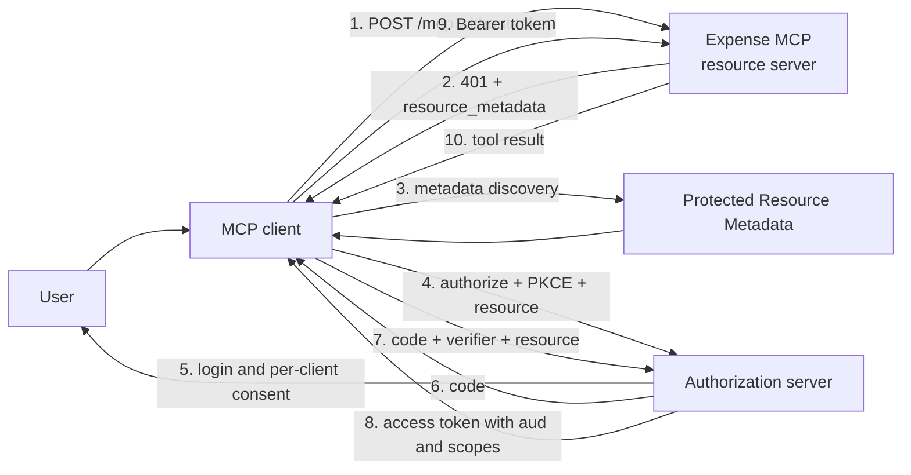

Say we connect an expense MCP server to a corporate AI assistant. One tool lists receipts, another approves a payment. On the demo everything looks fine: the server accepts a bearer token, `[Authorize]` keeps anonymous callers out, and the model finally stops inventing expense statuses.

The problems show up later. A token issued for the file API suddenly works against the expense server too. The desktop client that was only supposed to read calls `approve_expense`. The logs contain the whole `Authorization` header along with the tool arguments. And one busy agent loop makes a few thousand requests a minute.

Authentication was there. Access boundaries were not.

So we'll build an HTTP MCP server on ASP.NET Core where:

- the OAuth client uses the authorization code flow with PKCE
- `resource` binds the requested token to one MCP server
- the API validates signature, issuer, lifetime, and `aud`
- `expenses.read` and `expenses.approve` protect different tools
- consent and permitted scopes are tracked per client
- a privileged tool is authorized at the HTTP boundary and again before its side effect
- audit records don't become a store for tokens and sensitive arguments
- rate limiting separates users and clients
- security tests check the trust boundaries, not the happy path

The complete tested example lives in the [repository](https://github.com/TarasKovalenko/taraskovalenko.github.io/tree/main/examples/secure-mcp-oauth-dotnet). It uses .NET 10 and the official MCP C# SDK 2.0.0.

## Who is responsible for what

The first useful boundary is not trying to turn the MCP server into everything at once.



There are three different roles here:

- the **MCP client** starts the authorization flow, generates the PKCE verifier, and calls the server
- the **authorization server** authenticates the user, shows consent, and issues tokens
- the **MCP server** is an OAuth resource server. It doesn't sign the user in. It validates a token and allows one concrete operation

A production API shouldn't be minting access tokens from a username and password on its own. The [ASP.NET Core documentation](https://learn.microsoft.com/en-us/aspnet/core/security/authentication/configure-jwt-bearer-authentication?view=aspnetcore-10.0) explicitly recommends a standard OIDC/OAuth flow and full validation of signature, issuer, audience, and expiration.

So our .NET project implements the resource server. For the authorization server we take something ready-made, after checking that it supports the OAuth profile we need, Resource Indicators, and the client registration mode. A hand-written `/token` page that signs a JWT once the password checks out isn't a shortcut to production. It's a new security product the team will have to run.

## OAuth 2.1 is not an RFC yet

As of September 2026, OAuth 2.1 is still an IETF Internet-Draft. The current [MCP Authorization specification 2026-07-28](https://modelcontextprotocol.io/specification/2026-07-28/basic/authorization) references that draft and assembles a profile from several stable RFCs: bearer tokens, authorization server metadata, Resource Indicators, and Protected Resource Metadata.

That doesn't make the requirements optional. The basic protections are already fixed in [OAuth 2.0 Security Best Current Practice, RFC 9700](https://www.rfc-editor.org/rfc/rfc9700.html):

- public clients use PKCE
- the authorization server supports PKCE and prevents downgrade
- PKCE uses `S256`
- redirect URIs use exact string matching, except for the variable localhost port allowed to native apps
- access tokens do not travel in URI query strings

PKCE solves one specific problem. The client creates a random `code_verifier`, sends its SHA-256 challenge in the authorization request, and shows the verifier itself only to the token endpoint. An intercepted authorization code is no longer enough to get a token.

But PKCE says nothing about which API the resulting token is meant for. That's what `resource` is for.

## Resource Indicator and audience: one boundary from two sides

The MCP client has to include the canonical server URI in both requests:

```http
GET /authorize?
  response_type=code&
  client_id=finance-desktop&
  redirect_uri=http%3A%2F%2F127.0.0.1%3A49152%2Fcallback&
  code_challenge=...&
  code_challenge_method=S256&
  scope=expenses.read&
  resource=https%3A%2F%2Fexpenses.example.com%2Fmcp
```

During the code exchange the parameter is repeated:

```http
POST /token
Content-Type: application/x-www-form-urlencoded

grant_type=authorization_code&
client_id=finance-desktop&
code=...&
code_verifier=...&
redirect_uri=http%3A%2F%2F127.0.0.1%3A49152%2Fcallback&
resource=https%3A%2F%2Fexpenses.example.com%2Fmcp
```

[RFC 8707](https://www.rfc-editor.org/rfc/rfc8707.html) defines `resource` as an absolute URI without a fragment. The authorization server uses it to issue an audience-restricted token. In our case the expected `aud` looks like this:

```json
{
  "iss": "https://identity.example.com",
  "aud": "https://expenses.example.com/mcp",
  "sub": "user-42",
  "client_id": "finance-admin",
  "tenant_id": "tenant-a",
  "scope": "expenses.read expenses.approve",
  "exp": 1785562200
}
```

On the client side `resource` does the work, on the API side validation of `aud` does. Check only signature and issuer, and a token for `https://files.example.com/mcp` will walk straight into the expense server. It's real, it hasn't expired, and it came from a trusted issuer. It just wasn't issued to us.

That's why the MCP specification requires a resource server to accept only tokens issued for the current resource, and forbids token passthrough. If a tool calls a downstream API, don't forward the incoming MCP token there. Get a separate token for the downstream audience through the appropriate delegation flow.

## How the client finds the authorization server

The client shouldn't have to guess the issuer from the domain name. The first request without a token gets a `401`:

```http
HTTP/1.1 401 Unauthorized
WWW-Authenticate: Bearer
  resource_metadata="https://expenses.example.com/.well-known/oauth-protected-resource",
  scope="expenses.read"
```

After that the client reads the Protected Resource Metadata:

```json
{
  "resource": "https://expenses.example.com/mcp",
  "resource_name": "Expense MCP",
  "authorization_servers": ["https://identity.example.com"],
  "scopes_supported": ["expenses.read"]
}
```

[RFC 9728](https://www.rfc-editor.org/rfc/rfc9728.html) defines the document format and the rules for validating it. The `resource` value must match the resource identifier exactly. TLS validation is part of that boundary too: metadata with perfectly correct JSON doesn't become trusted because an attacker served it.

Why does `scopes_supported` list only `expenses.read` when the server also knows about approve? The current MCP specification recommends advertising the minimum set needed for basic functionality. The client can get the extra right later through step-up after a `403 insufficient_scope`. That way consent doesn't start with "give me everything".

## Per-client consent: a user cannot grant a client any right they like

Consent is often mistaken for a single boolean: the user pressed Allow, so the application is allowed everything. A practical grant has at least four dimensions:

```text
user + client_id + resource + approved scopes
```

For our scenario the registrations look like this:

| Client | Permitted scopes | Typical consent |
|---|---|---|
| `finance-desktop` | `expenses.read` | View expenses |
| `finance-admin` | `expenses.read expenses.approve` | View, and approve separately |

The authorization server shouldn't show `expenses.approve` to `finance-desktop` at all. Even if that client adds the scope to the URL by hand, the result should be a refusal, not a wider consent screen.

The resource server repeats this check as defense in depth. One mapping or claims-transformation mistake in the IdP shouldn't be enough to turn a read-only client into an administrative one.

In the sample the entitlement lives in configuration:

```json
"ClientScopes": {
  "finance-desktop": [ "expenses.read" ],
  "finance-admin": [ "expenses.read", "expenses.approve" ]
}
```

In a real system this might be a policy store, but the rule stays the same. The required scope has to be in the token *and* in the allowlist for that specific `client_id`.

## Configuring the ASP.NET Core resource server

An HTTP server needs the `ModelContextProtocol.AspNetCore` package:

```xml
<ItemGroup>
  <PackageReference Include="Microsoft.AspNetCore.Authentication.JwtBearer" />
  <PackageReference Include="ModelContextProtocol.AspNetCore" />
</ItemGroup>
```

The JWT bearer handler checks four properties of the token. The values are inlined here for readability; the repository reads them from configuration:

```cs
builder.Services.AddAuthentication(options =>
{
    options.DefaultAuthenticateScheme = JwtBearerDefaults.AuthenticationScheme;
    options.DefaultChallengeScheme = McpAuthenticationDefaults.AuthenticationScheme;
})
.AddJwtBearer(options =>
{
    options.Authority = "https://identity.example.com";
    options.RequireHttpsMetadata = true;
    options.MapInboundClaims = false;
    options.TokenValidationParameters = new TokenValidationParameters
    {
        ValidateIssuer = true,
        ValidIssuer = "https://identity.example.com",
        ValidateAudience = true,
        ValidAudience = "https://expenses.example.com/mcp",
        ValidateLifetime = true,
        ValidateIssuerSigningKey = true,
        ClockSkew = TimeSpan.FromMinutes(1)
    };
})
.AddMcp(options =>
{
    options.ResourceMetadataUri = new Uri(
        "https://expenses.example.com/.well-known/oauth-protected-resource");
    options.ResourceMetadata = new()
    {
        Resource = "https://expenses.example.com/mcp",
        ResourceName = "Expense MCP",
        AuthorizationServers = { "https://identity.example.com" },
        ScopesSupported = ["expenses.read"]
    };
});
```

`Authority` lets the handler fetch signing keys through the issuer metadata. The example swaps in a symmetric key only in two environments: `Testing` for the integration tests and `Development` for local experiments. Every other environment, production included, takes the `Authority` path.

The MCP server itself stays small:

```cs
builder.Services.AddMcpServer()
    .WithTools<ExpenseTools>()
    .WithHttpTransport(options => options.Stateless = true);

app.UseMiddleware<InitialScopeChallengeMiddleware>();
app.UseAuthentication();
app.UseRateLimiter();
app.UseAuthorization();
app.UseMiddleware<AuditMiddleware>();
app.UseMiddleware<ToolAuthorizationMiddleware>();

app.MapMcp("/mcp")
    .RequireAuthorization()
    .RequireRateLimiting("mcp");
```

The order matters. `InitialScopeChallengeMiddleware` sits first only because it edits the response on the way out: when the MCP challenge scheme has already produced a `401` with `resource_metadata`, it appends `scope="expenses.read"` so the client learns the minimum it should ask for.

Stateless mode fits here because the tools don't do server-to-client sampling or elicitation. It also simplifies horizontal scaling: no session affinity, and no server-side MCP session to keep somewhere.

## A scope belongs to an operation, not to the whole endpoint

`RequireAuthorization()` answers the question "is there a valid identity?". But every MCP tool arrives at the same `POST /mcp`, so an endpoint policy can't tell `list_expenses` from `approve_expense` by itself.

We set the mapping explicitly:

```json
"ToolScopes": {
  "list_expenses": [ "expenses.read" ],
  "approve_expense": [ "expenses.approve" ]
}
```

The middleware reads a bounded JSON body, finds `tools/call`, and compares the token scopes and the client entitlement. When a scope is missing, the response should be useful at the protocol level:

```http
HTTP/1.1 403 Forbidden
WWW-Authenticate: Bearer
  error="insufficient_scope",
  scope="expenses.approve",
  resource_metadata="https://expenses.example.com/.well-known/oauth-protected-resource"
```

401 and 403 are not interchangeable here:

- `401` means the token is missing, expired, or has the wrong signature, issuer, or audience
- `403` means the token is valid, but this operation lacks a scope or permission

An MCP client can use the challenge for step-up authorization and ask for the union of the scopes it already has and the new one. The user sees a new consent screen exactly when the agent first tries to approve an expense.

An unknown tool is denied by default in the middleware. If a developer adds a new `[McpServerTool]` and forgets the policy mapping, it must not accidentally become public to every authenticated client.

The client always sees `insufficient_scope`, because RFC 6750 defines only three error codes for this header. The real reason, whether an unconfigured tool, an unknown `client_id`, or a scope outside the entitlement, goes to the security log instead of the response.

## Authorization repeats before the side effect

The HTTP middleware exists to return the right step-up challenge. It shouldn't be the only thing protecting a business operation, so the tool checks the policy once more:

```cs
[McpServerTool(Name = "approve_expense", Destructive = true, Idempotent = true),
 Description("Approve a pending expense in the current tenant.")]
public Expense ApproveExpense(
    [Description("Expense identifier returned by list_expenses.")] Guid expenseId)
{
    var principal = GetPrincipal();
    Demand(principal, "expenses.approve");
    return store.Approve(expenseId, GetRequiredClaim(principal, "tenant_id"));
}
```

`GetRequiredClaim` pulls `tenant_id` out of the validated principal and throws when it is not there. Note that the tenant is not a tool argument. The model may pick an `expenseId`, but the tenant boundary comes from the identity. The data layer then checks once more that the expense really belongs to that tenant.

The two checks do different jobs. The HTTP layer shapes the transport response, the application layer protects the side effect. If another route or transport shows up tomorrow, the business operation won't be left without authorization.

## Audit: enough for an investigation, too little for a leak

A useful audit event answers who called the tool, through which client, which tool it was, when it happened, what the outcome and HTTP status were, which trace ID ties the event to telemetry, and how long the call took. It doesn't need the bearer token or a copy of the whole request.

```cs
public sealed record AuditEvent(
    DateTimeOffset Timestamp,
    string TraceId,
    string Subject,
    string ClientId,
    string Tool,
    string Outcome,
    int StatusCode,
    long DurationMs);
```

There is deliberately no bearer token, raw request, or tool arguments here. A financial operation may also need a separate business audit with the `expenseId`, the old and new status, and the policy version. But that should be a typed event with its own retention and access policy, not a copy of the whole HTTP body kept "just in case".

`LoggerAuditSink` in the sample marks the integration boundary. It doesn't promise immutable storage. In production, replace it with a durable append-only destination with access control, retention, and alerting.

## Rate limiting by identity, not only by IP

A single NAT address can represent a whole office, and a single user can change IP addresses. So the MCP limit in the sample is partitioned by the `client_id:sub` pair, with `azp` as a fallback for IdPs that don't emit `client_id`:

```cs
options.AddPolicy("mcp", httpContext =>
{
    var clientId = httpContext.User.FindFirst("client_id")?.Value ??
                   httpContext.User.FindFirst("azp")?.Value ??
                   "anonymous";
    var subject = httpContext.User.FindFirst("sub")?.Value ??
                  httpContext.Connection.RemoteIpAddress?.ToString() ?? "unknown";

    return RateLimitPartition.GetFixedWindowLimiter(
        $"{clientId}:{subject}",
        _ => new FixedWindowRateLimiterOptions
        {
            PermitLimit = 60,
            Window = TimeSpan.FromMinutes(1),
            QueueLimit = 0,
            AutoReplenishment = true
        });
});
```

In the repository the two numbers come from configuration, so the tests can shrink the window to a single permitted request.

The built-in [ASP.NET Core rate limiting middleware](https://learn.microsoft.com/en-us/aspnet/core/performance/rate-limit?view=aspnetcore-10.0) is convenient for local enforcement. Its in-memory counters don't become global once you add three replicas, though. If the limit has to apply across the cluster, move it into an API gateway or a distributed limiter.

A single request can be expensive too, so a rate limit doesn't replace timeouts, concurrency limits, request body limits, and budgets for downstream calls.

## Security tests that catch real mistakes

There are eight integration tests in the sample. They run the real ASP.NET Core pipeline and sign short-lived tokens with a test-only key.

The most important one checks audience confusion:

```cs
[Fact]
public async Task TokenForAnotherAudienceIsRejected()
{
    await using var factory = new ExpenseMcpFactory();
    using var client = factory.CreateClient();
    using var request = CreateToolCall(
        "list_expenses",
        TestTokens.Create(audience: "https://files.example.com/mcp"));

    using var response = await client.SendAsync(
        request,
        TestContext.Current.CancellationToken);

    Assert.Equal(HttpStatusCode.Unauthorized, response.StatusCode);
}
```

Another test issues `finance-desktop` a token that deliberately carries `expenses.approve`. The server still answers 403, because the client entitlement doesn't allow that scope. This simulates a mistake on the authorization server, not a normal token.

One more test covers audit redaction: the successful response contains the expense description, the serialized audit event does not.

For protocol `2026-07-28` the raw HTTP request also carries `Mcp-Method`, `Mcp-Name`, and a request-scoped `_meta` with the protocol version, client info, and capabilities. Without them the official SDK 2.0.0 rejects the request, and testing through the real transport helps you notice such a change earlier than a production client that stops connecting.

Running the example:

```bash
cd examples/secure-mcp-oauth-dotnet
dotnet test SecureMcpOAuth.slnx
```

## Try it yourself

You can break this sample on purpose and see which boundary stops the request. Testing the resource server doesn't require a local IdP: in `Development`, the server uses a separate symmetric key from `appsettings.Development.json`.

Start the MCP server in the first terminal:

```bash
cd examples/secure-mcp-oauth-dotnet

ASPNETCORE_ENVIRONMENT=Development \
  dotnet run --project src/ExpenseMcp --urls http://localhost:5099
```

Create a token for `finance-admin` in a second terminal:

```bash
cd examples/secure-mcp-oauth-dotnet
TOKEN=$(dotnet run --project tools/DevToken -- --client finance-admin)
```

`DevToken` lives in a separate console project and adds nothing to the MCP server itself. It doesn't emulate login, PKCE, or consent. It only signs a short-lived development token so the resource-server checks can be exercised without external infrastructure.

First, confirm that discovery works without authentication:

```bash
curl -s http://localhost:5099/.well-known/oauth-protected-resource | jq
```

The [sample README](https://github.com/TarasKovalenko/taraskovalenko.github.io/tree/main/examples/secure-mcp-oauth-dotnet#try-the-boundaries-by-hand) contains a ready-to-use `call_tool` Bash function with every MCP 2026-07-28 header. Copy it into the terminal, then call both tools:

```bash
call_tool list_expenses '{}'
call_tool approve_expense \
  '{"expenseId":"7fce98d1-d91e-44b0-aab7-440af78d18af"}'
```

Both calls succeed with `finance-admin`. Now change only the token and watch a different layer reject each request.

### 1. Valid token, insufficient scope

```bash
TOKEN=$(dotnet run --project tools/DevToken -- \
  --client finance-desktop \
  --scope expenses.read)

call_tool approve_expense \
  '{"expenseId":"7fce98d1-d91e-44b0-aab7-440af78d18af"}'
```

The server returns `403 insufficient_scope` and advertises `expenses.approve`. Signature, issuer, and audience are correct. Authorization for this operation is what failed.

### 2. The token has the scope, but the client is not entitled to it

```bash
TOKEN=$(dotnet run --project tools/DevToken -- \
  --client finance-desktop \
  --scope "expenses.read expenses.approve")

call_tool approve_expense \
  '{"expenseId":"7fce98d1-d91e-44b0-aab7-440af78d18af"}'
```

This also returns `403`. The scope exists, but the entitlement policy doesn't allow `finance-desktop` to approve expenses. That's the defense-in-depth check for a misconfigured authorization server.

### 3. A genuine token for the wrong resource

```bash
TOKEN=$(dotnet run --project tools/DevToken -- \
  --audience https://files.example.com/mcp)

call_tool list_expenses '{}'
```

This request receives `401`. Audience validation rejects the token before scopes or tools are considered. It's the clearest demonstration of the difference between "the token is valid" and "the token was issued to me".

The development key is only a teaching aid. Production configuration doesn't read it and discovers signing keys through `Authority` over HTTPS. To exercise the complete authorization flow, including PKCE, consent, and `resource`, connect a real IdP using the contract described earlier.

## What else is needed before production

### Authorization server

- [ ] Authorization code flow with PKCE `S256` and downgrade protection
- [ ] Exact redirect URIs without wildcards
- [ ] `resource` in authorization and token requests
- [ ] Audience-restricted access tokens
- [ ] Pre-registered clients or Client ID Metadata Documents
- [ ] DCR only for IdPs without Client ID Metadata Documents support (the 2026-07-28 spec deprecates it), and behind a policy
- [ ] Consent separated by user, client, resource, and scopes
- [ ] Grant revocation and safe refresh-token rotation

### MCP resource server

- [ ] HTTPS and a forwarded-header policy limited to trusted proxies
- [ ] Signature, issuer, audience, and lifetime validation
- [ ] Minimal initial scope and step-up for privileged tools
- [ ] Client entitlement in addition to token scopes
- [ ] Tenant and ownership checks in the data layer
- [ ] Fail-closed policy for tools without scope mappings
- [ ] No token passthrough

### Operations

- [ ] Durable audit without raw tokens or unnecessary payloads
- [ ] Rate, concurrency, request-size, and downstream budgets
- [ ] Alerts for unusual sequences of 401, 403, 429, and privileged calls
- [ ] Key rotation tested without downtime
- [ ] Security regression tests in CI
- [ ] Limits established through load tests rather than guesswork

## Conclusion

A bearer token by itself doesn't make an MCP server secure. PKCE makes sure the same client exchanges the authorization code. `resource` and `aud` decide who the token is meant for. Scope and entitlement decide which operations this client may perform, and the tenant and ownership checks in the data layer cover the specific object. Audit and rate limiting come in after access is granted: the first lets you reconstruct an incident, the second keeps legitimate access from turning into resource exhaustion.

The most dangerous configuration looks almost right: a valid signature, an authenticated user, and one broad scope for every tool. Before a server trusts a token, it should check who the token was issued for, which client is using it, and whether that client may perform this specific action.

## Sources and further reading

- [Runnable example: Secure MCP OAuth resource server (.NET 10)](https://github.com/TarasKovalenko/taraskovalenko.github.io/tree/main/examples/secure-mcp-oauth-dotnet)
- [MCP Authorization specification 2026-07-28](https://modelcontextprotocol.io/specification/2026-07-28/basic/authorization)
- [MCP Authorization tutorial](https://modelcontextprotocol.io/docs/2026-07-28/tutorials/security/authorization)
- [RFC 9728: OAuth 2.0 Protected Resource Metadata](https://www.rfc-editor.org/rfc/rfc9728.html)
- [RFC 8707: Resource Indicators for OAuth 2.0](https://www.rfc-editor.org/rfc/rfc8707.html)
- [RFC 9700: Best Current Practice for OAuth 2.0 Security](https://www.rfc-editor.org/rfc/rfc9700.html)
- [OAuth 2.1 Internet-Draft](https://datatracker.ietf.org/doc/draft-ietf-oauth-v2-1/)
- [Official MCP C# SDK](https://github.com/modelcontextprotocol/csharp-sdk)
- [ASP.NET Core JWT bearer authentication](https://learn.microsoft.com/en-us/aspnet/core/security/authentication/configure-jwt-bearer-authentication?view=aspnetcore-10.0)
- [ASP.NET Core rate limiting](https://learn.microsoft.com/en-us/aspnet/core/performance/rate-limit?view=aspnetcore-10.0)
