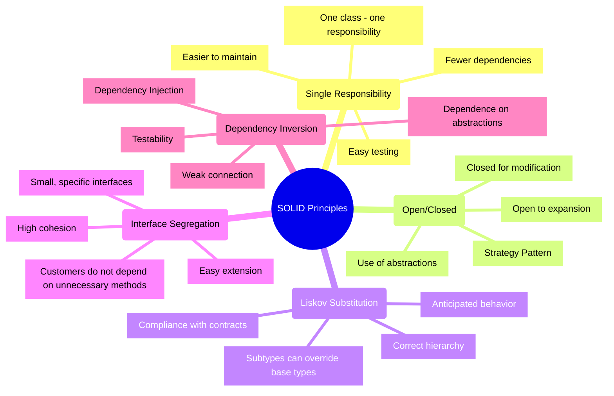

SOLID is an acronym for five fundamental principles of object-oriented programming and design, introduced by Robert Martin.
These principles help create software systems that are:

- Comprehensible - the code is easy to read and understand
- Flexible - easily adapt to changes in requirements
- Maintained - easy to make changes and fix errors
- Scalable - easily expandable with new functionality
- Tested - well covered by automated tests



Code adaptability is a key characteristic of modern software.
Let's consider the main aspects of adaptive code.

- First of all, responsive code is easy to change.
This means that changes have minimal impact on existing functionality due to clear separation of responsibilities and low coupling between components.

- The second important feature is ease of expansion.
New functionality can be added without modifying existing code through the use of abstractions and interfaces, which provides the possibility of flexible replacement of implementations.

- Efficient scaling is the third key feature.
Adaptive code supports both horizontal scaling of components and vertical scaling of functionality thanks to modular architecture.

- The fourth characteristic is good testability of the code.
It is achieved through the possibility of writing unit tests, easy replacement of dependencies and isolation of components.

Speaking about the importance of SOLID principles in modern development, it is worth noting several key aspects.

- The first is complexity management, which is achieved by breaking down complex systems into simple components, creating a clear structure and organization of code, and ensuring clear relationships between parts of the system.

- Preparation for change is the second important aspect of SOLID. Flexible architecture provides the ability to quickly respond to new requirements and minimizes technical debt.

- The third aspect is the improvement of software quality. Applying SOLID principles leads to fewer errors, increased reliability, and better development productivity.

Finally, SOLID principles greatly improve teamwork.
They make it easier to introduce new developers to a project, simplify the code review process, and provide more effective communication through code.

---

## Single Responsibility Principle (SRP)

The principle of single responsibility states that each class should have only one reason for the change.
In other words, a class should perform only one well-defined function or be responsible for one aspect of system functionality.

- The first important aspect is the responsibility of system components. In a well-designed system, each class has a well-defined role and purpose.
Class methods work with a single, well-defined set of data that ensures logical integrity. It is especially important that changes in one part of such a system do not create unexpected side effects in other parts of it.

- The second key aspect is code cohesion. In a properly designed class, all methods are logically related and work to achieve a common goal.
The functionality of such a class is so complete and focused that its purpose can be easily and clearly described in one sentence. This makes the code much easier to understand and maintain.

- The third fundamental aspect is encapsulation. This principle ensures that the internal details of the class implementation are hidden from the outside world.
Instead, the class provides a clear and understandable public interface for interaction. Due to the correct encapsulation, minimal dependencies between different parts of the system are achieved, which makes the code more flexible and resistant to changes.

### ❌ An example of a violation of the principle

```cs
public class UserManager
{
    private readonly string _connectionString;
    private readonly ILogger _logger;
    private readonly IEmailService _emailService;

    public UserManager(string connectionString, ILogger logger, IEmailService emailService)
    {
        _connectionString = connectionString;
        _logger = logger;
        _emailService = emailService;
    }

    public async Task RegisterUser(UserRegistrationDto dto)
    {
        // Data validation
        if (string.IsNullOrEmpty(dto.Email))
            throw new ValidationException("Email is required");
        if (string.IsNullOrEmpty(dto.Password))
            throw new ValidationException("Password is required");
        if (dto.Password.Length < 8)
            throw new ValidationException("Password must be at least 8 characters");

        // Password hashing
        var salt = GenerateSalt();
        var passwordHash = HashPassword(dto.Password, salt);

        // Saving to database
        using (var connection = new SqlConnection(_connectionString))
        {
            await connection.OpenAsync();
            using (var command = connection.CreateCommand())
            {
                command.CommandText = "INSERT INTO Users (Email, PasswordHash, Salt) VALUES (@Email, @PasswordHash, @Salt)";
                command.Parameters.AddWithValue("@Email", dto.Email);
                command.Parameters.AddWithValue("@PasswordHash", passwordHash);
                command.Parameters.AddWithValue("@Salt", salt);
                await command.ExecuteNonQueryAsync();
            }
        }

        // Sending a welcome email
        var emailMessage = new EmailMessage
        {
            To = dto.Email,
            Subject = "Welcome to our platform!",
            Body = "Thank you for registering..."
        };
        await _emailService.SendAsync(emailMessage);

        // Logging in
        _logger.LogInformation($"User {dto.Email} registered successfully at {DateTime.UtcNow}");
    }

    private string GenerateSalt()
    {
        // Salt generation
        byte[] salt = new byte[16];
        using (var rng = new RNGCryptoServiceProvider())
        {
            rng.GetBytes(salt);
        }
        return Convert.ToBase64String(salt);
    }

    private string HashPassword(string password, string salt)
    {
        // Password hashing
        using (var sha256 = SHA256.Create())
        {
            var passwordBytes = Encoding.UTF8.GetBytes(password + salt);
            var hashBytes = sha256.ComputeHash(passwordBytes);
            return Convert.ToBase64String(hashBytes);
        }
    }
}
```

### ✅ Correct implementation

```cs
// Data model
public class UserRegistrationDto
{
    public string Email { get; set; }
    public string Password { get; set; }
}

// Validation
public class UserRegistrationValidator : IValidator<UserRegistrationDto>
{
    public ValidationResult Validate(UserRegistrationDto dto)
    {
        var result = new ValidationResult();

        if (string.IsNullOrEmpty(dto.Email))
            result.AddError("Email is required");

        if (string.IsNullOrEmpty(dto.Password))
            result.AddError("Password is required");
        else if (dto.Password.Length < 8)
            result.AddError("Password must be at least 8 characters");

        return result;
    }
}

// Service for working with passwords
public interface IPasswordService
{
    string GenerateSalt();
    string HashPassword(string password, string salt);
}

public class PasswordService : IPasswordService
{
    public string GenerateSalt()
    {
        byte[] salt = new byte[16];
        using (var rng = new RNGCryptoServiceProvider())
        {
            rng.GetBytes(salt);
        }
        return Convert.ToBase64String(salt);
    }

    public string HashPassword(string password, string salt)
    {
        using (var sha256 = SHA256.Create())
        {
            var passwordBytes = Encoding.UTF8.GetBytes(password + salt);
            var hashBytes = sha256.ComputeHash(passwordBytes);
            return Convert.ToBase64String(hashBytes);
        }
    }
}

// Repository for working with the database
public interface IUserRepository
{
    Task CreateAsync(User user);
    Task<User> GetByEmailAsync(string email);
}

public class UserRepository : IUserRepository
{
    private readonly string _connectionString;

    public UserRepository(string connectionString)
    {
        _connectionString = connectionString;
    }

    public async Task CreateAsync(User user)
    {
        using (var connection = new SqlConnection(_connectionString))
        {
            await connection.OpenAsync();
            using (var command = connection.CreateCommand())
            {
                command.CommandText = "INSERT INTO Users (Email, PasswordHash, Salt) VALUES (@Email, @PasswordHash, @Salt)";
                command.Parameters.AddWithValue("@Email", user.Email);
                command.Parameters.AddWithValue("@PasswordHash", user.PasswordHash);
                command.Parameters.AddWithValue("@Salt", user.Salt);
                await command.ExecuteNonQueryAsync();
            }
        }
    }

    public async Task<User> GetByEmailAsync(string email)
    {
        // Implementation of receiving a user
    }
}

// Email sending service
public interface IEmailService
{
    Task SendWelcomeEmailAsync(string email);
}

public class EmailService : IEmailService
{
    private readonly IEmailClient _emailClient;
    private readonly IEmailTemplateService _templateService;

    public EmailService(IEmailClient emailClient, IEmailTemplateService templateService)
    {
        _emailClient = emailClient;
        _templateService = templateService;
    }

    public async Task SendWelcomeEmailAsync(string email)
    {
        var template = await _templateService.GetTemplateAsync("WelcomeEmail");
        var message = new EmailMessage
        {
            To = email,
            Subject = "Welcome to our platform!",
            Body = template
        };
        await _emailClient.SendAsync(message);
    }
}

// The main registration service
public class UserRegistrationService
{
    private readonly IValidator<UserRegistrationDto> _validator;
    private readonly IPasswordService _passwordService;
    private readonly IUserRepository _userRepository;
    private readonly IEmailService _emailService;
    private readonly ILogger<UserRegistrationService> _logger;

    public UserRegistrationService(
        IValidator<UserRegistrationDto> validator,
        IPasswordService passwordService,
        IUserRepository userRepository,
        IEmailService emailService,
        ILogger<UserRegistrationService> logger)
    {
        _validator = validator;
        _passwordService = passwordService;
        _userRepository = userRepository;
        _emailService = emailService;
        _logger = logger;
    }

    public async Task RegisterUserAsync(UserRegistrationDto dto)
    {
        // Validation
        var validationResult = _validator.Validate(dto);
        if (!validationResult.IsValid)
            throw new ValidationException(validationResult.Errors);

        // Create a user
        var salt = _passwordService.GenerateSalt();
        var passwordHash = _passwordService.HashPassword(dto.Password, salt);

        var user = new User
        {
            Email = dto.Email,
            PasswordHash = passwordHash,
            Salt = salt
        };

        // Preservation
        await _userRepository.CreateAsync(user);

        // Sending email
        await _emailService.SendWelcomeEmailAsync(dto.Email);

        // Logging in
        _logger.LogInformation($"User {dto.Email} registered successfully");
    }
}
```

### Advantages

- The first key benefit is better code organization. When each class has a well-defined purpose, it is much easier for developers to navigate the codebase and find the components they need. This organization makes the system more understandable and transparent for all development participants.

- The second significant advantage is the simplification of the testing process. Since each component is responsible for only one functionality, it can be tested in isolation from other parts of the system. This reduces the need to create complex mocks and stubs, resulting in better test coverage.

- The third important advantage is a significant simplification of the process of making changes to the code. When following the SRP, changes are usually localized within one component, which minimizes the risk of unwanted side effects in other parts of the system. This structure makes the code modification process safer and more predictable.

Overall, the single responsibility principle is a powerful tool for building quality, maintainable, and reliable software.

## Open/Closed Principle (OCP)

The principle of openness/closedness states that software entities (classes, modules, functions, etc.) should be:

- Open to extension: new functionality can be added
- Closed to modification: existing code does not need to be modified

Key aspects of the open/closed principle:

- The first fundamental aspect is the use of abstraction and polymorphism.
This approach is implemented through the active use of interfaces and abstract classes that form a stable foundation of the system.
Defining the right abstractions allows for flexible solutions where polymorphic behavior is achieved through inheritance mechanisms.

- The second important aspect is to ensure system expandability.
The right architecture allows new functionality to be added without the need to modify existing code.
This is achieved by using appropriate design patterns and creating configurable behavior that can easily adapt to new requirements.

- The third key aspect is change encapsulation.
This approach involves isolating those parts of the system that are most likely to change over time.
Thanks to this isolation, the impact of changes on other system components is minimized, and stable public interfaces provide a reliable way of interaction between different parts of the application.

### ❌ An example of a violation of the principle

```cs
public class OrderProcessor
{
    public decimal CalculateDiscount(Order order)
    {
        // Problem: When adding a new discount type
        // existing code must be modified
        switch (order.DiscountType)
        {
            case DiscountType.None:
                return 0;
            case DiscountType.Fixed:
                return order.Amount > 100 ? 20 : 0;
            case DiscountType.Percentage:
                return order.Amount * 0.1m;
            case DiscountType.Seasonal:
                return DateTime.Now.Month == 12 ? order.Amount * 0.2m : 0;
            default:
                throw new ArgumentException("Unknown discount type");
        }
    }
}

// When adding a new type of discount:
public enum DiscountType
{
    None,
    Fixed,
    Percentage,
    Seasonal,
    // You need to add a new type here
    SpecialOffer // New type
}
```

### ✅ Correct implementation

```cs
// 1. We define an abstraction for the discount strategy
public interface IDiscountStrategy
{
    decimal CalculateDiscount(Order order);
}

// 2. We implement specific strategies
public class NoDiscount : IDiscountStrategy
{
    public decimal CalculateDiscount(Order order) => 0;
}

public class FixedDiscount : IDiscountStrategy
{
    private readonly decimal _threshold;
    private readonly decimal _discountAmount;

    public FixedDiscount(decimal threshold, decimal discountAmount)
    {
        _threshold = threshold;
        _discountAmount = discountAmount;
    }

    public decimal CalculateDiscount(Order order)
    {
        return order.Amount > _threshold ? _discountAmount : 0;
    }
}

public class PercentageDiscount : IDiscountStrategy
{
    private readonly decimal _percentage;

    public PercentageDiscount(decimal percentage)
    {
        _percentage = percentage;
    }

    public decimal CalculateDiscount(Order order)
    {
        return order.Amount * (_percentage / 100);
    }
}

public class SeasonalDiscount : IDiscountStrategy
{
    private readonly int _month;
    private readonly decimal _percentage;

    public SeasonalDiscount(int month, decimal percentage)
    {
        _month = month;
        _percentage = percentage;
    }

    public decimal CalculateDiscount(Order order)
    {
        return DateTime.Now.Month == _month ? 
            order.Amount * (_percentage / 100) : 0;
    }
}

// 3. Factory for creating strategies
public interface IDiscountStrategyFactory
{
    IDiscountStrategy CreateStrategy(DiscountType type);
}

public class DiscountStrategyFactory : IDiscountStrategyFactory
{
    public IDiscountStrategy CreateStrategy(DiscountType type)
    {
        return type switch
        {
            DiscountType.None => new NoDiscount(),
            DiscountType.Fixed => new FixedDiscount(100, 20),
            DiscountType.Percentage => new PercentageDiscount(10),
            DiscountType.Seasonal => new SeasonalDiscount(12, 20),
            _ => throw new ArgumentException("Unknown discount type")
        };
    }
}

// 4. An order processor that uses strategies
public class OrderProcessor
{
    private readonly IDiscountStrategyFactory _strategyFactory;

    public OrderProcessor(IDiscountStrategyFactory strategyFactory)
    {
        _strategyFactory = strategyFactory;
    }

    public decimal CalculateDiscount(Order order)
    {
        var strategy = _strategyFactory.CreateStrategy(order.DiscountType);
        return strategy.CalculateDiscount(order);
    }
}

// 5. Adding a new discount strategy without changing the existing code
public class LoyaltyDiscount : IDiscountStrategy
{
    private readonly decimal _pointsPercentage;

    public LoyaltyDiscount(decimal pointsPercentage)
    {
        _pointsPercentage = pointsPercentage;
    }

    public decimal CalculateDiscount(Order order)
    {
        if (order.Customer?.LoyaltyPoints == null)
            return 0;

        return order.Amount * (order.Customer.LoyaltyPoints * _pointsPercentage / 100);
    }
}
```

### Advantages

- The first key advantage is the flexibility of the system.
With the right architecture, it becomes easy to add new functionality with minimal risk of regression, which also makes it easier to scale the system as a whole.

- The second important advantage is improved code support.
There are fewer errors when making changes, problems are easier to localize and fix, and the refactoring process becomes much simpler.

- The third advantage is better testability of the code.
Existing unit tests do not need to be modified when adding new functionality, writing new tests becomes easier, which leads to better code coverage by tests.

- The fourth advantage consists in reducing the connectivity between components.
Components become more independent, have clear boundaries of responsibility, which simplifies their reuse.

> It is important to correctly define system expansion points
{: .prompt-info }
This includes careful analysis of requirements and possible changes, selection of stable abstractions and design of flexible interfaces.
It is important to use inheritance correctly, favoring composition and avoiding deep class hierarchies.
Configuration management also plays an important role.
It is recommended to use DI containers, configuration files, as well as factory and builder to create objects.
> Typical errors
{: .prompt-info }
Excessive abstraction can lead to the creation of unnecessary interfaces and overly complex hierarchies.
Incorrect choice of extension points, including premature or insufficient abstraction, can complicate further development of the system.
It is also important not to violate other SOLID principles when implementing OCP.

In summary, we can say that the principle of openness/closure is fundamental to object-oriented programming.
Its correct application significantly reduces the risks of making changes, improves code quality, simplifies system extension, facilitates testing, and improves code reusability.

## Liskov Substitution Principle (LSP)

Liskov's principle of substitution states that objects of a base class can be replaced by objects of its derived classes without changing the correctness of the program.
In other words, if **A** is a subtype of **B**, then objects of type **B** can be replaced by objects of type **A** without changing the desired properties of the program.

Basic rules of the Liskov Substitution principle, which ensure the correct use of inheritance in object-oriented programming.

- The first group of rules concerns the contractual correspondence between the base class and its descendants.
When designing, it is important to follow the principle that the preconditions of methods cannot be strengthened in a subclass - this means that a method of a subclass cannot require stricter conditions for its execution than a method of the base class.
Also, postconditions cannot be relaxed in a subclass - the result of executing a subclass method must meet all guarantees given by the base class.
In addition, all invariants of the base class must remain valid for the subclass throughout the object's life cycle.

- The second group of rules defines behavioral aspects of inheritance.
Subclass methods must be able to handle all parameters accepted by the corresponding base class method, ensuring full compatibility when used.
At the same time, the subclass can return a more specific type (subtype) of what the base class returns, which allows you to refine the results without breaking the contract.
It is also important that the subclass does not throw exceptions that are not expected from the base class, as this can break the expected behavior of the program.

Compliance with these rules ensures the possibility of safe replacement of objects of the base class with objects of subclasses without violating the correctness of the program.

### ❌ An example of a violation of the principle

```cs
// A classic example of an LSP violation
public class Rectangle
{
    public virtual int Width { get; set; }
    public virtual int Height { get; set; }

    public virtual int CalculateArea()
    {
        return Width * Height;
    }
}

public class Square : Rectangle
{
    private int _size;

    public override int Width
    {
        get => _size;
        set
        {
            _size = value;
            Height = value; // LSP violation
        }
    }

    public override int Height
    {
        get => _size;
        set
        {
            _size = value;
            Width = value; // LSP violation
        }
    }
}

// Code that violates expected behavior
public class GeometryCalculator
{
    public void ProcessRectangle(Rectangle rectangle)
    {
        rectangle.Width = 4;
        rectangle.Height = 5;
        
        // We expect that the area will be 20
        // But for Square we will get 25!
        var area = rectangle.CalculateArea();
    }
}
```

### ✅ Correct implementation

```cs
// 1. Define abstraction for figures
public interface IShape
{
    double CalculateArea();
    double CalculatePerimeter();
}

// 2. Separate implementations for different figures
public class Rectangle : IShape
{
    public double Width { get; }
    public double Height { get; }

    public Rectangle(double width, double height)
    {
        if (width <= 0) throw new ArgumentException("Width must be positive", nameof(width));
        if (height <= 0) throw new ArgumentException("Height must be positive", nameof(height));
        
        Width = width;
        Height = height;
    }

    public double CalculateArea() => Width * Height;
    public double CalculatePerimeter() => 2 * (Width + Height);
}

public class Square : IShape
{
    public double Side { get; }

    public Square(double side)
    {
        if (side <= 0) throw new ArgumentException("Side must be positive", nameof(side));
        Side = side;
    }

    public double CalculateArea() => Side * Side;
    public double CalculatePerimeter() => 4 * Side;
}

// 3. Example of use
public class AreaCalculator
{
    public double CalculateTotalArea(IEnumerable<IShape> shapes)
    {
        return shapes.Sum(shape => shape.CalculateArea());
    }
}
```

### Advantages

- The first advantage is the improved modularity of the system.
Components become more independent, the system is easier to extend, and the code is easier to reuse.

- The second advantage is to increase the reliability of the code.
System behavior becomes more predictable, errors are reduced, and the debugging process is simplified.

- The third advantage is better testability of the code.
The ability to reuse tests for different implementations reduces the amount of test code required and provides better coverage.

- The fourth advantage is the increased flexibility of the system.
It becomes easier to add new types, easier to maintain existing code, and improves the scalability of the system as a whole.

> Recommendations
{: .prompt-info }

Let's start with the key recommendations for implementing LSP.

- The first important recommendation is designing according to the contract.
This means clearly defining the preconditions and postconditions of methods, documenting expected behavior, and using invariants to ensure system integrity.

- The second recommendation concerns the correct use of abstractions.
It is worth giving preference to interfaces over specific implementations, defining clear interaction contracts and avoiding tight coupling between components.

- The third recommendation focuses on substitution testing.
It is important to write tests for base classes that can then be used to test all derived classes.
Using parameterized tests helps ensure the same behavior for all implementations.

- The fourth recommendation emphasizes the importance of following the basic principles of object-oriented programming.

The principle of Liskov substitution is fundamental for creating reliable object-oriented systems.
Its correct application ensures correct type hierarchies, guarantees predictable behavior, improves code quality, simplifies system extensibility, and eases testing and support processes.
As a result, the system becomes more reliable, flexible and easy to maintain.

## Interface Segregation Principle (ISP)

The principle of interface separation states that clients should not depend on methods they do not use.
Large interfaces need to be divided into smaller and more specific ones.

- The first important aspect is the granularity of the interfaces.
This aspect implies that each interface must have a clearly defined and specific purpose in the system.
Experience shows that smaller, well-focused interfaces work better than large and generic ones.
It is especially important that the client code only sees the methods it really needs to work, avoiding dependencies on unnecessary functionality.

- The second key aspect is the cohesion or connectivity of the interfaces.
All methods within the same interface must be logically related to each other and work towards a common goal.
Each interface should represent a single, well-defined concept in the system.
High coupling between interface methods ensures its integrity and makes it easier for developers to understand its purpose.

Proper consideration of these aspects when designing the system helps to create more flexible and maintainable solutions, where each component has a clear responsibility and minimal dependence on other parts of the system.

### ❌ An example of a violation of the principle

```cs
// Too big interface with various functionality
public interface IEmployee
{
    // Personal data
    string GetName();
    string GetAddress();
    DateTime GetBirthDate();
    
    // Salary and Finances
    decimal CalculateSalary();
    void ProcessPayroll();
    decimal CalculateBonus();
    
    // Task management
    void AssignTask(Task task);
    Task[] GetTasks();
    void CompleteTask(Task task);
    
    // Holidays
    void RequestVacation(DateTime start, DateTime end);
    int GetRemainingVacationDays();
    
    // Reporting
    void GeneratePerformanceReport();
    void SubmitTimesheet();
}

// Problematic implementation
public class PartTimeEmployee : IEmployee
{
    public string GetName() => "John Doe";
    public string GetAddress() => "123 Street";
    public DateTime GetBirthDate() => new DateTime(1990, 1, 1);
    
    public decimal CalculateSalary() => 1000m;
    public void ProcessPayroll() { /* ... */ }
    public decimal CalculateBonus() => 0; // Does not receive bonuses
    
    public void AssignTask(Task task) { /* ... */ }
    public Task[] GetTasks() => Array.Empty<Task>();
    public void CompleteTask(Task task) { /* ... */ }
    
    // Methods that do not make sense for part-time employment
    public void RequestVacation(DateTime start, DateTime end) 
        => throw new NotSupportedException();
    public int GetRemainingVacationDays() 
        => throw new NotSupportedException();
    
    public void GeneratePerformanceReport() 
        => throw new NotSupportedException();
    public void SubmitTimesheet() { /* ... */ }
}
```

### ✅ Correct implementation

```cs
// 1. Separated interfaces by functionality
public interface IPersonalInfo
{
    string GetName();
    string GetAddress();
    DateTime GetBirthDate();
}

public interface IPayable
{
    decimal CalculateSalary();
    void ProcessPayroll();
}

public interface IBonusEligible
{
    decimal CalculateBonus();
}

public interface ITaskManageable
{
    void AssignTask(Task task);
    Task[] GetTasks();
    void CompleteTask(Task task);
}

public interface IVacationManageable
{
    void RequestVacation(DateTime start, DateTime end);
    int GetRemainingVacationDays();
}

public interface IReportable
{
    void GeneratePerformanceReport();
}

public interface ITimesheetSubmittable
{
    void SubmitTimesheet();
}

// 2. Implementations for different types of employees
public class FullTimeEmployee : 
    IPersonalInfo, 
    IPayable, 
    IBonusEligible, 
    ITaskManageable, 
    IVacationManageable, 
    IReportable,
    ITimesheetSubmittable
{
    // Implementation of all necessary methods
}

public class PartTimeEmployee : 
    IPersonalInfo, 
    IPayable, 
    ITaskManageable,
    ITimesheetSubmittable
{
    // Implementation of only the necessary methods
}

public class Contractor : 
    IPersonalInfo, 
    IPayable, 
    ITaskManageable,
    ITimesheetSubmittable
{
    // Implementation of only the necessary methods
}
```

### Advantages

- The first key advantage is the increased flexibility and expandability of the system.
When interfaces are properly separated, it becomes much easier to add new features to the system. Developers can simply combine different interfaces to create the desired functionality, while the number of dependencies between components remains minimal.

- The second important advantage is better maintainability of the code.
Small, well-focused interfaces make code more understandable. Making changes becomes easier because modifications are usually limited to a specific interface and are less likely to cause unwanted side effects in other parts of the system.

- The third advantage is improved code testability.
Small interfaces are easier to simulate (moke) in tests, test scenarios become clearer and more understandable, and the overall coverage of the code by tests improves.

- The fourth advantage is the reduction of connectivity between system components.
Components become more independent from each other, work through well-defined contracts, which makes the refactoring process much easier.

In summary, we can say that the principle of separation of interfaces is fundamental for creating flexible and maintainable systems.
Its correct application significantly improves the modularity of the code, simplifies the testing process, facilitates the extension of functionality, reduces the coupling of components and makes the code more adaptable to changes.
When designing interfaces, it is critical to find the optimal balance between their size and functionality, always taking into account the needs of the client code that will use them.

## Dependency Inversion Principle (DIP)

The principle of dependency inversion consists of two key rules:

- High-level modules should not depend on low-level modules. Both must depend on abstractions.
- Abstractions should not depend on details. Details must depend on abstractions.

Key concepts of the principle of dependency inversion and related patterns.

- The first fundamental concept is the use of abstractions.
This approach is based on the active use of interfaces and abstract classes that form stable contracts between system components.
Such abstractions ensure the independence of high-level modules from specific implementations of low-level components, which makes the system more flexible and resistant to changes.

- The second important concept is inversion of control (IoC).
This pattern involves transferring control over the creation and management of objects from the application to a specialized framework.
The IoC container takes responsibility for the configuration of dependencies and the management of the life cycle of objects, which greatly simplifies the system architecture and improves its testability.

- The third key concept is Dependency Injection, which offers various mechanisms for transferring dependencies to objects.
Constructor Injection involves the transfer of all necessary dependencies through the constructor, which provides an explicit declaration of the object's requirements.
Property Injection allows you to set dependencies via object properties, which can be useful for optional dependencies.
Method Injection is used when dependencies are needed only for certain operations and are passed directly to methods.

Together, these concepts form a powerful toolkit for building loosely coupled, easily testable, and flexible systems.

### ❌ An example of a violation of the principle

```cs
// Tightly coupled code with direct dependencies
public class CustomerService
{
    private readonly SqlConnection _connection;
    private readonly EmailClient _emailClient;
    private readonly FileLogger _logger;

    public CustomerService()
    {
        _connection = new SqlConnection("connection_string");
        _emailClient = new EmailClient("smtp.server.com");
        _logger = new FileLogger("app.log");
    }

    public void RegisterCustomer(CustomerDto dto)
    {
        try
        {
            // Direct work with SQL
            using (var command = _connection.CreateCommand())
            {
                command.CommandText = "INSERT INTO Customers...";
                // ...
            }

            // Direct email
            _emailClient.Send(new EmailMessage
            {
                To = dto.Email,
                Subject = "Welcome!",
                Body = "Thank you for registering..."
            });

            // Direct login
            _logger.Log($"Customer {dto.Email} registered successfully");
        }
        catch (Exception ex)
        {
            _logger.Log($"Error registering customer: {ex.Message}");
            throw;
        }
    }
}
```

### ✅ Correct implementation

```cs
// 1. Definition of abstractions
public interface ICustomerRepository
{
    Task<Customer> GetByIdAsync(int id);
    Task<Customer> GetByEmailAsync(string email);
    Task CreateAsync(Customer customer);
    Task UpdateAsync(Customer customer);
}

public interface IEmailService
{
    Task SendWelcomeEmailAsync(string email, string name);
    Task SendPasswordResetEmailAsync(string email, string resetToken);
}

public interface ILogger
{
    Task LogInfoAsync(string message);
    Task LogErrorAsync(string message, Exception exception = null);
}

// 2. Implementations
public class SqlCustomerRepository : ICustomerRepository
{
    private readonly string _connectionString;
    private readonly ILogger _logger;

    public SqlCustomerRepository(string connectionString, ILogger logger)
    {
        _connectionString = connectionString;
        _logger = logger;
    }

    public async Task<Customer> GetByIdAsync(int id)
    {
        try
        {
            using var connection = new SqlConnection(_connectionString);
            await connection.OpenAsync();
            
            var customer = await connection.QuerySingleOrDefaultAsync<Customer>(
                "SELECT * FROM Customers WHERE Id = @Id",
                new { Id = id }
            );

            _logger.LogInformation($"Retrieved customer {id}");
            return customer;
        }
        catch (Exception ex)
        {
            _logger.LogError($"Error retrieving customer {Exception}", ex);
            throw;
        }
    }

    // Other methods...
}

public class SmtpEmailService : IEmailService
{
    private readonly SmtpClient _smtpClient;
    private readonly ILogger _logger;
    private readonly IEmailTemplateService _templateService;

    public SmtpEmailService(
        SmtpClient smtpClient,
        ILogger logger,
        IEmailTemplateService templateService)
    {
        _smtpClient = smtpClient;
        _logger = logger;
        _templateService = templateService;
    }

    public async Task SendWelcomeEmailAsync(string email, string name)
    {
        try
        {
            var template = await _templateService.GetTemplateAsync("WelcomeEmail");
            var body = template.Replace("{Name}", name);

            var message = new MailMessage
            {
                To = { email },
                Subject = "Welcome to our platform!",
                Body = body,
                IsBodyHtml = true
            };

            await _smtpClient.SendMailAsync(message);
            _logger.LogInformation($"Welcome email sent to {email}");
        }
        catch (Exception ex)
        {
            _logger.LogError($"Error sending welcome email to {Exception}", ex);
            throw;
        }
    }

    // Other methods...
}

// 3. High level service
public class CustomerService
{
    private readonly ICustomerRepository _customerRepository;
    private readonly IEmailService _emailService;
    private readonly ILogger _logger;
    private readonly IValidator<CustomerDto> _validator;

    public CustomerService(
        ICustomerRepository customerRepository,
        IEmailService emailService,
        ILogger logger,
        IValidator<CustomerDto> validator)
    {
        _customerRepository = customerRepository;
        _emailService = emailService;
        _logger = logger;
        _validator = validator;
    }

    public async Task RegisterCustomerAsync(CustomerDto dto)
    {
        try
        {
            // Validation
            var validationResult = await _validator.ValidateAsync(dto);
            if (!validationResult.IsValid)
            {
                throw new ValidationException(validationResult.Errors);
            }

            // Check for duplicates
            var existingCustomer = await _customerRepository.GetByEmailAsync(dto.Email);
            if (existingCustomer != null)
            {
                throw new DuplicateEmailException(dto.Email);
            }

            // Creating a client
            var customer = new Customer
            {
                Name = dto.Name,
                Email = dto.Email,
                // Other fields...
            };

            await _customerRepository.CreateAsync(customer);
            _logger.LogInformation($"Created new customer: {customer.Email}");

            // Sending email
            await _emailService.SendWelcomeEmailAsync(customer.Email, customer.Name);
        }
        catch (Exception ex)
        {
            _logger.LogError(ex, "Error registering customer");
            throw;
        }
    }
}

// 4. Configuration of dependencies
public class Startup
{
    public void ConfigureServices(IServiceCollection services)
    {
        // Registration of dependencies
        services.AddScoped<ICustomerRepository, SqlCustomerRepository>();
        services.AddScoped<IEmailService, SmtpEmailService>();
        services.AddSingleton<ILogger, ApplicationLogger>();
        services.AddTransient<IValidator<CustomerDto>, CustomerDtoValidator>();
        services.AddScoped<CustomerService>();

        // Configuration options
        services.Configure<SqlOptions>(configuration.GetSection("SqlDatabase"));
        services.Configure<SmtpOptions>(configuration.GetSection("SmtpSettings"));
    }
}
```

### Advantages

Advantages of using the Dependency Inversion Principle (DIP) and its impact on software architecture.

- The first key advantage is the achievement of loose coupling between system components.
By relying on abstractions rather than concrete implementations, components become more independent of each other.
This provides easy replacement of components and better control over dependencies in the system.

- The second significant advantage is improved testability of the code.
When using DIP, it becomes much easier to create mock objects for testing, because the tests work with abstractions.
This allows you to write truly isolated tests and achieve better code coverage with tests.

- The third advantage is the increased flexibility and expandability of the system.
The ability to easily replace implementations and easily add new functionality makes the system more adaptable to changes.
Control over system configuration is also improved.

- The fourth advantage is the improvement of the overall design of the system.
DIP helps create clear boundaries of responsibility between components, makes system structure more understandable, and simplifies code reuse.

Summarizing, we can say that the principle of inversion of dependencies is fundamental for creating high-quality software systems.
Its correct application, together with the IoC and DI patterns, significantly reduces code connectivity, improves testability, simplifies functionality expansion, facilitates support and refactoring, and makes the system more adaptable to changes.
When designing systems, it is critical to define the right abstractions and carefully think through the interaction between components, always following the principle of dependence on abstractions, not on concrete implementations.

## Conclusion

SOLID principles are really not just theoretical concepts, but powerful practical tools for creating quality software.
Their systematic application helps create code that is easy to maintain and modify throughout the project's lifecycle.
They also significantly reduce the complexity of the system, making it more understandable and manageable.

A particularly important aspect is that SOLID principles greatly improve code testability.
When code is written following these principles, writing and maintaining tests becomes much easier.
This, in turn, leads to an increase in the quality and reliability of the software.

With the correct application of SOLID principles, developers get code that is not only easy to understand and test, but also convenient to extend with new functionality.
Such code is more efficient to maintain for a long time, and the refactoring process becomes more predictable and safe.

> It is important to remember
{: .prompt-info }
SOLID is just principles, not rigid rules. Their application should be balanced and take into account the specifics of a specific project, its scale, requirements and limitations.
Excessive or dogmatic adherence to these principles can lead to unnecessary complexity of the code and decrease its efficiency.
> Recommended reading
{: .prompt-info }
[Adaptive Code via C#: Agile coding with design patterns and SOLID principles](https://www.amazon.com/Adaptive-Code-via-principles-Developer/dp/0735683204){:target="_blank"}