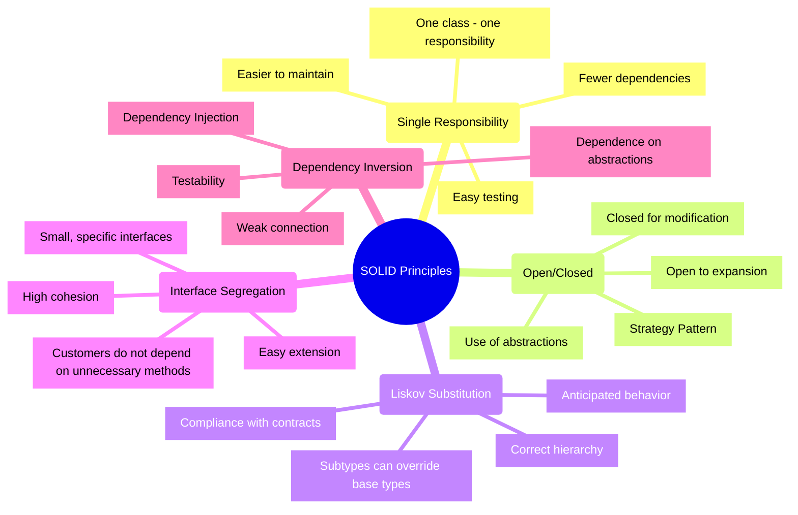

SOLID is an acronym for five fundamental principles of object-oriented programming and design, introduced by Robert Martin.
These principles help you build software that is:

- Understandable - the code is easy to read
- Flexible - it adapts easily to changing requirements
- Maintainable - changes and bug fixes are simple to make
- Scalable - new functionality is easy to add
- Testable - it's easy to cover with automated tests



Adaptive code is code that survives changing requirements.
Changes to it touch as little existing functionality as possible, because responsibilities are clearly separated and components are loosely coupled.
You can add new functionality without modifying existing code: abstractions and interfaces let you swap implementations.
A modular architecture lets you scale components horizontally and grow functionality vertically.
And isolated components with easily replaceable dependencies are simple to cover with unit tests.

SOLID leads you to exactly this kind of code.
The principles help you manage complexity: a large system gets broken into simple components with a clear structure and clear relationships between the parts.
A flexible architecture lets you react quickly to new requirements without piling up technical debt.
In practice that means fewer bugs, a more reliable system and more productive development.
The team wins too: new developers get up to speed faster, code review is simpler, and the code itself communicates better what it does.

---

## Single Responsibility Principle (SRP)

The principle of single responsibility states that each class should have only one reason for the change.
In other words, a class should perform only one well-defined function or be responsible for one aspect of system functionality.

In practice this means every class has a clear role, and its methods work with a single, well-defined set of data.
A change in one part of the system then doesn't cause unexpected side effects somewhere else.

The methods of a well-designed class are logically related and work toward a common goal, so you can describe the class's purpose in one sentence.
If one sentence isn't enough, the class is probably doing too much.

The third piece is encapsulation. The class hides its implementation details and exposes only a clear public interface.
The less the rest of the system knows about its internals, the fewer dependencies there are and the easier the class is to change.

### ❌ An example of a violation of the principle

```cs
public class UserManager
{
    private readonly string _connectionString;
    private readonly ILogger _logger;
    private readonly IEmailService _emailService;

    public UserManager(string connectionString, ILogger logger, IEmailService emailService)
    {
        _connectionString = connectionString;
        _logger = logger;
        _emailService = emailService;
    }

    public async Task RegisterUser(UserRegistrationDto dto)
    {
        // Data validation
        if (string.IsNullOrEmpty(dto.Email))
            throw new ValidationException("Email is required");
        if (string.IsNullOrEmpty(dto.Password))
            throw new ValidationException("Password is required");
        if (dto.Password.Length < 8)
            throw new ValidationException("Password must be at least 8 characters");

        // Password hashing
        var salt = GenerateSalt();
        var passwordHash = HashPassword(dto.Password, salt);

        // Saving to database
        using (var connection = new SqlConnection(_connectionString))
        {
            await connection.OpenAsync();
            using (var command = connection.CreateCommand())
            {
                command.CommandText = "INSERT INTO Users (Email, PasswordHash, Salt) VALUES (@Email, @PasswordHash, @Salt)";
                command.Parameters.AddWithValue("@Email", dto.Email);
                command.Parameters.AddWithValue("@PasswordHash", passwordHash);
                command.Parameters.AddWithValue("@Salt", salt);
                await command.ExecuteNonQueryAsync();
            }
        }

        // Sending a welcome email
        var emailMessage = new EmailMessage
        {
            To = dto.Email,
            Subject = "Welcome to our platform!",
            Body = "Thank you for registering..."
        };
        await _emailService.SendAsync(emailMessage);

        // Logging in
        _logger.LogInformation($"User {dto.Email} registered successfully at {DateTime.UtcNow}");
    }

    private string GenerateSalt()
    {
        // Salt generation
        byte[] salt = new byte[16];
        using (var rng = new RNGCryptoServiceProvider())
        {
            rng.GetBytes(salt);
        }
        return Convert.ToBase64String(salt);
    }

    private string HashPassword(string password, string salt)
    {
        // Password hashing
        using (var sha256 = SHA256.Create())
        {
            var passwordBytes = Encoding.UTF8.GetBytes(password + salt);
            var hashBytes = sha256.ComputeHash(passwordBytes);
            return Convert.ToBase64String(hashBytes);
        }
    }
}
```

### ✅ Correct implementation

```cs
// Data model
public class UserRegistrationDto
{
    public string Email { get; set; }
    public string Password { get; set; }
}

// Validation
public class UserRegistrationValidator : IValidator<UserRegistrationDto>
{
    public ValidationResult Validate(UserRegistrationDto dto)
    {
        var result = new ValidationResult();

        if (string.IsNullOrEmpty(dto.Email))
            result.AddError("Email is required");

        if (string.IsNullOrEmpty(dto.Password))
            result.AddError("Password is required");
        else if (dto.Password.Length < 8)
            result.AddError("Password must be at least 8 characters");

        return result;
    }
}

// Service for working with passwords
public interface IPasswordService
{
    string GenerateSalt();
    string HashPassword(string password, string salt);
}

public class PasswordService : IPasswordService
{
    public string GenerateSalt()
    {
        byte[] salt = new byte[16];
        using (var rng = new RNGCryptoServiceProvider())
        {
            rng.GetBytes(salt);
        }
        return Convert.ToBase64String(salt);
    }

    public string HashPassword(string password, string salt)
    {
        using (var sha256 = SHA256.Create())
        {
            var passwordBytes = Encoding.UTF8.GetBytes(password + salt);
            var hashBytes = sha256.ComputeHash(passwordBytes);
            return Convert.ToBase64String(hashBytes);
        }
    }
}

// Repository for working with the database
public interface IUserRepository
{
    Task CreateAsync(User user);
    Task<User> GetByEmailAsync(string email);
}

public class UserRepository : IUserRepository
{
    private readonly string _connectionString;

    public UserRepository(string connectionString)
    {
        _connectionString = connectionString;
    }

    public async Task CreateAsync(User user)
    {
        using (var connection = new SqlConnection(_connectionString))
        {
            await connection.OpenAsync();
            using (var command = connection.CreateCommand())
            {
                command.CommandText = "INSERT INTO Users (Email, PasswordHash, Salt) VALUES (@Email, @PasswordHash, @Salt)";
                command.Parameters.AddWithValue("@Email", user.Email);
                command.Parameters.AddWithValue("@PasswordHash", user.PasswordHash);
                command.Parameters.AddWithValue("@Salt", user.Salt);
                await command.ExecuteNonQueryAsync();
            }
        }
    }

    public async Task<User> GetByEmailAsync(string email)
    {
        // Implementation of receiving a user
    }
}

// Email sending service
public interface IEmailService
{
    Task SendWelcomeEmailAsync(string email);
}

public class EmailService : IEmailService
{
    private readonly IEmailClient _emailClient;
    private readonly IEmailTemplateService _templateService;

    public EmailService(IEmailClient emailClient, IEmailTemplateService templateService)
    {
        _emailClient = emailClient;
        _templateService = templateService;
    }

    public async Task SendWelcomeEmailAsync(string email)
    {
        var template = await _templateService.GetTemplateAsync("WelcomeEmail");
        var message = new EmailMessage
        {
            To = email,
            Subject = "Welcome to our platform!",
            Body = template
        };
        await _emailClient.SendAsync(message);
    }
}

// The main registration service
public class UserRegistrationService
{
    private readonly IValidator<UserRegistrationDto> _validator;
    private readonly IPasswordService _passwordService;
    private readonly IUserRepository _userRepository;
    private readonly IEmailService _emailService;
    private readonly ILogger<UserRegistrationService> _logger;

    public UserRegistrationService(
        IValidator<UserRegistrationDto> validator,
        IPasswordService passwordService,
        IUserRepository userRepository,
        IEmailService emailService,
        ILogger<UserRegistrationService> logger)
    {
        _validator = validator;
        _passwordService = passwordService;
        _userRepository = userRepository;
        _emailService = emailService;
        _logger = logger;
    }

    public async Task RegisterUserAsync(UserRegistrationDto dto)
    {
        // Validation
        var validationResult = _validator.Validate(dto);
        if (!validationResult.IsValid)
            throw new ValidationException(validationResult.Errors);

        // Create a user
        var salt = _passwordService.GenerateSalt();
        var passwordHash = _passwordService.HashPassword(dto.Password, salt);

        var user = new User
        {
            Email = dto.Email,
            PasswordHash = passwordHash,
            Salt = salt
        };

        // Preservation
        await _userRepository.CreateAsync(user);

        // Sending email
        await _emailService.SendWelcomeEmailAsync(dto.Email);

        // Logging in
        _logger.LogInformation($"User {dto.Email} registered successfully");
    }
}
```

### Advantages

SRP shows up most clearly in code organization: when each class has one purpose, it's easy to find your way around the codebase and locate what you need.

Testing gets easier too. A component with a single responsibility can be tested in isolation, without complex mocks and stubs, so test coverage goes up.

And changes become safer. They usually stay inside one component, so the risk of breaking something next to it is minimal and the outcome of a change is predictable.

## Open/Closed Principle (OCP)

The principle of openness/closedness states that software entities (classes, modules, functions, etc.) should be:

- Open to extension: new functionality can be added
- Closed to modification: existing code does not need to be modified

The principle rests on abstraction and polymorphism.
Interfaces and abstract classes form a stable foundation, and the concrete behavior comes in through implementations and inheritance.
With the right abstractions in place, new functionality is added without touching existing code, through suitable design patterns and configurable behavior.

The other half of the idea is encapsulating change.
The parts of the system most likely to change are isolated behind stable public interfaces, so changes to them don't ripple into other components.

### ❌ An example of a violation of the principle

```cs
public class OrderProcessor
{
    public decimal CalculateDiscount(Order order)
    {
        // Problem: When adding a new discount type
        // existing code must be modified
        switch (order.DiscountType)
        {
            case DiscountType.None:
                return 0;
            case DiscountType.Fixed:
                return order.Amount > 100 ? 20 : 0;
            case DiscountType.Percentage:
                return order.Amount * 0.1m;
            case DiscountType.Seasonal:
                return DateTime.Now.Month == 12 ? order.Amount * 0.2m : 0;
            default:
                throw new ArgumentException("Unknown discount type");
        }
    }
}

// When adding a new type of discount:
public enum DiscountType
{
    None,
    Fixed,
    Percentage,
    Seasonal,
    // You need to add a new type here
    SpecialOffer // New type
}
```

### ✅ Correct implementation

```cs
// 1. We define an abstraction for the discount strategy
public interface IDiscountStrategy
{
    decimal CalculateDiscount(Order order);
}

// 2. We implement specific strategies
public class NoDiscount : IDiscountStrategy
{
    public decimal CalculateDiscount(Order order) => 0;
}

public class FixedDiscount : IDiscountStrategy
{
    private readonly decimal _threshold;
    private readonly decimal _discountAmount;

    public FixedDiscount(decimal threshold, decimal discountAmount)
    {
        _threshold = threshold;
        _discountAmount = discountAmount;
    }

    public decimal CalculateDiscount(Order order)
    {
        return order.Amount > _threshold ? _discountAmount : 0;
    }
}

public class PercentageDiscount : IDiscountStrategy
{
    private readonly decimal _percentage;

    public PercentageDiscount(decimal percentage)
    {
        _percentage = percentage;
    }

    public decimal CalculateDiscount(Order order)
    {
        return order.Amount * (_percentage / 100);
    }
}

public class SeasonalDiscount : IDiscountStrategy
{
    private readonly int _month;
    private readonly decimal _percentage;

    public SeasonalDiscount(int month, decimal percentage)
    {
        _month = month;
        _percentage = percentage;
    }

    public decimal CalculateDiscount(Order order)
    {
        return DateTime.Now.Month == _month ? 
            order.Amount * (_percentage / 100) : 0;
    }
}

// 3. Factory for creating strategies
public interface IDiscountStrategyFactory
{
    IDiscountStrategy CreateStrategy(DiscountType type);
}

public class DiscountStrategyFactory : IDiscountStrategyFactory
{
    public IDiscountStrategy CreateStrategy(DiscountType type)
    {
        return type switch
        {
            DiscountType.None => new NoDiscount(),
            DiscountType.Fixed => new FixedDiscount(100, 20),
            DiscountType.Percentage => new PercentageDiscount(10),
            DiscountType.Seasonal => new SeasonalDiscount(12, 20),
            _ => throw new ArgumentException("Unknown discount type")
        };
    }
}

// 4. An order processor that uses strategies
public class OrderProcessor
{
    private readonly IDiscountStrategyFactory _strategyFactory;

    public OrderProcessor(IDiscountStrategyFactory strategyFactory)
    {
        _strategyFactory = strategyFactory;
    }

    public decimal CalculateDiscount(Order order)
    {
        var strategy = _strategyFactory.CreateStrategy(order.DiscountType);
        return strategy.CalculateDiscount(order);
    }
}

// 5. Adding a new discount strategy without changing the existing code
public class LoyaltyDiscount : IDiscountStrategy
{
    private readonly decimal _pointsPercentage;

    public LoyaltyDiscount(decimal pointsPercentage)
    {
        _pointsPercentage = pointsPercentage;
    }

    public decimal CalculateDiscount(Order order)
    {
        if (order.Customer?.LoyaltyPoints == null)
            return 0;

        return order.Amount * (order.Customer.LoyaltyPoints * _pointsPercentage / 100);
    }
}
```

### Advantages

With OCP you can add new functionality with minimal risk of regression, and the system is easier to scale.
Changes introduce fewer bugs, problems are easier to localize and fix, and refactoring gets much simpler.
Existing unit tests don't need rewriting when new functionality arrives, and new tests are easier to write.
Components are less coupled and have clear boundaries of responsibility, which makes them easier to reuse.

> Choosing extension points
{: .prompt-info }
Start by analyzing the requirements and the changes you can expect, pick out stable abstractions, and design flexible interfaces around them.
Be careful with inheritance: favor composition and avoid deep class hierarchies.
DI containers, configuration files, and factories and builders for object creation are convenient ways to wire up the extension points themselves.
> Typical errors
{: .prompt-info }
Too much abstraction produces unnecessary interfaces and overly complex hierarchies.
Poorly chosen extension points, whether the abstraction is premature or insufficient, make the system harder to evolve.
And while implementing OCP, it's easy to break one of the other SOLID principles.

## Liskov Substitution Principle (LSP)

Liskov's principle of substitution states that objects of a base class can be replaced by objects of its derived classes without changing the correctness of the program.
In other words, if **A** is a subtype of **B**, then objects of type **B** can be replaced by objects of type **A** without changing the desired properties of the program.

In practice it comes down to two groups of rules.

The first is about the contract between a base class and its descendants.
A subclass can't strengthen preconditions: its method mustn't demand stricter conditions to run than the base class method.
Postconditions, on the other hand, can't be weakened: the result of the subclass method has to meet every guarantee the base class gives.
And all invariants of the base class must remain valid for the subclass throughout the object's lifetime.

The second group is about behavior.
A subclass method has to accept every parameter the corresponding base class method accepts.
It can return a more specific type (a subtype) - that refines the result without breaking the contract.
And a subclass shouldn't throw exceptions nobody expects from the base class, or code that works with the base type will behave unpredictably.

Follow these rules and you can safely replace a base class object with a subclass object without breaking the program.

### ❌ An example of a violation of the principle

```cs
// A classic example of an LSP violation
public class Rectangle
{
    public virtual int Width { get; set; }
    public virtual int Height { get; set; }

    public virtual int CalculateArea()
    {
        return Width * Height;
    }
}

public class Square : Rectangle
{
    private int _size;

    public override int Width
    {
        get => _size;
        set
        {
            _size = value;
            Height = value; // LSP violation
        }
    }

    public override int Height
    {
        get => _size;
        set
        {
            _size = value;
            Width = value; // LSP violation
        }
    }
}

// Code that violates expected behavior
public class GeometryCalculator
{
    public void ProcessRectangle(Rectangle rectangle)
    {
        rectangle.Width = 4;
        rectangle.Height = 5;
        
        // We expect that the area will be 20
        // But for Square we will get 25!
        var area = rectangle.CalculateArea();
    }
}
```

### ✅ Correct implementation

```cs
// 1. Define abstraction for figures
public interface IShape
{
    double CalculateArea();
    double CalculatePerimeter();
}

// 2. Separate implementations for different figures
public class Rectangle : IShape
{
    public double Width { get; }
    public double Height { get; }

    public Rectangle(double width, double height)
    {
        if (width <= 0) throw new ArgumentException("Width must be positive", nameof(width));
        if (height <= 0) throw new ArgumentException("Height must be positive", nameof(height));
        
        Width = width;
        Height = height;
    }

    public double CalculateArea() => Width * Height;
    public double CalculatePerimeter() => 2 * (Width + Height);
}

public class Square : IShape
{
    public double Side { get; }

    public Square(double side)
    {
        if (side <= 0) throw new ArgumentException("Side must be positive", nameof(side));
        Side = side;
    }

    public double CalculateArea() => Side * Side;
    public double CalculatePerimeter() => 4 * Side;
}

// 3. Example of use
public class AreaCalculator
{
    public double CalculateTotalArea(IEnumerable<IShape> shapes)
    {
        return shapes.Sum(shape => shape.CalculateArea());
    }
}
```

### Advantages

When subclasses honor the contract, components become more independent, the system is easier to extend, and the code is easier to reuse.
System behavior is more predictable, there are fewer bugs, and debugging is simpler.

There's also a practical bonus for tests: you can run one test suite against every implementation, so you need less test code and get better coverage.
New types are easy to add, existing code is easier to maintain, and the system scales better.

> Recommendations
{: .prompt-info }

- Design by contract: define preconditions and postconditions of methods clearly, document the expected behavior, and use invariants to keep the system consistent.

- Prefer interfaces over concrete implementations, define clear interaction contracts, and avoid tight coupling between components.

- Test substitution: write tests for the base class in a way that lets you run them against every derived class. Parameterized tests help confirm that all implementations behave the same way.

- Stick to the basic principles of object-oriented programming.

## Interface Segregation Principle (ISP)

The principle of interface separation states that clients should not depend on methods they do not use.
Large interfaces need to be divided into smaller and more specific ones.

Two things matter here.

The first is granularity. Each interface should have a clear, specific purpose.
Smaller, focused interfaces work better in practice than large generic ones: client code sees only the methods it actually needs and doesn't depend on anything extra.

The second is cohesion. The methods of one interface should be logically related and work toward a common goal, and the interface itself should represent a single, well-defined concept.
Such an interface is easier for developers to understand, and the system ends up more flexible: each component has a clear responsibility and minimal dependencies on the others.

### ❌ An example of a violation of the principle

```cs
// Too big interface with various functionality
public interface IEmployee
{
    // Personal data
    string GetName();
    string GetAddress();
    DateTime GetBirthDate();
    
    // Salary and Finances
    decimal CalculateSalary();
    void ProcessPayroll();
    decimal CalculateBonus();
    
    // Task management
    void AssignTask(Task task);
    Task[] GetTasks();
    void CompleteTask(Task task);
    
    // Holidays
    void RequestVacation(DateTime start, DateTime end);
    int GetRemainingVacationDays();
    
    // Reporting
    void GeneratePerformanceReport();
    void SubmitTimesheet();
}

// Problematic implementation
public class PartTimeEmployee : IEmployee
{
    public string GetName() => "John Doe";
    public string GetAddress() => "123 Street";
    public DateTime GetBirthDate() => new DateTime(1990, 1, 1);
    
    public decimal CalculateSalary() => 1000m;
    public void ProcessPayroll() { /* ... */ }
    public decimal CalculateBonus() => 0; // Does not receive bonuses
    
    public void AssignTask(Task task) { /* ... */ }
    public Task[] GetTasks() => Array.Empty<Task>();
    public void CompleteTask(Task task) { /* ... */ }
    
    // Methods that do not make sense for part-time employment
    public void RequestVacation(DateTime start, DateTime end) 
        => throw new NotSupportedException();
    public int GetRemainingVacationDays() 
        => throw new NotSupportedException();
    
    public void GeneratePerformanceReport() 
        => throw new NotSupportedException();
    public void SubmitTimesheet() { /* ... */ }
}
```

### ✅ Correct implementation

```cs
// 1. Separated interfaces by functionality
public interface IPersonalInfo
{
    string GetName();
    string GetAddress();
    DateTime GetBirthDate();
}

public interface IPayable
{
    decimal CalculateSalary();
    void ProcessPayroll();
}

public interface IBonusEligible
{
    decimal CalculateBonus();
}

public interface ITaskManageable
{
    void AssignTask(Task task);
    Task[] GetTasks();
    void CompleteTask(Task task);
}

public interface IVacationManageable
{
    void RequestVacation(DateTime start, DateTime end);
    int GetRemainingVacationDays();
}

public interface IReportable
{
    void GeneratePerformanceReport();
}

public interface ITimesheetSubmittable
{
    void SubmitTimesheet();
}

// 2. Implementations for different types of employees
public class FullTimeEmployee : 
    IPersonalInfo, 
    IPayable, 
    IBonusEligible, 
    ITaskManageable, 
    IVacationManageable, 
    IReportable,
    ITimesheetSubmittable
{
    // Implementation of all necessary methods
}

public class PartTimeEmployee : 
    IPersonalInfo, 
    IPayable, 
    ITaskManageable,
    ITimesheetSubmittable
{
    // Implementation of only the necessary methods
}

public class Contractor : 
    IPersonalInfo, 
    IPayable, 
    ITaskManageable,
    ITimesheetSubmittable
{
    // Implementation of only the necessary methods
}
```

### Advantages

When interfaces are split properly, you add new capabilities by combining several interfaces, and dependencies between components stay minimal.
Small interfaces are also easier to understand and change: a modification is usually limited to one interface and is less likely to affect other parts of the system.

In tests the difference is immediate. A small interface is easy to mock, test scenarios are clearer, and coverage improves.
And since components work through well-defined contracts and depend less on each other, refactoring becomes much easier.

The hard part of ISP is the balance between an interface's size and its functionality.
Let the needs of the client code that will use the interface guide you.

## Dependency Inversion Principle (DIP)

The principle of dependency inversion consists of two key rules:

- High-level modules should not depend on low-level modules. Both must depend on abstractions.
- Abstractions should not depend on details. Details must depend on abstractions.

Dependency inversion usually comes up together with inversion of control and dependency injection, and all three ideas rest on abstractions.

Interfaces and abstract classes define stable contracts between components.
Thanks to them, high-level modules don't depend on the concrete implementations of low-level ones, and the system copes with change more easily.

Inversion of control (IoC) goes a step further: the application hands the creation and management of objects over to a specialized framework.
The IoC container configures dependencies and manages object lifetimes, which simplifies the architecture and testing.

Dependency Injection is the set of concrete ways to hand dependencies to an object:

- Constructor Injection - all required dependencies come through the constructor, so the object's requirements are explicit.
- Property Injection - dependencies are set through properties; handy for optional dependencies.
- Method Injection - the dependency is passed straight into a method when it's needed only for a specific operation.

### ❌ An example of a violation of the principle

```cs
// Tightly coupled code with direct dependencies
public class CustomerService
{
    private readonly SqlConnection _connection;
    private readonly EmailClient _emailClient;
    private readonly FileLogger _logger;

    public CustomerService()
    {
        _connection = new SqlConnection("connection_string");
        _emailClient = new EmailClient("smtp.server.com");
        _logger = new FileLogger("app.log");
    }

    public void RegisterCustomer(CustomerDto dto)
    {
        try
        {
            // Direct work with SQL
            using (var command = _connection.CreateCommand())
            {
                command.CommandText = "INSERT INTO Customers...";
                // ...
            }

            // Direct email
            _emailClient.Send(new EmailMessage
            {
                To = dto.Email,
                Subject = "Welcome!",
                Body = "Thank you for registering..."
            });

            // Direct login
            _logger.Log($"Customer {dto.Email} registered successfully");
        }
        catch (Exception ex)
        {
            _logger.Log($"Error registering customer: {ex.Message}");
            throw;
        }
    }
}
```

### ✅ Correct implementation

```cs
// 1. Definition of abstractions
public interface ICustomerRepository
{
    Task<Customer> GetByIdAsync(int id);
    Task<Customer> GetByEmailAsync(string email);
    Task CreateAsync(Customer customer);
    Task UpdateAsync(Customer customer);
}

public interface IEmailService
{
    Task SendWelcomeEmailAsync(string email, string name);
    Task SendPasswordResetEmailAsync(string email, string resetToken);
}

public interface ILogger
{
    Task LogInfoAsync(string message);
    Task LogErrorAsync(string message, Exception exception = null);
}

// 2. Implementations
public class SqlCustomerRepository : ICustomerRepository
{
    private readonly string _connectionString;
    private readonly ILogger _logger;

    public SqlCustomerRepository(string connectionString, ILogger logger)
    {
        _connectionString = connectionString;
        _logger = logger;
    }

    public async Task<Customer> GetByIdAsync(int id)
    {
        try
        {
            using var connection = new SqlConnection(_connectionString);
            await connection.OpenAsync();
            
            var customer = await connection.QuerySingleOrDefaultAsync<Customer>(
                "SELECT * FROM Customers WHERE Id = @Id",
                new { Id = id }
            );

            _logger.LogInformation($"Retrieved customer {id}");
            return customer;
        }
        catch (Exception ex)
        {
            _logger.LogError($"Error retrieving customer {Exception}", ex);
            throw;
        }
    }

    // Other methods...
}

public class SmtpEmailService : IEmailService
{
    private readonly SmtpClient _smtpClient;
    private readonly ILogger _logger;
    private readonly IEmailTemplateService _templateService;

    public SmtpEmailService(
        SmtpClient smtpClient,
        ILogger logger,
        IEmailTemplateService templateService)
    {
        _smtpClient = smtpClient;
        _logger = logger;
        _templateService = templateService;
    }

    public async Task SendWelcomeEmailAsync(string email, string name)
    {
        try
        {
            var template = await _templateService.GetTemplateAsync("WelcomeEmail");
            var body = template.Replace("{Name}", name);

            var message = new MailMessage
            {
                To = { email },
                Subject = "Welcome to our platform!",
                Body = body,
                IsBodyHtml = true
            };

            await _smtpClient.SendMailAsync(message);
            _logger.LogInformation($"Welcome email sent to {email}");
        }
        catch (Exception ex)
        {
            _logger.LogError($"Error sending welcome email to {Exception}", ex);
            throw;
        }
    }

    // Other methods...
}

// 3. High level service
public class CustomerService
{
    private readonly ICustomerRepository _customerRepository;
    private readonly IEmailService _emailService;
    private readonly ILogger _logger;
    private readonly IValidator<CustomerDto> _validator;

    public CustomerService(
        ICustomerRepository customerRepository,
        IEmailService emailService,
        ILogger logger,
        IValidator<CustomerDto> validator)
    {
        _customerRepository = customerRepository;
        _emailService = emailService;
        _logger = logger;
        _validator = validator;
    }

    public async Task RegisterCustomerAsync(CustomerDto dto)
    {
        try
        {
            // Validation
            var validationResult = await _validator.ValidateAsync(dto);
            if (!validationResult.IsValid)
            {
                throw new ValidationException(validationResult.Errors);
            }

            // Check for duplicates
            var existingCustomer = await _customerRepository.GetByEmailAsync(dto.Email);
            if (existingCustomer != null)
            {
                throw new DuplicateEmailException(dto.Email);
            }

            // Creating a client
            var customer = new Customer
            {
                Name = dto.Name,
                Email = dto.Email,
                // Other fields...
            };

            await _customerRepository.CreateAsync(customer);
            _logger.LogInformation($"Created new customer: {customer.Email}");

            // Sending email
            await _emailService.SendWelcomeEmailAsync(customer.Email, customer.Name);
        }
        catch (Exception ex)
        {
            _logger.LogError(ex, "Error registering customer");
            throw;
        }
    }
}

// 4. Configuration of dependencies
public class Startup
{
    public void ConfigureServices(IServiceCollection services)
    {
        // Registration of dependencies
        services.AddScoped<ICustomerRepository, SqlCustomerRepository>();
        services.AddScoped<IEmailService, SmtpEmailService>();
        services.AddSingleton<ILogger, ApplicationLogger>();
        services.AddTransient<IValidator<CustomerDto>, CustomerDtoValidator>();
        services.AddScoped<CustomerService>();

        // Configuration options
        services.Configure<SqlOptions>(configuration.GetSection("SqlDatabase"));
        services.Configure<SmtpOptions>(configuration.GetSection("SmtpSettings"));
    }
}
```

### Advantages

The main thing DIP gives you is loose coupling.
Components depend on abstractions rather than concrete implementations, so they're easy to replace and dependencies in the system stay under control.

Testability follows from that. Tests work with abstractions, so plugging in a mock object is easy and the tests are truly isolated.

You can swap implementations, add new functionality without rework, and manage the system's configuration more easily.
Responsibility boundaries between components get clearer, the structure is easier to follow, and code is easier to reuse.

Most of the effort in applying DIP goes into choosing the right abstractions and thinking through how components interact.

## Conclusion

Code written with SOLID in mind is easier to maintain and change over the whole life of a project: it has less unnecessary complexity and is easier to understand.

You feel it most in the tests. Writing and maintaining them gets much easier, and quality and reliability follow from that.
Such code is convenient to extend with new functionality, and refactoring becomes more predictable and safer.

> These are principles, not rules
{: .prompt-info }
Apply them with judgment, taking into account the specifics of the project, its scale, requirements and constraints.
Following SOLID dogmatically can easily turn simple code into needlessly complex and less efficient code.
> Recommended reading
{: .prompt-info }
[Adaptive Code via C#: Agile coding with design patterns and SOLID principles](https://www.amazon.com/Adaptive-Code-via-principles-Developer/dp/0735683204){:target="_blank"}