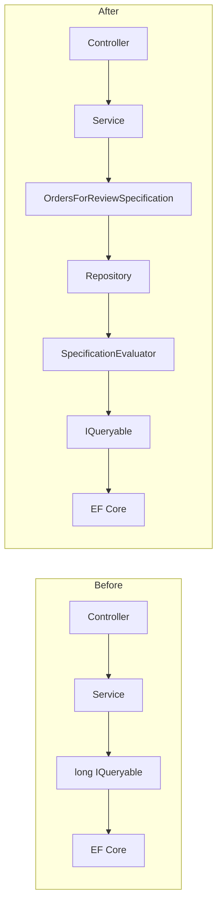

Database queries are rarely simple. First we need to get the user's active orders. Then a filter by date, status and amount, search by email, loading related entities, sorting, pagination and a separate query for export are added. A few months later, one business criterion already lives in the controller, background job and report service - and in three slightly different versions.

`Specification Pattern` extracts the selection rules into a separate named object. Instead of answering the question "which LINQ should I write?" application code says: "give orders corresponding to `OrdersForReviewSpecification`".

In this article, we will analyze what problem the Specification Pattern solves, write a minimal implementation for EF Core, and turn a cumbersome query into code that shows business intent.

## Before Specification: when an EF Core query knows too much

Let's imagine the order administration page. It supports optional filters, sorting and pagination:

```cs
public sealed record SearchOrdersRequest(
    Guid TenantId,
    string? CustomerEmail,
    DateTime? CreatedFrom,
    DateTime? CreatedTo,
    decimal? MinimumTotal,
    IReadOnlyCollection<OrderStatus>? Statuses,
    bool OnlyWithUnpaidBalance,
    int Page,
    int PageSize);
```

Without a separate abstraction, the query often grows directly inside the service:

```cs
public async Task<PagedResult<Order>> SearchAsync(
    SearchOrdersRequest request,
    CancellationToken cancellationToken)
{
    IQueryable<Order> query = dbContext.Orders
        .Where(order => order.TenantId == request.TenantId);

    if (!string.IsNullOrWhiteSpace(request.CustomerEmail))
    {
        var email = request.CustomerEmail.Trim();

        query = query.Where(order =>
            order.Customer.Email.Contains(email));
    }

    if (request.CreatedFrom is not null)
    {
        query = query.Where(order =>
            order.CreatedAt >= request.CreatedFrom);
    }

    if (request.CreatedTo is not null)
    {
        query = query.Where(order =>
            order.CreatedAt < request.CreatedTo);
    }

    if (request.MinimumTotal is not null)
    {
        query = query.Where(order =>
            order.Total >= request.MinimumTotal);
    }

    if (request.Statuses is { Count: > 0 })
    {
        query = query.Where(order =>
            request.Statuses.Contains(order.Status));
    }

    if (request.OnlyWithUnpaidBalance)
    {
        query = query.Where(order =>
            order.Payments.Sum(payment => payment.Amount) < order.Total);
    }

    var totalCount = await query.CountAsync(cancellationToken);

    var orders = await query
        .Include(order => order.Customer)
        .Include(order => order.Items)
        .Include(order => order.Payments)
        .AsNoTracking()
        .OrderByDescending(order => order.CreatedAt)
        .ThenByDescending(order => order.Id)
        .Skip((request.Page - 1) * request.PageSize)
        .Take(request.PageSize)
        .ToListAsync(cancellationToken);

    return new PagedResult<Order>(
        orders,
        totalCount,
        request.Page,
        request.PageSize);
}
```

This LINQ is not wrong by itself. The problem is everything that accumulates around it:

- service simultaneously knows business criteria, EF Core query structure and pagination rules
- the "order with an unpaid balance" condition is difficult to find and reuse
- export service will almost certainly copy most of the filters
- changing the definition of an active order requires finding all copies
- application service unit tests must check query-construction details
- the name `SearchAsync` does not explain exactly which data set it forms

After a few copies, the queries begin to diverge without anyone noticing. For example, the API uses `<` for the upper date boundary while the export uses `<=`; a background job forgets `TenantId`; one endpoint adds `AsNoTracking`, while another does not.

## What is Specification Pattern

A specification is an object that describes the data selection criteria. For a query, it can also include:

- `Where` criteria
- eager loading via `Include`
- sorting
- pagination
- tracking behavior

The main change is not in reducing the number of lines. The query code does not disappear anywhere - it gets a name, boundaries and a single place of responsibility.

The [.NET Architecture Guide](https://learn.microsoft.com/en-us/dotnet/architecture/microservices/microservice-ddd-cqrs-patterns/infrastructure-persistence-layer-implementation-entity-framework-core) likewise describes Query Specification as an object that encapsulates criteria, optional sorting, and paging.



A specification answers **what to select**, the evaluator answers **how to turn that description into an IQueryable**, and EF Core answers **how to execute it against a particular database**.

## A basic Specification contract

Let's start with a small contract. It supports filtering, `Include`, ordering with a tie-breaker, pagination, read-only mode, and split queries:

```cs
public interface ISpecification<T>
    where T : class
{
    Expression<Func<T, bool>>? Criteria { get; }

    IReadOnlyCollection<Expression<Func<T, object>>> Includes { get; }

    Expression<Func<T, object>>? OrderBy { get; }

    Expression<Func<T, object>>? OrderByDescending { get; }

    Expression<Func<T, object>>? ThenBy { get; }

    Expression<Func<T, object>>? ThenByDescending { get; }

    int? Skip { get; }

    int? Take { get; }

    bool IsNoTracking { get; }

    bool IsSplitQuery { get; }
}
```

Expressions are stored as `Expression<Func<...>>` rather than plain `Func` delegates. This allows EF Core to inspect the expression tree and translate it to SQL. If you compile the criteria into a delegate and execute it through `IEnumerable`, filtering takes place in memory instead.

Now let's add a base class with protected methods:

```cs
public abstract class Specification<T> : ISpecification<T>
    where T : class
{
    private readonly List<Expression<Func<T, object>>> _includes = [];

    public Expression<Func<T, bool>>? Criteria { get; private set; }

    public IReadOnlyCollection<Expression<Func<T, object>>> Includes => _includes;

    public Expression<Func<T, object>>? OrderBy { get; private set; }

    public Expression<Func<T, object>>? OrderByDescending { get; private set; }

    public Expression<Func<T, object>>? ThenBy { get; private set; }

    public Expression<Func<T, object>>? ThenByDescending { get; private set; }

    public int? Skip { get; private set; }

    public int? Take { get; private set; }

    public bool IsNoTracking { get; private set; }

    public bool IsSplitQuery { get; private set; }

    protected void SetCriteria(Expression<Func<T, bool>> criteria)
    {
        Criteria = criteria;
    }

    protected void AddInclude(Expression<Func<T, object>> include)
    {
        _includes.Add(include);
    }

    protected void ApplyOrderBy(
        Expression<Func<T, object>> orderBy,
        Expression<Func<T, object>>? thenBy = null)
    {
        OrderBy = orderBy;
        ThenBy = thenBy;
    }

    protected void ApplyOrderByDescending(
        Expression<Func<T, object>> orderByDescending,
        Expression<Func<T, object>>? thenByDescending = null)
    {
        OrderByDescending = orderByDescending;
        ThenByDescending = thenByDescending;
    }

    protected void ApplyPaging(int skip, int take)
    {
        Skip = skip;
        Take = take;
    }

    protected void AsNoTracking()
    {
        IsNoTracking = true;
    }

    protected void AsSplitQuery()
    {
        IsSplitQuery = true;
    }
}
```

This is an intentionally minimal implementation. It shows the mechanics of the pattern, rather than trying to immediately become a universal query framework.

## SpecificationEvaluator: turning the description into an EF Core query

The specification does not execute a query itself. We need an evaluator that applies its settings to `IQueryable<T>` in order:

```cs
public static class SpecificationEvaluator
{
    public static IQueryable<T> GetQuery<T>(
        IQueryable<T> inputQuery,
        ISpecification<T> specification,
        bool criteriaOnly = false)
        where T : class
    {
        var query = inputQuery;

        if (specification.Criteria is not null)
        {
            query = query.Where(specification.Criteria);
        }

        if (criteriaOnly)
        {
            return query;
        }

        query = specification.Includes.Aggregate(
            query,
            (current, include) => current.Include(include));

        query = ApplyOrdering(query, specification);

        if (specification.Skip is not null)
        {
            query = query.Skip(specification.Skip.Value);
        }

        if (specification.Take is not null)
        {
            query = query.Take(specification.Take.Value);
        }

        if (specification.IsSplitQuery)
        {
            query = query.AsSplitQuery();
        }

        if (specification.IsNoTracking)
        {
            query = query.AsNoTracking();
        }

        return query;
    }

    private static IQueryable<T> ApplyOrdering<T>(
        IQueryable<T> query,
        ISpecification<T> specification)
        where T : class
    {
        if (specification.OrderBy is not null)
        {
            return ApplyThenBy(query.OrderBy(specification.OrderBy), specification);
        }

        if (specification.OrderByDescending is not null)
        {
            return ApplyThenBy(
                query.OrderByDescending(specification.OrderByDescending),
                specification);
        }

        return query;
    }

    private static IQueryable<T> ApplyThenBy<T>(
        IOrderedQueryable<T> ordered,
        ISpecification<T> specification)
        where T : class
    {
        if (specification.ThenBy is not null)
        {
            return ordered.ThenBy(specification.ThenBy);
        }

        if (specification.ThenByDescending is not null)
        {
            return ordered.ThenByDescending(specification.ThenByDescending);
        }

        return ordered;
    }
}
```

The order of operators matters here. Criteria apply to both the count and the page, but `CountAsync` must not include `Skip`, `Take`, `Include`, or ordering. That is why the evaluator supports the `criteriaOnly` mode.

### Does this produce catch-all SQL?

One large expression full of `email == null || ...` looks suspicious: it seems the database will receive a pile of `@p IS NULL OR` conditions that no index can rescue. This is the most common objection to the approach, and it does not hold.

Filter values are known when the query is compiled, so EF Core evaluates the null comparisons up front and prunes the branches it does not need. Here is the actual SQL for a request that sets only `TenantId`:

```sql
SELECT "s"."Id", "s"."CreatedAt", "s"."CustomerId", "s"."Status", ...
FROM (
    SELECT ...
    FROM "Orders" AS "o"
    WHERE "o"."TenantId" = @request_TenantId
    ORDER BY "o"."CreatedAt" DESC, "o"."Id" DESC
    LIMIT @p7 OFFSET @p
) AS "s"
```

Not a single `IS NULL`. Each combination of populated filters gets its own plan and its own query-cache entry. The price is more cache entries, not a worse plan.

Repository remains thin:

```cs
public sealed class EfRepository<T>(AppDbContext dbContext)
    where T : class
{
    public Task<List<T>> ListAsync(
        ISpecification<T> specification,
        CancellationToken cancellationToken)
    {
        return SpecificationEvaluator
            .GetQuery(dbContext.Set<T>(), specification)
            .ToListAsync(cancellationToken);
    }

    public Task<int> CountAsync(
        ISpecification<T> specification,
        CancellationToken cancellationToken)
    {
        return SpecificationEvaluator
            .GetQuery(
                dbContext.Set<T>(),
                specification,
                criteriaOnly: true)
            .CountAsync(cancellationToken);
    }
}
```

A generic repository is not a mandatory part of the Specification Pattern. `DbContext` already provides `Set<T>()`, change tracking, and unit-of-work behavior, so a query service can call the evaluator directly. The repository here only demonstrates a convenient integration point.

## Moving the intimidating query into a concrete Specification

To search for orders, we will create a separate named specification:

```cs
public sealed class OrdersForReviewSpecification
    : Specification<Order>
{
    public OrdersForReviewSpecification(SearchOrdersRequest request)
    {
        ArgumentOutOfRangeException.ThrowIfLessThan(request.Page, 1);
        ArgumentOutOfRangeException.ThrowIfLessThan(request.PageSize, 1);

        var email = request.CustomerEmail?.Trim();
        var statuses = request.Statuses;

        SetCriteria(order =>
            order.TenantId == request.TenantId &&
            (email == null ||
                order.Customer.Email.Contains(email)) &&
            (request.CreatedFrom == null ||
                order.CreatedAt >= request.CreatedFrom) &&
            (request.CreatedTo == null ||
                order.CreatedAt < request.CreatedTo) &&
            (request.MinimumTotal == null ||
                order.Total >= request.MinimumTotal) &&
            (statuses == null ||
                statuses.Count == 0 ||
                statuses.Contains(order.Status)) &&
            (!request.OnlyWithUnpaidBalance ||
                order.Payments.Sum(payment => payment.Amount) <
                    order.Total));

        AddInclude(order => order.Customer);
        AddInclude(order => order.Items);

        ApplyOrderByDescending(
            order => order.CreatedAt,
            thenByDescending: order => order.Id);

        ApplyPaging(
            (request.Page - 1) * request.PageSize,
            request.PageSize);

        AsNoTracking();
    }
}
```

After that, the application service looks like this:

```cs
public async Task<PagedResult<Order>> SearchAsync(
    SearchOrdersRequest request,
    CancellationToken cancellationToken)
{
    var specification =
        new OrdersForReviewSpecification(request);

    var totalCount = await orderRepository.CountAsync(
        specification,
        cancellationToken);

    var orders = await orderRepository.ListAsync(
        specification,
        cancellationToken);

    return new PagedResult<Order>(
        orders,
        totalCount,
        request.Page,
        request.PageSize);
}
```

The total number of lines did not decrease significantly. Instead, the service now coordinates the use case, the specification contains the selection rules, and the evaluator contains the EF Core plumbing.

The name `OrdersForReviewSpecification` also becomes part of the system's language. It is easier to find, discuss in code review, and reuse than an anonymous chain of `Where` calls.

## Runnable example on SQLite

All code from the article is assembled into a runnable console project: [specification-pattern-ef-core](https://github.com/TarasKovalenko/taraskovalenko.github.io/tree/main/examples/specification-pattern-ef-core).

The example contains the domain models, `AppDbContext`, the complete specification implementation, evaluator, repository, seed data, application service, and seven tests. No database server is required: SQLite runs in memory inside the process. I deliberately avoid the InMemory provider - it accepts expressions a real provider cannot translate, which hides the very bugs a sample like this exists to expose.

Run it from the repository root with one command:

```bash
dotnet run \
  --project examples/specification-pattern-ef-core/src/SpecificationExample
```

The program prints the SQL the specification produced, then the result:

```text
Found 2 orders; page 1:
- bob@example.com      total=300.00 status=Processing
- alice@example.com    total=150.00 status=Pending
```

SQLite keeps this example self-contained and runnable without Docker while still being a real relational provider: it validates SQL translation and executes exactly the query printed to the console. That does not make it your production database - data types, constraints, and the semantics of some functions differ. Microsoft therefore [recommends testing query behavior against the same engine you run in production](https://learn.microsoft.com/en-us/ef/core/testing/choosing-a-testing-strategy), and treating SQLite as a compromise rather than an equivalent.

## Reuse without copying

Let's say export should use the same filters, but not pagination and not load whole entities. There is a temptation to add the `forExport` flag to the constructor. After a few such flags, the specification will turn into a complex service again.

It is better to separate the shared criteria from the different result shapes. For example, extract the expression into a factory:

```cs
public static class OrderCriteria
{
    public static Expression<Func<Order, bool>> ForReview(
        SearchOrdersRequest request)
    {
        var email = request.CustomerEmail?.Trim();
        var statuses = request.Statuses;

        return order =>
            order.TenantId == request.TenantId &&
            (email == null ||
                order.Customer.Email.Contains(email)) &&
            (request.CreatedFrom == null ||
                order.CreatedAt >= request.CreatedFrom) &&
            (request.CreatedTo == null ||
                order.CreatedAt < request.CreatedTo) &&
            (request.MinimumTotal == null ||
                order.Total >= request.MinimumTotal) &&
            (statuses == null ||
                statuses.Count == 0 ||
                statuses.Contains(order.Status)) &&
            (!request.OnlyWithUnpaidBalance ||
                order.Payments.Sum(payment => payment.Amount) <
                    order.Total);
    }
}
```

The main specification uses this criteria:

```cs
SetCriteria(OrderCriteria.ForReview(request));
```

And the export query can apply the same expression and make a projection:

```cs
var rows = await dbContext.Orders
    .Where(OrderCriteria.ForReview(request))
    .OrderByDescending(order => order.CreatedAt)
    .Select(order => new OrderExportRow(
        order.Id,
        order.Customer.Email,
        order.CreatedAt,
        order.Total,
        order.Status))
    .AsNoTracking()
    .ToListAsync(cancellationToken);
```

This is an important compromise: we reuse the business criterion without forcing the export to load entities through `Include`. For a read model, projecting directly into a DTO is often better than relying on a universal repository.

## How to test a Specification

Since the specification is a separate object, it can be checked without a controller or application service. But compiling `Criteria` to a plain delegate only checks the C# logic, not that EF Core is able to convert the expression to SQL.

A quick unit test is useful for a business rule:

```cs
[Fact]
public void Criteria_Rejects_Order_From_Another_Tenant()
{
    var tenantId = Guid.NewGuid();
    var request = new SearchOrdersRequest(
        tenantId,
        CustomerEmail: null,
        CreatedFrom: null,
        CreatedTo: null,
        MinimumTotal: null,
        Statuses: null,
        OnlyWithUnpaidBalance: false,
        Page: 1,
        PageSize: 20);

    var specification =
        new OrdersForReviewSpecification(request);

    var predicate = specification.Criteria!.Compile();
    var order = new Order { TenantId = Guid.NewGuid() };

    Assert.False(predicate(order));
}
```

Confidence in SQL translation requires an integration test with a real relational provider, such as SQLite or the same engine used in production:

```cs
[Fact]
public async Task Query_Returns_Only_Matching_Orders()
{
    await using var dbContext = CreateSqliteDbContext();
    await SeedOrdersAsync(dbContext);

    var request = new SearchOrdersRequest(
        TenantId: SeedData.DemoTenantId,
        CustomerEmail: null,
        CreatedFrom: null,
        CreatedTo: null,
        MinimumTotal: null,
        Statuses: null,
        OnlyWithUnpaidBalance: false,
        Page: 1,
        PageSize: 20);

    var query = SpecificationEvaluator.GetQuery(
        dbContext.Orders,
        new OrdersForReviewSpecification(request));

    var sql = query.ToQueryString();
    var orders = await query.ToListAsync();

    Assert.NotEmpty(sql);
    Assert.All(orders, order =>
        Assert.Equal(request.TenantId, order.TenantId));
}
```

The EF Core InMemory provider does not reproduce relational database behavior: it may accept an expression that a real provider cannot translate, and some operations have different semantics. For query-heavy code, a SQLite test therefore provides a much more useful signal.

SQLite will also show you its own limits. It does not translate `DateTimeOffset` in an `ORDER BY` clause at all:

```text
System.NotSupportedException: SQLite does not support expressions of type
'DateTimeOffset' in ORDER BY clauses.
```

SQL Server and PostgreSQL sort it without complaint. That is why `CreatedAt` is a UTC `DateTime` in the sample; the alternative is running these tests against the same engine as production, through Testcontainers.

## Specification does not optimize SQL automatically

Moving query into a separate class does not make it faster. A Specification can also create:

- redundant `Include`
- cartesian explosion
- slow `Contains`
- pagination through large `OFFSET`
- column filter without index
- loading entire entities instead of projection

The pattern improves the organization of the query logic, not the execution plan. After refactoring, still check SQL via `ToQueryString()`, EF Core logs, and database execution plan.

The official EF Core documentation on [efficient queries](https://learn.microsoft.com/en-us/ef/core/performance/efficient-querying) separately recommends projecting only the required fields, limiting the result set, and controlling how navigation properties are loaded.

For read-only lists, project only the required fields:

```cs
var query = dbContext.Orders
    .Where(OrderCriteria.ForReview(request))
    .Select(order => new OrderListItem(
        order.Id,
        order.Customer.Email,
        order.Total,
        order.Status,
        order.CreatedAt))
    .AsNoTracking();
```

For large sequential lists, consider keyset pagination instead of `Skip`. If you load multiple collection navigations, evaluate `AsSplitQuery`. A specification can store these settings, but the decision must still follow the query's actual performance profile.

## Advantages of the Specification Pattern

- **Clear business intent**  
  `OrdersForReviewSpecification` conveys intent better than an unnamed set of `Where` calls.

- **One place for query rules**  
  Tenant isolation, status and date boundaries do not spread between endpoint, job and export.

- **Reusable**  
  The criteria can be applied in multiple scenarios without copying LINQ.

- **Testability**  
  Business conditions are checked separately, while integration tests with a relational provider verify translation.

- **Thinner application code**  
  The service coordinates the use case instead of constructing a query over dozens of lines.

## Disadvantages and limitations

- **Additional abstraction**  
  For two simple `Where`, a separate class can be more expensive than the query itself.

- **The risk of creating your own LINQ framework**  
  Support for `ThenInclude`, projection, group by, split queries, tags and compiled queries quickly complicates the basic implementation.

- **Not every specification is truly reused**  
  Sometimes a query belongs to a single endpoint and is best read next to it.

- **Expression composition is non-trivial**  
  Not all providers support naive tree composition through `Expression.Invoke` equally well. Composition must be tested against a real database.

- **Generic repository can hide EF Core capabilities**  
  If abstraction doesn't allow projection or provider-specific optimization, it starts to get in the way.

## When to use the Specification Pattern

Use Specification when:

- the criterion has a business name
- the same selection rules are required in several places
- query contains many optional filters
- it is important to centralize tenant or access criteria
- application service is overloaded with EF Core details
- separate query behavior tests are required

Don't use a Specification just because the project has EF Core. A simple endpoint may well remain simple:

```cs
var customer = await dbContext.Customers
    .SingleOrDefaultAsync(
        customer => customer.Id == customerId,
        cancellationToken);
```

A separate `CustomerByIdSpecification` doesn't provide a new language or reuse here - it just adds a file and transitions between abstractions.

## Ready-made libraries

For a production project, it is not necessary to maintain your own evaluator. [Ardalis.Specification](https://github.com/ardalis/Specification) already has integration with EF Core, projection, pagination, caching metadata and other features.

A custom minimal implementation is useful for understanding the pattern and precisely controlling a small feature set. A ready-made library is appropriate when requirements go beyond `Where`, `Include`, ordering, and pagination.

## Conclusion

The Specification Pattern does not remove query complexity - it gives that complexity a name and a proper place. Before the pattern, business criteria, EF Core plumbing, and orchestration are often mixed in one service. Afterward, the service works with intent, the specification describes the selection, the evaluator builds an `IQueryable`, and EF Core executes the SQL.

The best signal for using the pattern is not the length of the LINQ itself, but the emergence of a stable business concept that repeats across the system. If the team regularly says "orders for review", that is a good candidate for `OrdersForReviewSpecification`. If a query is used once and can be understood in ten seconds, an additional abstraction is probably unnecessary.

Specification makes complex queries cleaner at the application-code level. But a clean `ListAsync(specification)` call does not remove the obligation to inspect the SQL that actually reaches the database.
